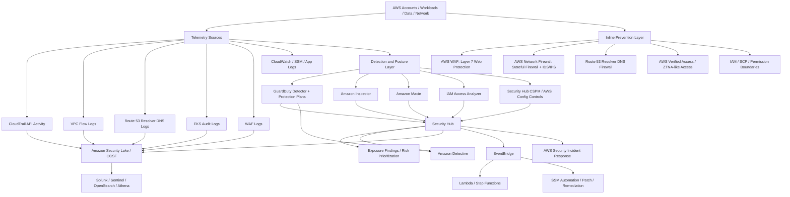
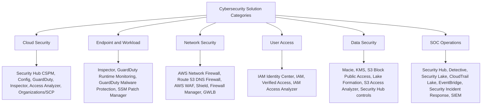
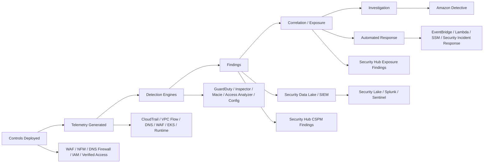

## Big picture

AWS cloud-native security has evolved from **separate point tools** into a more connected platform:

**Prevent / enforce:** AWS WAF, AWS Network Firewall, Route 53 Resolver DNS Firewall, Verified Access, IAM/SCPs.

**Detect / assess:** GuardDuty, Inspector, Macie, IAM Access Analyzer, Security Hub CSPM, AWS Config.

**Correlate / investigate / respond:** Security Hub, Amazon Detective, Amazon Security Lake, EventBridge, Systems Manager Automation, AWS Security Incident Response, and third-party SIEM/SOAR.

AWS now separates **Security Hub CSPM** from **Security Hub**. Security Hub CSPM focuses on posture, compliance controls, and security standards, while Security Hub is positioned as a unified experience for prioritizing and correlating findings, including “exposure findings” that combine vulnerabilities, configurations, threats, and resource relationships. ([AWS Documentation][1])

---

## 1. AWS-native security architecture view

---

## 2. How the major AWS tools protect and interact

| AWS service                             | Primary role                                  | Protects against                                                                                                          | Key dependency / interaction                                                                                                                                                                                                                  |
| --------------------------------------- | --------------------------------------------- | ------------------------------------------------------------------------------------------------------------------------- | --------------------------------------------------------------------------------------------------------------------------------------------------------------------------------------------------------------------------------------------- |
| **AWS WAF**                             | Inline web application firewall               | OWASP-style web attacks, bots, scrapers, bad IPs, account takeover patterns                                               | Attach to CloudFront, ALB, API Gateway, etc. WAF supports managed rule groups, Bot Control, CAPTCHA/challenge actions, and logs can feed Security Lake/SIEM. ([AWS Documentation][2])                                                         |
| **AWS Network Firewall**                | Managed stateful network firewall and IDS/IPS | North-south and east-west network threats, malicious domains/IPs, Suricata-style IPS signatures                           | Deployed in VPC/TGW inspection paths. Uses stateless and stateful engines, Suricata-compatible stateful rules, and AWS managed threat signature/domain/IP rule groups. ([AWS Documentation][3])                                               |
| **Route 53 Resolver DNS Firewall**      | DNS-layer control                             | Malware domains, DGA domains, DNS tunneling, unauthorized DNS destinations                                                | Associated to VPCs. Can be centrally managed with Firewall Manager. Logs and query telemetry can feed Security Lake/SIEM. ([AWS Documentation][4])                                                                                            |
| **GuardDuty**                           | Threat detection                              | Compromised IAM credentials, EC2 compromise, crypto-mining, malicious network behavior, S3/EKS/RDS/Lambda/runtime threats | Uses CloudTrail, VPC Flow Logs, Route 53 Resolver DNS logs as foundational sources; extra protection plans add S3, EKS, Runtime, RDS, EBS malware, and Lambda coverage. Findings flow to Security Hub and Detective. ([AWS Documentation][5]) |
| **GuardDuty Extended Threat Detection** | Multi-stage attack sequence detection         | Attack chains across users, resources, time, and data sources                                                             | Enabled by default when GuardDuty is enabled. More GuardDuty protection plans widen the event sources used for attack-sequence detection. ([AWS Documentation][6])                                                                            |
| **Amazon Inspector**                    | Vulnerability management                      | EC2 package CVEs, ECR container image vulnerabilities, Lambda vulnerabilities, unintended network exposure                | Inspector continuously discovers and scans EC2, ECR, and Lambda. EC2 scanning often depends on SSM Agent/IAM/managed node readiness. Findings can feed Security Hub. ([AWS Documentation][7])                                                 |
| **Security Hub CSPM**                   | CSPM / compliance posture                     | Misconfiguration, missing logging, weak IAM posture, noncompliance with standards                                         | Uses security controls and standards; many controls rely on AWS Config. It ingests findings from AWS and third-party tools, then routes posture findings into Security Hub. ([AWS Documentation][8])                                          |
| **Security Hub**                        | Findings correlation and prioritization       | Risk prioritization across posture, vulnerability, and threat findings                                                    | Correlates Security Hub CSPM, Inspector, GuardDuty, and other signals into exposure findings. ([AWS Documentation][9])                                                                                                                        |
| **Amazon Detective**                    | Investigation / root cause                    | Investigation of suspicious IAM, EC2, network, and GuardDuty-related activity                                             | Builds behavior graphs using CloudTrail, VPC Flow Logs, GuardDuty findings, and other sources; uses ML, statistical analysis, and graph theory. ([AWS Documentation][10])                                                                     |
| **Amazon Macie**                        | Data security / sensitive data discovery      | Sensitive data exposure in S3                                                                                             | Uses ML and pattern matching to discover sensitive data in S3 and generate findings. Good AWS-native DSPM-like capability for S3, but not a full enterprise DLP suite. ([AWS Documentation][11])                                              |
| **IAM Access Analyzer**                 | CIEM-like IAM analysis                        | External access, internal access paths, unused access, overly broad policies                                              | Generates findings for external, internal, and unused access; validates IAM policies and can generate policies from CloudTrail activity. ([AWS Documentation][12])                                                                            |
| **Security Lake**                       | Security data lake / OCSF normalization       | Centralized security analytics and SIEM integration                                                                       | Natively collects CloudTrail, EKS audit logs, Route 53 Resolver query logs, Security Hub CSPM findings, VPC Flow Logs, and WAFv2 logs; normalizes to OCSF and stores in S3. ([AWS Documentation][13])                                         |
| **Firewall Manager**                    | Organization-wide firewall policy management  | Inconsistent WAF, DNS Firewall, Network Firewall, Shield, security group policy deployment                                | Centrally applies and remediates security policies across AWS Organizations. ([AWS Documentation][14])                                                                                                                                        |

---

## 3. Important distinction: prevention vs detection

Some AWS services **block traffic inline**. Examples are **AWS WAF**, **AWS Network Firewall**, **Route 53 Resolver DNS Firewall**, IAM/SCPs, and Verified Access.

Some services **detect, assess, or prioritize** but do not directly block by themselves. Examples are **GuardDuty**, **Inspector**, **Macie**, **Security Hub CSPM**, **IAM Access Analyzer**, and **Detective**. You use **EventBridge, Lambda, Systems Manager Automation, Firewall Manager, security group updates, quarantine VPCs, or ticketing/SOAR** to turn those findings into response actions. Security Hub CSPM findings can be sent to EventBridge in near real time for automated remediation actions. ([AWS Documentation][15])

---

## 4. Mapping AWS tools to your six cybersecurity domains

| Your domain               | Industry categories        | AWS-native mapping                                                                                                                                 | Coverage assessment                                                                                                                                                                                                                                                                                                                                                   |
| ------------------------- | -------------------------- | -------------------------------------------------------------------------------------------------------------------------------------------------- | --------------------------------------------------------------------------------------------------------------------------------------------------------------------------------------------------------------------------------------------------------------------------------------------------------------------------------------------------------------------- |
| **Cloud Security**        | CNAPP, CSPM, CWPP, CIEM    | Security Hub CSPM, AWS Config, GuardDuty, Inspector, IAM Access Analyzer, Organizations/SCP, Control Tower, Security Hub                           | AWS has strong native **CSPM**, strong cloud threat detection, growing exposure correlation, and partial CNAPP coverage. It is not always packaged as one “CNAPP” product like Wiz, Prisma, Lacework, or Orca.                                                                                                                                                        |
| **Endpoint and Workload** | EDR, XDR, CWPP             | Inspector, GuardDuty Runtime Monitoring, GuardDuty Malware Protection for EC2, SSM Patch Manager                                                   | AWS has workload vulnerability/threat detection, but not a full traditional EDR/XDR replacement for Windows/Linux endpoints. For EDR/XDR, Microsoft Defender for Endpoint, CrowdStrike, SentinelOne, or Trellix are still common.                                                                                                                                     |
| **Network Security**      | NGFW, NDR, WAF             | AWS Network Firewall, Route 53 Resolver DNS Firewall, AWS WAF, Shield Advanced, Firewall Manager, Gateway Load Balancer for third-party appliances | AWS covers WAF, DNS firewall, and managed stateful firewall/IPS well. For full NGFW features like deep application control, SSL decryption policy, user-ID, and advanced NDR, customers often add Palo Alto, Fortinet, Cisco, Check Point, Suricata sensors, Zeek, ExtraHop, Corelight, or Vectra through GWLB/TGW patterns.                                          |
| **User Access**           | SASE, SSE, ZTNA, CASB, SWG | IAM Identity Center, IAM, Verified Access, IAM Access Analyzer, ALB OIDC, Cognito for apps                                                         | AWS has IAM and ZTNA-like application access with Verified Access, but AWS does **not** provide a full SASE/SSE/CASB/SWG suite comparable to Zscaler, Netskope, Cisco Umbrella/Secure Access, Palo Alto Prisma Access, or Microsoft Global Secure Access. Verified Access evaluates each application request using trust data and policies. ([AWS Documentation][16]) |
| **Data Security**         | DSPM, DLP                  | Macie, KMS, S3 Block Public Access, S3 Access Points, Lake Formation, CloudTrail data events, Security Hub CSPM controls                           | Strong for AWS data stores, especially S3. Macie is closest to AWS-native DSPM/sensitive-data discovery for S3. Full enterprise DLP across endpoint, SaaS, email, web, and cloud usually requires Microsoft Purview, Netskope, Palo Alto, Symantec/Broadcom, Forcepoint, etc.                                                                                         |
| **SOC Operations**        | SIEM, SOAR, MDR            | Security Hub, Detective, Security Lake, CloudTrail Lake, EventBridge, Lambda, Systems Manager Automation, AWS Security Incident Response           | AWS provides strong SOC building blocks and managed incident response options. Security Lake is the OCSF data layer; Security Hub is findings/risk correlation; Detective is investigation; EventBridge/SSM/Lambda provide SOAR-style automation. For full SIEM, Splunk, Microsoft Sentinel, OpenSearch, or a managed SOC/MDR provider is still common.               |

---

## 5. Does AWS provide UEBA?

**Not as a standalone product branded “UEBA.”** AWS has **UEBA-like capabilities** in multiple services:

GuardDuty uses threat intelligence and ML models to identify suspicious activity, including anomalous IAM/API behavior; its anomaly model tracks factors such as user, request location, and API action. ([AWS Documentation][17])

Amazon Detective builds behavior graphs and shows baselines, unusual activity, entity relationships, and investigation panels. Detective documentation states that some panels compare activity against a 45-day baseline and become more accurate as more data is extracted into the behavior graph. ([AWS Documentation][18])

So the practical answer is:

**AWS-native UEBA = GuardDuty anomaly detection + Detective behavior graph + Security Lake/SIEM analytics.**
**Full enterprise UEBA = usually done in SIEM/XDR**, such as Microsoft Sentinel UEBA, Splunk UBA/ES analytics, Exabeam, Securonix, or other identity analytics tools, especially when you need Entra ID, Okta, VPN, SaaS, endpoint, proxy, and HR identity context together.

---

## 6. Recommended AWS-native security stack by layer

For an AWS organization, a clean native baseline would look like this:

| Layer                        | Recommended AWS-native controls                                                                                                                                    |
| ---------------------------- | ------------------------------------------------------------------------------------------------------------------------------------------------------------------ |
| **Organization governance**  | AWS Organizations, SCPs, Control Tower, delegated admin for GuardDuty, Security Hub CSPM, Inspector, Macie, Firewall Manager                                       |
| **Cloud posture / CSPM**     | Security Hub CSPM, AWS Config, IAM Access Analyzer, Control Tower guardrails                                                                                       |
| **Threat detection**         | GuardDuty in all Regions, Extended Threat Detection, S3/EKS/RDS/Lambda/Runtime/Malware protection plans where applicable                                           |
| **Vulnerability management** | Inspector for EC2, ECR, Lambda; SSM Patch Manager for remediation and patch compliance                                                                             |
| **Network enforcement**      | AWS Network Firewall through TGW inspection VPC, Route 53 Resolver DNS Firewall in VPCs, AWS WAF on internet-facing ALB/API Gateway/CloudFront                     |
| **Web/API protection**       | AWS WAF managed rules, Bot Control, rate limiting, account takeover prevention where login endpoints exist                                                         |
| **Identity / access**        | IAM Identity Center, permission sets, SCPs, IAM Access Analyzer, Verified Access for private app access                                                            |
| **Data security**            | Macie for S3 sensitive data, KMS, S3 Block Public Access, CloudTrail data events, Lake Formation for analytics data                                                |
| **SOC / SIEM**               | Security Hub for findings, Detective for investigation, Security Lake for OCSF data lake, EventBridge/Lambda/SSM for response, Splunk/Sentinel/OpenSearch for SIEM |

---

## 7. Simple way to explain the dependency chain

The easiest mental model:

**WAF / Network Firewall / DNS Firewall stop bad traffic.**
**GuardDuty detects active threats.**
**Inspector finds vulnerable workloads.**
**Macie finds sensitive data risk.**
**Access Analyzer finds IAM exposure.**
**Security Hub CSPM finds misconfiguration.**
**Security Hub correlates and prioritizes.**
**Detective helps investigate.**
**Security Lake sends normalized OCSF data to the SOC/SIEM.**

[1]: https://docs.aws.amazon.com/securityhub/latest/userguide/what-is-securityhub.html?utm_source=chatgpt.com "Introduction to AWS Security Hub CSPM"
[2]: https://docs.aws.amazon.com/waf/latest/developerguide/how-aws-waf-works.html?utm_source=chatgpt.com "How AWS WAF works"
[3]: https://docs.aws.amazon.com/network-firewall/latest/developerguide/what-is-aws-network-firewall.html?utm_source=chatgpt.com "AWS Network Firewall - AWS Documentation"
[4]: https://docs.aws.amazon.com/Route53/latest/DeveloperGuide/resolver-dns-firewall-overview.html?utm_source=chatgpt.com "How Resolver DNS Firewall works - Amazon Route 53"
[5]: https://docs.aws.amazon.com/guardduty/latest/ug/guardduty_settingup.html?utm_source=chatgpt.com "Getting started with GuardDuty - AWS Documentation"
[6]: https://docs.aws.amazon.com/guardduty/latest/ug/guardduty-extended-threat-detection.html?utm_source=chatgpt.com "GuardDuty Extended Threat Detection - AWS Documentation"
[7]: https://docs.aws.amazon.com/inspector/latest/user/what-is-inspector.html?utm_source=chatgpt.com "What is Amazon Inspector? - Amazon Inspector"
[8]: https://docs.aws.amazon.com/securityhub/latest/userguide/standards-reference.html?utm_source=chatgpt.com "Standards reference for Security Hub CSPM"
[9]: https://docs.aws.amazon.com/securityhub/latest/userguide/exposure-findings.html?utm_source=chatgpt.com "Exposure findings in Security Hub"
[10]: https://docs.aws.amazon.com/detective/latest/userguide/what-is-detective.html?utm_source=chatgpt.com "What is Amazon Detective? - Amazon Detective"
[11]: https://docs.aws.amazon.com/macie/latest/user/what-is-macie.html?utm_source=chatgpt.com "What is Amazon Macie? - Amazon Macie"
[12]: https://docs.aws.amazon.com/IAM/latest/UserGuide/access-analyzer-findings.html?utm_source=chatgpt.com "IAM Access Analyzer findings"
[13]: https://docs.aws.amazon.com/security-lake/latest/userguide/internal-sources.html?utm_source=chatgpt.com "Collecting data from AWS services in Security Lake"
[14]: https://docs.aws.amazon.com/waf/latest/developerguide/working-with-policies.html?utm_source=chatgpt.com "Using AWS Firewall Manager policies"
[15]: https://docs.aws.amazon.com/securityhub/latest/userguide/securityhub-cloudwatch-events.html?utm_source=chatgpt.com "Using EventBridge for automated response and remediation"
[16]: https://docs.aws.amazon.com/verified-access/latest/ug/what-is-verified-access.html?utm_source=chatgpt.com "AWS Verified Access - AWS Documentation"
[17]: https://docs.aws.amazon.com/guardduty/latest/ug/what-is-guardduty.html?utm_source=chatgpt.com "What is Amazon GuardDuty? - Amazon ..."
[18]: https://docs.aws.amazon.com/detective/latest/userguide/detective-data-training-period.html?utm_source=chatgpt.com "Training period for new Detective behavior graphs"
