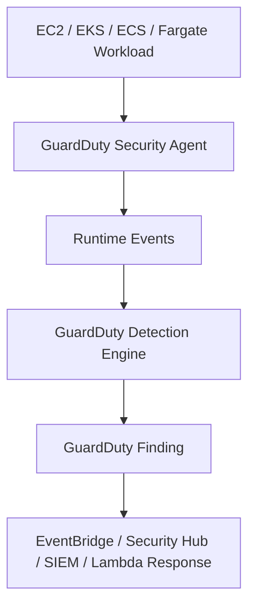

**Runtime Monitoring in GuardDuty** means GuardDuty is not only looking at AWS control-plane/network logs like **CloudTrail, VPC Flow Logs, and DNS logs**. It also watches what is happening **inside the workload while it is running**: processes, files, command-line activity, container behavior, and network connections. AWS says Runtime Monitoring observes OS-level, networking, and file events for supported workloads. ([AWS Documentation][1])

Think of it this way:

```text
Normal GuardDuty:
Who called AWS APIs?
What network/DNS activity looks suspicious?

GuardDuty Runtime Monitoring:
What is actually running inside the EC2 instance, EKS node/container, or ECS/Fargate task?
```

## Simple example

A vulnerable container gets compromised.

Without Runtime Monitoring, GuardDuty may later detect:

```text
Container/EC2 is talking to a known bad IP
Suspicious DNS query
Unusual AWS API call
```

With Runtime Monitoring, GuardDuty can also detect behavior like:

```text
A reverse shell started
A suspicious binary executed
A process tried privilege escalation
A container accessed Docker socket
A sensitive file was modified
A process loaded a suspicious library
A crypto miner executed
```

AWS lists Runtime Monitoring findings such as reverse shell, new binary executed, Docker socket accessed, container escape, fileless execution, crypto miner executed, suspicious command, elevation to root, kernel module loaded, and sensitive file modified. ([AWS Documentation][2])

## How it works

GuardDuty Runtime Monitoring uses a **GuardDuty security agent**. That agent collects runtime events and sends them to the GuardDuty backend for threat detection. AWS says the collected events include process details such as process name, executable path, process ID, user, parent process, script path, command-line arguments, and selected environment variables. ([AWS Documentation][3])



## Supported workload types

Runtime Monitoring supports threat detection for:

| Workload           | What GuardDuty watches                                  |
| ------------------ | ------------------------------------------------------- |
| **EC2**            | Host-level process, file, command, and network behavior |
| **EKS**            | EKS nodes and containers                                |
| **ECS on EC2**     | Container/task runtime behavior on EC2-backed ECS       |
| **ECS on Fargate** | Fargate task/container runtime behavior                 |

AWS notes that Runtime Monitoring now supports **EKS, ECS Fargate, and EC2 resources**. It also notes that EKS clusters running on AWS Fargate are not supported in that context. ([AWS Documentation][1])

## Practical-world meaning

Runtime Monitoring is closer to **workload behavior detection** or lightweight **cloud-native EDR-style visibility**, but it is not a full EDR replacement like Microsoft Defender for Endpoint or CrowdStrike.

It helps answer:

```text
Did something suspicious execute inside my container or EC2 instance?
Did a compromised process try to escape the container?
Did a process become root unexpectedly?
Did a shell get spawned by a web-facing service?
Did malware or crypto-mining behavior start?
```

## Summary trick

```text
GuardDuty standard = AWS account, API, network, DNS threat detection.
GuardDuty Runtime Monitoring = inside workload behavior detection.
```

For the AWS Security Specialty exam, remember this:

```text
If the question says suspicious process, reverse shell, container escape,
privilege escalation, runtime command, file modification, or crypto miner inside workload,
think GuardDuty Runtime Monitoring.
```

## One-line summary

**GuardDuty Runtime Monitoring watches the behavior inside running EC2, EKS, ECS, and Fargate workloads using a GuardDuty agent, then generates findings when it sees suspicious process, file, network, or container activity.**

[1]: https://docs.aws.amazon.com/guardduty/latest/ug/runtime-monitoring.html "GuardDuty Runtime Monitoring - Amazon GuardDuty"
[2]: https://docs.aws.amazon.com/guardduty/latest/ug/findings-runtime-monitoring.html "GuardDuty Runtime Monitoring finding types - Amazon GuardDuty"
[3]: https://docs.aws.amazon.com/guardduty/latest/ug/runtime-monitoring-collected-events.html "Collected runtime event types that GuardDuty uses - Amazon GuardDuty"
