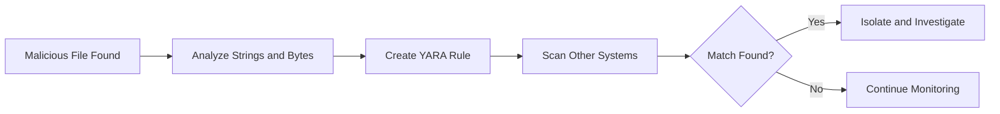
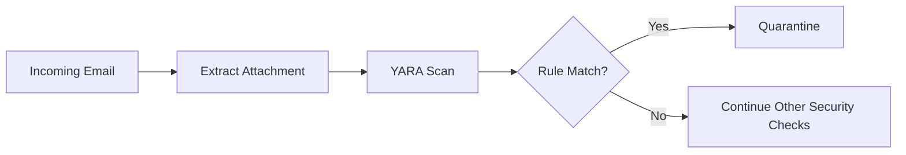
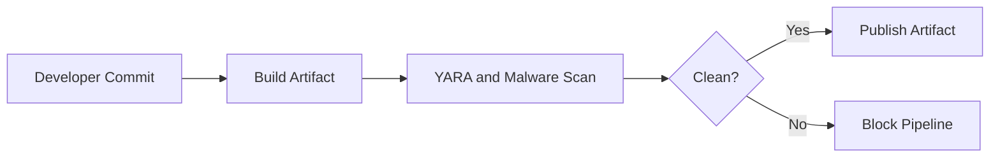
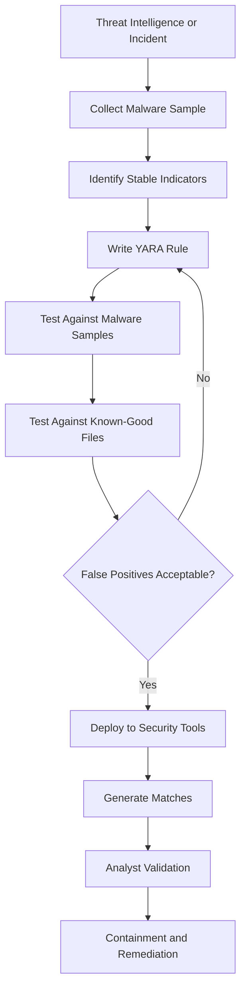

## What are YARA rules?

**YARA rules are pattern-matching rules used to identify malware, suspicious files, scripts, memory artifacts, or other digital content.**

Think of YARA as:

> **“If a file contains these strings, byte patterns, or characteristics, classify it as suspicious or as a particular malware family.”**

YARA does not usually block malware by itself. It is primarily a **detection and classification language** used by malware analysts, incident responders, antivirus products, sandboxes, and security tools.

---

## Simple YARA rule

```yara
rule Suspicious_PowerShell_Downloader
{
    meta:
        description = "Detects common PowerShell download behavior"
        author = "Security Team"
        severity = "medium"

    strings:
        $powershell = "powershell" nocase
        $download1  = "DownloadString" nocase
        $download2  = "Invoke-WebRequest" nocase
        $encoded    = "-EncodedCommand" nocase

    condition:
        $powershell and 1 of ($download*)
        or
        $powershell and $encoded
}
```

### How it works

The rule contains three main sections:

| Section     | Purpose                                                                        |
| ----------- | ------------------------------------------------------------------------------ |
| `meta`      | Documentation such as author, description, malware family, and severity        |
| `strings`   | Text, hexadecimal bytes, regular expressions, or binary patterns to search for |
| `condition` | Logic defining when the rule matches                                           |

This rule matches content containing `powershell` together with download-related or encoded-command indicators.

---

# Practical uses

## 1. Malware identification

A malware analyst discovers a malicious executable and identifies unique strings such as:

```text
evil-c2-domain.com
CreateRemoteThread
Global\MalwareMutex123
```

They create a YARA rule:

```yara
rule Example_Backdoor
{
    strings:
        $domain = "evil-c2-domain.com"
        $mutex  = "Global\\MalwareMutex123"
        $api1   = "CreateRemoteThread"
        $api2   = "VirtualAllocEx"

    condition:
        2 of them
}
```

The rule can then scan thousands of systems or files to find additional copies of the malware.

---

## 2. Incident-response threat hunting

Suppose one server is compromised.

The incident-response team extracts indicators from the malicious file and scans:

* Other EC2 instances
* Windows endpoints
* Linux servers
* File shares
* Email attachments
* Forensic disk images
* Memory dumps
* S3 objects downloaded for inspection



This helps answer:

> “Is this malware present anywhere else in the environment?”

---

## 3. Memory scanning

YARA can scan process memory or memory dumps.

This is useful when malware:

* Deletes itself from disk
* Runs only in memory
* Uses process injection
* Decrypts its malicious payload only during execution

Tools such as Volatility can use YARA rules against memory images.

Example:

```bash
vol.py -f memory.raw windows.vadyarascan.YaraScan \
  --yara-rules suspicious_rule.yar
```

The exact command depends on the Volatility version.

---

## 4. EDR and endpoint security

Many endpoint security platforms support YARA or YARA-like custom indicators.

A security team might deploy a rule to look for:

* Known ransomware notes
* Malicious DLLs
* Web shells
* Credential-stealing tools
* Suspicious scripts
* Organization-specific threats

In a Microsoft Defender environment, YARA may be used during investigation or through supporting threat-hunting and malware-analysis workflows. However, not every EDR exposes raw YARA rules as an endpoint prevention policy.

---

## 5. Email attachment scanning

A secure email gateway or malware-analysis pipeline can scan attachments before delivery.



For example, a rule could detect a malicious Office document containing:

* VBA macro indicators
* PowerShell commands
* Suspicious URLs
* Known exploit byte sequences

---

## 6. Web-shell detection

YARA is commonly used to detect web shells on compromised web servers.

```yara
rule Suspicious_PHP_WebShell
{
    strings:
        $eval   = "eval(" nocase
        $base64 = "base64_decode" nocase
        $exec1  = "shell_exec" nocase
        $exec2  = "system(" nocase

    condition:
        $eval and $base64 and 1 of ($exec*)
}
```

A scanner can check directories such as:

```text
/var/www/html
/usr/share/nginx/html
C:\inetpub\wwwroot
```

However, legitimate applications might contain some of these strings, so the rule must be tested carefully.

---

## 7. Malware sandboxing

When a suspicious file enters a sandbox:

1. The file is scanned with YARA.
2. It is executed in an isolated environment.
3. Network and process behavior is captured.
4. YARA rules may also scan unpacked payloads and memory.
5. The sandbox assigns a malware family or risk score.

YARA is used by many malware-analysis and threat-intelligence platforms.

---

## 8. CI/CD and software-supply-chain scanning

YARA rules can scan:

* Software packages
* Container images
* Build artifacts
* Third-party libraries
* Release bundles

Example workflow:



This can help prevent accidental distribution of known malicious components.

---

# String types supported by YARA

## Text strings

```yara
$text = "malicious command"
```

Case-insensitive:

```yara
$text = "powershell" nocase
```

Wide-character strings:

```yara
$text = "powershell" wide ascii
```

---

## Hexadecimal byte patterns

Useful when identifying machine-code sequences or file structures:

```yara
$bytes = { 48 8B ?? ?? 48 85 C0 74 ?? }
```

Here:

* `48 8B` represents exact bytes.
* `??` means any byte.
* The pattern can match variations of the same malware.

---

## Regular expressions

```yara
$url = /https?:\/\/[a-z0-9.-]+\/[a-z0-9\/]+/ nocase
```

Regular expressions are powerful but can make scans slower if overly broad.

---

# More realistic malware rule

```yara
import "pe"

rule Suspicious_Windows_Loader
{
    meta:
        description = "Detects characteristics of a suspicious Windows loader"
        severity = "high"

    strings:
        $s1 = "VirtualAlloc" ascii
        $s2 = "WriteProcessMemory" ascii
        $s3 = "CreateRemoteThread" ascii
        $s4 = "powershell.exe" ascii wide
        $url = /https?:\/\/[a-zA-Z0-9.-]+\.[a-zA-Z]{2,}/

    condition:
        uint16(0) == 0x5A4D and
        pe.number_of_sections <= 8 and
        3 of ($s*) and
        $url
}
```

Important logic:

```yara
uint16(0) == 0x5A4D
```

Checks that the file starts with the Windows PE `MZ` header.

```yara
3 of ($s*)
```

Requires at least three suspicious strings rather than matching only one common API.

---

# How YARA is used operationally

A mature workflow normally looks like this:



Testing against **known-good files** is critical. A rule that detects every PowerShell script is not useful because legitimate administrators also use PowerShell.

---

# Where YARA fits in a SOC

| Security function   | How YARA helps                            |
| ------------------- | ----------------------------------------- |
| Malware analysis    | Classifies malware families               |
| Threat hunting      | Searches endpoints for known patterns     |
| Incident response   | Finds related compromised hosts           |
| Digital forensics   | Scans disks and memory images             |
| Email security      | Detects malicious attachments             |
| EDR                 | Provides custom file or memory indicators |
| Sandbox             | Labels and categorizes submitted samples  |
| Threat intelligence | Shares reusable malware signatures        |
| Cloud security      | Scans S3 objects, images, and artifacts   |
| DevSecOps           | Scans build and release packages          |

---

# What YARA does not do well

YARA has important limitations:

### It is not behavioral detection

A YARA rule normally examines content. It does not inherently understand that:

```text
Process A created Process B,
which connected to an external server,
and then dumped credentials.
```

That requires EDR, SIEM, behavioral analytics, or detection rules such as Sigma.

### Malware can evade static rules

Attackers may use:

* Packing
* Encryption
* Obfuscation
* String encoding
* Randomized file generation
* Fileless execution

Rules based on only one hash or one string can become ineffective quickly.

### False positives are possible

For example:

```yara
condition:
    $powershell
```

This would match many legitimate files.

Better rules combine several attributes:

```yara
condition:
    filesize < 2MB and
    $powershell and
    2 of ($suspicious_commands)
```

---

# YARA compared with other detection formats

| Technology                 | Main purpose                                             |
| -------------------------- | -------------------------------------------------------- |
| **YARA**                   | Detect patterns inside files, memory, and binary content |
| **Sigma**                  | Detect suspicious activity in log events                 |
| **Snort/Suricata rules**   | Detect suspicious network traffic                        |
| **IOC/hash matching**      | Match exact known indicators                             |
| **EDR behavioral rules**   | Detect process, file, registry, and network behavior     |
| **SIEM correlation rules** | Correlate events from multiple systems                   |

A simple way to remember them:

```text
YARA      → Files and memory
Sigma     → Logs
Suricata  → Network packets
EDR rules → Endpoint behavior
```

## Key takeaway

YARA is most valuable when a security team has a suspicious or malicious sample and wants to turn its **unique and stable characteristics** into a reusable detection that can be deployed across endpoints, forensic tools, sandboxes, cloud storage, or malware-scanning pipelines.
