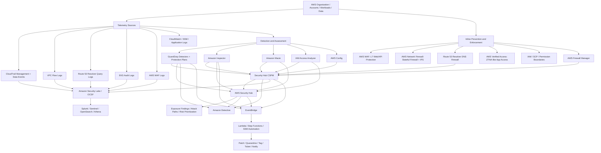
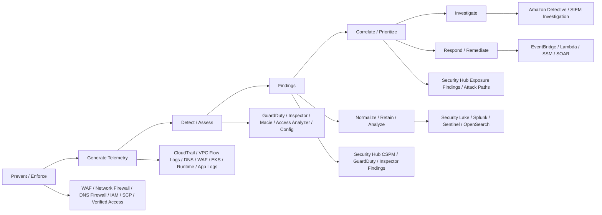
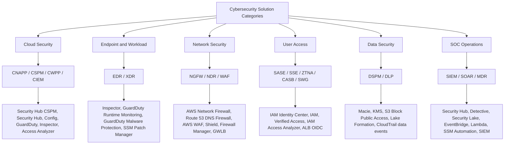

# High-Level Design: AWS-Native Cloud Security Stack

**Scope:** AWS-native security services, industry-category mapping, service dependency mapping, gap analysis, and AWS GovCloud (US) design caveats.

**Reviewed date:** 2026-06-21  
**Primary audience:** Cloud security architects, SOC engineers, SCCA / regulated-environment reviewers, and AWS platform teams.

> **Important regulated-environment note:** AWS GovCloud (US) service availability and feature parity can differ from commercial AWS Regions. Treat all GovCloud notes as design guidance, not an authorization decision. Before customer release or accreditation use, verify the exact service, Region, feature, and compliance scope against the AWS GovCloud User Guide, AWS Services in Scope, the applicable FedRAMP / DoD SRG listing, and the authorizing official's boundary decision.

---

## 1. Executive summary

AWS cloud-native security has evolved from separate point services into a more connected security platform. The services now fit into four practical layers:

1. **Prevent / enforce:** AWS WAF, AWS Network Firewall, Route 53 Resolver DNS Firewall, AWS Verified Access, IAM, SCPs, and Firewall Manager.
2. **Detect / assess:** Amazon GuardDuty, Amazon Inspector, Amazon Macie, IAM Access Analyzer, AWS Config, and Security Hub CSPM.
3. **Correlate / investigate / respond:** AWS Security Hub, Amazon Detective, EventBridge, Lambda, Systems Manager Automation, AWS Security Incident Response, and third-party SIEM/SOAR tools.
4. **Normalize / retain / analyze:** Amazon Security Lake, CloudTrail Lake, S3 log archive, Athena, OpenSearch, Splunk, or Microsoft Sentinel.

The most important correction is the **Security Hub / Security Hub CSPM naming model**:

- **AWS Security Hub CSPM** is the cloud security posture management service. It focuses on standards, controls, configuration checks, posture findings, and finding aggregation.
- **AWS Security Hub** is the newer unified security operations experience. It correlates signals from Security Hub CSPM, GuardDuty, Inspector, Macie, and other AWS services to produce prioritized risk views, exposure findings, attack paths, and response workflows.
- AWS recommends enabling both. Security Hub can run without Security Hub CSPM, but it loses CSPM posture signals that are important for exposure analysis.

---

## 2. Corrected AWS-native security architecture



**Key correction:** Security Lake natively ingests **Security Hub CSPM findings**, not the new Security Hub correlation/exposure layer directly. Use Security Hub for prioritization and Security Lake for normalized log/finding storage and downstream SOC analytics.

---

## 3. Service roles and how they interact

| AWS service | Primary role | What it helps protect against | How it interacts with the stack | GovCloud (US) note |
|---|---|---|---|---|
| **AWS WAF** | Inline Layer 7 web/API firewall | OWASP-style web attacks, bots, scrapers, bad IPs, abusive request patterns, login abuse | Attach to CloudFront, ALB, API Gateway, AppSync, Cognito, App Runner, and Verified Access. Logs can flow to Security Lake or SIEM. | Available, but always verify feature parity and regional support for the target architecture. |
| **AWS Network Firewall** | Managed stateful network firewall and IPS | Malicious IP/domain traffic, command-and-control patterns, protocol/network policy violations, Suricata-compatible IPS signatures | Usually deployed in centralized inspection VPCs with Transit Gateway. Supports stateless rules, stateful rules, Suricata-compatible rules, and AWS managed rule groups. | Available; validate TLS inspection, rule-group, endpoint, and inspection design details in GovCloud. |
| **Route 53 Resolver DNS Firewall** | DNS-layer enforcement | Malware domains, DGA domains, DNS tunneling patterns, unauthorized DNS destinations, category-based DNS controls | Associated with VPCs; centrally governed with Firewall Manager. Managed Domain List and DNS Firewall Advanced findings can flow to Security Hub CSPM automatically; custom domain list findings require manual integration enablement. | Available; validate exact DNS Firewall Advanced and integration behavior by Region. |
| **Amazon GuardDuty** | Threat detection | Compromised IAM credentials, suspicious API activity, EC2 compromise, crypto-mining, malware indicators, suspicious DNS/network activity, S3/EKS/RDS/Lambda/runtime threats | Foundational GuardDuty automatically consumes CloudTrail management events, VPC Flow Logs, and Route 53 Resolver DNS logs. Protection plans add S3, EKS, Runtime, RDS, Malware Protection, and Lambda coverage. Findings flow to Security Hub CSPM, Security Hub, EventBridge, and Detective. | Available. Runtime Monitoring and protection-plan behavior can have GovCloud-specific endpoint/configuration differences. |
| **GuardDuty detector** | Regional GuardDuty configuration object | Not a separate protection tool; it represents GuardDuty enablement for an account in a Region | GuardDuty is Regional. Enabling GuardDuty in a Region associates the account with a unique detector ID for that Region. Many GuardDuty API operations require the regional detector ID. | Important for multi-Region GovCloud operations because each Region has separate detector configuration. |
| **GuardDuty Extended Threat Detection** | Multi-stage attack-sequence detection | Attack chains across time, AWS resources, and multiple signals | Enabled by default when GuardDuty is enabled. Foundational detection works without extra protection plans, but S3, EKS, ECS, EC2, and runtime attack-sequence coverage improves when relevant protection plans are enabled. | Available in GovCloud. Validate supported finding types and protection-plan support. |
| **Amazon Inspector** | Vulnerability and exposure assessment | EC2 package CVEs, ECR image CVEs, Lambda vulnerabilities, code vulnerabilities, network reachability exposure | Continuously scans supported resources. EC2 scanning uses SSM Agent or EBS snapshot-based scanning depending on configuration and support. Findings can flow to Security Hub / Security Hub CSPM and EventBridge. | Available; confirm supported scan modes and OS/package coverage in GovCloud. |
| **AWS Security Hub CSPM** | CSPM and finding aggregation | Misconfiguration, missing controls, weak security posture, standards noncompliance | Uses AWS Config rules for most controls. Receives findings from GuardDuty, Inspector, Macie, IAM Access Analyzer, Route 53 Resolver DNS Firewall, Firewall Manager, Patch Manager, and others. Sends findings to Security Hub and Security Lake. | Available. Not all controls and integrations are available in GovCloud; cross-Region aggregation is limited to GovCloud Regions. |
| **AWS Security Hub** | Unified risk correlation and prioritization | Combined risk across vulnerabilities, misconfigurations, threats, sensitive data, and resource relationships | Correlates signals from Security Hub CSPM, Inspector, GuardDuty, Macie, and other AWS services to generate exposure findings and attack-path style views. | Available in GovCloud since March 2026. Third-party integrations, automation rules for integrations, cost estimator, usage page, and Extended plan are not available in GovCloud. |
| **Amazon Detective** | Investigation and root-cause analysis | Investigation of suspicious IAM, EC2, network, and GuardDuty-related activity | Builds behavior graphs and investigation views from AWS security telemetry and GuardDuty-related activity. Useful for analyst triage after GuardDuty/Security Hub findings. | Available; confirm regional behavior graph and data-source support. |
| **Amazon Macie** | S3 sensitive-data discovery and S3 data risk | Sensitive data in S3, public or cross-account S3 exposure, S3 policy risks | Uses ML and pattern matching to find sensitive data in S3. Findings can flow to Security Hub CSPM and Security Hub. | Available; strong AWS-native DSPM-like capability for S3 only. |
| **IAM Access Analyzer** | CIEM-like IAM analysis | External access, internal access paths, unused IAM permissions, overly broad policies | Uses automated reasoning to analyze policies. Findings can help Security Hub exposure context, especially unused-access and over-permissioned identities. | Available; external/internal analyzers are Regional; unused access analyzer behavior is not Region-dependent in the same way. |
| **Amazon Security Lake** | OCSF-normalized security data lake | Central storage and analytics for security logs and findings | Natively collects CloudTrail, EKS audit logs, Route 53 Resolver query logs, Security Hub CSPM findings, VPC Flow Logs, and WAFv2 logs, then normalizes to OCSF in S3. | Available. In GovCloud, `HttpsNotificationConfiguration` for subscribers is not supported; use SQS-style subscriber patterns where applicable. |
| **AWS Firewall Manager** | Organization-wide firewall policy governance | Inconsistent WAF, Shield, security group, Network Firewall, and DNS Firewall deployment | Uses AWS Organizations delegated administration to apply policies across accounts and resources. Sends relevant findings to Security Hub CSPM. | Available; validate each policy type in GovCloud. |
| **AWS Verified Access** | ZTNA-like private application access | VPN-less app access with identity/device/trust-based policy checks | Evaluates each request using trust-provider data and Cedar policies. Useful for private web apps but not a full SASE/SSE replacement. | Available in GovCloud; use HTTPS endpoints and verify trust-provider support. |

---

## 4. Dependency mapping: hard vs soft dependencies

| Capability | Hard dependency | Soft dependency / improves quality |
|---|---|---|
| GuardDuty foundational detection | Enable GuardDuty in each Region/account where monitoring is required | Enable all supported Regions; configure delegated administrator; integrate with Security Hub/Security Hub CSPM |
| GuardDuty detector | GuardDuty enabled in that specific Region | Organization-wide delegated admin and auto-enable configuration |
| GuardDuty ETD baseline | GuardDuty enabled | More protection plans increase attack-sequence coverage |
| GuardDuty ETD for S3 data compromise | Some foundational S3 control-plane sequences can work from foundational data; deeper data compromise coverage requires S3 Protection | Enable S3 Protection broadly for production buckets |
| GuardDuty ETD for EKS | At least one of EKS Protection or Runtime Monitoring for EKS | Enable both EKS Protection and Runtime Monitoring for best coverage |
| GuardDuty ETD for ECS | Runtime Monitoring for Fargate or EC2-based ECS, depending on infrastructure type | Standardize ECS runtime agent deployment and coverage reporting |
| GuardDuty ETD for EC2 instance groups | Foundational GuardDuty signals support EC2 attack-sequence detection | Runtime Monitoring for EC2 provides process/system-call visibility and better context |
| Inspector EC2 scanning | Inspector enabled; supported scan method; SSM Agent/managed-node readiness or EBS snapshot scanning depending on configuration | SSM inventory hygiene, patch baselines, image pipeline integration |
| Security Hub CSPM controls | Security Hub CSPM enabled; AWS Config enabled/recording for most controls | Central configuration, FSBP/CIS/NIST standards, delegated admin |
| Security Hub exposure findings | Security Hub enabled; source services enabled for the relevant signals | Security Hub CSPM + GuardDuty + Inspector + Macie + IAM Access Analyzer for richer correlation |
| Security Lake CloudTrail source | Multi-Region organization trail with read/write management events enabled | Add S3/Lambda data events where required; define rollup Region strategy |
| Security Lake Security Hub findings | Add Security Hub CSPM as a Security Lake source | Maintain Security Hub CSPM standards and integrations for useful findings |
| Detective investigation | Detective enabled; GuardDuty strongly recommended and commonly used as entry point | Enable Security Hub/Security Hub CSPM integrations and define analyst workflow |
| DNS Firewall findings to Security Hub CSPM | Security Hub CSPM and DNS Firewall enabled | Managed Domain List and DNS Firewall Advanced findings auto-send; custom domain list findings need manual integration enablement |
| Automated response | EventBridge rule and target such as Lambda, Step Functions, SSM Automation, SNS, or ticketing connector | Use Security Hub/Security Hub CSPM custom actions, tagging standards, and runbooks |

---

## 5. Prevention, detection, and response model



### Simple mental model

- **WAF, Network Firewall, DNS Firewall, IAM, SCPs, and Verified Access** enforce security policy.
- **GuardDuty** detects active threats and attack sequences.
- **Inspector** finds vulnerable workloads and network reachability exposure.
- **Macie** finds sensitive-data risk in S3.
- **IAM Access Analyzer** finds external, internal, and unused access risk.
- **Security Hub CSPM** evaluates posture and aggregates findings.
- **Security Hub** correlates findings into prioritized exposures.
- **Detective** helps analysts investigate suspicious entities and relationships.
- **Security Lake** normalizes AWS logs/findings to OCSF for SIEM and analytics.

---

## 6. Mapping to the six cybersecurity solution domains



| Domain | Industry categories | AWS-native mapping | Native coverage | Common gap / third-party addition |
|---|---|---|---|---|
| **Cloud Security** | CNAPP, CSPM, CWPP, CIEM | Security Hub CSPM, Security Hub, Config, GuardDuty, Inspector, IAM Access Analyzer, Organizations/SCPs, Control Tower | Strong CSPM, threat detection, vulnerability scanning, and growing exposure correlation. | AWS is not always packaged as a single CNAPP console like Wiz, Prisma Cloud, Orca, or Lacework. Add CNAPP if single-pane multi-cloud attack-path/posture coverage is required. |
| **Endpoint and Workload** | EDR, XDR, CWPP | Inspector, GuardDuty Runtime Monitoring, GuardDuty Malware Protection for EC2, SSM Patch Manager | Good AWS workload vulnerability and runtime-threat visibility. | Not a full enterprise EDR/XDR replacement. Add Microsoft Defender for Endpoint, CrowdStrike, SentinelOne, Trellix, or similar for endpoint isolation, process response, memory/behavioral telemetry, and managed hunting. |
| **Network Security** | NGFW, NDR, WAF | AWS Network Firewall, Route 53 Resolver DNS Firewall, AWS WAF, Shield Advanced, Firewall Manager, Gateway Load Balancer | Strong managed WAF, DNS firewall, stateful firewall, and IPS building blocks. | Not a full enterprise NGFW/NDR stack by itself. Add Palo Alto, Fortinet, Cisco, Check Point, Zeek/Corelight, ExtraHop, or Vectra when you need mature app-ID/user-ID, advanced TLS inspection operations, packet analytics, or NDR. |
| **User Access** | SASE, SSE, ZTNA, CASB, SWG | IAM Identity Center, IAM, Verified Access, IAM Access Analyzer, ALB OIDC, Cognito | Strong AWS identity and policy enforcement. Verified Access provides ZTNA-like private app access. | AWS does not provide a full SASE/SSE/CASB/SWG suite. Add Zscaler, Netskope, Palo Alto Prisma Access, Cisco Secure Access, or Microsoft Global Secure Access for enterprise web/SaaS/user traffic control. |
| **Data Security** | DSPM, DLP | Macie, KMS, S3 Block Public Access, S3 Access Points, Lake Formation, CloudTrail data events, Security Hub CSPM controls | Strong S3-focused sensitive-data discovery and AWS data-control enforcement. | Macie is DSPM-like for S3, not a full enterprise DSPM/DLP platform across SaaS, email, endpoint, databases, and web. Add Microsoft Purview, Netskope, Symantec/Broadcom, Forcepoint, BigID, or similar if required. |
| **SOC Operations** | SIEM, SOAR, MDR | Security Hub, Detective, Security Lake, CloudTrail Lake, EventBridge, Lambda, Step Functions, SSM Automation, AWS Security Incident Response | Strong cloud-native SOC building blocks and OCSF data lake foundation. | Not a complete SIEM/SOAR/MDR by itself. Add Splunk ES, Microsoft Sentinel, OpenSearch security analytics, or MDR/MSSP depending on SOC maturity. |

---

## 7. Does AWS provide UEBA?

AWS does **not** provide a standalone service branded as UEBA in the same way as Microsoft Sentinel UEBA, Splunk UBA, Exabeam, or Securonix.

AWS does provide **UEBA-like behavior analytics** through several services:

- **GuardDuty** uses threat intelligence, machine learning, anomaly detection, and behavioral modeling to identify suspicious activity in AWS accounts, workloads, and data.
- **GuardDuty Extended Threat Detection** correlates sequences of suspicious events across time and resources to identify multi-stage attacks.
- **Amazon Detective** builds behavior graphs and relationship views that help analysts investigate suspicious activity.
- **Security Hub** correlates risk signals into exposure findings and attack-path style views.
- **Security Lake** provides the normalized OCSF data layer where SIEM or UEBA platforms can perform broader user/entity analytics.

**Practical equation:**

```text
AWS-native UEBA-like coverage = GuardDuty anomaly detection
                              + GuardDuty Extended Threat Detection
                              + Detective behavior graph
                              + Security Hub exposure correlation
                              + Security Lake/SIEM analytics
```

For enterprise UEBA across **Entra ID, Okta, VPN, endpoint, proxy, SaaS, HR data, and AWS**, use a SIEM/XDR/UEBA platform and feed it AWS telemetry through Security Lake, CloudTrail, GuardDuty, Security Hub CSPM, and identity logs.

---

## 8. GovCloud caveats

---

## 9. Recommended AWS-native baseline

| Layer | Recommended AWS-native controls |
|---|---|
| Organization governance | AWS Organizations, Control Tower or custom landing zone, SCPs, delegated admins, account vending, central logging account |
| CSPM / posture | Security Hub CSPM, AWS Config, FSBP/CIS/NIST controls, IAM Access Analyzer, Control Tower controls |
| Threat detection | GuardDuty in all supported Regions, delegated admin, ETD, S3/EKS/RDS/Lambda/Runtime/Malware protection plans where applicable |
| Vulnerability management | Amazon Inspector for EC2/ECR/Lambda, SSM Patch Manager, image pipeline scanning, patch compliance reporting |
| Network enforcement | AWS Network Firewall in inspection VPC/TGW path, Route 53 Resolver DNS Firewall in VPCs, AWS WAF on public ALB/API Gateway/CloudFront/Verified Access where applicable |
| Web/API protection | AWS WAF managed rules, Bot Control where justified, rate-based rules, CAPTCHA/Challenge, account-takeover protections for login flows |
| Identity and access | IAM Identity Center, permission sets, SCPs, IAM Access Analyzer, Verified Access for private apps, ALB OIDC where app-level auth fronting is needed |
| Data protection | Macie for S3 sensitive-data discovery, KMS, S3 Block Public Access, S3 bucket policies, Lake Formation, CloudTrail data events |
| SOC operations | Security Hub, Detective, Security Lake, EventBridge, Lambda, SSM Automation, Splunk/Sentinel/OpenSearch integration, incident response runbooks |
| GovCloud / SCCA validation | Validate Region, feature, endpoint, compliance scope, logging path, encryption, retention, and AO boundary alignment before production use |

---


## 10. Source references for validation

Use the current AWS documentation as the final authority because AWS service names, plans, GovCloud availability, and integrations change over time.

- AWS Security Hub and AWS Security Hub CSPM: https://docs.aws.amazon.com/securityhub/latest/userguide/what-are-securityhub-services.html
- AWS Security Hub exposure findings: https://docs.aws.amazon.com/securityhub/latest/userguide/exposure-findings.html
- AWS Security Hub in AWS GovCloud (US): https://docs.aws.amazon.com/govcloud-us/latest/UserGuide/govcloud-ashv2.html
- AWS Security Hub CSPM in AWS GovCloud (US): https://docs.aws.amazon.com/govcloud-us/latest/UserGuide/govcloud-ash.html
- Security Hub CSPM AWS service integrations: https://docs.aws.amazon.com/securityhub/latest/userguide/securityhub-internal-providers.html
- Security Lake native AWS sources: https://docs.aws.amazon.com/security-lake/latest/userguide/internal-sources.html
- Security Lake CloudTrail source requirement: https://docs.aws.amazon.com/security-lake/latest/userguide/cloudtrail-event-logs.html
- Security Lake in AWS GovCloud (US): https://docs.aws.amazon.com/govcloud-us/latest/UserGuide/govcloud-asl.html
- Amazon GuardDuty overview: https://docs.aws.amazon.com/guardduty/latest/ug/what-is-guardduty.html
- GuardDuty Extended Threat Detection: https://docs.aws.amazon.com/guardduty/latest/ug/guardduty-extended-threat-detection.html
- GuardDuty concepts and detector ID: https://docs.aws.amazon.com/guardduty/latest/ug/guardduty_concepts.html
- Amazon Inspector EC2 scanning: https://docs.aws.amazon.com/inspector/latest/user/scanning-ec2.html
- AWS Network Firewall Suricata/stateful rules: https://docs.aws.amazon.com/network-firewall/latest/developerguide/stateful-rule-groups-ips.html
- Route 53 Resolver DNS Firewall Advanced: https://docs.aws.amazon.com/Route53/latest/DeveloperGuide/firewall-advanced.html
- AWS WAF behavior and rule groups: https://docs.aws.amazon.com/waf/latest/developerguide/how-aws-waf-works.html
- Amazon Macie overview: https://docs.aws.amazon.com/macie/latest/user/what-is-macie.html
- AWS Verified Access overview: https://docs.aws.amazon.com/verified-access/latest/ug/what-is-verified-access.html
- IAM Access Analyzer findings: https://docs.aws.amazon.com/IAM/latest/UserGuide/access-analyzer-findings.html
