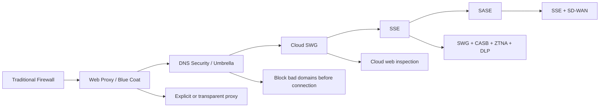
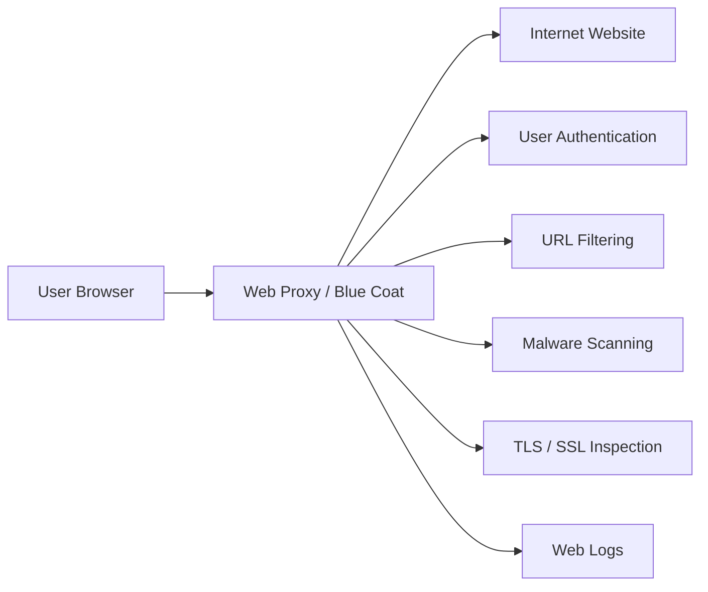
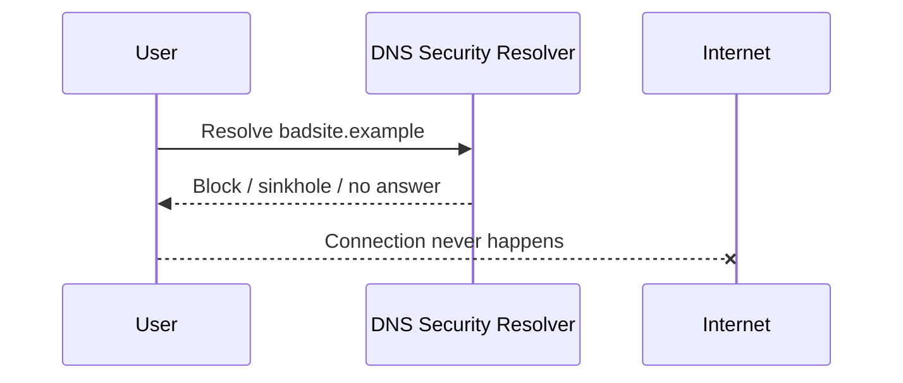
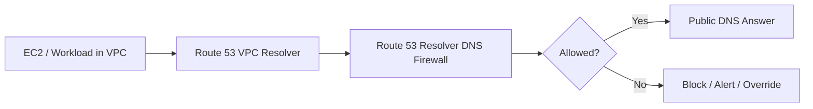
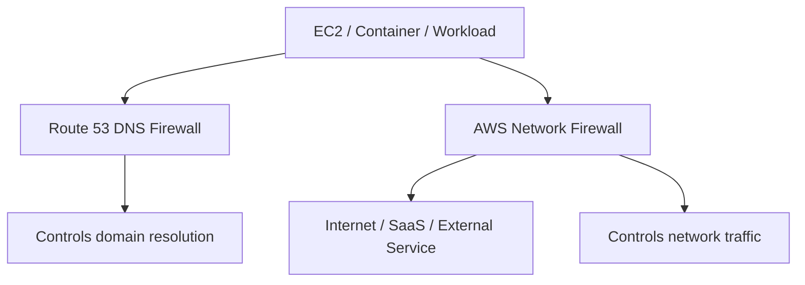
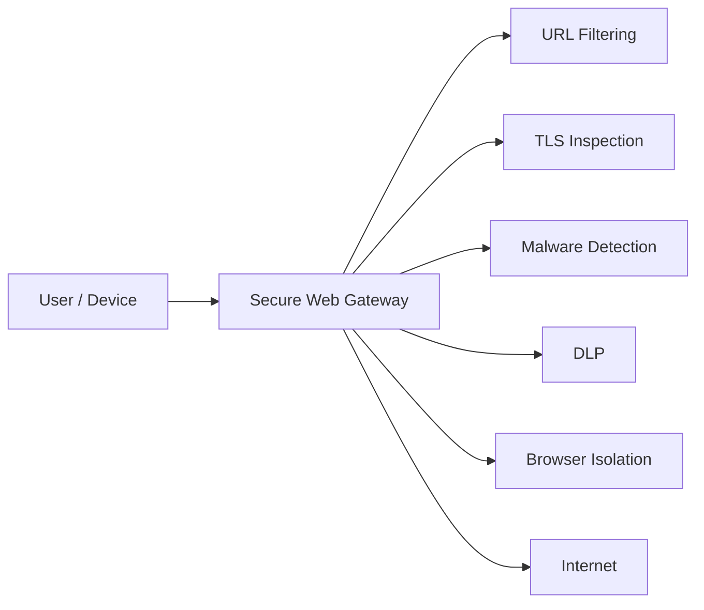
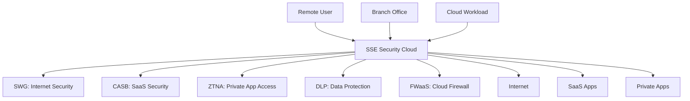
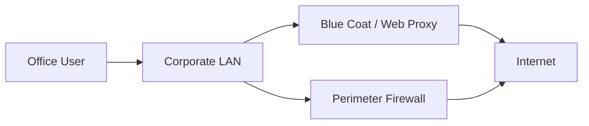
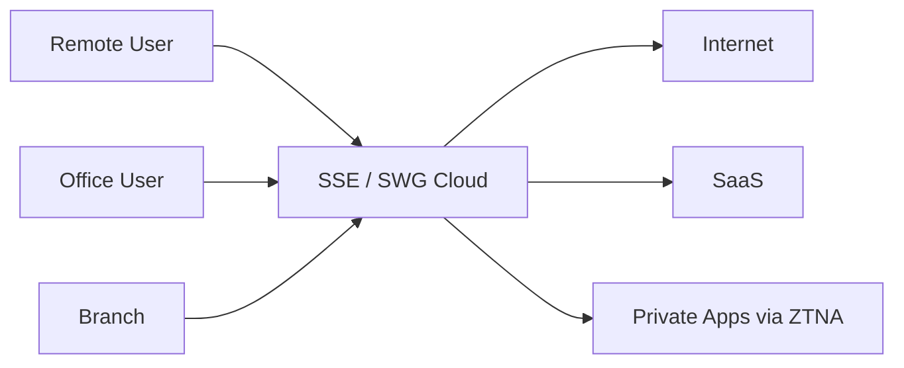
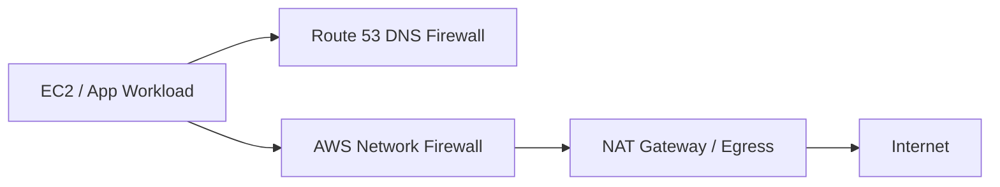

# 0 Evolution of Web Traffic Security Solution Below is the clean way to understand the evolution:

> **Old model:** Web Proxy / Blue Coat protected users by forcing web traffic through a proxy.
> **Middle model:** DNS security like Cisco Umbrella blocked bad destinations before connection.
> **Cloud model:** SWG/SSE/SASE moved proxy, DNS, firewall, CASB, DLP, and ZTNA controls into a cloud-delivered security platform.
> **AWS model:** Route 53 Resolver DNS Firewall and AWS Network Firewall protect **AWS VPC workloads**, not enterprise users by themselves.

---

# 1. The Simple Difference

| Solution Type               | What It Controls                                       | Main Question It Answers                                                        | Example Products                                                                      |
| --------------------------- | ------------------------------------------------------ | ------------------------------------------------------------------------------- | ------------------------------------------------------------------------------------- |
| **Traditional Web Proxy**   | HTTP/HTTPS web traffic                                 | “Can this user access this website?”                                            | Blue Coat ProxySG / Symantec Edge SWG, Squid, McAfee Web Gateway                      |
| **DNS Security**            | DNS lookups                                            | “Should this domain resolve?”                                                   | Cisco Umbrella DNS, AWS Route 53 Resolver DNS Firewall                                |
| **Network Firewall / NGFW** | IP, port, protocol, sessions, sometimes app/domain     | “Should this network flow be allowed?”                                          | Palo Alto, Fortinet, Cisco Firepower, AWS Network Firewall                            |
| **SWG**                     | Web traffic, URLs, files, malware, DLP, TLS inspection | “Is this web access safe and compliant?”                                        | Zscaler, Netskope, Palo Alto Prisma Access, Cisco Umbrella SIG, Symantec/Broadcom SWG |
| **SSE / SASE**              | Web, SaaS, private apps, data, user identity           | “Can this user securely access internet, SaaS, and private apps from anywhere?” | Zscaler, Netskope, Prisma Access, Cisco Umbrella SIG, Cloudflare One                  |

---

# 2. Evolution Timeline

The evolution happened because users, applications, and data moved outside the traditional data center. Old firewalls and proxies assumed users were inside the corporate network. Modern SWG/SSE assumes users are everywhere and applications are spread across SaaS, public cloud, and private environments.

---

# 3. Phase 1 — Traditional Web Proxy / Blue Coat Model

A **web proxy** sits between the user and the internet. The user’s browser sends web requests to the proxy, and the proxy fetches the website on behalf of the user.

Blue Coat ProxySG became one of the classic enterprise web proxy platforms. Blue Coat was acquired by Symantec in 2016, and Symantec’s enterprise security business was later acquired by Broadcom in 2019. Today, the product lineage is generally seen under **Symantec / Broadcom Edge Secure Web Gateway**. Broadcom describes Edge SWG as a proxy-based web security solution that monitors, controls, and secures web/cloud traffic. ([Gen Digital Newsroom][1])

## How the proxy worked

## Deployment models

| Proxy Mode            | How It Works                                               | Example                              |
| --------------------- | ---------------------------------------------------------- | ------------------------------------ |
| **Explicit Proxy**    | Browser or OS is configured to use proxy IP/port           | PAC file, browser proxy setting      |
| **Transparent Proxy** | Network redirects traffic to proxy without browser knowing | WCCP, PBR, inline appliance          |
| **Reverse Proxy**     | Proxy sits in front of internal web apps                   | Protects inbound application traffic |

Broadcom’s Edge SWG documentation still includes explicit and transparent SSL proxy deployment models, which shows how this classic architecture continues in modernized form. ([TechDocs][2])

## What it solved

The web proxy solved:

* User-based web access control
* URL filtering
* Malware scanning
* Web usage logging
* Acceptable-use policy enforcement
* TLS/SSL inspection
* DLP-like inspection for web uploads

## Weakness of the old proxy model

The old proxy model was strong for office users but became difficult when users started working remotely, using SaaS heavily, and accessing cloud applications directly. If traffic did not pass through the proxy, the proxy could not inspect it.

---

# 4. Phase 2 — DNS-Based Security

DNS security came next because it was simpler and faster to deploy.

Instead of inspecting the full web session, DNS security controls the **domain lookup**. If a user tries to visit `badsite.example`, the DNS security platform can refuse to resolve the domain or return a block page.

Cisco Umbrella describes DNS-layer security as blocking malicious domains, IPs, and cloud applications before the connection is established. ([Cisco Umbrella][3])

## How DNS security works

## What DNS security is good at

DNS security is very useful for:

* Blocking known malicious domains
* Blocking phishing domains
* Blocking command-and-control domains
* Blocking newly registered suspicious domains
* Enforcing basic category policies
* Protecting users without full traffic inspection
* Fast deployment by changing DNS forwarders

Cisco Umbrella now includes DNS-layer security as part of a broader secure internet gateway platform that can also include SWG, cloud firewall, CASB functionality, and threat intelligence. ([Security Help Center][4])

## Limitation of DNS security

DNS security does **not** inspect the full HTTP request, URL path, file content, or application transaction.

For example:

| User Access                    |       DNS Can See? | DNS Cannot Fully See               |
| ------------------------------ | -----------------: | ---------------------------------- |
| `example.com`                  |                Yes | Specific page path                 |
| `example.com/malware/file.exe` |        Domain only | Full URL path and file content     |
| SaaS file upload               |        Domain only | Actual file content                |
| Direct IP access               |          Maybe not | No domain lookup may occur         |
| Encrypted DNS / DoH            | Only if controlled | DNS may bypass enterprise resolver |

So DNS security is excellent as a **first layer**, but it is not a full replacement for SWG, CASB, DLP, or ZTNA.

---

# 5. AWS DNS-Based Option — Route 53 Resolver DNS Firewall

In AWS, the service that most closely matches “DNS-based security” is **Amazon Route 53 Resolver DNS Firewall**.

AWS Route 53 Resolver DNS Firewall lets you control outbound DNS queries from VPC resources that use the Route 53 VPC Resolver. You create DNS Firewall rule groups, associate them with VPCs, and define domain allow/block behavior. AWS also supports advanced DNS Firewall rules for DNS tunneling and domain generation algorithm threats. ([AWS Documentation][5])

## AWS DNS Firewall flow

## What AWS DNS Firewall is good for

| Use Case                                 | Fit         |
| ---------------------------------------- | ----------- |
| Block malware domains from EC2 workloads | Good        |
| Enforce domain allow/block lists in VPCs | Good        |
| Detect/block DNS tunneling patterns      | Good        |
| Centralize VPC DNS policy                | Good        |
| Inspect HTTP/HTTPS payload               | Not its job |
| Inspect file downloads/uploads           | Not its job |
| Replace SWG for users                    | No          |
| Replace CASB for SaaS                    | No          |

Important point: **AWS Route 53 Resolver DNS Firewall protects DNS queries from AWS VPC resources. It does not inspect full web traffic.**

---

# 6. AWS Network Firewall — Different from DNS Firewall

AWS Network Firewall is not the same thing as Route 53 Resolver DNS Firewall.

**AWS Route 53 Resolver DNS Firewall** works at the DNS query layer.

**AWS Network Firewall** works in the network path and supports stateful inspection, Suricata-compatible IPS rules, TLS inspection configuration, and domain-name stateful inspection. AWS documentation states that Network Firewall supports stateful domain list rule groups for allow/deny domain inspection, and it also supports Suricata-compatible stateful IPS rules. ([AWS Documentation][6])

## AWS comparison

| AWS Service                        | Layer                             | Main Function                                                |
| ---------------------------------- | --------------------------------- | ------------------------------------------------------------ |
| **Route 53 Resolver DNS Firewall** | DNS layer                         | Allow/block domain lookups from VPC resources                |
| **AWS Network Firewall**           | Network layer                     | Stateful inspection, IPS rules, domain lists, TLS inspection |
| **AWS WAF**                        | HTTP application layer            | Protect web apps from HTTP attacks                           |
| **AWS Verified Access**            | Identity/application access layer | ZTNA-style access to private apps                            |
| **Amazon GuardDuty**               | Detection layer                   | Threat detection from logs and telemetry                     |

## Simple AWS flow

The key difference:

> **DNS Firewall decides whether a name should resolve.**
> **Network Firewall decides whether traffic should pass.**

---

# 7. Phase 3 — Secure Web Gateway

A **Secure Web Gateway**, or **SWG**, is the modern evolution of the traditional web proxy.

A SWG can be on-premises or cloud-delivered. Palo Alto defines SWG as a network security technology that sits between users and the internet, filters internet traffic, enforces policy, blocks malicious or non-compliant websites and applications, and can apply URL filtering, anti-malware, and DLP controls. ([Palo Alto Networks][7])

## How SWG differs from old proxy

| Area           | Traditional Proxy / Blue Coat | Modern SWG                                |
| -------------- | ----------------------------- | ----------------------------------------- |
| Deployment     | Appliance in data center      | Cloud, on-prem, or hybrid                 |
| User location  | Best for office users         | Designed for office, remote, mobile users |
| Policy         | Web/URL focused               | Web, threat, identity, device, data-aware |
| TLS inspection | Appliance-based               | Cloud-scale TLS inspection                |
| SaaS awareness | Limited originally            | Often integrated with CASB                |
| Remote users   | VPN/backhaul required         | Agent, tunnel, proxy, or cloud PoP        |
| Management     | Appliance-centric             | Cloud policy platform                     |

## What SWG does

SWG is stronger than DNS-only security because it can inspect more than just the domain. It can inspect the URL, HTTP method, headers, file downloads, uploads, user identity, device posture, and in many cases decrypted HTTPS traffic.

---

# 8. Phase 4 — SSE and SASE

SSE and SASE are the current architecture direction.

**SSE** focuses on cloud-delivered security services such as SWG, CASB, ZTNA, FWaaS, and DLP. Gartner defines SSE as securing access to the web, cloud services, and private applications regardless of user location, device, or application hosting location. ([Gartner][8])

**SASE** combines SSE-style security with networking, especially SD-WAN. Palo Alto describes SASE as a cloud-native architecture that unifies SD-WAN with security functions such as SWG, CASB, FWaaS, and ZTNA. ([Palo Alto Networks][9])

---

# 9. Where Cisco Umbrella Fits

Cisco Umbrella started as a DNS-layer security solution, but modern Cisco Umbrella has expanded into a broader secure internet gateway/SSE-style platform.

Cisco documentation says Umbrella can deploy DNS-layer security, cloud-delivered firewall, and secure web gateway components, and Cisco Umbrella documentation from 2026 describes Umbrella SWG as able to control and route web traffic and decrypt/inspect traffic for web destinations. ([Security Help Center][10])

So Cisco Umbrella can be understood in layers:

| Umbrella Capability      | Security Category                         |
| ------------------------ | ----------------------------------------- |
| DNS-layer security       | DNS security                              |
| Intelligent proxy        | Selective proxying for risky destinations |
| Secure Web Gateway       | SWG                                       |
| Cloud-delivered firewall | FWaaS                                     |
| CASB-style controls      | SaaS visibility/control                   |
| SIG / SSE-style platform | Modern cloud security edge                |

The important point:

> **Cisco Umbrella DNS-only deployment is not the same as full Umbrella SWG/SIG.**
> DNS-only blocks domains. SWG/SIG can inspect and control web traffic more deeply.

---

# 10. How These Tools Compare Practically

| Capability             | Web Proxy / Blue Coat |  DNS Security |          AWS DNS Firewall |                              AWS Network Firewall |          Modern SWG / SSE |
| ---------------------- | --------------------: | ------------: | ------------------------: | ------------------------------------------------: | ------------------------: |
| Block bad domains      |                   Yes |           Yes |                       Yes |                            Yes, with domain rules |                       Yes |
| Block by URL path      |                   Yes |            No |                        No |                         Limited / not primary use |                       Yes |
| Inspect file downloads |                   Yes |            No |                        No | Possible with IPS/TLS but not full SWG experience |                       Yes |
| Inspect SaaS activity  |               Limited |            No |                        No |                                                No |    Yes, usually with CASB |
| User identity policy   |                   Yes |       Limited | No, workload/VPC oriented |                         Limited unless integrated |                       Yes |
| Device posture policy  |          No / limited |  No / limited |                        No |                                                No |                       Yes |
| TLS inspection         |                   Yes |            No |                        No |                                  Yes, with config |                       Yes |
| DLP                    |              Possible |            No |                        No |                                   Not primary use |                       Yes |
| Private app access     |                    No |            No |                        No |                                Network-level only |         ZTNA handles this |
| Best for remote users  |      Weak without VPN | Good baseline |          No, AWS VPC only |                                  No, AWS VPC only |                    Strong |
| Best for AWS workloads |  Possible but awkward |  Not directly |      Good for DNS control |                       Good for traffic inspection | Depends on routing/design |

---

# 11. Best Way to Think About the Evolution

## Old enterprise security stack

This worked when users were mostly in the office.

## Cloud and remote-work security stack

This works better when users and applications are everywhere.

## AWS workload security stack

This is more appropriate for **server/workload egress control**, not user web browsing.

---

# 12. Recommended Mental Model

Use this simple separation:

| Problem                                          | Best-Fit Control               |
| ------------------------------------------------ | ------------------------------ |
| “I want to block malicious domains quickly.”     | DNS Security                   |
| “I want to control AWS VPC DNS lookups.”         | Route 53 Resolver DNS Firewall |
| “I want to inspect AWS workload traffic.”        | AWS Network Firewall           |
| “I want to control user web browsing.”           | SWG                            |
| “I want to control SaaS usage and data sharing.” | CASB                           |
| “I want to replace VPN for private apps.”        | ZTNA                           |
| “I want all of this from one cloud platform.”    | SSE                            |
| “I want networking + security together.”         | SASE                           |

---

# 13. Final Summary

**Web Proxy / Blue Coat** was the classic enterprise answer for controlling web access from inside the corporate network.

**DNS security** like Cisco Umbrella simplified protection by blocking risky destinations before the connection was made.

**AWS Route 53 Resolver DNS Firewall** brings DNS-based control to AWS VPC workloads.

**AWS Network Firewall** provides stateful network inspection, IPS-style rules, domain lists, and TLS inspection for AWS network traffic.

**Modern SWG** is the cloud evolution of the traditional proxy.

**SSE** combines SWG, CASB, ZTNA, DLP, and FWaaS into a cloud-delivered security service.

**SASE** combines SSE with SD-WAN.

The cleanest one-line summary is:

> **DNS security blocks bad destinations. Web proxy/SWG inspects web traffic. Network firewall inspects network flows. CASB controls SaaS. ZTNA controls private app access. SSE combines the security stack. SASE adds SD-WAN/networking to SSE.**

[1]: https://newsroom.gendigital.com/Symantec-to-Acquire-Blue-Coat-and-Define-the-Future-of-Cybersecurity?utm_source=chatgpt.com "Press Releases | Gen Digital"
[2]: https://techdocs.broadcom.com/us/en/symantec-security-software/web-and-network-security/edge-swg/7-4.html?utm_source=chatgpt.com "Edge Secure Web Gateway (Edge SWG) - 7.4"
[3]: https://umbrella.cisco.com/?utm_source=chatgpt.com "Cisco Umbrella | Leader in DNS and Cloud Cybersecurity ..."
[4]: https://securitydocs.cisco.com/docs/umbrella-dns/olh/146780.dita?utm_source=chatgpt.com "Welcome to Cisco Umbrella"
[5]: https://docs.aws.amazon.com/Route53/latest/DeveloperGuide/resolver-dns-firewall-overview.html?utm_source=chatgpt.com "How Resolver DNS Firewall works - Amazon Route 53"
[6]: https://docs.aws.amazon.com/network-firewall/latest/developerguide/stateful-rule-groups-domain-names.html?utm_source=chatgpt.com "Stateful domain list rule groups in AWS Network Firewall"
[7]: https://www.paloaltonetworks.com/cyberpedia/what-is-secure-web-gateway?utm_source=chatgpt.com "What Is a Secure Web Gateway (SWG)?"
[8]: https://www.gartner.com/reviews/market/security-service-edge?utm_source=chatgpt.com "Best Security Service Edge Reviews 2026"
[9]: https://www.paloaltonetworks.com/cyberpedia/what-is-sase?utm_source=chatgpt.com "What Is SASE (Secure Access Service Edge)? | A Starter ..."
[10]: https://securitydocs.cisco.com/docs/umbrella-sig/olh/151730.dita?utm_source=chatgpt.com "Configure the Secure Web Gateway"
