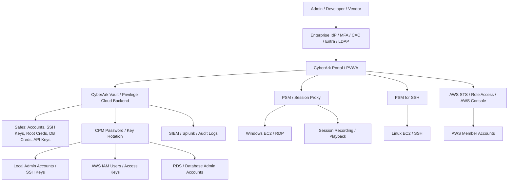
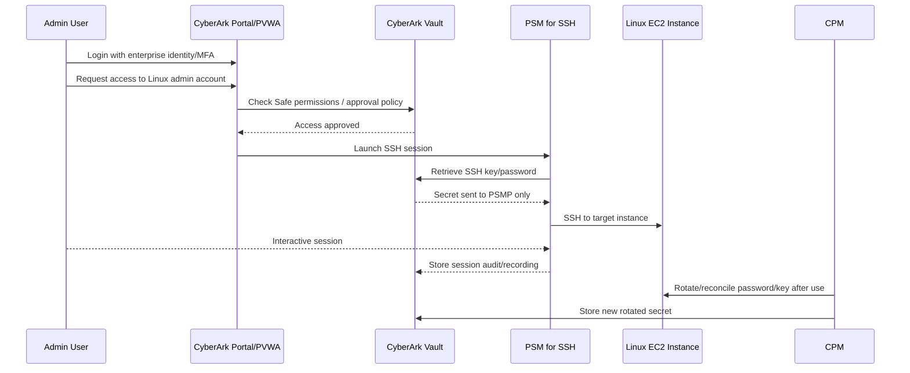
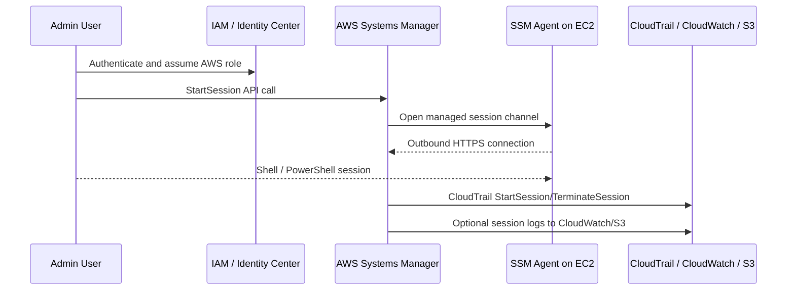
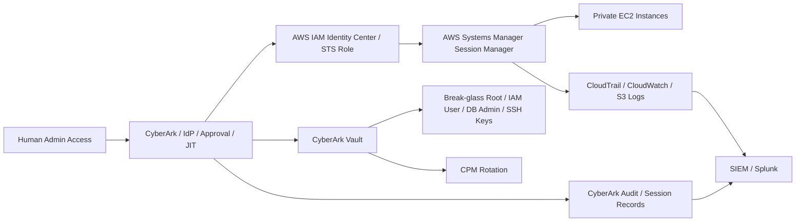

## Bottom line

**CyberArk PAM and AWS Systems Manager are not exact replacements.**

**AWS Systems Manager Session Manager** is best for **AWS-native EC2 access without SSH/RDP inbound ports, bastion hosts, or SSH keys**. AWS specifically recommends using Session Manager instead of public SSH/RDP or bastions, with instances in private subnets and SSM/VPC endpoints. ([AWS Documentation][1])

**CyberArk PAM** is best for **enterprise privileged access control**: vaulting credentials, rotating passwords/SSH keys, brokering sessions, hiding secrets from users, approval workflows, privileged session recording, third-party/vendor access, break-glass accounts, AWS root/IAM user credential control, and multi-cloud/on-prem PAM. CyberArk’s Privilege Cloud architecture includes a cloud backend/Vault plus customer-side connectors such as **PSM**, **CPM**, **PSM for SSH**, Secure Tunnel, and identity connectors. ([CyberArk Docs][2])

---

# 1. CyberArk PAM architecture for AWS workloads

Think of CyberArk as a **privileged access control plane** sitting above AWS accounts and workloads.

## Main CyberArk components

| Component                                         | What it does in AWS workload access                                                                                                                                                                                           |
| ------------------------------------------------- | ----------------------------------------------------------------------------------------------------------------------------------------------------------------------------------------------------------------------------- |
| **Vault / Privilege Cloud backend**               | Stores privileged passwords, SSH keys, API keys, IAM user credentials, AWS root break-glass credentials, and audit data. CyberArk describes the Vault as the secure storage engine for privileged data. ([CyberArk Docs][3])  |
| **PVWA / CyberArk Portal**                        | Web portal where users request access, check out credentials, launch sessions, and auditors review activity. ([CyberArk Docs][3])                                                                                             |
| **CPM — Central Policy Manager**                  | Automatically changes, verifies, and reconciles passwords on target systems, then stores updated secrets back in the Vault. ([CyberArk Docs][3])                                                                              |
| **PSM — Privileged Session Manager**              | Proxies privileged RDP/web sessions, hides credentials from the user, records sessions, and provides audit playback. ([CyberArk Docs][3])                                                                                     |
| **PSM for SSH / PSMP**                            | Proxies SSH access to Linux/Unix systems and can record SSH activity while keeping SSH keys/passwords hidden from the user. ([CyberArk Docs][3])                                                                              |
| **AWS STS connector / Secure Cloud Access**       | Provides controlled AWS console/CLI access using scoped, time-bound cloud permissions. CyberArk describes Secure Cloud Access as a zero-standing-privilege model that grants cloud entitlements just in time. ([CyberArk][4]) |
| **Secrets Hub / application secrets integration** | Can integrate CyberArk-managed secrets with AWS Secrets Manager so developers continue using AWS-native secret retrieval while security centrally governs rotation and control. ([Amazon Web Services, Inc.][5])              |

---

# 2. How access works: CyberArk to EC2

## Example: Linux EC2 privileged SSH access

The important point: **the user never needs to know the EC2 local admin password or SSH private key**. CyberArk retrieves it, uses it through PSM/PSMP, records the activity, and can rotate the secret afterward.

For this model, CyberArk’s PSM/CPM components need network reachability to the target EC2 instances. CyberArk’s AWS auto-onboarding guidance also notes that CPM and PSM need network access to target devices, for example through VPC peering or equivalent routing. ([GitHub][6])

---

# 3. How access works: AWS Systems Manager Session Manager

SSM Session Manager does **not require inbound SSH/RDP ports, bastion hosts, or SSH keys**. The instance needs SSM Agent, an instance profile such as `AmazonSSMManagedInstanceCore`, and connectivity to SSM endpoints such as `ssm`, `ssmmessages`, and `ec2messages`. ([AWS Documentation][1])

SSM can send session data to CloudWatch Logs or S3, and CloudTrail records the SSM API activity such as `StartSession`. ([AWS Documentation][7]) However, AWS documents an important limitation: **Session Manager logging is not available for sessions that connect through SSH or port forwarding**, because SSM is only tunneling encrypted SSH/port-forward traffic in those cases. ([AWS Documentation][8])

---

# 4. CyberArk vs AWS Systems Manager

| Area                          | CyberArk PAM                                                                                                           | AWS Systems Manager                                                                                                                                            |
| ----------------------------- | ---------------------------------------------------------------------------------------------------------------------- | -------------------------------------------------------------------------------------------------------------------------------------------------------------- |
| **Primary purpose**           | Enterprise PAM: vault, rotate, approve, broker, record, audit privileged access.                                       | AWS-native operations and access to managed nodes.                                                                                                             |
| **EC2 access**                | PSM/PSMP proxies SSH/RDP and can hide credentials from users.                                                          | Session Manager gives shell access without SSH/RDP inbound ports or keys.                                                                                      |
| **Credential vaulting**       | Strong native vaulting for passwords, SSH keys, root, break-glass, DB creds, service accounts.                         | Parameter Store supports SecureString; Secrets Manager is the stronger AWS-native secrets service. ([Amazon Web Services, Inc.][9])                            |
| **Password/key rotation**     | CPM rotates, verifies, and reconciles privileged passwords/keys.                                                       | Secrets Manager rotates supported secrets; SSM itself is not a full PAM password rotation platform.                                                            |
| **Session recording**         | PSM records privileged sessions and provides playback/audit. ([CyberArk Docs][3])                                      | SSM can log normal session input/output to CloudWatch/S3, but not SSH-over-SSM or port-forwarded sessions. ([AWS Documentation][8])                            |
| **AWS console access**        | Can broker AWS console access through STS/JIT patterns and hide long-lived keys. ([CyberArk Docs][10])                 | IAM Identity Center/STS provides native AWS role access and temporary credentials.                                                                             |
| **Approvals / dual control**  | Stronger built-in PAM workflow: request, approval, reason, time-bound access, safe permissions.                        | IAM can enforce access, but approval workflow usually needs IAM Identity Center customization, Change Manager, ticketing, or third-party tooling.              |
| **Third-party/vendor access** | Strong use case: vendor enters through CyberArk, no password disclosure, full recording.                               | Possible with IAM/SSM, but not as complete for vendor PAM governance.                                                                                          |
| **Multi-cloud/on-prem**       | Designed for hybrid, multi-cloud, network devices, databases, Windows/Linux, SaaS/admin accounts.                      | Best inside AWS; hybrid is possible, but AWS-centric.                                                                                                          |
| **Fleet operations**          | PAM-focused, not a patching/configuration platform.                                                                    | Strong: Run Command, Patch Manager, Automation, State Manager, Inventory, Fleet Manager. Run Command automates admin tasks at scale. ([AWS Documentation][11]) |
| **Operational complexity**    | Higher: connectors, safes, CPM/PSM sizing, network paths, licensing, platform onboarding.                              | Lower for AWS EC2 if SSM Agent/IAM/VPC endpoints are standardized.                                                                                             |
| **Best fit**                  | High-compliance PAM, break-glass, root/IAM user control, vendor access, session recording, legacy privileged accounts. | AWS-native private EC2 access, patching, command execution, inventory, automation.                                                                             |

---

# 5. Main gaps if you use only AWS Systems Manager

SSM is excellent for AWS-native access, but it does **not fully replace enterprise PAM**.

| Gap                                                                  | Why it matters                                                                                                                                                                                                                      |
| -------------------------------------------------------------------- | ----------------------------------------------------------------------------------------------------------------------------------------------------------------------------------------------------------------------------------- |
| **No full enterprise credential vault model**                        | SSM Session Manager avoids SSH keys for access, but many environments still have local admin accounts, root credentials, database admin passwords, service accounts, break-glass accounts, and non-AWS privileged credentials.      |
| **Limited privileged session recording**                             | SSM session logs are useful, but port-forwarding and SSH-over-SSM session content is not logged by Session Manager. CyberArk PSM is stronger when auditors require replayable privileged-session evidence. ([AWS Documentation][8]) |
| **Approval workflow is not as mature out of the box**                | SSM uses IAM authorization. CyberArk adds PAM workflows: request reason, approval, checkout window, exclusive access, and post-use rotation.                                                                                        |
| **Weak coverage outside AWS**                                        | SSM can manage hybrid nodes, but CyberArk is better suited for enterprise PAM across AWS, Azure, on-prem servers, network devices, databases, and vendor access.                                                                    |
| **No CyberArk-style password checkout/rotation for legacy accounts** | SSM removes the need for SSH keys in the ideal model, but it does not automatically solve all legacy local-account rotation and reconciliation needs.                                                                               |
| **Break-glass/root governance**                                      | AWS recommends safeguarding root credentials and not using root for daily tasks. CyberArk has published AWS root MFA/PAM use cases for controlled root access. ([Amazon Web Services, Inc.][12])                                    |

---

# 6. Main gaps if you use only CyberArk

CyberArk is not a replacement for AWS-native operations.

| Gap                                         | Why it matters                                                                                                                                                                                                                          |
| ------------------------------------------- | --------------------------------------------------------------------------------------------------------------------------------------------------------------------------------------------------------------------------------------- |
| **Still needs AWS IAM guardrails**          | AWS IAM, SCPs, permission boundaries, CloudTrail, and IAM Identity Center remain the source of truth for AWS API authorization.                                                                                                         |
| **May require network path to targets**     | PSM/CPM often need connectivity to EC2/RDS/admin endpoints. In a locked-down AWS environment, that means routing, security groups, endpoints, inspection paths, and scaling decisions.                                                  |
| **More operational overhead**               | You must manage connectors, safes, platforms, CPM rotation policies, PSM capacity, recordings, DR, and onboarding.                                                                                                                      |
| **Not an SSM fleet-management replacement** | SSM Patch Manager, Run Command, Automation, Inventory, and Compliance are AWS-native operational tools. Patch Manager automates patching and compliance reporting across managed nodes. ([AWS Documentation][13])                       |
| **Can conflict with “no SSH/RDP” strategy** | If your target architecture is “no inbound 22/3389 anywhere,” SSM is cleaner. CyberArk can still control AWS console/role access and secrets, but traditional PSM-to-instance access may require opening SSH/RDP from PSM subnets only. |

---

# 7. Best practical architecture for AWS workloads

For a secure AWS environment, I would not choose **CyberArk OR SSM**. I would use them together, with clear boundaries.

## Recommended pattern

Use **SSM Session Manager as the default EC2 access method** for AWS workloads, especially in private subnets with no public IP, no bastion, and no inbound SSH/RDP. Use **CyberArk for the privileged governance layer**: approval, break-glass credentials, AWS root protection, legacy local admin credentials, vendor access, secrets governance, and high-assurance session recording.

For your AWS/GovCloud-style environment, the clean model is:

1. **No inbound SSH/RDP from users.**
2. **EC2 instances managed by SSM Agent.**
3. **SSM endpoints deployed privately in VPCs.**
4. **AWS access through IAM Identity Center / Entra / CAC/MFA.**
5. **CyberArk controls high-risk privilege elevation and break-glass.**
6. **CloudTrail + SSM logs + CyberArk audit logs forwarded to Splunk/SIEM.**
7. **CyberArk PSM used only where replay-level session recording or legacy credential hiding is required.**

---

## Simple decision rule

Use **SSM** when the requirement is:

> “I need secure AWS-native shell/RDP access to EC2 without opening ports or managing SSH keys.”

Use **CyberArk** when the requirement is:

> “I need enterprise PAM: vaulting, rotation, approval, password hiding, vendor control, break-glass governance, root/IAM user control, and strong privileged-session audit.”

Use **both** when the requirement is:

> “I need AWS-native private access, but also enterprise-grade privileged access governance and compliance evidence.”

[1]: https://docs.aws.amazon.com/prescriptive-guidance/latest/aws-startup-security-baseline/wkld-06.html "WKLD.06 Use Systems Manager instead of SSH or RDP - AWS Prescriptive Guidance"
[2]: https://docs.cyberark.com/privilege-cloud-shared-services/latest/en/content/privilege%20cloud/privcloud-detailed-architecture.htm "Privilege Cloud architecture"
[3]: https://docs.cyberark.com/pam-self-hosted/latest/en/content/pasimp/privileged-account-security-solution-architecture.htm "Privileged Access Manager - Self-Hosted Architecture"
[4]: https://www.cyberark.com/products/secure-cloud-access/ "Secure Cloud Access | CyberArk"
[5]: https://aws.amazon.com/blogs/apn/streamlining-secrets-management-for-enhanced-security-using-cyberark-secrets-hub-and-aws/ "Streamlining Secrets Management for Enhanced Security Using CyberArk Secrets Hub and AWS | AWS Partner Network (APN) Blog"
[6]: https://github.com/cyberark/cyberark-aws-auto-onboarding "GitHub - cyberark/cyberark-aws-auto-onboarding: Solutions for automatically detecting, managing and securing privileged accounts in AWS EC2 · GitHub"
[7]: https://docs.aws.amazon.com/systems-manager/latest/userguide/session-manager-logging-cloudwatch-logs.html?utm_source=chatgpt.com "Logging session data using Amazon CloudWatch Logs ..."
[8]: https://docs.aws.amazon.com/systems-manager/latest/userguide/session-manager-logging.html?utm_source=chatgpt.com "Enabling and disabling session logging"
[9]: https://aws.amazon.com/secrets-manager/?utm_source=chatgpt.com "AWS Secrets Manager"
[10]: https://docs.cyberark.com/pam-self-hosted/latest/en/content/pasimp/psm-aws-cloudservicesmanagement.htm "AWS Cloud Services"
[11]: https://docs.aws.amazon.com/systems-manager/latest/userguide/run-command.html "AWS Systems Manager Run Command - AWS Systems Manager"
[12]: https://aws.amazon.com/blogs/apn/managing-aws-account-root-mfa-using-cyberark-privileged-access-manager/ "Managing AWS Account Root MFA Using CyberArk Privileged Access Manager | AWS Partner Network (APN) Blog"
[13]: https://docs.aws.amazon.com/systems-manager/latest/userguide/patch-manager.html "AWS Systems Manager Patch Manager - AWS Systems Manager"
