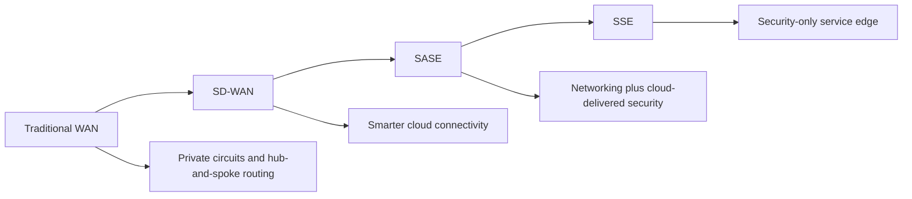
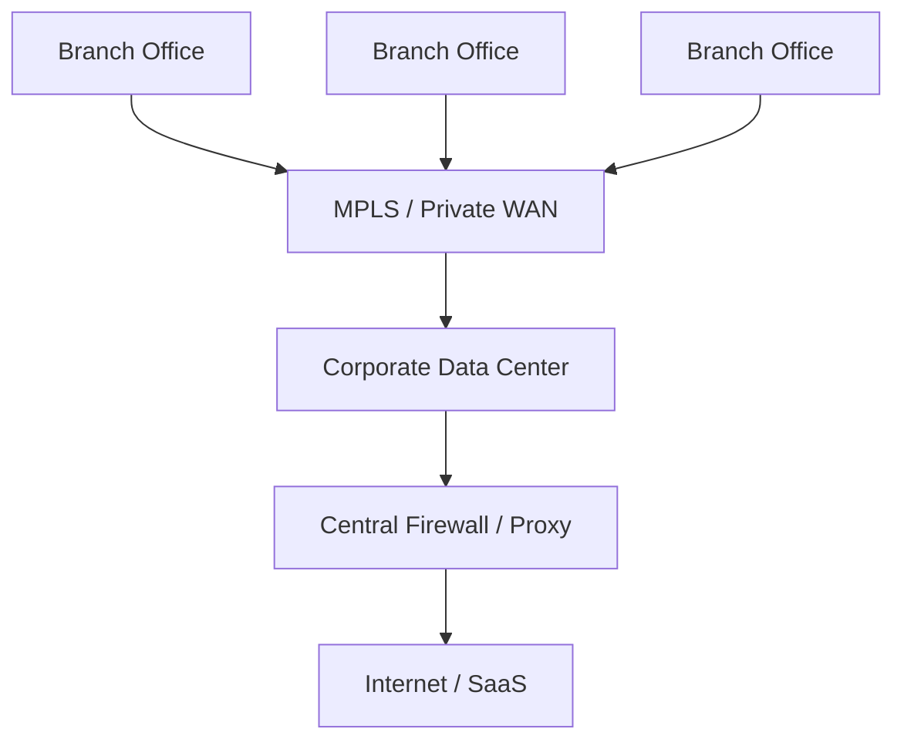
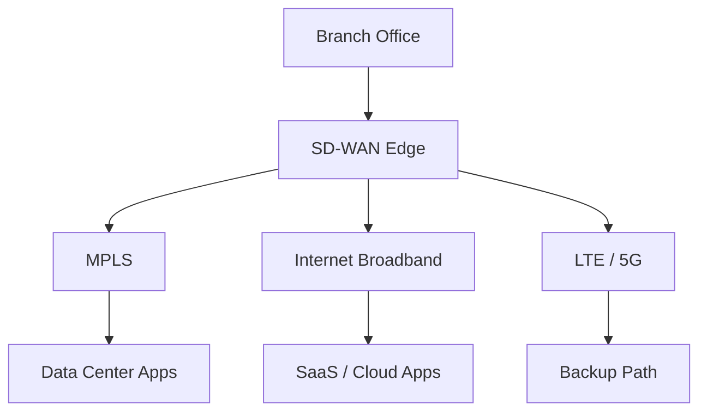
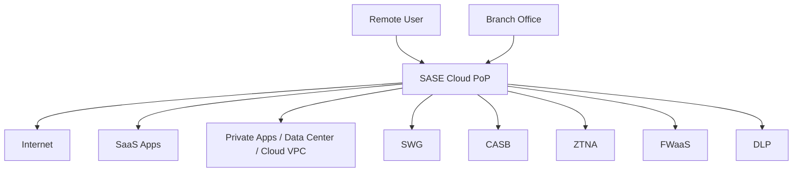
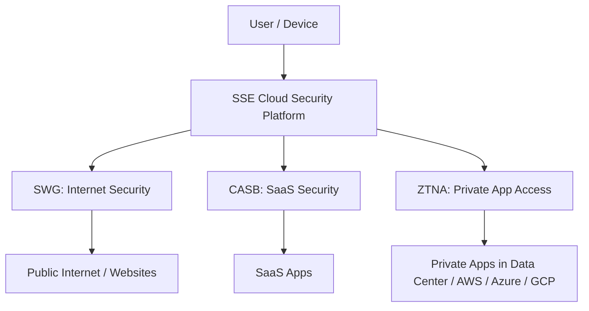
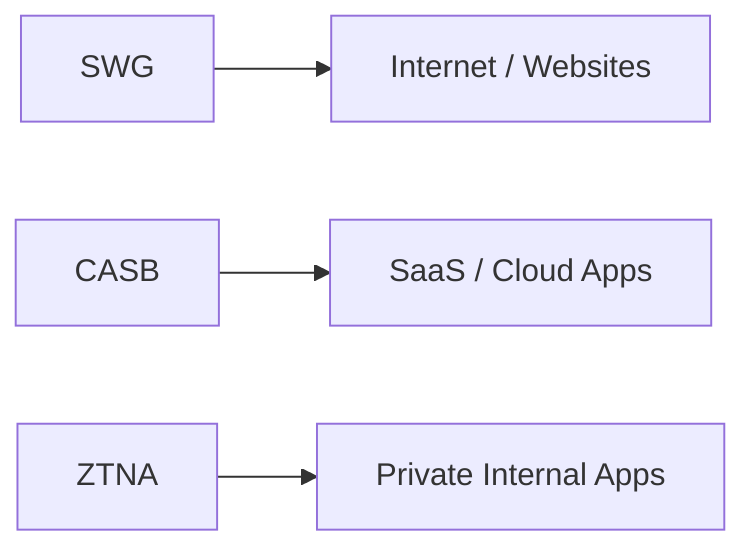

# Evolution from SD-WAN to SASE to SSE

## 1. Executive Summary

The evolution from **SD-WAN** to **SASE** to **SSE** is really the story of how enterprise traffic changed.

In the old model, most users worked from offices, most applications lived in private data centers, and security inspection happened at the corporate perimeter. That model worked when traffic flowed from branch offices back to headquarters.

Cloud, SaaS, remote work, mobile users, and hybrid applications broke that model. Users now connect from anywhere, applications live everywhere, and traffic no longer fits neatly through one corporate data center.

The progression is:

At a high level:

| Stage               | Main Focus                      | Problem It Solved                                             |
| ------------------- | ------------------------------- | ------------------------------------------------------------- |
| **Traditional WAN** | Private enterprise connectivity | Connected branches to data centers                            |
| **SD-WAN**          | Flexible network routing        | Made branch-to-cloud connectivity faster and cheaper          |
| **SASE**            | Networking + security           | Added cloud-delivered security to the new distributed network |
| **SSE**             | Security only                   | Provided the security side of SASE without requiring SD-WAN   |

---

# 2. Traditional WAN — The Old Enterprise Model

Before cloud and SaaS became dominant, most enterprise networks were built around a **hub-and-spoke model**.

Branch offices connected back to headquarters or a corporate data center using private circuits such as MPLS. Internet access and security inspection usually happened at the central data center.

## How it worked

## Why this became a problem

This model worked when applications were mostly inside the data center. But when users started accessing SaaS applications like Microsoft 365, Salesforce, ServiceNow, and cloud-hosted applications, routing all traffic back to the data center became inefficient.

The problems were:

* High latency for SaaS and cloud applications
* Expensive reliance on MPLS circuits
* Poor user experience for branch and remote users
* Central security stack became a bottleneck
* Remote users often bypassed corporate security controls

The enterprise needed better connectivity to cloud applications. That led to **SD-WAN**.

---

# 3. SD-WAN — Solved the Connectivity Problem

**SD-WAN** stands for **Software-Defined Wide Area Network**.

SD-WAN solved the networking problem created by cloud adoption. Instead of forcing all branch traffic through expensive private circuits and headquarters, SD-WAN allowed branches to use multiple connection types intelligently.

These could include:

* MPLS
* Broadband internet
* LTE / 5G
* Direct internet access
* Private circuits

## What SD-WAN changed

SD-WAN separates network control from the underlying transport. In simple terms, it does not care whether the link is MPLS, broadband, LTE, or another circuit. It uses policy and real-time link monitoring to choose the best path for application traffic.

## What problem SD-WAN solved

SD-WAN solved the problem of **efficient, flexible, and cost-effective connectivity**.

It helped organizations:

* Reduce dependency on expensive MPLS
* Improve application performance
* Route SaaS traffic directly to the internet
* Use multiple links actively instead of keeping backups idle
* Centrally manage WAN routing policies

## What SD-WAN did not fully solve

SD-WAN improved connectivity, but it did not fully solve the security problem.

Once branch offices started sending traffic directly to the internet and SaaS platforms, the old centralized security model became weaker. Traffic no longer always passed through the corporate data center firewall, proxy, IDS/IPS, or DLP stack.

That created a new problem: **security needed to move closer to users and cloud applications**.

That led to **SASE**.

---

# 4. SASE — Solved the Networking + Security Convergence Problem

**SASE** stands for **Secure Access Service Edge**.

SASE combines **networking** and **security** into a cloud-delivered architecture.

A simple way to think about it:

> **SASE = SD-WAN + cloud-delivered security**

SASE was created to solve the problem that SD-WAN made more visible: branch users and remote users were connecting directly to cloud services, but security was still designed around the old data center perimeter.

## Main components of SASE

SASE commonly includes:

| Component  | Full Form                          | Purpose                                     |
| ---------- | ---------------------------------- | ------------------------------------------- |
| **SD-WAN** | Software-Defined Wide Area Network | Optimizes network connectivity              |
| **SWG**    | Secure Web Gateway                 | Secures internet and web browsing           |
| **CASB**   | Cloud Access Security Broker       | Secures SaaS and cloud application usage    |
| **ZTNA**   | Zero Trust Network Access          | Provides per-application private access     |
| **FWaaS**  | Firewall as a Service              | Delivers firewall capability from the cloud |
| **DLP**    | Data Loss Prevention               | Helps stop sensitive data leakage           |

## How SASE works

Instead of sending all traffic back to the corporate data center, users and branches connect to the nearest SASE cloud point of presence.

Security inspection happens close to the user, not only at headquarters.

## What problem SASE solved

SASE solved the problem of **consistent security for distributed users, branches, cloud applications, SaaS, and private applications**.

It helped organizations:

* Secure direct internet access from branches
* Apply consistent policy to remote and office users
* Reduce data center security backhaul
* Combine networking and security policy
* Support cloud and hybrid work models
* Improve performance by inspecting traffic near the user

## Key point

SASE is not just a firewall in the cloud. It is a broader architecture that combines **network connectivity** and **security enforcement**.

---

# 5. SSE — Solved the “Security-Only” Requirement

**SSE** stands for **Security Service Edge**.

SSE is the security portion of SASE without the SD-WAN networking component.

A simple way to think about it:

> **SSE = SASE security services without SD-WAN**

or:

> **SASE = SD-WAN + SSE**

## Why SSE became important

Not every organization wanted to replace or redesign its network. Some already had SD-WAN, MPLS, cloud networking, or another connectivity model in place.

They still needed stronger security for:

* Remote users
* SaaS applications
* Internet browsing
* Private application access
* Sensitive data movement

SSE provided a way to adopt the security side without requiring a full SD-WAN transformation.

## Common SSE components

| Component | Full Form                    | Main Purpose                               |
| --------- | ---------------------------- | ------------------------------------------ |
| **SWG**   | Secure Web Gateway           | Secures web and internet traffic           |
| **CASB**  | Cloud Access Security Broker | Secures SaaS and cloud app usage           |
| **ZTNA**  | Zero Trust Network Access    | Secures access to private applications     |
| **DLP**   | Data Loss Prevention         | Protects sensitive data                    |
| **FWaaS** | Firewall as a Service        | Provides cloud-delivered firewall controls |
| **RBI**   | Remote Browser Isolation     | Isolates risky web browsing sessions       |

## SASE vs SSE

| Area                             | SASE                                                | SSE                                                |
| -------------------------------- | --------------------------------------------------- | -------------------------------------------------- |
| Includes SD-WAN                  | Yes                                                 | No                                                 |
| Includes cloud security services | Yes                                                 | Yes                                                |
| Primary focus                    | Networking + security                               | Security only                                      |
| Best fit                         | Organizations modernizing WAN and security together | Organizations that already have networking handled |
| Example components               | SD-WAN, SWG, CASB, ZTNA, FWaaS, DLP                 | SWG, CASB, ZTNA, FWaaS, DLP                        |

---

# 6. Difference Between CASB, SWG, and ZTNA

CASB, SWG, and ZTNA are often grouped together under SSE or SASE, but they solve different problems.

The easiest way to separate them is by asking:

| Question                                                 | Technology |
| -------------------------------------------------------- | ---------- |
| Is the user safely browsing the internet?                | **SWG**    |
| Is the user safely using SaaS/cloud apps?                | **CASB**   |
| Should this user/device access this private application? | **ZTNA**   |

---

## 6.1 SWG — Secure Web Gateway

**SWG** stands for **Secure Web Gateway**.

SWG protects users when they access the public internet and web-based content.

## What SWG focuses on

SWG focuses on **web traffic**, usually HTTP and HTTPS traffic.

It answers questions like:

* Is this website malicious?
* Is this URL category allowed?
* Is the user trying to download malware?
* Should this file download be blocked?
* Should this web request be inspected?
* Is this phishing or command-and-control traffic?

## Common SWG functions

| Function            | Description                                                   |
| ------------------- | ------------------------------------------------------------- |
| URL filtering       | Allows or blocks websites by category or reputation           |
| Malware inspection  | Scans downloads and web content                               |
| Phishing protection | Blocks known phishing sites                                   |
| TLS/SSL inspection  | Decrypts and inspects HTTPS traffic where allowed             |
| Content filtering   | Blocks risky or inappropriate content                         |
| Browser isolation   | Opens risky websites in an isolated environment               |
| Web DLP             | Prevents sensitive data from being uploaded to risky websites |

## Simple example

A user tries to visit a newly registered website that hosts malware.

The **SWG** checks the URL reputation, detects risk, and blocks the connection before the user downloads anything.

## Simple explanation

> SWG protects the user from the internet.

---

## 6.2 CASB — Cloud Access Security Broker

**CASB** stands for **Cloud Access Security Broker**.

CASB protects SaaS and cloud application usage.

While SWG focuses broadly on web browsing, CASB focuses more deeply on **cloud applications and SaaS platforms** such as Microsoft 365, Google Workspace, Salesforce, ServiceNow, Box, Dropbox, GitHub, Slack, and other cloud services.

## What CASB focuses on

CASB answers questions like:

* Which SaaS apps are users accessing?
* Are users using unsanctioned cloud apps?
* Is sensitive data being uploaded to SaaS?
* Is someone sharing files publicly?
* Is a user downloading large amounts of data from SaaS?
* Is a compromised account behaving abnormally?
* Are OAuth apps or third-party integrations risky?

## Common CASB functions

| Function                  | Description                                                        |
| ------------------------- | ------------------------------------------------------------------ |
| Shadow IT discovery       | Finds unsanctioned SaaS applications                               |
| SaaS visibility           | Shows who is using which cloud apps                                |
| SaaS DLP                  | Detects sensitive data in SaaS uploads, downloads, and sharing     |
| API-based SaaS inspection | Connects directly to SaaS platforms to scan data and configuration |
| Inline SaaS control       | Enforces policy while users access SaaS apps                       |
| User behavior analytics   | Detects abnormal SaaS activity                                     |
| Collaboration control     | Finds risky sharing, public links, and external access             |
| OAuth app control         | Detects risky third-party SaaS integrations                        |

## Simple example

A user uploads a spreadsheet containing sensitive data to a personal Dropbox account.

The **CASB** detects that the SaaS destination is unsanctioned, identifies sensitive content, and blocks or alerts on the upload.

## Another example

A user in Microsoft 365 creates an anonymous public sharing link for a sensitive document.

The **CASB** detects the risky sharing permission through API integration and can remove the public link or alert the SOC.

## Simple explanation

> CASB protects SaaS and cloud application usage.

---

## 6.3 ZTNA — Zero Trust Network Access

**ZTNA** stands for **Zero Trust Network Access**.

ZTNA controls access to private applications based on identity, device posture, user context, and policy.

ZTNA is often described as a VPN replacement, but that is only partially true. A VPN usually gives users network-level access. ZTNA gives users **application-level access**.

## What ZTNA focuses on

ZTNA answers questions like:

* Who is the user?
* Is the device healthy and managed?
* Is MFA satisfied?
* Is the user allowed to access this specific application?
* Is the user coming from an expected location?
* Should access be read-only, blocked, or allowed?
* Should the session be continuously re-evaluated?

## Common ZTNA functions

| Function               | Description                                                        |
| ---------------------- | ------------------------------------------------------------------ |
| Identity-based access  | Uses IdP, MFA, groups, and roles                                   |
| Device posture check   | Checks device health, compliance, EDR status, or certificate       |
| Per-app access         | Grants access to specific applications, not the whole network      |
| Least privilege        | Avoids broad network access                                        |
| Private app publishing | Exposes private apps without placing them directly on the internet |
| Continuous evaluation  | Re-checks access based on risk and context                         |
| Session control        | Can limit or terminate access when risk changes                    |

## Simple example

A contractor needs access to one internal web application hosted in a private AWS VPC.

With a VPN, the contractor may receive network-level access into the environment.

With **ZTNA**, the contractor only receives access to that one approved application after identity, MFA, and device posture checks pass.

## Simple explanation

> ZTNA protects private application access.

---

# 7. CASB vs SWG vs ZTNA — Side-by-Side Comparison

| Category             | SWG                                                                | CASB                                                                    | ZTNA                                                                     |
| -------------------- | ------------------------------------------------------------------ | ----------------------------------------------------------------------- | ------------------------------------------------------------------------ |
| Full Form            | Secure Web Gateway                                                 | Cloud Access Security Broker                                            | Zero Trust Network Access                                                |
| Main Purpose         | Secure internet browsing                                           | Secure SaaS/cloud app usage                                             | Secure private application access                                        |
| Primary Traffic Type | Web traffic: HTTP/HTTPS                                            | SaaS and cloud application traffic                                      | Private application traffic                                              |
| Main User Question   | “Can this user safely browse this site?”                           | “Can this user safely use this SaaS app and data?”                      | “Should this user/device access this private app?”                       |
| Protects Against     | Malware, phishing, malicious websites, risky downloads             | Shadow IT, risky sharing, SaaS data leakage, compromised SaaS accounts  | Over-broad VPN access, unauthorized private app access, lateral movement |
| Enforcement Point    | Between user and internet                                          | Between user and SaaS, and/or via SaaS API integration                  | Between user and private application                                     |
| Typical Controls     | URL filtering, malware scanning, TLS inspection, browser isolation | SaaS discovery, DLP, sharing control, API inspection, OAuth app control | MFA, device posture, per-app policy, least-privilege access              |
| Example              | Block malware download from a website                              | Block upload of sensitive data to personal Dropbox                      | Allow contractor to access only one internal app                         |
| Simple Summary       | Protects users from the internet                                   | Protects data and activity in SaaS                                      | Protects private apps from unauthorized access                           |

---

# 8. How They Work Together in SSE

In a modern SSE platform, SWG, CASB, and ZTNA are usually integrated.

## Example user journey

A remote employee logs in from a managed laptop.

The SSE platform applies different controls depending on what the user is trying to access:

| User Action                                | SSE Control Used            |
| ------------------------------------------ | --------------------------- |
| User browses the internet                  | SWG                         |
| User opens Microsoft 365                   | CASB                        |
| User uploads a file to SaaS                | CASB + DLP                  |
| User visits a suspicious website           | SWG                         |
| User accesses an internal HR app           | ZTNA                        |
| User tries to reach a private admin portal | ZTNA + MFA + device posture |

The important point is that the same user may pass through different security functions depending on the destination and risk.

---

# 9. Practical Way to Remember the Difference

Use this simple model:

| Technology | Memory Aid                                             |
| ---------- | ------------------------------------------------------ |
| **SWG**    | “Can I safely browse this website?”                    |
| **CASB**   | “Can I safely use this SaaS app and protect the data?” |
| **ZTNA**   | “Can I access this specific private application?”      |

---

# 10. Final Summary

The evolution is logical:

1. **Traditional WAN** connected branches to data centers.
2. **SD-WAN** improved cloud connectivity and reduced dependency on MPLS.
3. **SASE** combined SD-WAN with cloud-delivered security.
4. **SSE** separated out the security side for organizations that did not need the SD-WAN component.
5. **SWG, CASB, and ZTNA** are key SSE/SASE security controls, but they solve different problems.

The simplest summary is:

> **SD-WAN solves connectivity.**
> **SASE combines connectivity and security.**
> **SSE provides cloud-delivered security without SD-WAN.**
> **SWG secures web browsing.**
> **CASB secures SaaS and cloud application usage.**
> **ZTNA secures private application access.**

