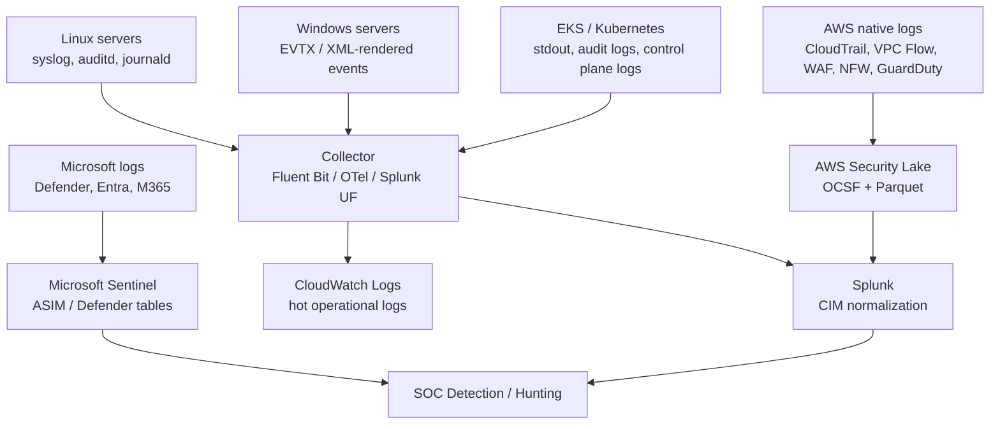

Yes — think of it this way:

```text
Microsoft Sentinel / Defender world  → ASIM / Defender hunting tables
AWS Security Lake world              → OCSF + Parquet
Splunk Enterprise Security world     → CIM
OpenTelemetry world                  → telemetry model for logs, metrics, traces
```

## 1. What does Splunk use?

Splunk’s traditional normalization model is **CIM — Common Information Model**.

Splunk CIM normalizes different vendor logs into common field names and tags. For example, firewall, proxy, Windows, Linux, AWS, and endpoint logs can all be mapped into common data models such as:

| Splunk CIM data model   | Example use                                           |
| ----------------------- | ----------------------------------------------------- |
| **Authentication**      | Logon success/failure from Windows, Linux, Entra, VPN |
| **Network Traffic**     | Firewall, VPC Flow Logs, proxy, NFW                   |
| **Web**                 | Proxy, WAF, web server logs                           |
| **Endpoint**            | EDR, process, file, registry activity                 |
| **Change**              | Configuration changes                                 |
| **Malware**             | AV/EDR detections                                     |
| **Intrusion Detection** | IDS/IPS alerts                                        |

Splunk describes CIM as a search-time schema that lets you normalize fields and tags while leaving the raw machine data intact. This is important: Splunk often keeps the original raw log, then applies field extractions, aliases, tags, and data models at search time. ([Splunk Docs][1])

### Splunk compared to AWS and Microsoft

| Platform                       | Main normalization model                     |
| ------------------------------ | -------------------------------------------- |
| **Splunk Enterprise Security** | **CIM**                                      |
| **Microsoft Sentinel**         | **ASIM**, CommonSecurityLog, Defender tables |
| **AWS Security Lake**          | **OCSF**                                     |
| **Elastic**                    | ECS — Elastic Common Schema                  |
| **Google SecOps / Chronicle**  | UDM — Unified Data Model                     |
| **Legacy SIEM integrations**   | CEF / LEEF / Syslog                          |

Splunk now also supports OCSF. Splunk’s **OCSF-CIM Add-On** maps OCSF-formatted events into Splunk CIM so Splunk Enterprise Security detections and dashboards can still work with CIM-based content. ([Splunk Docs][2]) Splunk also documents how to work with OCSF-formatted data and recommends the OCSF-CIM Add-On for timestamp extraction and CIM mappings. ([Splunk Docs][3])

So the practical answer is:

```text
Splunk native security normalization = CIM
Splunk can ingest OCSF = Yes
Splunk Security Lake integration = OCSF data mapped/used through CIM-compatible knowledge objects
```

---

## 2. Linux logs are Syslog — can we convert them to JSON at source?

Yes, but with a clarification.

Classic Linux logs are often **Syslog-style text**, for example:

```text
Jun 19 10:12:01 server01 sshd[1234]: Failed password for user1 from 10.1.2.3 port 50122 ssh2
```

That is human-readable, but not ideal for analytics. You can convert Linux logs to JSON in a few ways:

### Option A — application writes JSON directly

Best option for modern apps:

```json
{
  "time": "2026-06-19T10:12:01Z",
  "app": "payment-api",
  "event": "login_failed",
  "user": "user1",
  "src_ip": "10.1.2.3"
}
```

This is the cleanest because the application knows the meaning of the fields.

### Option B — rsyslog converts Syslog to JSON

`rsyslog` can use templates to build structured output. Its documentation describes list templates for schema mapping and subtree templates for building output from a JSON subtree. ([Rsyslog Documentation][4])

Conceptually:

```text
Linux syslog text
   ↓
rsyslog template / parser
   ↓
JSON output
   ↓
CloudWatch / Splunk / Sentinel / Security Lake pipeline
```

### Option C — agent converts it

Agents such as Fluent Bit, OpenTelemetry Collector, Splunk Universal Forwarder, Elastic Agent, or Azure Monitor Agent can read Linux logs and send structured fields downstream.

For example:

```text
/var/log/secure
/var/log/messages
journald
auditd
application logs
   ↓
Fluent Bit / OTel Collector / Splunk UF
   ↓
JSON or structured event
   ↓
SIEM / data lake
```

For security, the better approach is usually:

```text
Do not only convert text to JSON.
Also normalize to CIM / ASIM / OCSF later.
```

Because JSON only makes it structured. It does not automatically make it a security schema.

---

## 3. Windows logs are XML — can we convert them to JSON?

Yes. Windows Event Logs are commonly stored as EVTX and can be rendered as XML, but collectors can transform them into structured fields.

Example Windows event rendered as XML:

```xml
<Event>
  <System>
    <EventID>4625</EventID>
    <Provider Name="Microsoft-Windows-Security-Auditing"/>
  </System>
  <EventData>
    <Data Name="TargetUserName">jdoe</Data>
    <Data Name="IpAddress">10.1.2.3</Data>
  </EventData>
</Event>
```

A collector can convert that into structured JSON-like data:

```json
{
  "EventID": 4625,
  "Provider": "Microsoft-Windows-Security-Auditing",
  "TargetUserName": "jdoe",
  "IpAddress": "10.1.2.3",
  "Outcome": "Failure"
}
```

Fluent Bit’s Windows Event Log input, for example, can render Windows events as XML or newline-separated key/value text. ([Fluent Bit Documentation][5]) From there, the pipeline can output structured records to a destination.

Practical Windows options:

| Method                         | What it does                                      |
| ------------------------------ | ------------------------------------------------- |
| **Windows Event Forwarding**   | Centralizes Windows events                        |
| **Azure Monitor Agent**        | Sends Windows events to Log Analytics / Sentinel  |
| **Splunk Universal Forwarder** | Sends Windows events to Splunk                    |
| **Fluent Bit / Fluentd**       | Collects Windows events and ships them            |
| **Winlogbeat / Elastic Agent** | Converts Windows events into structured documents |
| **Sysmon + agent**             | Adds detailed process/network/file telemetry      |

In Microsoft Sentinel, you typically do not think of the data as XML anymore. It lands in tables such as `SecurityEvent`, `WindowsEvent`, `DeviceLogonEvents`, `DeviceProcessEvents`, or Defender XDR hunting tables.

---

## 4. How are AWS Kubernetes / EKS logs JSON?

There are multiple Kubernetes log types, so the answer depends on which one you mean.

### A. Container application logs

In Kubernetes, applications usually write to:

```text
stdout
stderr
```

The container runtime and kubelet make those logs available on the node, often under paths like:

```text
/var/log/containers/
```

In Amazon EKS, AWS documents Fluent Bit as a DaemonSet that can send container logs from `/var/log/containers` to CloudWatch Logs. ([AWS Documentation][6])

If the application writes JSON to stdout, then Kubernetes collects JSON-looking log lines:

```json
{
  "level": "info",
  "service": "orders",
  "message": "order submitted",
  "order_id": "12345"
}
```

But if the application writes plain text, Kubernetes does not magically make it high-quality JSON. The log pipeline may wrap it with Kubernetes metadata.

Example:

```json
{
  "log": "failed login for user1 from 10.1.2.3",
  "kubernetes": {
    "namespace_name": "prod",
    "pod_name": "api-55f9d",
    "container_name": "api"
  }
}
```

That is JSON as a container, but the actual message may still be unstructured text.

### B. Kubernetes audit logs

Kubernetes audit logs are more naturally structured. Kubernetes documentation says the log backend writes audit events in **JSONLines** format. ([Kubernetes][7])

Example concept:

```json
{
  "kind": "Event",
  "apiVersion": "audit.k8s.io/v1",
  "verb": "create",
  "user": {
    "username": "system:serviceaccount:prod:deploy"
  },
  "objectRef": {
    "resource": "secrets",
    "namespace": "prod"
  },
  "responseStatus": {
    "code": 201
  }
}
```

### C. EKS control plane logs

Amazon EKS can send control plane logs to CloudWatch Logs. EKS supports log types such as API server, audit, authenticator, controller manager, and scheduler logs. ([AWS Documentation][8])

AWS Security Lake can also normalize **EKS Audit Logs** into OCSF as **API Activity** events. ([AWS Documentation][9])

So:

```text
EKS application logs        = app stdout/stderr, JSON only if app emits JSON or agent parses it
EKS audit logs              = JSONLines-style audit events
EKS control plane logs      = sent to CloudWatch; format depends on component
Security Lake EKS audit     = normalized to OCSF API Activity
```

---

## 5. Is OCSF the only open standard?

No.

OCSF is an important **open cybersecurity schema**, but it is not the only standard/model in the logging world.

| Standard / model      | Main purpose                                                       |
| --------------------- | ------------------------------------------------------------------ |
| **OCSF**              | Open cybersecurity event schema                                    |
| **OpenTelemetry**     | Observability telemetry: logs, metrics, traces                     |
| **Syslog / RFC 5424** | Traditional system/network log transport/message format            |
| **CEF**               | Legacy SIEM event format, common with ArcSight/Sentinel connectors |
| **LEEF**              | Legacy SIEM event format, common with QRadar                       |
| **Elastic ECS**       | Elastic Common Schema                                              |
| **Splunk CIM**        | Splunk security data model                                         |
| **Microsoft ASIM**    | Microsoft Sentinel normalization model                             |
| **Google UDM**        | Google SecOps/Chronicle normalization model                        |

OCSF is open and cybersecurity-focused. The OCSF project describes it as a framework with data types, an attribute dictionary, and taxonomy; it is agnostic to storage format and ETL processes. ([Open Cybersecurity Schema Framework][10]) AWS Security Lake uses OCSF and stores supported data in S3, with custom sources required to use OCSF schema and Apache Parquet. ([AWS Documentation][9])

---

## 6. Where does OpenTelemetry fit?

OpenTelemetry is not the same thing as OCSF.

**OpenTelemetry** is mainly for observability:

```text
Application traces
Application metrics
Application logs
Service dependencies
Latency
Errors
Infrastructure telemetry
```

OpenTelemetry’s logs data model is designed to represent logs from application log files, machine-generated events, system logs, and similar sources, and existing log formats can be mapped into the OpenTelemetry log data model. ([OpenTelemetry][11])

### OCSF vs OpenTelemetry

| Question                | OCSF                                                          | OpenTelemetry                                              |
| ----------------------- | ------------------------------------------------------------- | ---------------------------------------------------------- |
| Primary domain          | Cybersecurity                                                 | Observability                                              |
| Main users              | SOC, SIEM, threat hunting                                     | SRE, DevOps, platform teams                                |
| Data types              | Security events                                               | Logs, metrics, traces                                      |
| Examples                | Authentication, network activity, DNS, findings, API activity | HTTP request latency, traces, app logs, CPU/memory metrics |
| Storage format          | Agnostic; often JSON/Parquet                                  | OTLP/protobuf/JSON depending pipeline                      |
| Replaces SIEM schema?   | Yes, can help                                                 | Not by itself                                              |
| Replaces app telemetry? | No                                                            | Yes, this is its strength                                  |

Simple example:

```text
OpenTelemetry tells you:
"Service A called Service B and latency was 2.5 seconds."

OCSF tells you:
"User X performed API action Y from source IP Z and it was denied."
```

They solve different problems.

---

## 7. Best architecture for AWS + Microsoft + Splunk

For your environment, I would design the log flow like this:



## 8. Practical recommendation

For **new applications**, emit **JSON at the source**.

For **Linux and Windows OS logs**, use collectors to convert or enrich them, but do not expect perfect JSON from the OS itself.

For **AWS-native security logs**, use **Security Lake with OCSF** where possible.

For **Splunk Enterprise Security**, normalize to **CIM**. If you ingest Security Lake OCSF data into Splunk, use the **OCSF-CIM mapping approach**.

For **Microsoft Sentinel**, use **ASIM** and Microsoft-native tables.

For **application observability**, use **OpenTelemetry**.

The clean way to remember it:

```text
JSON = structure
OCSF = security meaning
CIM = Splunk security meaning
ASIM = Microsoft Sentinel security meaning
OpenTelemetry = app/platform telemetry meaning
Parquet = efficient data lake storage
```

[1]: https://help.splunk.com/splunk-cloud-platform/common-information-model/6.3/introduction/overview-of-the-splunk-common-information-model "Overview of the Splunk Common Information Model | Splunk Enterprise, Splunk Cloud Platform (last updated 2025-11-19T22:43:28.613Z)"
[2]: https://help.splunk.com/en/splunk-cloud-platform/common-information-model/8.5/introduction/overview-of-the-ocsf-cim-add-on "Overview of the OCSF CIM add-on | Platform (last updated 2026-04-01T20:48:27.100Z)"
[3]: https://help.splunk.com/en/data-management/process-data-at-the-edge/use-edge-processors-for-splunk-cloud-platform/process-data-using-pipelines/convert-data-to-ocsf-format-using-an-edge-processor/working-with-ocsf-formatted-data-in-the-splunk-platform-and-splunk-enterprise-security "Working with OCSF-formatted data in the Splunk platform and Splunk Enterprise Security | Splunk Cloud Platform (last updated 2026-06-16T02:25:06.884Z)"
[4]: https://docs.rsyslog.com/doc/configuration/templates.html "Templates - rsyslog 8 daily stable documentation"
[5]: https://docs.fluentbit.io/manual/data-pipeline/inputs/windows-event-log-winevtlog "Windows Event logs (winevtlog) | Fluent Bit: Official Manual"
[6]: https://docs.aws.amazon.com/AmazonCloudWatch/latest/monitoring/Container-Insights-setup-logs-FluentBit.html "Set up Fluent Bit as a DaemonSet to send logs to CloudWatch Logs - Amazon CloudWatch"
[7]: https://kubernetes.io/docs/tasks/debug/debug-cluster/audit/?utm_source=chatgpt.com "Auditing"
[8]: https://docs.aws.amazon.com/eks/latest/userguide/control-plane-logs.html "Send control plane logs to CloudWatch Logs - Amazon EKS"
[9]: https://docs.aws.amazon.com/security-lake/latest/userguide/open-cybersecurity-schema-framework.html "Open Cybersecurity Schema Framework (OCSF) in Security Lake - Amazon Security Lake"
[10]: https://ocsf.io/ "Welcome to OCSF | Open Cybersecurity Schema Framework"
[11]: https://opentelemetry.io/docs/specs/otel/logs/data-model/ "Logs Data Model | OpenTelemetry"
