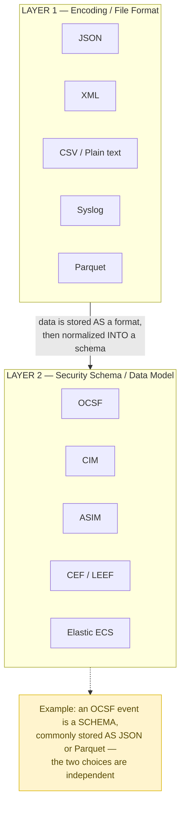
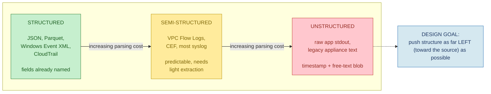
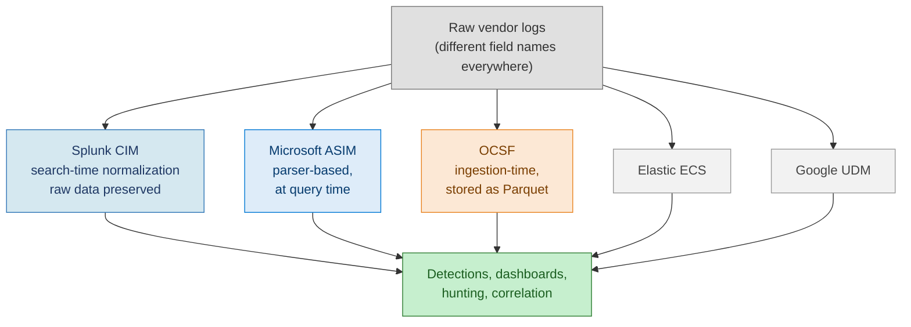
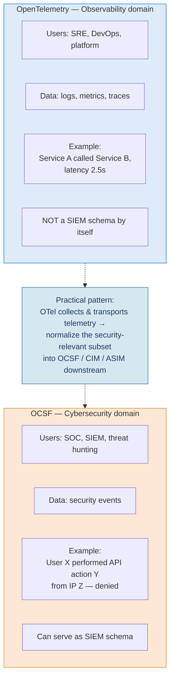
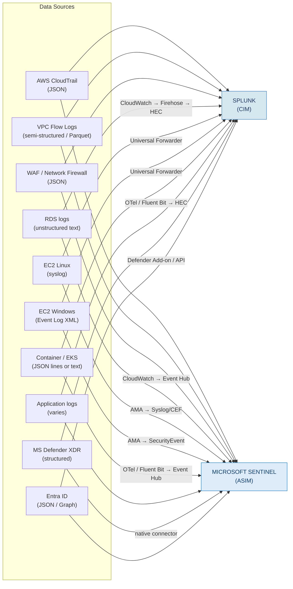
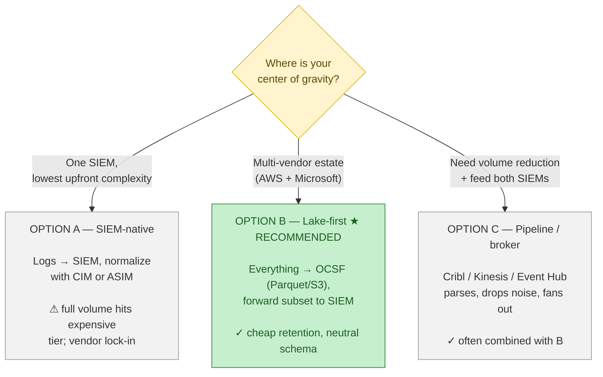
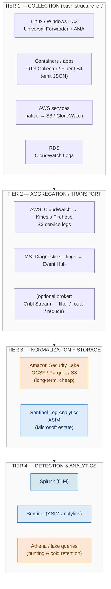
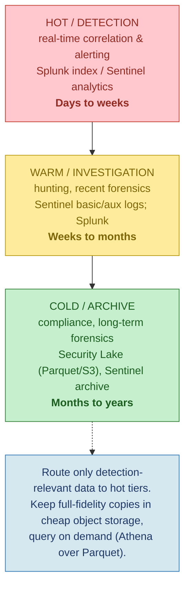

# Centralized Logging Architecture — Mermaid Diagrams

A set of diagrams derived from the architecture document. Each captures one distinct
idea rather than cramming everything into a single chart.

---

## 1. The Two Layers (Foundations)

Encoding format vs. security schema — these are independent choices.

---

## 2. Structured vs. Unstructured — the parsing-cost spectrum

---

## 3. Normalization Models by Platform

---

## 4. OCSF vs. OpenTelemetry — different problems

---

## 5. Source Inventory → Ingestion Paths

---

## 6. The Key Decision — Where Normalization Happens

---

## 7. Tiered Reference Architecture (recommended)

---

## 8. Cost & Retention Tiering

