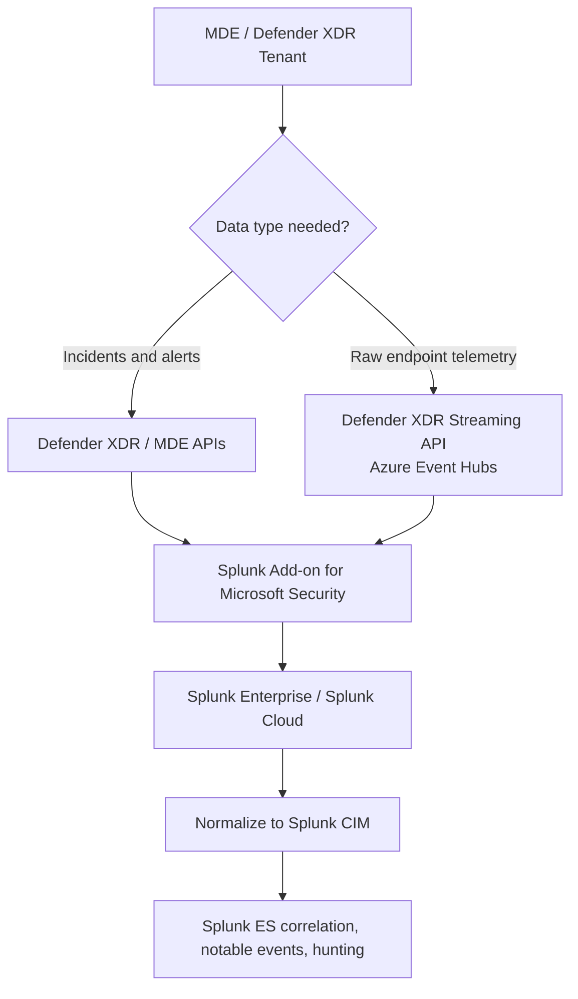
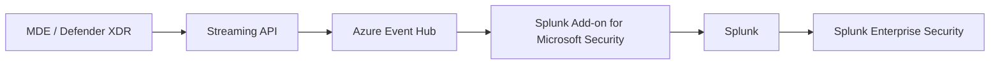
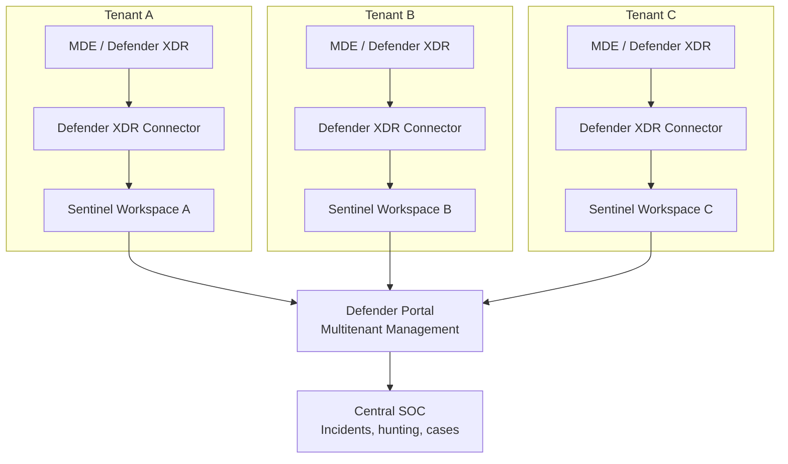
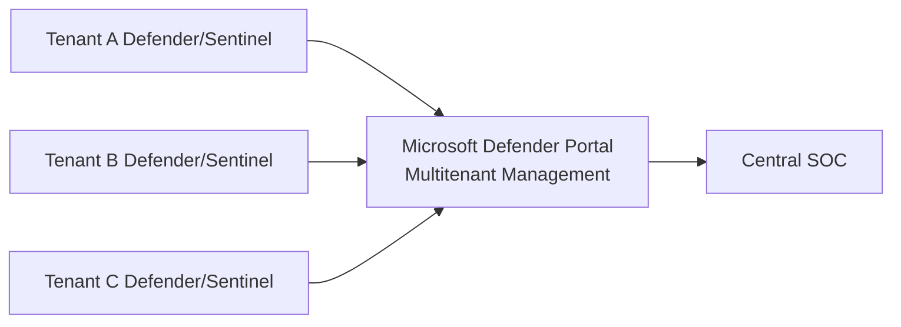
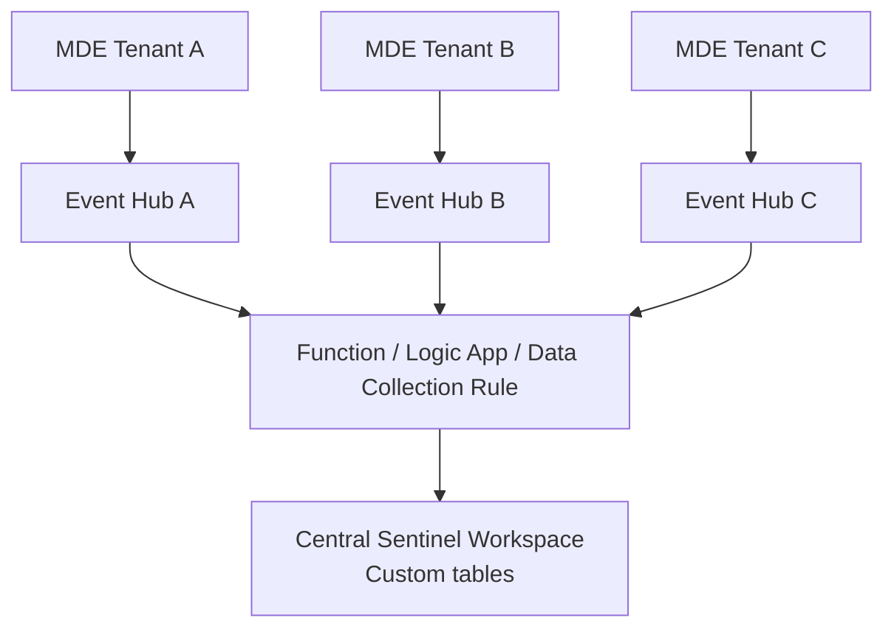
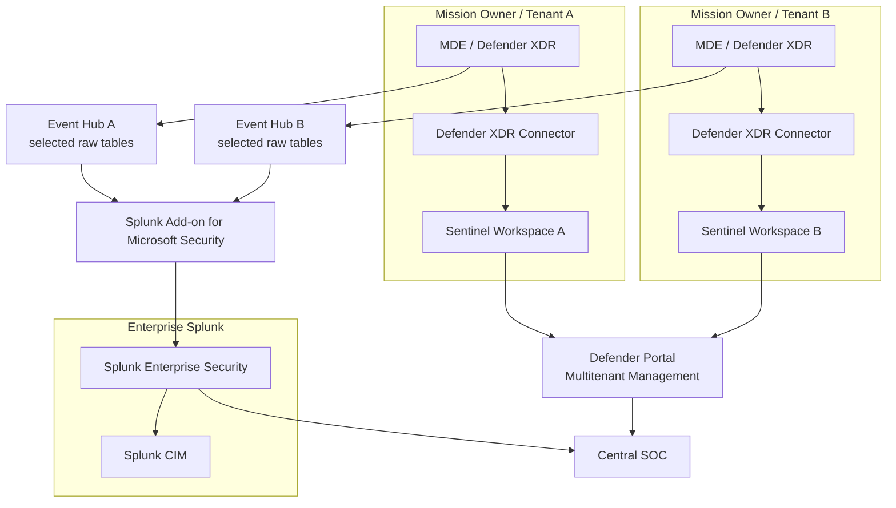

# MDE to Splunk or Sentinenl Integration Options.
---

## 1. MDE / Defender XDR into Splunk

## Recommended architecture



## Option A — ingest incidents and alerts into Splunk

Use this when you want:

```text
Defender incident
Defender alert
Alert evidence
Severity
Impacted device/user
Detection source
MITRE mapping where available
```

The supported Splunk path is the **Splunk Add-on for Microsoft Security**. Splunk documents that this add-on collects Microsoft 365 Defender incidents and related information, plus Microsoft Defender for Endpoint alerts. It also supports Microsoft Defender Advanced Hunting events streamed through Azure Event Hubs. ([splunk.github.io][1])

This is usually the best starting point because you avoid dumping all endpoint telemetry into Splunk.

### Best for

| Use case               | Recommendation                                 |
| ---------------------- | ---------------------------------------------- |
| SOC alert queue        | Yes                                            |
| Splunk ES correlation  | Yes                                            |
| Lower ingestion volume | Yes                                            |
| Executive dashboards   | Yes                                            |
| Full endpoint timeline | No, use raw event streaming or Defender portal |

---

## Option B — stream raw MDE / Defender XDR events into Splunk

Use this when Splunk needs raw endpoint telemetry such as:

```text
DeviceProcessEvents
DeviceNetworkEvents
DeviceFileEvents
DeviceLogonEvents
DeviceRegistryEvents
DeviceImageLoadEvents
DeviceEvents
DeviceInfo
```

Microsoft Defender XDR supports streaming Advanced Hunting event data to **Azure Event Hubs** or Azure Storage. Microsoft’s SIEM integration documentation describes two ingestion models: pulling Defender XDR incidents through REST APIs, or ingesting streaming event data through Event Hubs or Storage. ([Microsoft Learn][2])

The streaming architecture is:



Microsoft’s Event Hub streaming schema sends records that include the event time, tenant ID, category, and the Defender Advanced Hunting event as JSON in the `properties` object. ([Microsoft Learn][3])

Example concept:

```json
{
  "records": [
    {
      "time": "2026-06-22T10:00:00Z",
      "tenantId": "tenant-guid",
      "category": "AdvancedHunting-DeviceProcessEvents",
      "properties": {
        "DeviceName": "server01",
        "FileName": "powershell.exe",
        "ProcessCommandLine": "powershell.exe -enc ..."
      }
    }
  ]
}
```

### Best for

| Use case                                   | Recommendation |
| ------------------------------------------ | -------------- |
| Splunk becomes main hunting platform       | Yes            |
| Need raw endpoint telemetry in Splunk      | Yes            |
| Need Sysmon-like endpoint events in Splunk | Yes            |
| Want low-cost minimal integration          | No             |
| Want avoid duplicate storage               | No             |

---

## Practical Splunk recommendation

For most enterprise SOCs:

```text
Start with Defender XDR incidents and alerts into Splunk.
Only stream raw Advanced Hunting tables that support real Splunk detection use cases.
Do not stream every MDE table by default.
```

A good approach:

| Data type              |          Send to Splunk? | Why                                  |
| ---------------------- | -----------------------: | ------------------------------------ |
| Defender XDR incidents |                      Yes | High-value SOC signal                |
| MDE alerts             |                      Yes | Endpoint detections                  |
| DeviceProcessEvents    |              Selectively | Useful but high volume               |
| DeviceNetworkEvents    |              Selectively | Very high volume                     |
| DeviceFileEvents       |              Selectively | Very high volume                     |
| DeviceLogonEvents      |                Often yes | Useful for identity/host correlation |
| DeviceInfo             |                      Yes | Asset context                        |
| TVM vulnerability data | Usually keep in Defender | Better queried in Defender portal    |

---

## 2. MDE data from different tenants into Sentinel

This has an important limitation:

```text
Microsoft Sentinel data connectors are normally tenant-bound.
Microsoft Defender XDR connector is enabled in the Sentinel workspace associated with that tenant.
```

Microsoft’s Defender XDR connector streams incidents, alerts, and Advanced Hunting events into Microsoft Sentinel and keeps incidents synchronized between Defender XDR and Sentinel. ([Microsoft Learn][4]) Microsoft also states that, for Microsoft/Azure SaaS resources, Sentinel data collection is within its own Microsoft Entra tenant boundary; each Entra tenant generally requires a separate workspace. ([Azure Documentation][5])

So the clean design is **not one random central Sentinel workspace directly connecting to every tenant’s MDE connector**.

## Recommended multi-tenant Sentinel design



## How to do it

For each tenant:

```text
1. Create or use a Sentinel-enabled Log Analytics workspace in that tenant.
2. Enable the Microsoft Defender XDR connector in that tenant’s Sentinel workspace.
3. Connect incidents and alerts.
4. Optionally connect raw Advanced Hunting events.
5. Use Azure Lighthouse / B2B / Defender multitenant management for central SOC visibility.
```

Microsoft’s Sentinel integration documentation says the Defender XDR connector can collect incidents and alerts, connect entities, and collect raw Advanced Hunting events from Defender components. ([Microsoft Learn][4]) It also notes that Defender XDR incidents and alerts are synchronized into Sentinel at no charge, while other raw Advanced Hunting tables such as `DeviceInfo`, `DeviceFileEvents`, and `EmailEvents` are charged. ([Microsoft Learn][6])

---

## 3. Multi-tenant SOC visibility options

## Option A — separate Sentinel workspace per tenant, central management

This is the cleanest Microsoft-supported model.

```text
Tenant A → Sentinel Workspace A
Tenant B → Sentinel Workspace B
Tenant C → Sentinel Workspace C
Central SOC → Azure Lighthouse / Defender multitenant management
```

Azure Lighthouse lets a central SOC manage multiple Sentinel workspaces across tenants and supports scenarios like cross-workspace queries and workbooks. ([Microsoft Learn][7]) Microsoft also documents Sentinel management across multiple tenants for MSSPs using Azure Lighthouse. ([Microsoft Learn][8])

### Best for

| Requirement                         | Fit                |
| ----------------------------------- | ------------------ |
| Strong tenant separation            | Excellent          |
| MSSP / multi-mission owner model    | Excellent          |
| Native Microsoft support            | Excellent          |
| Centralized visibility              | Good               |
| Single physical data lake/workspace | Not the main model |

---

## Option B — Defender portal multitenant management

This is the newer Microsoft direction.

Microsoft Defender multitenant management gives SOC teams a unified view across Defender XDR and Microsoft Sentinel tenants, including incident triage, alerts, hunting, and cases. Microsoft states this capability is available for Microsoft Defender XDR and Microsoft Sentinel in the Defender portal. ([Microsoft Learn][9])



Microsoft’s setup documentation says multitenant access can use GDAP or Microsoft Entra B2B for Defender data, and Azure Lighthouse is required for cross-tenant Sentinel queries using workspace-based access. ([Microsoft Learn][10])

### Best for

| Requirement                         | Fit                                         |
| ----------------------------------- | ------------------------------------------- |
| Central SOC view                    | Excellent                                   |
| Cross-tenant Defender investigation | Excellent                                   |
| Cross-tenant hunting                | Good                                        |
| Native Microsoft future direction   | Strong                                      |
| Physical data consolidation         | Not exactly; more like federated visibility |

---

## Option C — custom central ingestion pipeline

This is possible but more complex.



This model uses each tenant’s Defender XDR Streaming API to push raw events to Event Hubs, then forwards them to a central Sentinel workspace using a custom ingestion pipeline.

### Use carefully

This can work for special cases, but it has tradeoffs:

| Issue         | Why it matters                                                       |
| ------------- | -------------------------------------------------------------------- |
| Custom schema | You may lose native Sentinel Defender tables                         |
| Cost          | Raw Advanced Hunting events can be expensive                         |
| RBAC          | Cross-tenant permissions are harder                                  |
| Incident sync | You may not get native Defender/Sentinel bidirectional incident sync |
| Maintenance   | You own parsing, routing, and failure handling                       |

I would only use this model when there is a firm requirement for central physical data storage.

---

## 4. Which model should you pick?

## For MDE → Splunk

Use:

```text
Splunk Add-on for Microsoft Security
+ Defender XDR incidents/alerts API
+ Event Hub streaming only for selected raw Advanced Hunting tables
```

## For MDE from multiple tenants → Sentinel

Use:

```text
One Sentinel workspace per tenant
+ Defender XDR connector per tenant
+ Azure Lighthouse / Defender multitenant management for central SOC
```

Avoid trying to force all tenants’ MDE data into one Sentinel workspace unless there is a strong requirement.

---

## 5. Recommended architecture for your environment



---

## 6. Cheat sheet

| Requirement                                 | Best method                                                                                      |
| ------------------------------------------- | ------------------------------------------------------------------------------------------------ |
| Send MDE alerts to Splunk                   | Splunk Add-on for Microsoft Security                                                             |
| Send Defender XDR incidents to Splunk       | Splunk Add-on for Microsoft Security                                                             |
| Send raw MDE endpoint events to Splunk      | Defender XDR Streaming API → Azure Event Hub → Splunk Add-on                                     |
| Send one tenant’s MDE data to Sentinel      | Defender XDR connector in that tenant’s Sentinel workspace                                       |
| Send multiple tenants’ MDE data to Sentinel | Separate Sentinel workspace per tenant + Azure Lighthouse / Defender multitenant management      |
| Central SOC view across tenants             | Defender portal multitenant management                                                           |
| Central query across Sentinel workspaces    | Azure Lighthouse / cross-workspace KQL                                                           |
| Avoid duplicate alerts in Sentinel          | Use Defender XDR connector and disable older standalone product incident rules where recommended |
| Reduce cost                                 | Send incidents/alerts first; stream raw endpoint tables only when needed                         |

## Bottom line

For **Splunk**, use the **Splunk Add-on for Microsoft Security**. Start with Defender incidents/alerts, then add Event Hub streaming for selected Advanced Hunting tables only.

For **multi-tenant Sentinel**, the best pattern is **one Sentinel workspace per tenant**, each connected to its own Defender XDR/MDE tenant, then use **Azure Lighthouse and Microsoft Defender multitenant management** for central SOC visibility.

[1]: https://splunk.github.io/splunk-add-on-for-microsoft-365-defender/ "Introduction - Splunk Add-on for Microsoft Security"
[2]: https://learn.microsoft.com/en-us/defender-xdr/configure-siem-defender "Integrate your SIEM tools with Microsoft Defender XDR - Microsoft Defender XDR | Microsoft Learn"
[3]: https://learn.microsoft.com/en-us/defender-xdr/streaming-api-event-hub "Stream Microsoft Defender XDR events to Azure Event Hubs - Microsoft Defender XDR | Microsoft Learn"
[4]: https://learn.microsoft.com/en-us/azure/sentinel/connect-microsoft-365-defender "Stream data from Microsoft Defender XDR to Microsoft Sentinel in the Azure portal | Microsoft Learn"
[5]: https://docs.azure.cn/en-us/sentinel/prepare-multiple-workspaces "Prepare for multiple workspaces and tenants in Microsoft Sentinel | Azure Docs"
[6]: https://learn.microsoft.com/en-us/azure/sentinel/microsoft-365-defender-sentinel-integration "Microsoft Defender XDR integration with Microsoft Sentinel | Microsoft Learn"
[7]: https://learn.microsoft.com/en-us/azure/lighthouse/how-to/manage-sentinel-workspaces "Manage Microsoft Sentinel workspaces at scale - Azure Lighthouse | Microsoft Learn"
[8]: https://learn.microsoft.com/en-us/azure/sentinel/multiple-tenants-service-providers "Manage multiple tenants in Microsoft Sentinel as a Managed Security Service Provider | Microsoft Learn"
[9]: https://learn.microsoft.com/en-us/unified-secops/mto-overview?utm_source=chatgpt.com "Microsoft Defender multitenant management"
[10]: https://learn.microsoft.com/en-us/unified-secops/mto-requirements?utm_source=chatgpt.com "Set up Microsoft Defender multitenant management"
