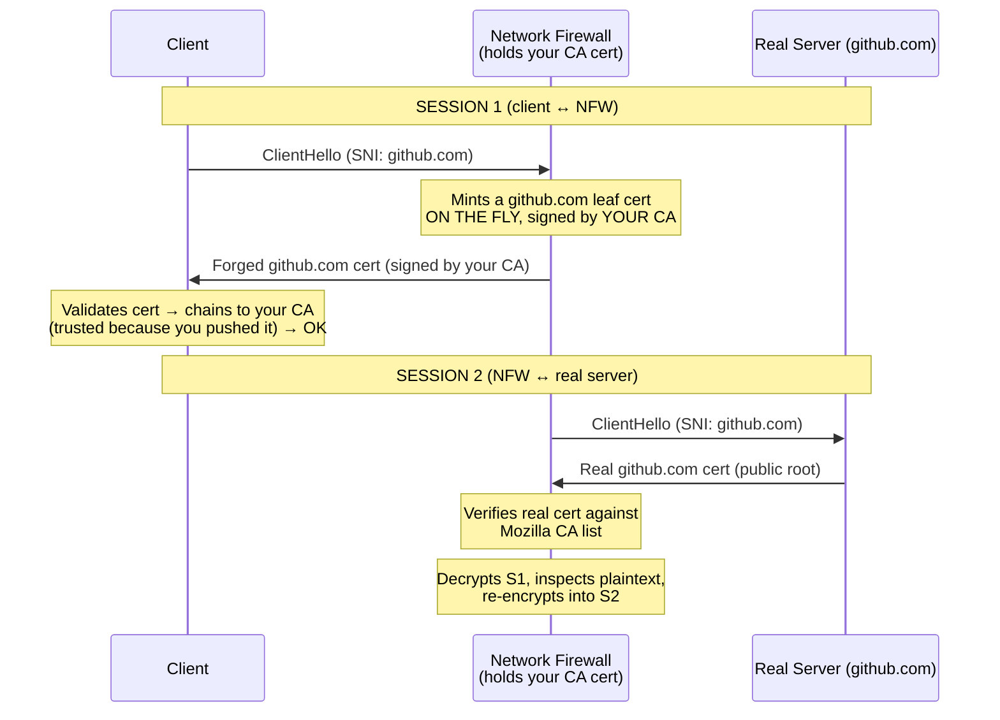

This caveat is describing **why outbound TLS inspection requires a CA cert and not just a server cert** — and it comes down to the fact that Network Firewall is performing a **man-in-the-middle (MITM)** on your outbound traffic. Let me break down what's happening and how it differs from a "regular" TLS certificate.

A **regular server (leaf) cert** identifies one specific site — it's valid only for the domains listed in it (e.g., `github.com`), and its job is to prove "I am this server." A **CA cert** is a *signing* cert — its job is to issue and vouch for other certs, so whatever it signs is trusted by anyone who trusts the CA.

That's why inspection needs a CA cert, not a leaf: a leaf could only impersonate its own named domains, but a CA can mint a fresh cert for *any* domain the client visits on the fly — and your clients accept those forgeries because you distributed the CA into their trust stores.

## Regular TLS vs. inspection: the fundamental difference

In **regular TLS**, there are two parties and one certificate: the server presents a leaf (server) certificate, the client validates it against a chain up to a well-known root, and an encrypted tunnel is established end-to-end. Nobody in the middle can read it. That's the whole point.

In **outbound TLS inspection**, Network Firewall deliberately breaks that single tunnel into **two separate TLS sessions** and sits in the middle decrypting between them. To do that convincingly, it has to impersonate every server your clients connect to — which is exactly what a CA certificate lets it do.

## Why it needs a CA cert, not a server cert

A **server (leaf) certificate** is valid for one specific set of domains (its SAN list). If NFW only had a server cert, it could only impersonate the handful of domains named in that cert.

A **CA certificate** is a signing certificate. It lets NFW **generate a fresh server certificate on the fly** for *whatever* domain the client is trying to reach. Client connects to `github.com` → NFW mints a `github.com` cert signed by your CA. Client connects to `example.com` → NFW mints an `example.com` cert signed by the same CA. This is the sentence in the caveat:

> Network Firewall uses the CA certificate to generate a server certificate, which the service uses to establish trust between the client and the server.

Here's the flow:

For the client to *accept* those forged certs without a browser error, the client must **trust your CA** — meaning your organization has distributed that CA cert into every client's trust store (via GPO, MDM, golden image, etc.). This is the same mechanism corporate proxies (Zscaler, Palo Alto, etc.) have always used.

## How this differs from a "regular" CA certificate

The CA cert itself is technically a normal CA cert — the difference is entirely in **how it's used and what constraints AWS puts on it**:

| Aspect | Regular public CA (e.g., DigiCert) | NFW inspection CA |
|---|---|---|
| Who trusts it | Everyone (in Mozilla/OS root stores by default) | Only *your* clients, because *you* pushed it into their trust stores |
| Purpose | Sign certs for domains you own | Sign forged certs for domains you **don't** own, to MITM them |
| Where it lives | Public root program | Imported into **your** ACM, private to your account |
| Scope | Issues certs the whole internet trusts | Issues certs only your fleet trusts |

You are essentially running a **private CA that only your own devices trust**, and NFW is the entity wielding it.

## Now the three specific restrictions in the caveat

These are the parts that trip people up:

**1. "You can't generate intermediate CA certificates using ACM."**
ACM can *import* a CA cert but won't *issue/generate* one for you. You have to bring your own CA (created with your PKI, OpenSSL, Microsoft ADCS, etc.), import it into ACM, and associate it. ACM is just holding it, not minting it.

**2. "We don't support TLS traffic to destination servers that use a server certificate signed by a private CA... server certificates [must be] signed by public well-known roots contained on the Mozilla Included CA Certificate List."**

This is about **Session 2** (NFW → real server) in the diagram. When NFW connects onward to the real destination, it validates *that server's* certificate. It will only proceed if the destination's cert chains to a **public, well-known root** on the Mozilla list.

The practical consequence, and the big GovCloud/enterprise gotcha: **outbound inspection breaks for internal destinations that use privately-signed certs.** If your egress traffic is going to something fronted by an internal/private-CA-signed cert, NFW refuses it because it can't verify against the Mozilla list. Outbound TLS inspection is really designed for traffic heading to the **public internet**, where destinations use publicly-trusted certs.

**3. "We also don't support certificates issued by AWS Private Certificate Authority."**

Two separate implications:
- The **CA you import** for inspection can't be one issued by AWS Private CA.
- And, consistent with #2, **destination servers** whose certs come from AWS Private CA won't be inspectable either (AWS Private CA is a private root, not on the Mozilla list).

## Putting it together for your architecture

The mental model that makes all three restrictions coherent: NFW inspection is **asymmetric**.

- **On the client side (Session 1):** NFW is a CA. It forges certs, and your clients trust the forgeries because you distributed the CA. Full control, you own the trust.
- **On the server side (Session 2):** NFW is a strict client. It demands the real destination present a **publicly-trusted** cert (Mozilla list), and it will not tolerate private/AWS-Private-CA-signed certs on that leg.

So outbound TLS inspection is well-suited to inspecting **fleet → public internet** egress (that's where you'd want URL-path visibility and DLP), but it is *not* a fit for **fleet → internal service** traffic that rides on private certs — which in DoD/GovCloud environments is often a large share of your east-west and internal-egress traffic. For those internal paths you'd lean back on SNI/domain-based rules (no decryption) or enforce at the endpoint instead.

