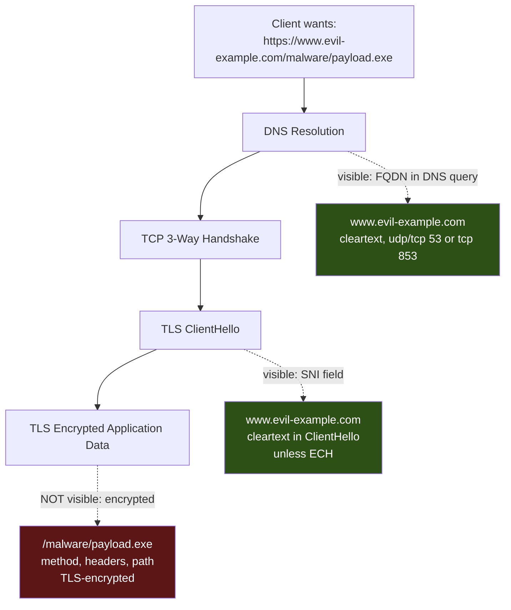
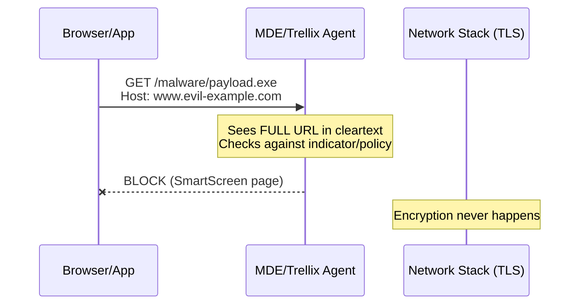
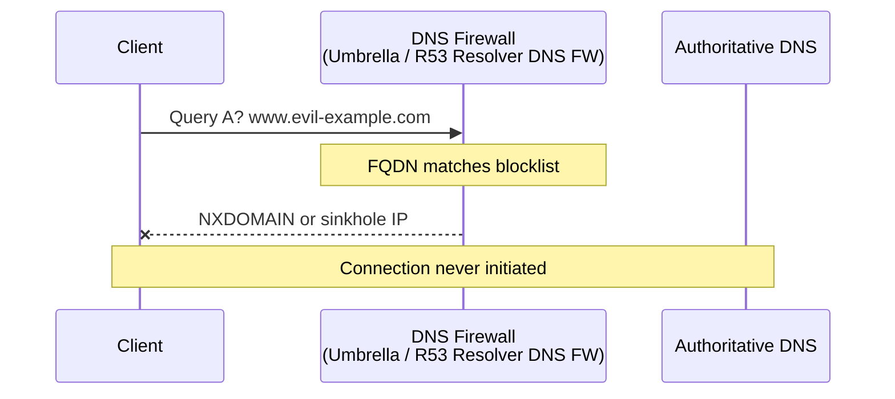
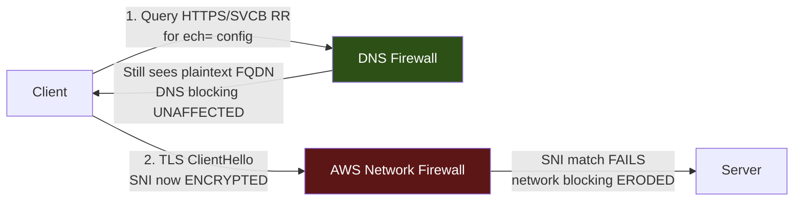

# URL & Domain Blocking Across Layers

Endpoint (MDE/Trellix), DNS filtering, and AWS Network Firewall each intercept web traffic at a different layer and therefore see a different amount of the request. This document explains where each mechanism sits, what it can and cannot enforce, and clarifies two commonly-confused points: how ECH actually affects blocking, and the difference between the TCP and TLS handshakes in the AWS NFW drop path.

---

## 1. The core distinction: what each layer sees

With TLS, the full URL **path** is encrypted. Only the **domain (FQDN)** leaks in the clear, and it leaks in three places: the DNS query, the TLS SNI, and the server certificate. Everything after the host — `/malware/payload.exe`, HTTP method, headers — is inside the encrypted TLS record.

Request modeled below: `https://www.evil-example.com/malware/payload.exe`



---

## 2. The three mechanisms compared

| Layer | Mechanism | What it inspects | Blocks true URL path? | Evadable by |
|---|---|---|---|---|
| Endpoint | MDE / Trellix | Full URL (pre-encryption, on host) | **Yes** | Unmanaged devices, non-agent processes |
| DNS | DNS filtering (Umbrella, Route 53 Resolver DNS FW) | FQDN only | No (domain only) | DoH/DoT to an unsanctioned resolver, hardcoded IPs |
| Network | AWS Network Firewall | SNI (TLS) or Host header (plain HTTP) | No (domain only, unless TLS inspection enabled) | Domain fronting, ECH, IP-direct |

---

## 3. Endpoint blocking (MDE / Trellix)

The endpoint agent operates **above the encryption layer**. MDE network protection hooks the OS/browser network stack and sees the full URL *before* it is wrapped in TLS (or reconstructs it from browser telemetry).



Because it lives on the host, it can enforce **true URL-path granularity** — block `evil-example.com/malware/*` while allowing `evil-example.com/legit/*`. Its weakness is coverage: it protects only managed endpoints running the agent.

---

## 4. DNS-based blocking

DNS filtering intercepts the **name resolution** step, before a connection to the target is attempted. It answers with NXDOMAIN, a sinkhole IP, or a block-page IP.



**Domain-granular only** — the DNS layer has no concept of `/malware/payload.exe`. It also cannot block traffic to a hardcoded IP (no lookup occurs), and it is bypassed if the client resolves via DoH/DoT to a resolver you do not control.

---

## 5. AWS Network Firewall (SNI / Host-based) — TCP vs TLS handshake clarified

AWS Network Firewall inspects traffic inline. For HTTPS its Suricata-based stateful engine reads the **TLS SNI** from the ClientHello; for plaintext HTTP it reads the **Host header**. Without TLS inspection configured, it does **not** see the URL path — only the domain.

**Clarification:** the **TCP 3-way handshake completes**. The stateful engine requires an established TCP session to receive and parse the ClientHello. It is the **TLS handshake** that never completes — NFW drops/resets *after* reading the SNI, before the TLS handshake can finish.

```mermaid
sequenceDiagram
    participant Client
    participant ANFW as AWS Network Firewall
    participant Server

    rect rgb(45, 80, 22)
    Note over Client,ANFW: TCP 3-way handshake COMPLETES
    Client->>ANFW: SYN
    ANFW->>Client: SYN-ACK
    Client->>ANFW: ACK
    end

    rect rgb(92, 22, 22)
    Note over Client,ANFW: TLS handshake does NOT complete
    Client->>ANFW: TLS ClientHello (SNI: www.evil-example.com)
    Note over ANFW: Suricata reads SNI<br/>tls.sni matches deny-list
    ANFW--xClient: Drop / RST (aws:drop_tls)
    end

    Note over Server: Server never receives the ClientHello
```



A domain-list rule (`tls.sni; content:"evil-example.com"`) matches on the SNI. NFW **can** perform TLS inspection (decrypt using a cert in ACM) to reach the path, but This requires CA Cert.A CA certificate is a signing certificate. It lets NFW generate a fresh server certificate on the fly for whatever domain the client is trying to reach  — so in practice it is **domain-based** filtering fronting the ALB/WAF.

---

## 6. What this looks like in a packet capture

In a Wireshark capture of the TLS ClientHello (filter `tls.handshake.extensions_server_name`), the domain appears in cleartext even though everything after the handshake is encrypted:

```
Frame 4: 583 bytes on wire
Transport Layer Security
  TLSv1.3 Record Layer: Handshake Protocol: Client Hello
    Handshake Type: Client Hello (1)
    Extension: server_name (len=28)
      Server Name Indication extension
        Server Name Type: host_name (0)
        Server Name: www.evil-example.com   <-- VISIBLE (SNI; this is what NFW matches)

Frame 6: 1514 bytes on wire
Transport Layer Security
  TLSv1.3 Record Layer: Application Data
    Encrypted Application Data: 3a8f2c...   <-- /malware/payload.exe is IN HERE, unreadable
```

Wireshark filter cheat-sheet:

- `dns.qry.name == "www.evil-example.com"` — the FQDN the DNS layer blocks on
- `tls.handshake.extensions_server_name` — the SNI that NFW / a proxy blocks on
- `http.request.full_uri` — full URL, but **only populates for plaintext HTTP**; empty for HTTPS unless TLS session keys (SSLKEYLOGFILE) are imported to decrypt

One line summarizes it: **without decryption, a capture of HTTPS shows the domain but not the URL** — which is why DNS and network controls are domain-granular while only the endpoint (or a TLS-terminating proxy) enforces true URL-path policy.

---

## 7. ECH — what it actually erodes (correction)

Earlier phrasing that ECH "erodes DNS-based blocking" was **wrong**. Correct picture:

- **ECH (Encrypted Client Hello)** encrypts the **SNI** inside the TLS ClientHello. This erodes **SNI-based network blocking** (AWS NFW's `tls.sni` match) and SNI-based proxy filtering.
- **ECH does NOT erode DNS-based blocking.** The client must still resolve the domain to an IP, and that A/AAAA query is still visible to a DNS filter.
- In fact ECH **depends on DNS**: the client fetches the server's ECH public key from a DNS **`HTTPS` / `SVCB` resource record** (the `ech=` parameter). So DNS is *more* involved with ECH, not less — and filtering the `HTTPS` RR is itself a way to break ECH and force the SNI back into the clear.



Net: ECH is a **TLS-layer** concern. It weakens SNI-based enforcement (network firewall, proxy) and pushes enforcement toward endpoints and TLS-terminating proxies. DNS filtering is unaffected and can even be used against ECH.

---

## 8. DoH / DoT — what they are and how to block them

Both wrap DNS queries in encryption so an on-path observer cannot read or tamper with them. The difference is the port they use, which drives how you block each.

| | DoT (DNS over TLS) | DoH (DNS over HTTPS) |
|---|---|---|
| Transport | TLS on **tcp/853** | HTTPS on **tcp/443** |
| Visibility | Distinct well-known port | Blends with all other web traffic |
| Block difficulty | Easy | Hard |

### Blocking DoT
Deny outbound **tcp/853** at the firewall. Clients fall back to plaintext DNS on 53, which your DNS filter then sees and enforces on. Clean and reliable.

### Blocking DoH
There is no dedicated port to close — it looks identical to normal HTTPS. Techniques, layered:

- **Block known public-resolver IPs and SNIs** on the network firewall (Cloudflare `1.1.1.1` / `cloudflare-dns.com`, Google `8.8.8.8` / `dns.google`, Quad9, etc.).
- **Block the canary domain** `use-application-dns.net` — returning NXDOMAIN signals Firefox to disable its automatic DoH.
- **Enterprise policy / MDM** to disable DoH in managed browsers (Chrome `DnsOverHttpsMode`, Firefox policy, Edge equivalent).
- **TLS inspection** at a proxy as a last resort to see and block DoH request patterns.

### The practical enterprise pattern
Force all clients onto sanctioned resolvers, deny **tcp/853**, and maintain an IP+SNI blocklist of public DoH endpoints on the network firewall. That collapses clients back onto DNS you control and can filter.

**The visibility-collapse scenario:** a client using **ECH-enabled DoH to a public resolver you have not blocked** can hide both the domain resolution (inside DoH) and the SNI (inside ECH). That is the case where layered visibility genuinely breaks — and it is an argument for controlling DoH, not a flaw in DNS filtering.

---

## 9. Bottom line — defense in depth

The three controls are not redundant; they cover each other's gaps.

- **DNS filtering** — cheapest, acts before a connection exists, unaffected by ECH; but domain-only and bypassable via unsanctioned DoH/DoT or hardcoded IPs.
- **AWS Network Firewall** — enforces at the VPC boundary regardless of endpoint-agent coverage; domain-granular via SNI (or full URL only if TLS inspection is enabled); eroded by ECH.
- **Endpoint (MDE/Trellix)** — the only control with true URL-path visibility without decryption; but only on managed hosts.

Trajectory to track for durable designs: **ECH erodes SNI-based network blocking over time**, pushing enforcement onto endpoints and TLS-terminating proxies, and raising the importance of controlling DoH so DNS-layer filtering keeps its visibility.
