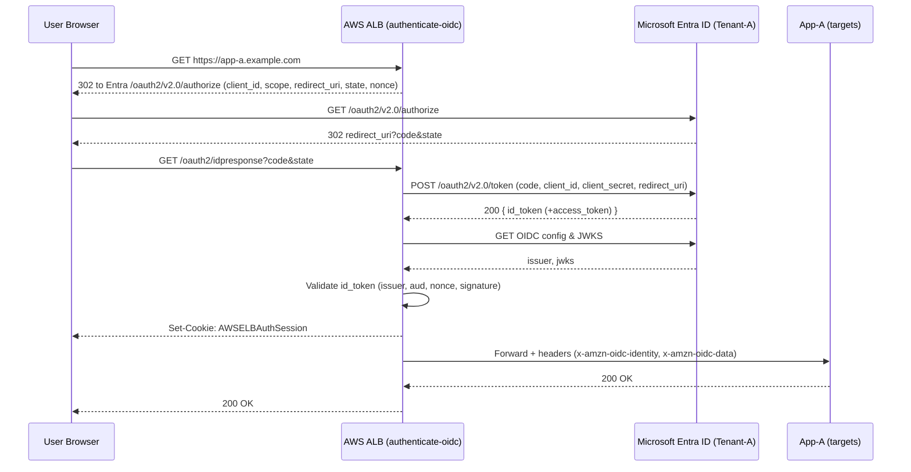

---

# ALB + Microsoft Entra (OIDC) — Implementation & Troubleshooting Guide

## 1) Overview (What & Why)

**Goal:** Put an AWS **Application Load Balancer (ALB)** in front of **App-A**, enforce **OIDC** sign-in with **Microsoft Entra ID (Tenant-A)**, then pass identity to the app via headers.

**Key idea:** The **ALB is the OIDC client/RP**. It redirects the user to Entra, validates tokens, manages the session cookie, and forwards the request (with identity headers) to App-A.

---

## 2) Architecture at a Glance

**Actors:** User Browser → **ALB (authenticate-oidc)** → **Entra (Tenant-A)** → **App-A (targets)**

**Legend:**

* `302` = HTTP redirect
* ✓ = success point
* ⚠ = common failure point

---

## 3) Components

* **User**: Signed into **Tenant-A** (home tenant).
* **App-A**: Web app behind the AWS **ALB**.
* **ALB**: Has a listener rule with `authenticate-oidc` (issuer = Entra).
* **Microsoft Entra ID**: OIDC Identity Provider (IdP).

---

## 4) End-to-End Authentication Flow (Code Flow)

1. **Browser → ALB**: `GET https://app-a.example.com`
   ALB sees no session → **OIDC required**.

2. **ALB → Browser (302)** to Entra **/authorize** with:

   * `client_id=<App Registration ID>`
   * `response_type=code`
   * `scope=openid+profile+email`
   * `redirect_uri=https://app-a.example.com/oauth2/idpresponse` (**must match exactly**)
   * `state`, `nonce`

3. **Browser → Entra**: `GET /authorize`
   User authenticates (CAC/MFA/PRT/WAM). ✓

4. **Entra → Browser (302)** back to `redirect_uri` with `?code=<auth_code>&state=<opaque>`.

5. **Browser → ALB**: `GET /oauth2/idpresponse?code&state`
   ALB does **back-channel** `POST /token` with `code`, `client_id`, `client_secret`, `redirect_uri`.

6. **Entra → ALB**: `200 { id_token (+access_token optional) }`
   ALB **validates** ID token (issuer, audience, nonce, signature via JWKS). ✓

7. **ALB → Browser**: `Set-Cookie: AWSELBAuthSession` (secure, signed).

8. **ALB → App-A**: Forwards original request + **identity headers** → App responds; ALB returns 200 to browser.

---

## 5) What App-A Receives (Identity Headers)

* `x-amzn-oidc-identity`  → e.g., `sub` or UPN/email (depending on Entra token config)
* `x-amzn-oidc-data`      → Base64-encoded ID token (JWT)
* `x-amzn-oidc-accesstoken` (optional)

> If you need **groups/roles/UPN/email**, add them in **Entra → App Registration → Token configuration** so they appear in the **ID token**.

---

## 6) Minimal Known-Good ALB OIDC (Terraform Shape)

```hcl
resource "aws_lb_listener" "https" {
  load_balancer_arn = aws_lb.this.arn
  port              = 443
  protocol          = "HTTPS"
  certificate_arn   = var.acm_certificate_arn
  ssl_policy        = "ELBSecurityPolicy-TLS13-1-2-2021-06"

  default_action {
    type = "authenticate-oidc"
    authenticate_oidc {
      issuer                   = "https://login.microsoftonline.com/${var.tenant_id}/v2.0"
      authorization_endpoint   = "https://login.microsoftonline.com/${var.tenant_id}/oauth2/v2.0/authorize"
      token_endpoint           = "https://login.microsoftonline.com/${var.tenant_id}/oauth2/v2.0/token"
      user_info_endpoint       = "https://graph.microsoft.com/oidc/userinfo"
      client_id                = var.client_id
      client_secret            = var.client_secret
      scope                    = "openid profile email"
      on_unauthenticated_request = "authenticate"
      session_cookie_name      = "ALBAuthSession"
    }
  }

  default_action {
    type             = "forward"
    target_group_arn = aws_lb_target_group.app.arn
  }
}
```

---

## 7) Configuration Checklist (Copy/Paste)

* [ ] **Azure App Registration** type = **Web**
* [ ] **Redirect URI** = `https://app-a.example.com/oauth2/idpresponse` (**exact**; no trailing `/`)
* [ ] Use **tenant-specific v2.0** endpoints (not `/common`)
* [ ] `client_id` = **Application (client) ID**; `client_secret` valid & not expired
* [ ] `scope` includes **`openid`** (add `profile email` if needed)
* [ ] Optional claims (UPN/email/groups) added in **Token configuration**
* [ ] ALB Access Logs enabled (S3/Kinesis), CloudWatch metrics visible

---

## 8) Troubleshooting (Triage First, Then Deep-Dive)

### Phase-Based Triage

* **Phase 1 — Browser → Entra (/authorize)**
  You see the Entra login prompt → Phase 1 good.
* **Phase 2 — Entra authenticates**
  Check **Entra Sign-in logs** for your App Registration: **Status = Success** (interactive). If failure → CA/CBA/MFA/device policy issue.
* **Phase 3 — ALB code exchange / token validation / session**
  Most 500s happen here (redirect URI mismatch, wrong tenant/issuer, bad secret, JWKS, nonce/state, clock skew).

### Prove Exactly Where It Breaks (5-Minute Checks)

**A) Entra side (did auth succeed?)**

* **Entra → Sign-in logs** filtered by **Application** and **User**.

  * Success → Entra authenticated. Move to ALB checks.
  * Failure → fix CA/MFA/CBA/device/compliance.

**B) ALB side (did code exchange/validate?)**

* **ALB Access Logs** (S3/Kinesis):

  * `elb_status_code=500`, `target_status_code=-` → failed **before** App-A.
  * Look at `actions_executed` and `error_reason`:
    `OIDCRedirectURIError`, `OIDCInvalidClientSecret`, `OIDCTokenEndpointError`,
    `OIDCInvalidIssuer`, `OIDCJWKSFetchError`, `OIDCNonceMismatch`, etc.
* **CloudWatch metrics**: ALB 5XX > 0 while **Target 5XX = 0** → OIDC stage failure.
* **Browser DevTools**: `GET /oauth2/idpresponse?code=...` → 500 right there = code exchange/validation.

### Quick Isolation (No Backend Needed)

Replace the forward action with a **fixed 200** after `authenticate-oidc`.

* If still **500** → OIDC exchange/validation is broken (ALB/Entra side).
* If **200 “Auth OK”** → OIDC fine; issue is in App-A (header parsing, authz, upstream errors).

```hcl
# Probe rule: authenticate-oidc, then fixed 200 (no forward)
action { type = "authenticate-oidc" ... }
action {
  type = "fixed-response"
  fixed_response { content_type = "text/plain" status_code = "200" message_body = "Auth OK: ALB OIDC succeeded" }
}
```

---

## 9) Common Root Causes → Exact Fixes

1. **Redirect URI mismatch**
   **Fix:** In App Registration → Authentication → Web, set **exactly**
   `https://app-a.example.com/oauth2/idpresponse` (scheme/host/case match; no trailing `/`).

2. **Wrong issuer/endpoints**
   **Fix:** Use tenant-specific **v2.0** URLs:
   Issuer `https://login.microsoftonline.com/<TenantID>/v2.0`
   Auth `.../oauth2/v2.0/authorize` Token `.../oauth2/v2.0/token`.

3. **Bad/expired client secret**
   **Fix:** Rotate secret; update ALB/TF; redeploy.

4. **Conditional Access / CBA blocks token**
   **Fix:** Review **Sign-in logs** + **CA Insights**; allow the app/flow (device, location, CBA mappings).

5. **JWKS/Signature/Issuer mismatch**
   **Fix:** Ensure issuer is correct (no `/common`), and ALB can reach `login.microsoftonline.com`. Retry if transient.

6. **Nonce/State mismatch**
   **Fix:** Single clean tab/session; avoid long delays; check clock skew.

7. **Audience mismatch**
   **Fix:** ALB `client_id` must equal **Application (client) ID** (not Object ID).

8. **UserInfo endpoint oddities**
   **Fix:** Use `https://graph.microsoft.com/oidc/userinfo` or omit (ID token alone is fine for ALB).

---

## 10) After Auth Works (What to Verify in App-A)

* Log/dump the incoming identity headers once (in non-prod) to confirm expected values.
* Map claims → your authorization model (roles, groups, UPN/email).
* Ensure App-A only accepts traffic from the ALB SG/NLB, not directly.

---

## 11) Logical Flow (One-screen Summary)

1. User → ALB
2. ALB → Entra `/authorize`
3. Entra authenticates user (CAC/SSO)
4. Entra → ALB with `code`
5. ALB ↔ Entra `/token` → **ID token**
6. ALB validates token, sets **session cookie**
7. ALB → App-A with identity headers
8. App-A responds; ALB returns 200

---

## 12) OIDC Flow 


## 13) Detail OIDC Flow 

 🔹 Authentication Flow

### 1. User/browser Requests the App Hosted on AWS ALB

* User opens **`https://app-a.example.com`** (fronted by ALB).
* ALB has a listener rule with `authenticate-oidc` → so before routing traffic to App-A, ALB enforces OIDC.

---

### 2. ALB Redirects to Entra ID/IDP

* ALB sees no valid session cookie → it sends an **OIDC Authorization Request** redirect:

  ```
  https://login.microsoftonline.com/<Tenant-A-ID>/oauth2/v2.0/authorize
    ?client_id=<App-Registration-ID>
    &response_type=code
    &scope=openid+profile+email
    &redirect_uri=https://app-a.example.com/oauth2/idpresponse
    &state=<opaque>
    &nonce=<random>
  ```

* Key: **redirect\_uri** points back to ALB, not the app.

---

### 3. Entra ID/IDP Authenticates the User

* User’s browser goes to Entra ID login page.
* If user is already signed in (e.g. via CAC, smartcard, or PRT/WAM), no prompt.
* Otherwise, they authenticate (CAC PIN, username/password, MFA, etc.).

---

### 4. Entra ID Issues Authorization Code

* After authentication, Entra ID redirects the browser back to ALB’s `redirect_uri`:

  ```
  https://app-a.example.com/oauth2/idpresponse?code=<auth_code>&state=<opaque>
  ```

---

### 5. ALB Exchanges Code for Tokens with Entra ID/IDP

* ALB takes the `auth_code` and makes a **back-channel HTTPS request** to Entra ID’s **Token Endpoint**:

  ```
  POST https://login.microsoftonline.com/<Tenant-A-ID>/oauth2/v2.0/token
  grant_type=authorization_code
  code=<auth_code>
  client_id=<App-Registration-ID>
  client_secret=<App-Secret>   # if confidential client
  redirect_uri=https://app-a.example.com/oauth2/idpresponse
  ```

* Entra ID returns an **ID Token (JWT)**, plus (optionally) an **access\_token** + **refresh\_token**.

---

### 6. ALB Validates Token

* ALB validates the **ID Token** signature against Entra’s OIDC JWKS endpoint.
* If valid, ALB sets a secure **session cookie** for the user.

---

### 7. Request Forwarded to App-A

* Once authenticated, ALB forwards the request to the backend target (App-A).
* ALB can inject **OIDC claims** into HTTP headers (e.g., `x-amzn-oidc-data`, `x-amzn-oidc-identity`).
* App-A can read these headers to know who the user is (e.g., UPN, email, groups if mapped).

---

### 8. Session Management

* For subsequent requests, ALB checks the session cookie.
* As long as it’s valid, traffic goes straight to App-A without forcing another OIDC redirect.

Great question. Here’s what the ALB actually does between receiving the code and letting traffic through—i.e., the **ID token validation pipeline**.

# How ALB validates the OIDC ID token

## 1) Parse the JWT

* ALB receives the `id_token` from Entra’s `/token` response.
* It splits the JWT into **header.payload.signature** and Base64-decodes the header & payload.
* From the **header**, ALB reads:

  * `alg` (the signing algorithm; Entra typically advertises RS256)
  * `kid` (key identifier used to pick the right public key)

## 2) Discover provider metadata (once/cached)

* Using your configured **issuer**, ALB fetches (and caches) the OIDC metadata:

  * `/.well-known/openid-configuration` → contains the **`jwks_uri`** and other endpoints.
* ALB then fetches (and caches) the **JWKS** (JSON Web Key Set) from `jwks_uri`.

  * If the `kid` in the token header isn’t in the cached JWKS, ALB will refetch/refresh.
  * Key rotation on the IdP side is handled automatically via this JWKS lookup.

## 3) Verify the signature (cryptographic check)

* ALB selects the public key from JWKS whose `kid` matches the token’s header.
* It verifies the JWT **signature** with that key and the advertised `alg`.

  * If the signature check fails → validation stops (auth fails).

## 4) Validate critical claims (semantic checks)

ALB enforces the standard OIDC claim checks (the exact set is per OIDC spec and ALB implementation):

* **`iss` (issuer)** must equal the configured issuer
  e.g., `https://login.microsoftonline.com/<TenantID>/v2.0`
* **`aud` (audience)** must equal your **client_id** (the App Registration’s Application (client) ID used by ALB)
* **`exp` (expiry)** must be in the future (token not expired)
* **`nbf` (not before)** must be in the past (token already valid)
* **`iat` (issued at)** should be sane (fresh enough)
* **`nonce`** must match what ALB originally sent in the `/authorize` request
  (Mitigates replay and mix-up attacks; ALB generated the nonce and stored it for this check.)
* **`sub`** (subject) must be present (OIDC requirement)

> Note: ALB allows small clock skew; you don’t need to tune it.

## 5) Optional user info (not required)

* If you configured `user_info_endpoint`, ALB can call it to fetch profile data.
* **Not required** for token validation; the **ID token alone** is sufficient for ALB to authenticate the session.

## 6) Establish the ALB session

* On success, ALB issues a **secure, HTTP-only session cookie** (name is whatever you set in `session_cookie_name` in the listener rule).
* That cookie is what ALB uses to **skip re-auth** on subsequent requests until it expires.

## 7) Forward to the target with identity headers

* ALB forwards the original request to your target group and **adds headers**, e.g.:

  * `x-amzn-oidc-identity` (a stable user identifier such as `sub`/UPN/email depending on your token config)
  * `x-amzn-oidc-data` (base64 form of the ID token)
  * (optional) `x-amzn-oidc-accesstoken` if scopes/flow yielded one and you want it passed

# What happens on failures (and how they look)

* **Signature or JWKS issues**

  * Example causes: unknown `kid`, stale JWKS, wrong `iss` URL.
  * **User experience:** 500 at `/oauth2/idpresponse`.
  * **ALB access logs:** `elb_status_code=500`, `target_status_code=-`, `error_reason` like `OIDCJWKSFetchError` or `OIDCInvalidIssuer`.

* **Audience/issuer mismatch**

  * `aud` ≠ your ALB’s `client_id`, or `iss` doesn’t match configured issuer.
  * **Result:** 500 at callback; logs show `OIDCInvalidIssuer` or a validation error.

* **Expired/not-yet-valid token**

  * `exp` in past or `nbf` in future (clock skew aside).
  * **Result:** 500; token invalid.

* **Nonce/state mismatch**

  * Multiple tabs, long pauses, or replayed requests.
  * **Result:** 500; logs often show `OIDCNonceMismatch` (or generic validation error).

* **Client secret problems (during code exchange)**

  * Expired/wrong secret: Entra rejects `/token` call.
  * **Result:** 500; `error_reason=OIDCInvalidClientSecret` or `OIDCTokenEndpointError`.

# Practical tips

* **You don’t configure the callback path**: ALB always uses `…/oauth2/idpresponse`, constructed from the incoming request scheme/host. Make sure each domain/port you serve is registered in Entra with that exact redirect URI.
* **Rely on ALB access logs**: When validation fails *before* your app, `target_status_code` will be `-` and `error_reason` is gold for diagnosis.
* **Keep Entra App Registration tidy**: Use tenant-specific v2.0 endpoints; ensure the correct **Application (client) ID** and a **valid client secret**.

In short: ALB does a full **OIDC-compliant verification**—discovery → JWKS lookup → signature check → issuer/audience/time/nonce checks—then sets its own session cookie and forwards identity to your app.

---

### TL;DR

* **ALB is the OIDC client** (not App-A).
* Most 500s occur at **code exchange / token validation**.
* Use **sign-in logs** (Entra) + **ALB access logs** + **fixed-200 probe** to isolate in minutes.
* Enforce exact **redirect URI**, correct **tenant v2.0 issuer**, valid **client secret**, and **CA/CBA** policies.
