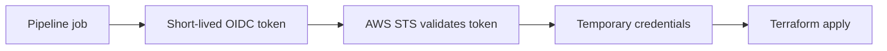
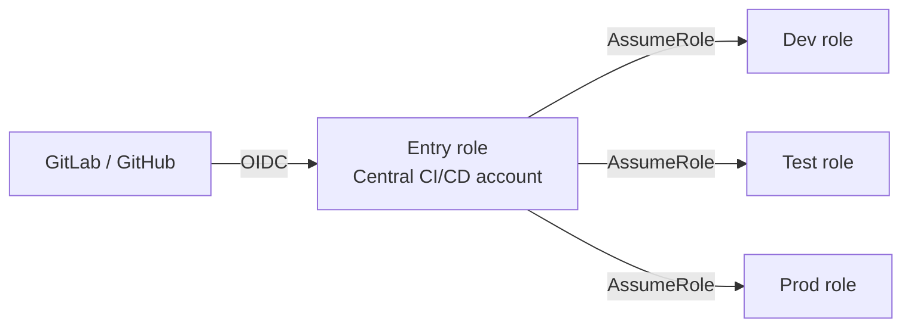
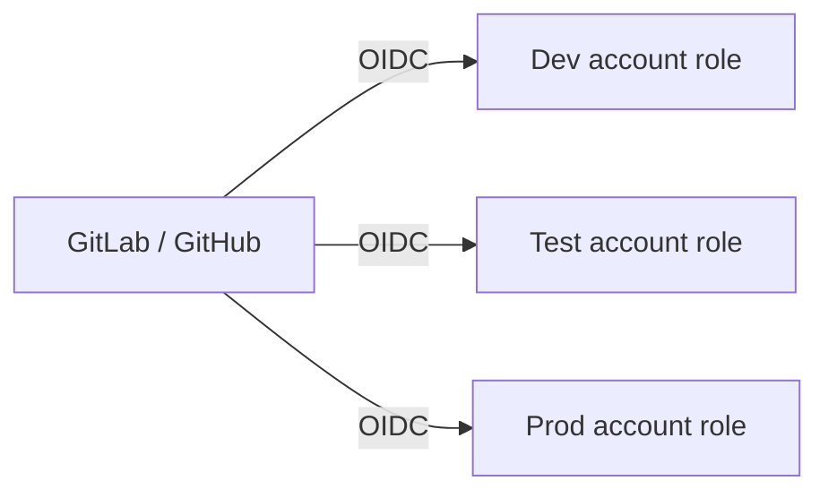
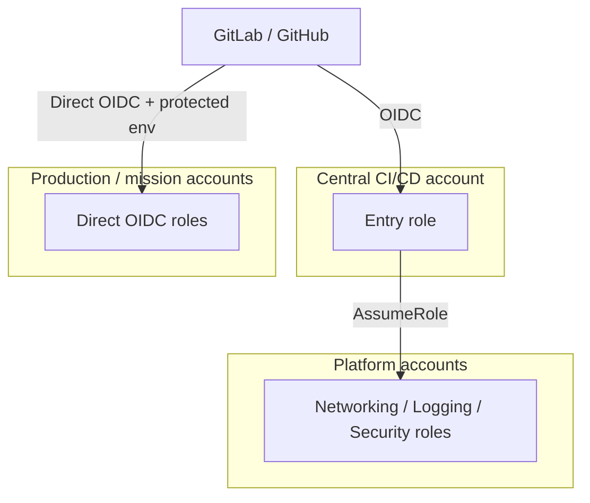

# CI/CD → AWS Multi-Account Design Patterns (Simplified)

## The Problem It Solves

CI/CD pipelines (GitLab/GitHub) need AWS access to run Terraform — but storing long-lived AWS access keys is a security risk.

**Solution: OIDC federation.** The pipeline gets a short-lived signed token from GitLab/GitHub, exchanges it with AWS STS for temporary credentials. **No stored secrets, ever.**



## The Core Security Model (3 Layers)

```text
WHO can assume the role   → OIDC trust policy (repo, branch, environment)
WHAT the role can do      → IAM role permissions
CEILING it can never pass → SCPs + permission boundaries
```

An Allow in the role never overrides a Deny in an SCP or boundary.

---

## The Two Patterns

### Pattern 1: Central Broker Account

One dedicated CI/CD account holds the only OIDC provider. Pipeline enters there, then hops into target accounts via cross-account `AssumeRole` (2 STS calls).



**Think:** one guarded front door for the whole organization.

### Pattern 2: Direct OIDC Per Account

Every target account has its own OIDC provider and trusts GitLab/GitHub directly (1 STS call).



**Think:** each account checks the pipeline's ID itself.

---

## Side-by-Side

| Area | Central Broker | Direct OIDC |
| --- | --- | --- |
| OIDC providers | 1 (central account) | 1 per account |
| STS calls | 2 (role chaining) | 1 |
| Session limit | 1-hour second hop | Role's own max |
| Target validates pipeline identity | No — trusts central role | Yes — checks repo/branch claims |
| Blast radius | Higher (central role reaches all accounts) | Lower (contained per account) |
| Setup / maintenance | Easy onboarding, central control | More bootstrap, drift risk |
| Best fit | Platform teams, shared services | Production, sensitive accounts |

---

## Key Points

1. **No long-lived keys.** OIDC + STS replaces stored AWS credentials entirely.
2. **Trust ≠ permissions.** Who can assume the role is separate from what it can do; SCPs cap both.
3. **Central broker = convenience, direct OIDC = isolation.** Trade-off is governance simplicity vs. blast radius and audit clarity.
4. **Role chaining caps sessions at 1 hour** — a hard limit for long Terraform runs in the broker pattern.
5. **Bootstrap problem:** Terraform can't assume roles that don't exist. Pre-provision OIDC providers, roles, and state backends via CloudFormation StackSets, account factory, or a locked-down bootstrap pipeline.
6. **Split roles by purpose:** separate plan / non-prod apply / prod apply / IAM-bootstrap roles — never one TerraformAdminRole everywhere.
7. **Never run CI/CD from the Organizations management account** — SCPs don't apply there. Use a dedicated member account.

---

## Recommended: Hybrid Model



```text
Shared platform services (network, logging, security) → Central broker
Production & high-impact accounts                     → Direct OIDC
Bootstrap both patterns                               → StackSets
```

GovCloud note: partition `aws-us-gov`, regional STS endpoints only (`us-gov-west-1` / `us-gov-east-1`).
