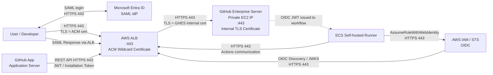
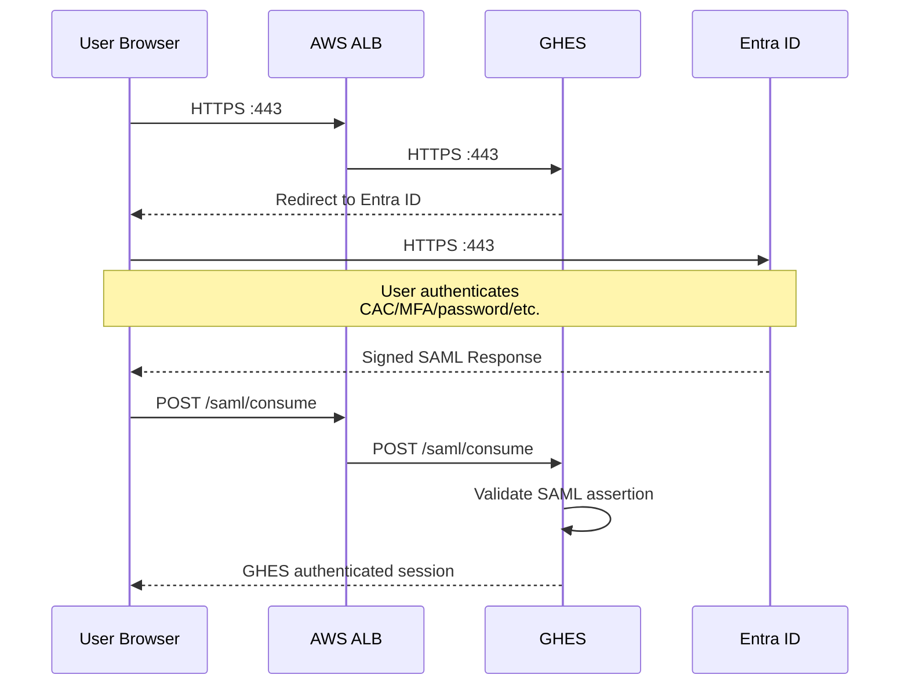
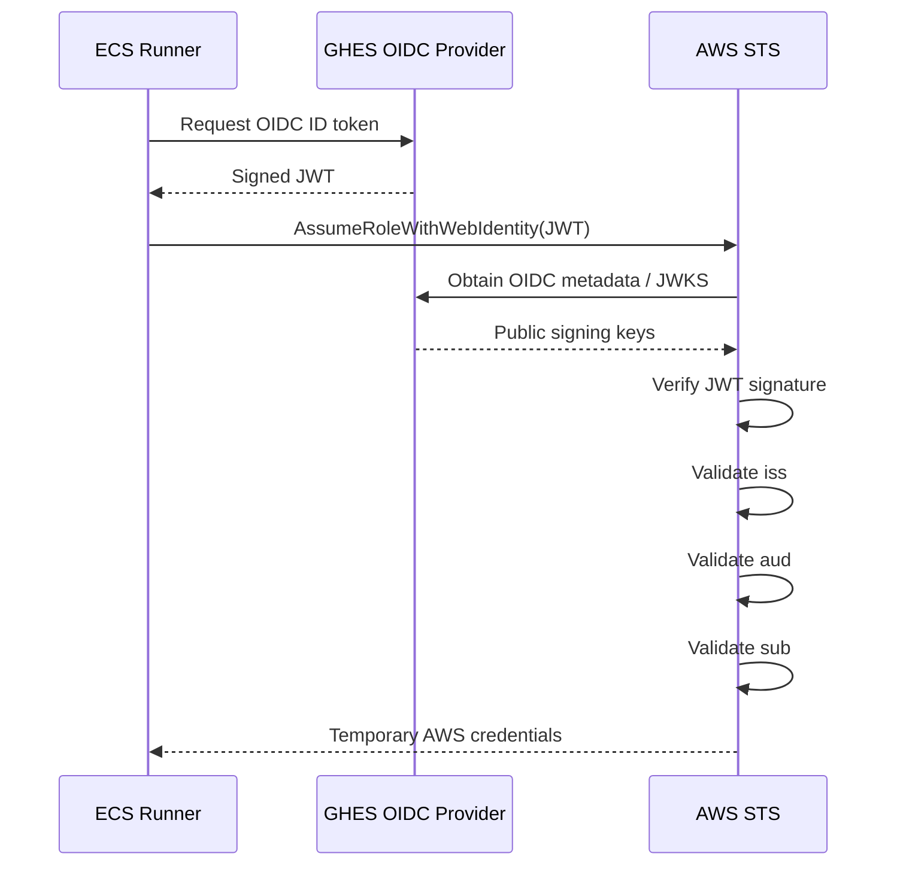

Yes. In your design there are several completely different security mechanisms layered together, and the certificate warning on the GHES appliance does **not necessarily mean your users will lose access when that certificate expires**.

The most important fact for your architecture is this:

> **Browser → ALB TLS certificate and ALB → GHES TLS certificate are two independent certificates.**
> AWS ALB does **not validate** the certificate presented by an HTTPS target, including whether it is expired. ([AWS Documentation][1])

So your architecture is roughly:



GitHub itself requires HTTPS to remain HTTPS when you terminate TLS at a load balancer; GitHub specifically warns not to terminate HTTPS at the load balancer and then downgrade the backend to HTTP. ([GitHub Docs][2])

## 1. User browser access: ACM certificate

When a user opens:

```text
https://github.company.com
```

the connection is:

```text
User
   |
   | HTTPS :443
   | Certificate = AWS ACM wildcard
   | *.company.com
   v
ALB
```

The browser **never sees the GHES EC2 certificate**.

The browser validates:

```text
Subject/SAN
Issuer
Expiration
Trust chain
Hostname
```

against the **ACM certificate on the ALB**.

The ALB terminates that TLS session, decrypts the HTTP request, and starts a **new HTTPS connection**:

```text
ALB
   |
   | HTTPS :443
   | completely new TLS session
   v
GHES private IP
```

GHES now presents its internal certificate.

So there are actually two TLS sessions:

```text
        TLS Session #1                  TLS Session #2
        ACM certificate                 GHES certificate
              ↓                              ↓

Browser ==================> ALB ==================> GHES
             :443                         :443
```

The two certificates can have different:

```text
Issuers
Private keys
Expiration dates
Certificate chains
Renewal processes
```

That explains exactly why GHES can tell you:

```text
"Certificate expires soon"
```

while ACM shows:

```text
ACM wildcard certificate: healthy
```

They are unrelated certificates.

---

# 2. Why the expired GHES certificate may NOT break ALB traffic

This is the unusual but very important part.

For an ALB HTTPS target group, AWS states that the ALB establishes TLS to the target but **does not validate the target certificate**. AWS explicitly says self-signed and expired certificates can be used for targets. ([AWS Documentation][1])

Therefore:

```text
ALB
 |
 | TLS handshake
 |
 v
GHES
   Certificate:
       Expiration: EXPIRED
```

can still establish successfully.

The ALB effectively cares that:

```text
GHES speaks TLS
GHES has a certificate/private key
Compatible TLS version exists
Compatible cipher exists
GHES returns expected HTTP response
```

It does not perform normal browser-style verification such as:

```text
Is certificate expired?       <-- not checked
Is CA trusted?                <-- not checked
Does hostname match?          <-- not checked
```

Consequently, an ALB HTTPS health check can also continue succeeding despite an expired backend certificate, assuming the application itself responds normally. ([AWS Documentation][1])

---

# 3. SAML authentication with Entra ID

SAML is another completely separate authentication layer.

SAML answers:

> **Who is this person?**

TLS answers:

> **Can I securely communicate with this server?**

Your SAML flow looks like this:



GitHub Enterprise Server acts as the **SAML Service Provider**, and the SAML response is posted to an ACS endpoint such as:

```text
https://github.company.com/saml/consume
```

GitHub documents SAML HTTP-POST for this flow. ([GitHub Docs][3])

Notice the certificate visible to the browser during the return to GHES:

```text
Entra
   |
   | SAML Response
   v
Browser
   |
   | HTTPS :443
   | ACM wildcard cert
   v
ALB
   |
   | HTTPS :443
   v
GHES
```

Therefore an expired **backend GHES TLS certificate normally does not break SAML login through the ALB**.

### There is another certificate involved in SAML

Don't confuse the GHES TLS certificate with the **Entra SAML signing certificate**.

You effectively have:

| Certificate/key                | Purpose                                 |
| ------------------------------ | --------------------------------------- |
| ACM wildcard certificate       | Browser → ALB TLS                       |
| GHES TLS certificate           | ALB/direct client → GHES TLS            |
| Entra SAML signing certificate | Cryptographically signs SAML assertions |
| GHES OIDC signing key          | Signs OIDC JWTs                         |
| GitHub App private key         | Signs GitHub App JWTs                   |

These serve very different purposes.

If the **Entra SAML signing certificate** expires or is replaced without updating GHES trust, SAML authentication can fail even though both TLS certificates are perfectly valid.

---

# 4. Developer PAT authentication

SAML is primarily the interactive browser authentication mechanism.

For example:

```text
Developer
   |
   | git clone / git pull / git push
   | HTTPS :443
   | PAT
   v
ALB
   |
   | HTTPS :443
   v
GHES
```

A developer might run:

```bash
git clone https://github.company.com/team/repository.git
```

Git uses:

```text
TLS:
    ACM certificate

Authentication:
    Personal Access Token
```

The PAT effectively replaces the password for HTTPS Git operations. GitHub documents PAT authentication for HTTPS Git and REST API access. ([GitHub Docs][4])

With SAML configured on GHES, SAML and PAT therefore serve different purposes:

```text
Web UI
   ↓
SAML

Git HTTPS
   ↓
PAT

REST API
   ↓
PAT / GitHub App token / GITHUB_TOKEN
```

GitHub's GHES documentation specifically notes that with SAML authentication, Git/API authentication uses tokens rather than normal basic password authentication. ([GitHub Docs][5])

### Internal certificate expires

If developers use:

```text
https://github.company.com
        ↓
       ALB
```

they see the ACM certificate.

So PAT-based Git operations should continue.

But suppose somebody configured:

```text
https://github-internal.company.local
```

and that DNS resolves directly:

```text
Developer
     |
     v
10.20.30.40 GHES
```

Now the developer sees the **GHES internal certificate**.

After expiration you can expect something like:

```text
SSL certificate problem:
certificate has expired
```

and Git clone/pull/push fails before PAT authentication even happens.

The order matters:

```text
1. TCP connection
2. TLS handshake
3. Certificate validation
4. HTTP
5. PAT authentication
```

If step 3 fails, GHES never gets a chance to validate the PAT.

---

# 5. ECS self-hosted runners

Your ECS runners are another important case.

GitHub documents that GHES self-hosted runners communicate with the GHES hostname/API over HTTP(S), normally HTTPS **TCP 443**, to receive jobs and runner updates. ([GitHub Docs][6])

Typical flow:

```text
ECS Runner
     |
     | HTTPS :443
     v
github.company.com
     |
     v
ALB
     |
     | HTTPS :443
     v
GHES
```

The runner initiates this communication.

You generally don't need:

```text
GHES ---> inbound connection ---> Runner
```

for normal job polling/assignment.

### Authentication is also different

The Actions runner has its own runner registration/authentication relationship with GHES.

Then individual workflow operations may use:

```text
GITHUB_TOKEN
PAT
GitHub App installation token
OIDC token
AWS temporary credentials
```

depending on what the workflow is doing.

### Certificate impact

If your ECS runner resolves:

```text
github.company.com → ALB
```

then:

```text
Runner validates ACM certificate
ALB talks to GHES
ALB ignores expired backend certificate
```

So the runner will probably continue working.

But if your ECS environment has split DNS like:

```text
github.company.com → 10.10.20.50 GHES
```

or runner configuration uses:

```text
github-internal.company.local
```

then the runner sees the internal certificate.

After expiration:

```text
Runner
  |
  X TLS certificate expired
  |
GHES
```

Actions can stop getting jobs.

That is one of the first things I would check in your environment.

---

# 6. GitHub Apps

There is another subtle point here.

When you say:

> "there are apps in GHES"

usually GHES contains the **GitHub App registration and installation**, but the application code normally runs somewhere else.

Conceptually:

```text
GHES
  |
  | webhook
  v
Application server

Application server
  |
  | REST/GraphQL API
  v
GHES
```

GitHub Apps have another authentication system.

The app has:

```text
App ID
Private key
Permissions
Installation ID
```

The application generates a short-lived **JWT signed with its GitHub App private key**.

Then:

```text
Application
   |
   | App JWT
   v
GHES /api/v3/app/...
```

GHES validates the JWT and issues an **installation access token**.

Then:

```text
Application
   |
   | Installation Access Token
   v
GHES REST API
```

GitHub documents these three GitHub App identities: app JWT, installation access token, and user access token. ([GitHub Docs][7])

These authentication credentials have nothing to do with the TLS certificate.

But the network connection carrying them still does.

Therefore:

```text
App JWT
Installation Token
           ↓
      authentication

HTTPS certificate
           ↓
      transport security
```

If the app connects through the ALB:

```text
App → ALB → GHES

App sees ACM certificate
```

backend certificate expiration should not affect it.

If the application calls:

```text
https://github-internal.company.local/api/v3/
```

directly:

```text
App → GHES
```

it may fail as soon as the internal certificate expires.

---

# 7. GHES as an AWS OIDC provider

This one is especially important in your environment because it introduces yet another identity mechanism.

OIDC does **not use the PAT** and does **not use SAML**.

Your Actions workflow asks GHES for an OIDC identity token.

Conceptually:



For GHES, GitHub documents endpoints similar to:

```text
https://github.company.com/_services/token/.well-known/openid-configuration

https://github.company.com/_services/token/.well-known/jwks
```

and the AWS provider URL uses:

```text
https://github.company.com/_services/token
```

AWS must be able to reach those OIDC discovery/JWKS endpoints. ([GitHub Docs][8])

The workflow then exchanges the GHES-issued identity token with AWS for temporary AWS credentials. ([GitHub Docs][8])

### OIDC has TWO different cryptographic operations

This distinction is critical.

First:

```text
HTTPS/TLS
AWS <---- secure HTTPS ----> GHES
```

protects AWS's access to the OIDC endpoints.

Second:

```text
OIDC JWT
   |
   +-- digitally signed by GHES OIDC signing key
```

proves the identity of the workflow.

AWS validates things such as:

```text
iss = GHES issuer
aud = sts.amazonaws.com
sub = repo/org/branch/environment identity
signature = GHES OIDC signing key
```

The **GHES web server TLS certificate is not the key that signs the OIDC JWT**.

---

# 8. What happens to AWS OIDC if the internal GHES certificate expires?

It depends entirely on which path AWS sees.

### Your likely architecture

If:

```text
AWS
 |
 | HTTPS :443
 v
github.company.com
 |
 v
ALB
 |
 v
GHES
```

then AWS sees:

```text
ACM wildcard certificate
```

not the internal GHES certificate.

Therefore:

```text
Internal GHES TLS expires
           ↓
ALB still connects to GHES
           ↓
AWS still reaches OIDC discovery
           ↓
AWS still reaches JWKS
           ↓
OIDC can continue
```

assuming nothing else is wrong.

This is likely the behavior in your architecture.

But if your OIDC configuration somehow reaches:

```text
AWS
 |
 v
private GHES endpoint
```

and AWS sees the expired internal certificate, the discovery/JWKS HTTPS connection can fail and then OIDC role assumption becomes a serious issue.

---

# 9. Git over SSH is another completely different path

GHES also normally supports:

```text
TCP 22
```

for Git over SSH. GitHub documents 22 for Git SSH, 443 for web/Git HTTPS, and 8443 for the secure management console. ([GitHub Docs][9])

For example:

```bash
git@github.company.com:team/repo.git
```

uses:

```text
SSH
TCP 22
SSH host key
Developer SSH public/private key
```

It does **not** use:

```text
ACM
X.509 TLS certificate
PAT
SAML
OIDC
```

An ALB cannot carry normal Git-over-SSH traffic. If you provide Git SSH, you typically have some other path such as an NLB/direct endpoint.

So your complete picture may actually be:

```text
                        HTTPS :443
Users / PAT / API -----------> ALB --------HTTPS:443------> GHES
                                 |
                                 +-- ACM cert       GHES cert


Developers SSH ---------------- NLB/direct ----------------> GHES
                  TCP 22                     TCP 22


Users ------------------------> Entra
            HTTPS 443 / SAML


ECS Runner -------------------> ALB -----------------------> GHES
             HTTPS 443


ECS Workflow -----------------> AWS STS
             HTTPS 443
             OIDC JWT


AWS --------------------------> ALB -----------------------> GHES
          HTTPS 443                    OIDC JWKS
```

---

# 10. The certificate-expiration impact in your environment

Here's the practical risk matrix.

| Communication                               | TLS certificate caller sees | Internal GHES cert expiration      |
| ------------------------------------------- | --------------------------- | ---------------------------------- |
| User browser → ALB                          | **ACM wildcard**            | 🟢 Probably unaffected             |
| SAML callback → ALB                         | **ACM wildcard**            | 🟢 Probably unaffected             |
| Developer Git HTTPS + PAT → ALB             | **ACM wildcard**            | 🟢 Probably unaffected             |
| REST API + PAT → ALB                        | **ACM wildcard**            | 🟢 Probably unaffected             |
| ECS runner → ALB                            | **ACM wildcard**            | 🟢 Probably unaffected             |
| GitHub App → ALB API                        | **ACM wildcard**            | 🟢 Probably unaffected             |
| AWS → ALB OIDC JWKS                         | **ACM wildcard**            | 🟢 Probably unaffected             |
| ALB → GHES HTTPS                            | **GHES internal**           | 🟢 ALB doesn't validate expiration |
| Direct runner → GHES                        | **GHES internal**           | 🔴 Likely fails                    |
| Direct API client → GHES                    | **GHES internal**           | 🔴 Likely fails                    |
| Direct Git HTTPS → GHES                     | **GHES internal**           | 🔴 Likely fails                    |
| Internal automation → GHES private endpoint | **GHES internal**           | 🔴 Likely fails                    |
| Direct management access                    | Depends on endpoint/cert    | 🟠 Verify                          |
| Git SSH :22                                 | SSH host key                | 🟢 TLS cert irrelevant             |

That is why I would **still renew the GHES certificate**, even though your main public service may continue working.

The dangerous scenario is discovering six months later that some background application, runner, backup/integration, API script, or admin path was connecting directly to GHES and suddenly cannot validate TLS.

---

# 11. How I would verify your actual architecture before expiration

You can determine exactly which certificate each path sees.

From a normal workstation:

```bash
openssl s_client \
  -connect github.company.com:443 \
  -servername github.company.com </dev/null 2>/dev/null |
openssl x509 -noout -subject -issuer -dates -serial
```

You should see the **AWS ACM certificate**.

Then test the GHES server directly while preserving the correct hostname/SNI. Suppose GHES is:

```text
10.20.30.40
```

Use:

```bash
openssl s_client \
  -connect 10.20.30.40:443 \
  -servername github.company.com </dev/null 2>/dev/null |
openssl x509 -noout -subject -issuer -dates -serial
```

Now you should see the **internal certificate that's generating the warning**.

An even better test is:

```bash
curl -Iv \
  --resolve github.company.com:443:10.20.30.40 \
  https://github.company.com/
```

This forces:

```text
github.company.com
       ↓
10.20.30.40
```

while keeping the correct hostname and TLS SNI.

Also run the public path:

```bash
curl -Iv https://github.company.com/
```

You'll probably find:

```text
Public path:
   issuer = Amazon
   expiration = later date

Direct GHES:
   issuer = Internal CA / other entity
   expiration = soon
```

which would confirm exactly what you're seeing.

## The way I would think about your GHES security model

You don't have "one authentication system." You have several independent systems:

```text
                    WHAT IS IT PROTECTING?

ACM TLS             Network connection: User → ALB

GHES TLS            Network connection: ALB/direct client → GHES

SAML / Entra        Human interactive login

PAT                  Developer Git/API identity

SSH key              Developer Git-over-SSH identity

Runner credential    Runner ↔ GHES Actions relationship

GITHUB_TOKEN         Workflow → GHES repository/API

GitHub App JWT       Proves identity of GitHub App

App installation
token                App authorization to repositories/API

GHES OIDC JWT        Workflow identity presented to AWS

AWS STS credentials  Temporary AWS authorization
```

So in **your particular ALB architecture**, I would classify the expiring GHES certificate as **important maintenance but probably not an immediate public outage**, because your ACM certificate protects external clients and AWS ALB does not validate the expired backend target certificate. The highest-priority investigation is whether **ECS runners, GitHub Apps, AWS OIDC discovery/JWKS, automation scripts, or administrators ever bypass the ALB and connect directly to the GHES private endpoint**. ([AWS Documentation][1])

If they all use `github.company.com → ALB`, the blast radius from the backend certificate expiration is much smaller than the GHES warning initially suggests.

[1]: https://docs.aws.amazon.com/elasticloadbalancing/latest/application/load-balancer-target-groups.html?utm_source=chatgpt.com "Target groups for your Application Load Balancers - Elastic Load Balancing"
[2]: https://docs.github.com/en/enterprise-server%403.17/admin/configuring-settings/hardening-security-for-your-enterprise/configuring-tls?utm_source=chatgpt.com "Configuring TLS - GitHub Enterprise Server 3.17 Docs"
[3]: https://docs.github.com/en/enterprise-server%403.17/admin/managing-iam/iam-configuration-reference/saml-configuration-reference?utm_source=chatgpt.com "SAML configuration reference - GitHub Enterprise Server 3.17 Docs"
[4]: https://docs.github.com/en/enterprise-server%403.20/authentication/keeping-your-account-and-data-secure/managing-your-personal-access-tokens?utm_source=chatgpt.com "Managing your personal access tokens - GitHub Enterprise Server 3.20 Docs"
[5]: https://docs.github.com/en/enterprise-server%403.17/admin/managing-iam/understanding-iam-for-enterprises/changing-authentication-methods?utm_source=chatgpt.com "Changing authentication methods - GitHub Enterprise Server 3.17 Docs"
[6]: https://docs.github.com/en/enterprise-server%403.20/actions/reference/runners/self-hosted-runners?utm_source=chatgpt.com "Self-hosted runners reference - GitHub Enterprise Server 3.20 Docs"
[7]: https://docs.github.com/en/enterprise-server%403.17/apps/creating-github-apps/authenticating-with-a-github-app/about-authentication-with-a-github-app?utm_source=chatgpt.com "About authentication with a GitHub App - GitHub Enterprise Server 3.17 Docs"
[8]: https://docs.github.com/en/enterprise-server%403.17/actions/how-tos/secure-your-work/security-harden-deployments/oidc-in-aws?utm_source=chatgpt.com "Configuring OpenID Connect in Amazon Web Services - GitHub Enterprise Server 3.17 Docs"
[9]: https://docs.github.com/en/enterprise-server%403.17/admin/configuring-settings/configuring-network-settings/network-ports?learn=improve_security_of_your_instance&learnProduct=admin&utm_source=chatgpt.com "Network ports - GitHub Enterprise Server 3.17 Docs"
