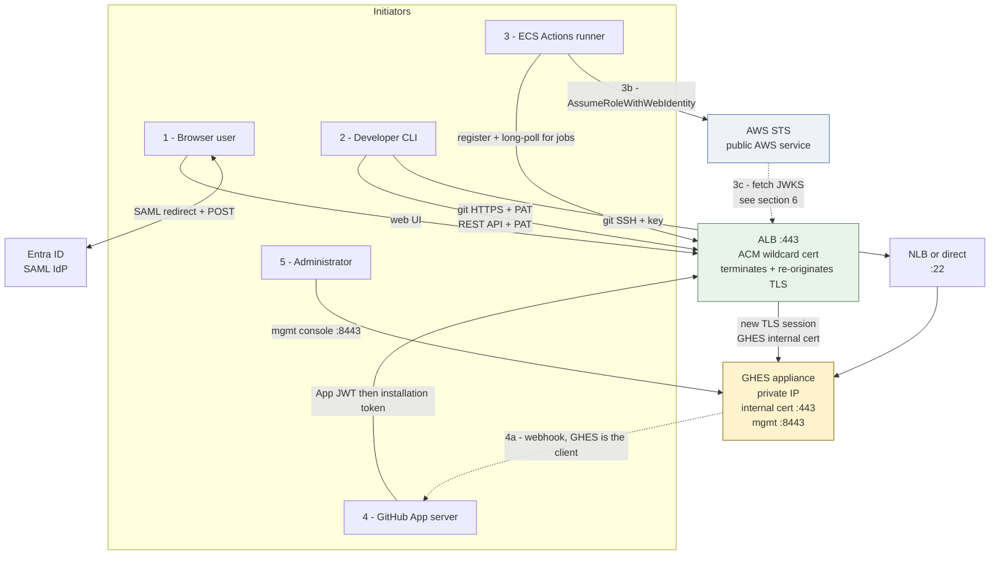
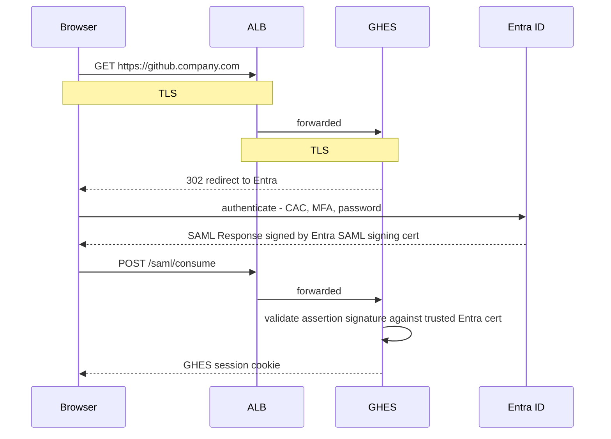
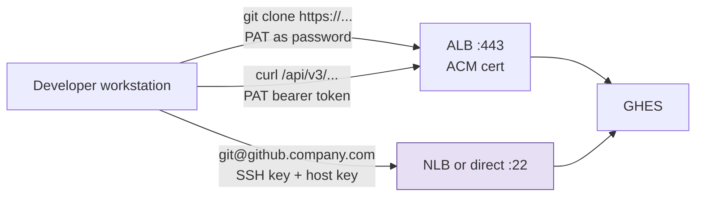
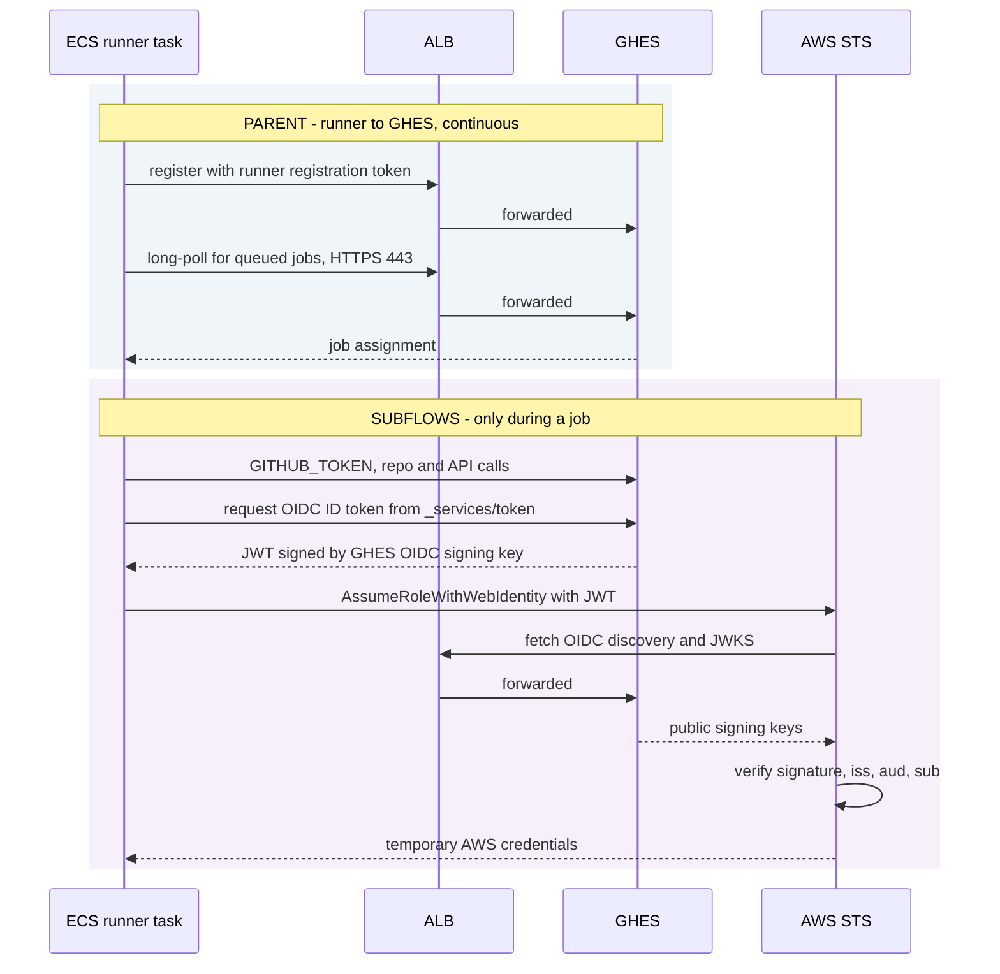
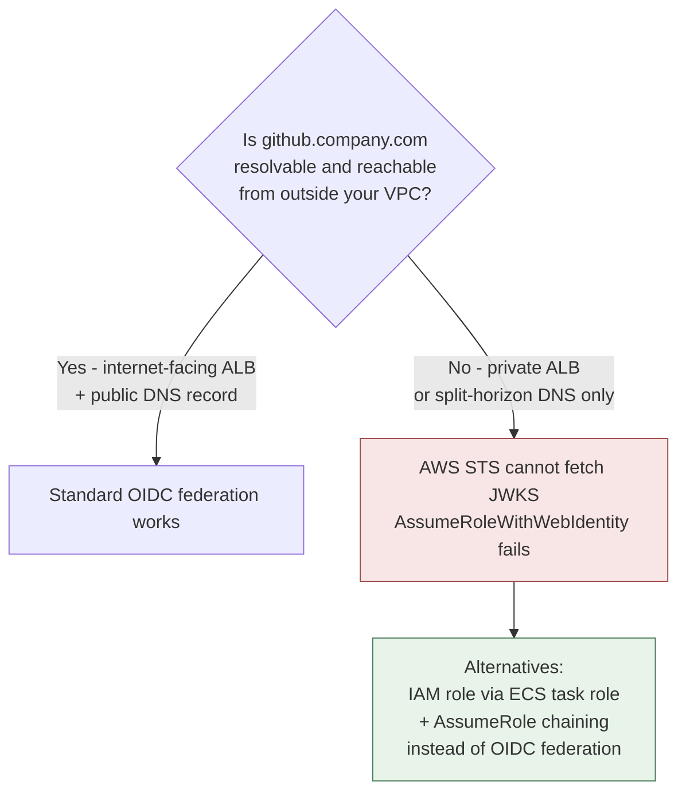
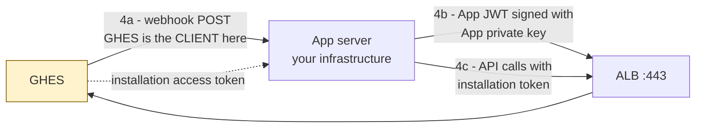
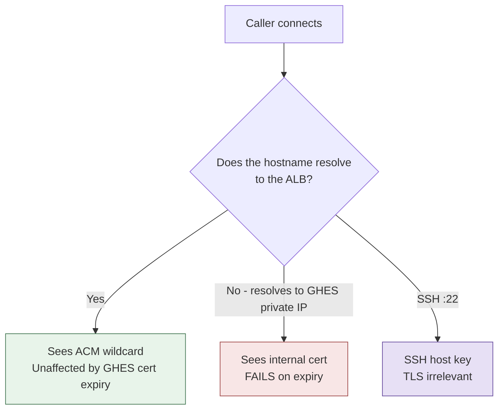

# GHES Communication Flows — Simplified

## 0. The one idea that collapses the whole document

Every path in your environment is a combination of **three independent axes**. Confusion comes from treating them as one thing.

| Axis | Question it answers | Examples |
|---|---|---|
| **Transport** | Can I talk to this server securely? | ACM cert, GHES internal cert, SSH host key |
| **Identity** | Who or what is calling? | SAML assertion, PAT, SSH key, GITHUB_TOKEN, App JWT, OIDC JWT |
| **Network path** | Which wire does it take? | Through the ALB, or direct to the GHES private IP |

**Certificate expiration only touches Transport + Network path.** It cannot break an identity mechanism. So the only question that matters for your expiring GHES certificate is: *which callers bypass the ALB?*

---

## 1. Corrections to your flow taxonomy

Your grouping is close. Two things are inverted or don't exist:

**"AWS OIDC with GHES, where runner→GHES is a subflow" — it's the other way around.**
The runner's connection to GHES is the *parent*. The runner registers, long-polls for jobs, and receives work. Only once a job is running does the workflow ask GHES for an OIDC token and hand it to AWS STS. OIDC is a subflow *inside* a job, not the container for the runner relationship. This matters operationally: if the runner→GHES leg breaks, you never get far enough to have an OIDC problem.

**"Developer OIDC to GHES" isn't a thing.**
OIDC on GHES is a token GHES *issues* to Actions workflows so they can prove identity to a third party (AWS). It is not a way for a human to authenticate to GHES. Developers have exactly three identities: SAML (web UI), PAT (Git over HTTPS and REST/GraphQL), and an SSH key (Git over SSH).

**One flow your list is missing:** the GitHub App's *inbound* webhook. GHES initiates that connection outbound to your app server — it is the only flow where GHES is the client rather than the server.

---

## 2. The five flows



The dotted lines are the two flows that run *opposite* to the obvious direction. Those are the ones people forget when they draw firewall rules.

---

## 3. Flow 1 — Human interactive login (SAML)

**Parent:** browser → ALB → GHES. **Subflow:** SAML round trip to Entra.



**Three separate certificates are in play and only one is the one expiring:**

| Certificate | Protects | Expiry breaks |
|---|---|---|
| ACM wildcard | Browser → ALB transport | Everything through the ALB |
| GHES internal | ALB → GHES transport | Only direct-to-GHES callers (§6) |
| **Entra SAML signing cert** | Signature on the assertion | SAML login, even with both TLS certs healthy |

That third row is the one that surprises people. If Entra rotates its SAML signing certificate and GHES isn't updated to trust the new one, logins fail with valid TLS everywhere.

**Downstream of this flow:** the authenticated web session is where a developer creates a PAT or uploads an SSH key. So SAML is upstream of Flow 2's *credential issuance*, but plays no part in Flow 2's *credential use*.

---

## 4. Flow 2 — Developer Git and API

Three identities, two network paths, and only one of them involves TLS at all.



**Order of operations matters for troubleshooting.** For the HTTPS paths:

```
1. TCP connect
2. TLS handshake
3. Certificate validation   <-- fails here on expiry
4. HTTP request
5. PAT validation           <-- never reached
```

A cert failure looks like an auth failure to a developer, but GHES never saw the token. `SSL certificate problem: certificate has expired` is a step-3 error, not a credentials problem.

**Git over SSH is immune.** It uses the SSH host key, not X.509. It also cannot traverse an ALB — if you offer SSH, there is a separate NLB or direct path, which means a separate set of firewall rules and a separate blast radius.

---

## 5. Flow 3 — ECS runner (parent) and OIDC (subflow)

This is the one worth redrawing, because the nesting is the opposite of how you had it.



**Identity chain inside one job, in order:**

| Step | Credential | Signed or issued by |
|---|---|---|
| Runner comes online | Runner registration token, then a long-lived runner credential | GHES |
| Job starts | `GITHUB_TOKEN` — scoped, expires with the job | GHES |
| Workflow requests cloud access | OIDC JWT — `iss` / `aud` / `sub` claims | **GHES OIDC signing key**, not the web TLS cert |
| Exchange | `AssumeRoleWithWebIdentity` | AWS validates the JWT signature against GHES JWKS |
| Result | Temporary STS credentials | AWS |

The GHES web server TLS certificate does not sign the OIDC JWT. Those are different keys with different lifecycles.

**Typical GHES OIDC endpoints:**

```
https://github.company.com/_services/token/.well-known/openid-configuration
https://github.company.com/_services/token/.well-known/jwks
```

and the IAM provider URL is `https://github.company.com/_services/token`.

---

## 6. Flow 3c — the leg that usually breaks in a private environment

The source document treats `AWS STS → GHES JWKS` as just another ALB-fronted path. In a DoD or GovCloud enclave it often isn't, and this deserves verification rather than assumption.

**AWS STS is a public AWS service, not something running in your VPC.** When it validates an OIDC token it fetches the issuer's discovery and JWKS documents. That fetch originates from AWS's own service infrastructure, so:

- If `github.company.com` resolves only inside your VPC or on your private DNS, AWS cannot reach it.
- If the ALB is internal-scheme rather than internet-facing, AWS cannot reach it.
- Creating the IAM OIDC identity provider in the first place requires reaching the issuer to retrieve the thumbprint.



Since your runners already run on ECS, the **task role + `sts:AssumeRole` chain** is the pattern that works without exposing GHES publicly. It's worth confirming which one you're actually on before you invest in OIDC trust policies. Also note the audience claim defaults to `sts.amazonaws.com`; if you're in `aws-us-gov`, verify the expected value against current docs rather than copying a commercial example.

---

## 7. Flow 4 — GitHub App

The App registration lives in GHES; the App *code* runs elsewhere. Two directions, and they're easy to conflate.



**Three App identities, distinct purposes:**

| Token | Proves | Lifetime |
|---|---|---|
| App JWT | "I am this GitHub App" — signed with the App private key | ~10 min |
| Installation access token | "I am this App acting on this org or repo" | ~1 hour |
| User access token | "I am this App acting on behalf of this user" | Configurable |

**The webhook leg is the one to check for cert impact.** GHES initiating outbound to your app server means the *app server's* certificate matters, and it means GHES needs egress and DNS to reach it. This leg does not go through your ALB at all.

---

## 8. Flow 5 — Administration

The management console on `:8443` typically does not sit behind the ALB, which means it presents the internal GHES certificate directly. Same for SSH-based appliance administration on port `122`. These are the paths most likely to be forgotten in a cert inventory precisely because only a handful of people use them.

---

## 9. Certificate impact — the simplified matrix

The original document's thirteen-row table collapses to one rule:

> **Through the ALB → sees the ACM certificate → unaffected.**
> **Direct to GHES → sees the internal certificate → breaks on expiry.**



**Why the ALB → GHES leg survives:** an ALB with an HTTPS target group establishes TLS to the target but does not perform browser-style validation. It does not check expiry, CA trust, or hostname match. Self-signed and expired target certificates still complete the handshake, and HTTPS health checks continue passing as long as the application responds.

**Two caveats the "it'll be fine" conclusion needs:**

1. Anything doing certificate pinning or explicit CA validation on the backend leg still breaks. That includes some monitoring agents and backup integrations.
2. GHES itself may generate alerts, block admin operations, or behave oddly around an expired cert independent of what the ALB tolerates. "The ALB doesn't care" is not the same as "GHES doesn't care."

Renew it. The finding you're actually hunting for is the inventory of direct callers, not permission to defer.

---

## 10. How to find the direct callers

Three methods, cheapest first.

**Confirm which cert each path presents:**

```bash
# Through the ALB - expect the ACM wildcard
openssl s_client -connect github.company.com:443 \
  -servername github.company.com </dev/null 2>/dev/null |
  openssl x509 -noout -subject -issuer -dates

# Direct to GHES, preserving SNI - expect the expiring internal cert
openssl s_client -connect 10.20.30.40:443 \
  -servername github.company.com </dev/null 2>/dev/null |
  openssl x509 -noout -subject -issuer -dates
```

**Find who is bypassing the ALB.** VPC Flow Logs on the GHES ENI, filtered to :443, minus the ALB node IPs, is your list of direct callers:

```bash
# Enumerate ALB node IPs to subtract
aws ec2 describe-network-interfaces \
  --filters "Name=description,Values=ELB app/<alb-name>/*" \
  --query 'NetworkInterfaces[].PrivateIpAddress' --output text
```

In Splunk against `aws:cloudwatchlogs:vpcflow`:

```
index=<vpcflow_index> sourcetype=aws:cloudwatchlogs:vpcflow
  dest_ip=<ghes_private_ip> dest_port=443 action=ACCEPT
  NOT src_ip IN (<alb_ip_1>, <alb_ip_2>, <alb_ip_3>)
| stats count sum(bytes) as bytes by src_ip
| sort - count
```

Every `src_ip` in that result is a client that will break on expiry. Resolve each one to an ENI, then to a workload.

**Cross-check with Route 53 Resolver query logs** for anything resolving an internal hostname like `github-internal.company.local` — that's a direct-path caller that flow logs alone might not explain.
