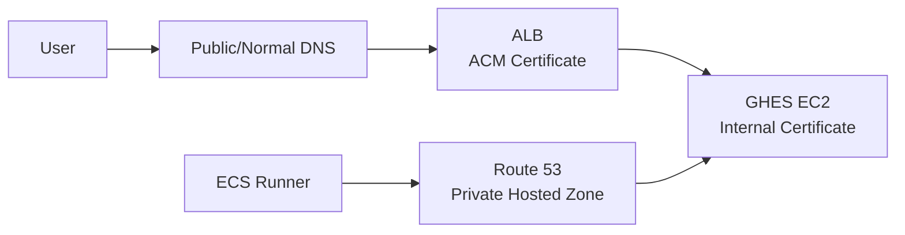

Yes. I would verify it from **three angles**: what hostname the runner is configured to use, what that hostname resolves to inside ECS, and which certificate the runner actually sees.

### 1. From inside the ECS runner container

If ECS Exec is enabled, enter the running task and run:

```bash
getent hosts github.company.com
```

or:

```bash
nslookup github.company.com
```

If the result is the **ALB addresses**, your path is:

```text
ECS Runner
    |
    | DNS = ALB IPs
    v
ALB
    |
    v
GHES
```

If it resolves directly to the GHES EC2 private IP, for example:

```text
10.50.20.25  github.company.com
```

then you have split-horizon/internal DNS and the runner is bypassing the ALB:

```text
ECS Runner
    |
    | DNS
    v
10.50.20.25
    |
    v
GHES directly
```

That is the situation where the GHES certificate expiration matters.

### 2. Check the certificate the runner actually receives

From the same container:

```bash
openssl s_client \
  -connect github.company.com:443 \
  -servername github.company.com </dev/null 2>/dev/null |
openssl x509 -noout -subject -issuer -dates
```

This is probably the single best test.

If you see something like:

```text
issuer=Amazon RSA 2048 M03
notAfter=...
```

the runner is reaching the **ALB/ACM certificate**.

If you see:

```text
issuer=Your Internal CA
notAfter=Sep 15 2026
```

or whatever entity issued the GHES certificate, the runner is reaching **GHES directly**.

Your answer is then definitive:

```text
Certificate seen by runner
        |
        +-- Amazon/ACM cert ------> going through ALB
        |
        +-- GHES internal cert ---> direct/internal GHES path
```

### 3. Use `curl` for an even easier test

Inside the ECS runner:

```bash
curl -Iv https://github.company.com/
```

Look for the certificate information:

```text
* Server certificate:
*  subject: ...
*  issuer: ...
*  expire date: ...
```

Do **not** use `-k` for the normal test. `-k` disables certificate validation and can hide exactly the problem you're trying to identify.

You can separately test whether expiration/trust is the issue with:

```bash
curl -Iv https://github.company.com/
```

versus:

```bash
curl -Ikv https://github.company.com/
```

If normal curl fails but `-k` succeeds, that's strong evidence of a certificate validation problem.

---

## 4. Compare DNS from outside and inside

This is particularly important because I suspect you may have **Route 53 private DNS overriding the public hostname**.

From your workstation:

```bash
nslookup github.company.com
```

Then inside ECS:

```bash
nslookup github.company.com
```

You may discover:

```text
External workstation

github.company.com
        |
        v
ALB DNS
        |
        v
10.10.1.15
10.10.2.20
```

but inside the runner VPC:

```text
ECS Runner

github.company.com
        |
        v
Private Hosted Zone
        |
        v
10.50.20.25
        |
        v
GHES
```

That is a classic split-DNS design.

In that case:



Then your browser works even after the GHES cert expires while your Actions runners can fail.

---

## 5. Find what URL the runner itself was configured with

Inside the runner container, first look for URL-related environment variables without dumping every environment variable:

```bash
env | grep -Ei 'github.*url|ghes.*url|runner.*url'
```

Your container startup code may have something like:

```text
GITHUB_URL=https://github.company.com
GHES_URL=https://github-internal.company.local
RUNNER_URL=https://github-internal.company.local/org
```

The exact variable names depend on how your ECS runner image was built.

Also check the runner installation directory:

```bash
pwd
ls -la
```

You will commonly see files/directories such as:

```text
config.sh
run.sh
_diag/
```

You can inspect diagnostics for the GitHub hostname:

```bash
grep -RiE 'https://|github\.company\.com' _diag/ | head -100
```

Don't broadly paste `_diag` logs into tickets or chat without reviewing them first; they can contain operational information.

GitHub documents `_diag` as the location for runner application diagnostics. ([GitHub Docs][1])

---

## 6. GitHub has a built-in runner connectivity test

From the runner installation directory:

```bash
./config.sh --check \
  --url https://github.company.com/YOUR-ORG/YOUR-REPO \
  --pat YOUR_PAT
```

GitHub's runner will test required connectivity and report `PASS` or `FAIL`; detailed results go into `_diag`. GitHub also confirms that the self-hosted runner validates the GitHub TLS certificate by default. ([GitHub Docs][1])

I would **not** disable certificate verification as a solution. GitHub provides `GITHUB_ACTIONS_RUNNER_TLS_NO_VERIFY=1` for testing, but explicitly recommends proper certificate trust instead. ([GitHub Docs][1])

---

# 7. The strongest AWS-side verification: VPC Flow Logs

You can prove the path even without entering the container.

Find the ECS task ENI:

```text
ECS Task
   ↓
Networking
   ↓
eni-xxxxxxxx
   ↓
Private IP = 10.60.5.42
```

Then search VPC Flow Logs for:

```text
srcaddr = 10.60.5.42
dstport = 443
```

You want to see the destination.

### If going through ALB

```text
10.60.5.42    →    10.10.1.17:443
ECS runner          ALB node
```

Then ALB:

```text
10.10.x.x     →    10.50.20.25:443
ALB                 GHES
```

### If going directly to GHES

You'll see:

```text
10.60.5.42    →    10.50.20.25:443
ECS runner          GHES
```

That is definitive evidence the ALB is bypassed.

For your environment, this would be my preferred network-level proof.

---

# 8. ALB access logs are another useful confirmation

If ALB access logging is enabled, trigger a runner connection or job and search for requests originating from your ECS runner IP.

Conceptually:

```text
Runner job starts
      ↓
10.60.5.42 → ALB
      ↓
ALB access log should show activity
```

If Actions jobs are running while you see:

```text
VPC Flow Log:

ECS-IP → GHES-IP:443
```

and **nothing corresponding in ALB logs**, that's very strong evidence the runner is bypassing ALB.

---

# What I would run first

From the ECS runner, just run these four commands:

```bash
# 1. What IP does GHES resolve to?
getent hosts github.company.com
```

```bash
# 2. Which TLS certificate do I see?
openssl s_client \
  -connect github.company.com:443 \
  -servername github.company.com </dev/null 2>/dev/null |
openssl x509 -noout -subject -issuer -dates
```

```bash
# 3. Does normal TLS validation work?
curl -Iv https://github.company.com/
```

```bash
# 4. Look for configured GHES URL
env | grep -Ei 'github.*url|ghes.*url|runner.*url'
```

### Interpret the result

| Result                                       | Conclusion                                      | Expiring GHES cert   |
| -------------------------------------------- | ----------------------------------------------- | -------------------- |
| DNS → ALB + certificate issuer Amazon        | Runner → ALB → GHES                             | Low immediate impact |
| DNS → GHES private IP + internal certificate | **Runner → GHES directly**                      | **High impact**      |
| DNS → ALB but internal certificate displayed | Something unusual/proxy/DNS needs investigation | Investigate          |
| DNS → GHES IP but Amazon cert displayed      | Another LB/proxy likely exists                  | Investigate          |

The **certificate test is particularly valuable** because it tells us what TLS endpoint the runner actually sees, rather than what we think DNS or the architecture diagram says.

If you paste the output of these three commands:

```bash
getent hosts <your-ghes-hostname>

openssl s_client -connect <your-ghes-hostname>:443 \
 -servername <your-ghes-hostname> </dev/null 2>/dev/null |
 openssl x509 -noout -subject -issuer -dates

curl -Iv https://<your-ghes-hostname>/
```

I can tell you whether your runner is hitting the **ALB or GHES directly**, and then we can map exactly what will break when that internal certificate expires.

[1]: https://docs.github.com/en/actions/how-tos/manage-runners/self-hosted-runners/monitor-and-troubleshoot?utm_source=chatgpt.com "Monitoring and troubleshooting self-hosted runners - GitHub Docs"
