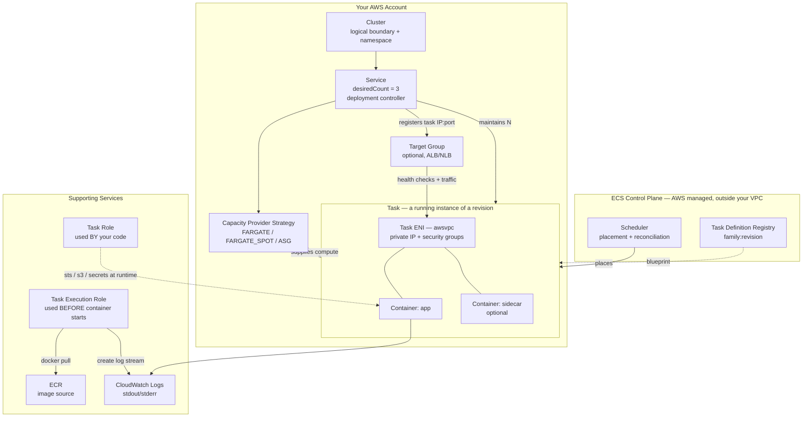
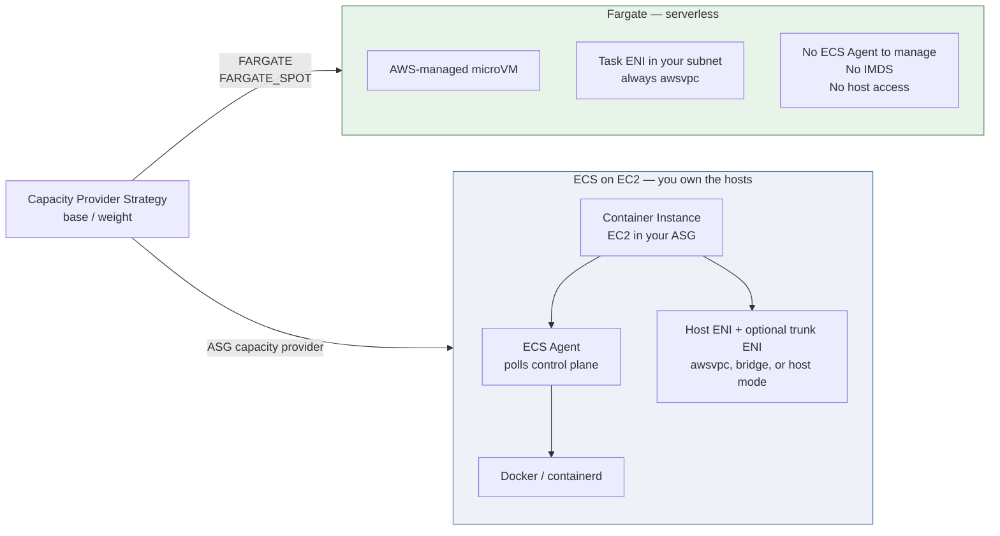
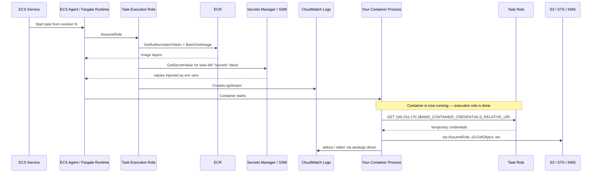
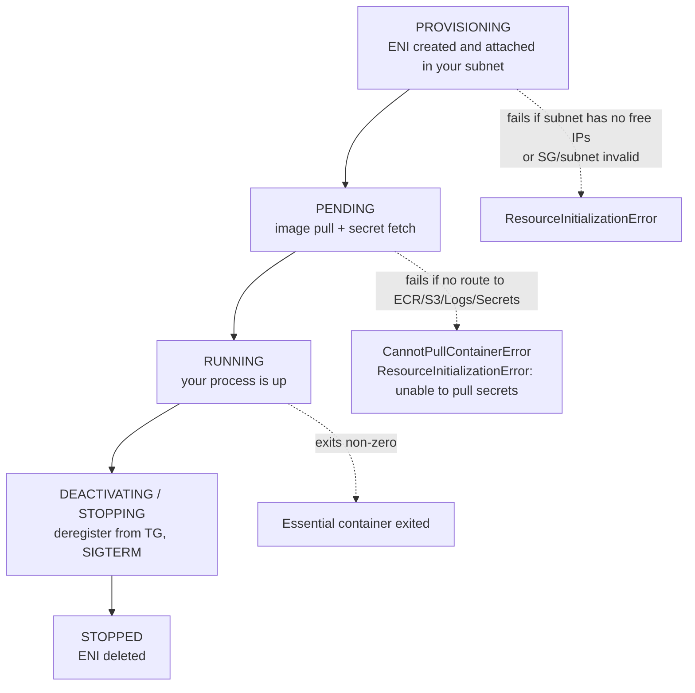
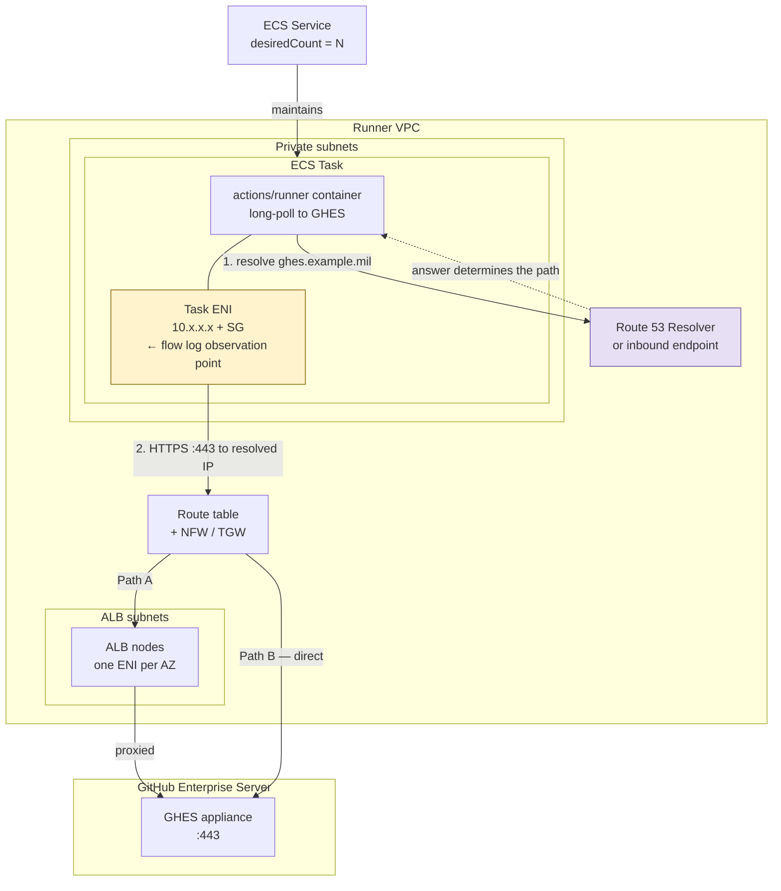

# Amazon ECS — Component Model and the GHES Runner Path

## 1. The mental model

ECS has exactly three ideas underneath all the vocabulary:

| Layer | What it is | Analogy |
|---|---|---|
| **Declaration** | Task Definition | The AMI / the Dockerfile output — a versioned, immutable spec |
| **Instantiation** | Task | The running EC2 instance — a live object with an ID, an IP, and a lifecycle |
| **Reconciliation** | Service | The Auto Scaling Group — a controller that keeps N instantiations alive |

Everything else (cluster, capacity provider, agent, container instance) exists to answer one question: **where does the compute come from?**

The control plane is AWS-managed and lives outside your VPC. Your tasks live inside your VPC. That split is why the task ENI matters so much for troubleshooting — it is the only part of the data path you can actually observe.

---

## 2. Object model



**Key relationships people get wrong:**

- A Task Definition is **immutable**. You never edit one; you register a new revision. `my-runner:14` and `my-runner:15` are different objects.
- A Service is optional. `RunTask` launches a standalone task with no controller behind it — which is often the *correct* choice for CI runners (see §6).
- Containers in a task share the ENI, the network namespace, and `localhost`. Two containers in one task cannot both bind :443.
- The task ENI belongs to the task, not the host. It is created at task start and destroyed at task stop.

---

## 3. Where the compute comes from



| Concern | Fargate | ECS on EC2 |
|---|---|---|
| Patching the host | AWS | You (AMI refresh, ASG rotation) |
| ECS Agent | Not exposed | You manage it, and it can fail independently |
| Container Instance object | Does not exist | Exists; `describe-container-instances` |
| Network modes | `awsvpc` only | `awsvpc`, `bridge`, `host`, `none` |
| ENI per task | Always | Only with `awsvpc`; density limited without trunking |
| IMDS (`169.254.169.254`) | **Not available** | Available |
| Task metadata | `ECS_CONTAINER_METADATA_URI_V4` | Same |
| Docker socket / DinD | Not possible | Possible (privileged) |
| Accounting | Per-task vCPU/GB-second | Per-EC2-instance, regardless of packing |

**The Fargate item that bites CI runners:** no Docker socket. If your GitHub workflows do `docker build`, Fargate cannot do it natively — you need Kaniko, Buildah, BuildKit rootless, or ECS on EC2.

---

## 4. The two IAM roles

This is the single most common ECS misconfiguration, so it gets its own diagram.



| | Task Execution Role | Task Role |
|---|---|---|
| Who uses it | The ECS agent / Fargate runtime | Your application process |
| When | Before and during container startup | After the container is running |
| Typical policy | `AmazonECSTaskExecutionRolePolicy` + `secretsmanager:GetSecretValue` + `kms:Decrypt` | Whatever your app calls — `sts:AssumeRole` for cross-account Terraform, `s3:*` on state buckets |
| Failure symptom | Task never starts. `CannotPullContainerError`, `ResourceInitializationError`, `AccessDeniedException` on the secret | Task starts fine, then the app throws `AccessDenied` mid-job |

**Rule of thumb:** if the failure is in `stoppedReason` on the task, it is the execution role. If the failure is in your container logs, it is the task role.

**GovCloud note:** both role ARNs are in the `aws-us-gov` partition, and the managed policy is `arn:aws-us-gov:iam::aws:policy/service-role/AmazonECSTaskExecutionRolePolicy`. Cross-partition `AssumeRole` does not work — a GovCloud runner cannot assume a role in a commercial account.

---

## 5. Task startup in a private subnet

Worth internalizing because it explains most "task stuck in PROVISIONING/PENDING" tickets in a no-IGW environment.



Required egress before your container ever runs — via NAT, or via interface endpoints if you have no NAT:

| Endpoint | Why |
|---|---|
| `com.amazonaws.<region>.ecr.api` | Auth token, image manifest |
| `com.amazonaws.<region>.ecr.dkr` | Registry protocol |
| `com.amazonaws.<region>.s3` **(gateway)** | ECR layers physically live in S3 |
| `com.amazonaws.<region>.logs` | `awslogs` driver |
| `com.amazonaws.<region>.secretsmanager` / `.ssm` | Only if the task def uses `secrets` |
| `com.amazonaws.<region>.ssmmessages` | Only if you want ECS Exec |

The S3 gateway endpoint is the one that gets forgotten. Image pull fails with the three interface endpoints present but no S3 route.

**GovCloud caveats to verify against current docs rather than trust from memory:**
- **Fargate Spot** has historically not been offered in `us-gov-west-1` / `us-gov-east-1`. If your capacity provider strategy includes `FARGATE_SPOT`, confirm before you write the Terraform.
- Fargate platform version parity lags commercial; pin `platform_version` explicitly rather than using `LATEST` if you depend on a specific behavior.
- FIPS endpoints (`ecs-fips`, `ecr-fips`, `logs-fips`) may be required by your ATO boundary — check whether the interface endpoints above need the FIPS variant.
- ECS Exec is generally available but often blocked by SCP in DoD orgs; do not design your troubleshooting workflow around it.

---

## 6. Your GHES runner on ECS

Based on what you described. I do not have your actual account topology, so treat the ALB and GHES placement as the two hypotheses you are trying to distinguish, not as established fact.



**The registration direction matters:** the runner dials out to GHES and holds a long-poll. GHES never initiates inbound to the task. So the security group on the task ENI needs egress :443 only, and any inbound rule you find is either for the ALB health check (if the runner is behind one, which it usually should not be) or is vestigial.

**Service vs RunTask for runners.** If you register runners with `--ephemeral`, each runner exits after one job. Under a Service with `desiredCount = 3`, ECS will restart them continuously — that works, but you get constant task churn, noisy deployment events, and no correlation between a job and a task. The alternative is a webhook-driven `RunTask` per queued job. Either is defensible; just know which one you built, because it changes what "3 tasks are running" means when you are debugging.

---

## 7. Answering "ALB or direct?" from flow logs

Your instinct is right that the task ENI is the leverage point. The method:

**Step 1 — get the ENI and IP for a live task.**

```bash
aws ecs describe-tasks \
  --cluster <cluster> \
  --tasks <task-arn> \
  --query 'tasks[].attachments[].details[?name==`networkInterfaceId` || name==`privateIPv4Address`].[name,value]' \
  --output text
```

**Step 2 — enumerate the ALB's private IPs**, so you have something to compare against.

```bash
aws ec2 describe-network-interfaces \
  --filters "Name=description,Values=ELB app/<alb-name>/*" \
  --query 'NetworkInterfaces[].[PrivateIpAddress,AvailabilityZone]' \
  --output text
```

**Step 3 — query the flow logs.** In Splunk, against `aws:cloudwatchlogs:vpcflow`:

```
index=<vpcflow_index> sourcetype=aws:cloudwatchlogs:vpcflow
  src_ip=10.x.x.x dest_port=443
| stats count sum(bytes) as bytes by src_ip dest_ip action
| sort - bytes
```

Then read `dest_ip`:

| `dest_ip` matches | Conclusion |
|---|---|
| An ALB node IP from Step 2 | Path A — going through the ALB |
| The GHES appliance IP | Path B — direct, ALB bypassed |
| A proxy IP | The container has `HTTPS_PROXY` set and DNS/routing is irrelevant |
| Nothing at all, or `action=REJECT` | SG egress or NACL, not a routing question |

**Two things that will mislead you here:**

1. **Flow logs record the packet's actual destination IP, not the next hop.** If traffic crosses a NAT gateway, TGW, or Network Firewall endpoint, the `dest_ip` at the *task* ENI is still the final destination. So the task-ENI record alone tells you which endpoint was chosen — but it tells you nothing about whether the packet survived the inspection path. If you see the right `dest_ip` and still no connectivity, pull flow logs from the NFW/TGW attachment ENIs next.

2. **DNS is what actually decides this, not routing.** Path A vs Path B is determined by what `ghes.example.mil` resolves to inside the VPC. If you have a private hosted zone overriding the public record, or a Resolver rule forwarding to on-prem, that is the real control point. Route 53 Resolver query logs will answer the question faster than flow logs will.

**Corroborating signals, cheapest first:**

| Signal | Tells you |
|---|---|
| Route 53 Resolver query logs | What the runner resolved, before any packet moves |
| ALB access logs — is the runner's task IP present as `client:port`? | Definitive proof of Path A |
| ALB `RequestCount` / target group `HealthyHostCount` | Whether the ALB is in the path at all |
| Task ENI flow logs | Chosen destination + accept/reject |
| `nslookup` / `curl -v` via ECS Exec | Ground truth, if Exec is permitted in your enclave |

---

## 8. Quick reference

| Term | One line |
|---|---|
| Cluster | Namespace + capacity boundary. No cost of its own. |
| Task Definition | Immutable versioned blueprint: image, CPU/mem, ports, env, roles, logging, volumes, network mode. |
| Task | A running instantiation. Has an ARN, a lifecycle, and (in `awsvpc`) its own ENI and IP. |
| Service | Controller that reconciles running tasks to `desiredCount`; owns LB registration and deployments. |
| Container | One Docker container inside a task. Shares the task's network namespace with its siblings. |
| Capacity Provider | Declares where compute comes from: `FARGATE`, `FARGATE_SPOT`, or an ASG. |
| ECS Agent | Runs on EC2 container instances, polls the control plane. Not exposed on Fargate. |
| Container Instance | An EC2 host registered to a cluster. EC2 launch type only. |
| `awsvpc` / Task ENI | Each task gets a private IP and security groups — the observability anchor for flow logs. |
| Target Group | Optional. ECS registers task IP:port; the service keeps registration in sync. |
| Task Role | Runtime permissions for your code. |
| Task Execution Role | Startup permissions for ECS itself — ECR pull, secrets fetch, log stream creation. |
| ECR | Image source. Requires `ecr.api` + `ecr.dkr` + **S3 gateway** endpoints in a no-NAT VPC. |
| CloudWatch Logs | Default `awslogs` destination. Alternatives: `awsfirelens` → Firehose → Splunk HEC. |
