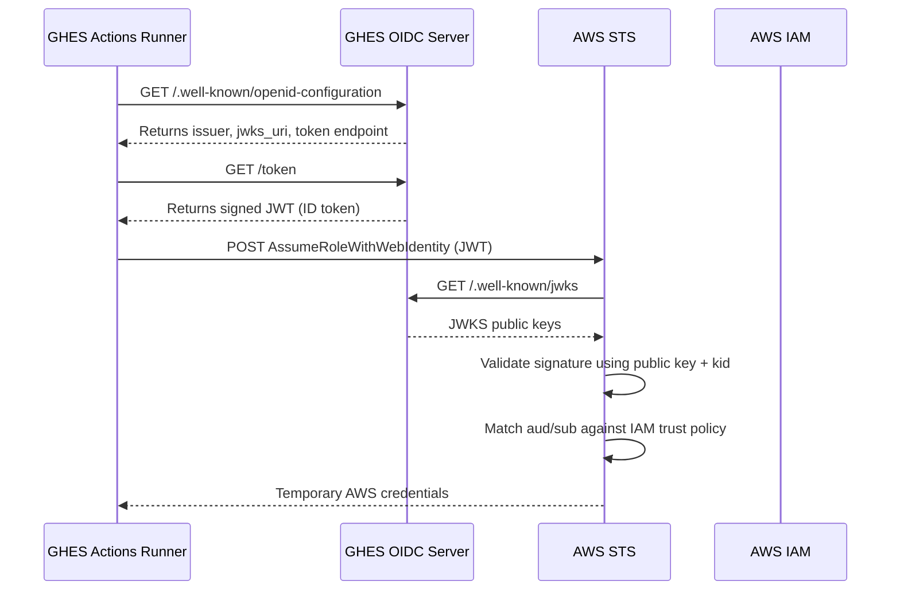

---

## 🧭 Key Differences from GitHub.com Integration

| Area                  | GitHub.com (cloud)                            | GitHub Enterprise Server (GHES)                           |
| --------------------- | --------------------------------------------- | --------------------------------------------------------- |
| OIDC Provider URL     | `https://token.actions.githubusercontent.com` | **Self-hosted GHES URL** like `https://ghes.example.com`  |
| Public Key (JWKS)     | Hosted by GitHub.com                          | **You host it** at `.well-known/jwks`                     |
| Thumbprint            | GitHub's TLS cert issuer (static SHA1)        | **Derived from your GHES TLS root CA**                    |
| Role Trust Conditions | Tied to `sub`, `aud`, etc. from GitHub.com    | Tied to **your GHES runner claims**                       |
| Setup Requirement     | Simple IAM config with GitHub's URL           | Requires full OIDC IdP setup + GHES config and secure TLS |

---

## 🏗️ Prerequisites for GHES OIDC → AWS Integration

1. ✅ GHES version **3.6 or newer**
2. ✅ **OIDC tokens enabled** in Actions
3. ✅ TLS-enabled GHES endpoint with a valid CA-signed certificate
4. ✅ Your GHES exposes:

   * `https://ghes.example.com/.well-known/openid-configuration`
   * `https://ghes.example.com/.well-known/jwks`
5. ✅ You configure **OIDC trust policy** in AWS IAM using your GHES URL

---

## 🔐 Step-by-Step Logical Flow (OIDC Federation via GHES)

Let’s now break this down:

---

### 🔁 1. GitHub Runner Requests an OIDC Token from GHES

```http
GET https://ghes.example.com/.well-known/openid-configuration
```

→ Returns metadata like:

```json
{
  "issuer": "https://ghes.example.com",
  "jwks_uri": "https://ghes.example.com/.well-known/jwks",
  "token_endpoint": "https://ghes.example.com/token"
}
```

Then:

```http
GET https://ghes.example.com/token
Authorization: Bearer [internal GHES auth]
```

→ Returns:

```json
{
  "value": "<JWT-OIDC-ID-Token>"
}
```

---

### 🔁 2. GitHub Runner Sends JWT to AWS STS

```http
POST https://sts.amazonaws.com/
Action: AssumeRoleWithWebIdentity
Params:
  RoleArn=arn:aws:iam::<account>:role/GHESOIDCRole
  WebIdentityToken=<JWT>
  RoleSessionName=ghes-runner
```

---

### 🔍 3. AWS IAM OIDC Provider Configuration (Terraform)

```hcl
resource "aws_iam_openid_connect_provider" "ghes" {
  url             = "https://ghes.example.com"
  client_id_list  = ["sts.amazonaws.com"]
  thumbprint_list = ["<sha1-thumbprint-of-ghes-root-CA>"]
}
```

> 🔹 You must calculate the SHA1 fingerprint of the **root CA cert** that signs your GHES TLS certificate:

```bash
echo | openssl s_client -servername ghes.example.com -connect ghes.example.com:443 2>/dev/null \
  | openssl x509 -fingerprint -noout -sha1 \
  | cut -d'=' -f2 | sed 's/://g'
```

---

### 🛡️ 4. IAM Role Trust Policy for GHES

```json
{
  "Version": "2012-10-17",
  "Statement": [
    {
      "Effect": "Allow",
      "Principal": {
        "Federated": "arn:aws:iam::<account>:oidc-provider/ghes.example.com"
      },
      "Action": "sts:AssumeRoleWithWebIdentity",
      "Condition": {
        "StringEquals": {
          "ghes.example.com:aud": "sts.amazonaws.com",
          "ghes.example.com:sub": "repo:secure-org/infrastructure:ref:refs/heads/main"
        }
      }
    }
  ]
}
```

---

### 📡 Signature Verification Logic (Same as GitHub.com)

* Your GHES signs JWT using its **private key**.
* The `JWT Header` includes:

  ```json
  {
    "alg": "RS256",
    "kid": "ghes-key-2025"
  }
  ```
* AWS pulls your GHES JWKS from:

  ```
  https://ghes.example.com/.well-known/jwks
  ```
* AWS verifies the signature using the matching public key based on `kid`.

---

##  (GHES → AWS OIDC)



---

## 🧠 Summary

| Component                  | Description                                                                         |
| -------------------------- | ----------------------------------------------------------------------------------- |
| GHES                       | Acts as your **OIDC identity provider**                                             |
| AWS IAM OIDC Provider      | Points to your GHES server URL with proper thumbprint                               |
| GHES JWT Token             | Signed with your **GHES private key**, claims like `sub`, `aud`, `repository`, etc. |
| AWS Signature Verification | Uses GHES **public key** from your `.well-known/jwks` endpoint                      |
| IAM Trust Policy           | Matches `aud`, `sub`, etc. in JWT to allow specific workflows to assume role        |

---
* A Terraform module scaffold for GHES OIDC integration?
* A bash script to calculate the thumbprint?
* An example `.well-known/jwks` config for GHES OIDC key rotation?

Let me know — I can provide production-ready code or scripts to match.
