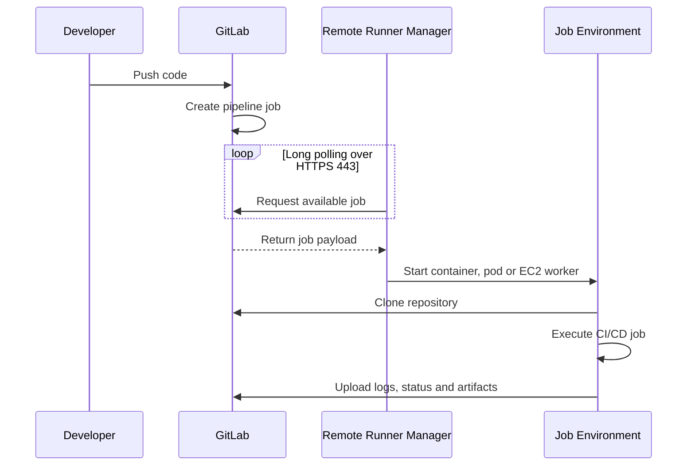
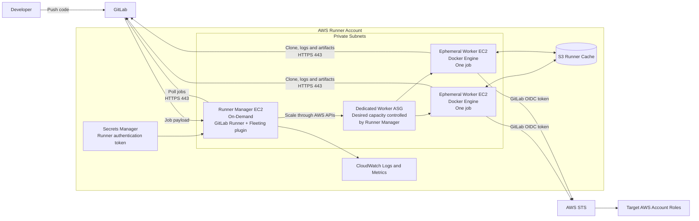
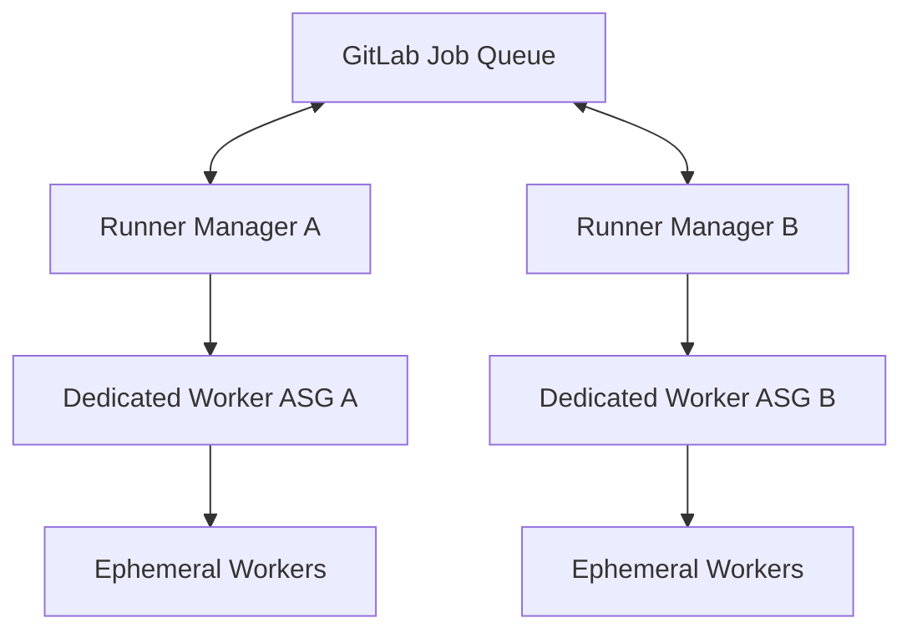
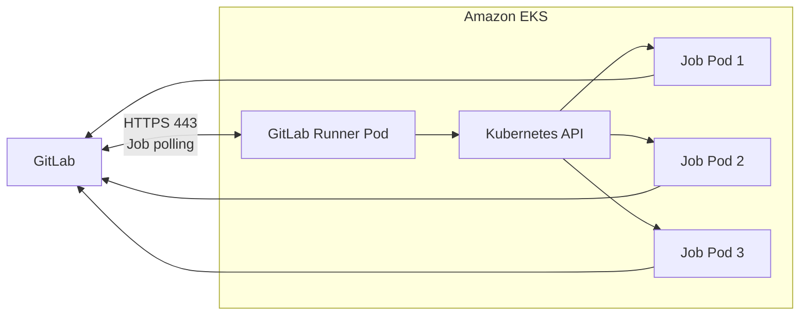
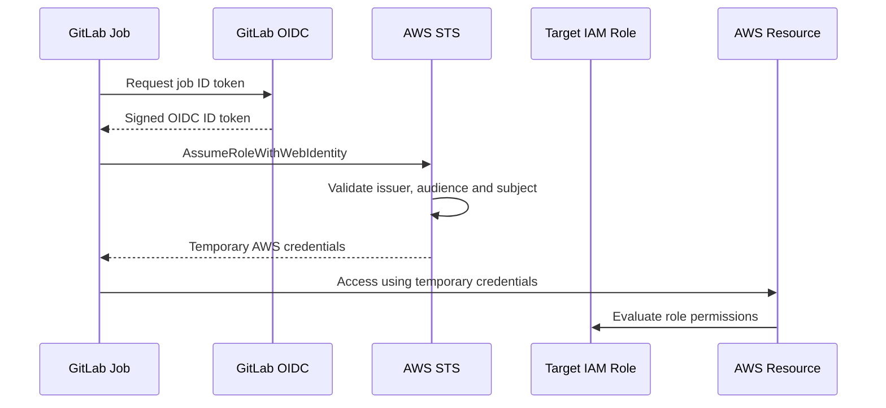

## Yes—GitLab runners can be remote

A GitLab Runner does **not** need to run on the GitLab server. It can run:

* In an AWS account or VPC
* In AWS GovCloud
* On premises
* In another cloud
* On EC2, EKS, ECS/Fargate, or even a developer workstation

The runner initiates the communication. It continuously polls GitLab for jobs, generally over outbound HTTPS port 443. GitLab does not normally initiate an inbound connection to the runner. ([GitLab Docs][1])



Unless you enable special features such as interactive web terminals, the basic network requirement is usually:

| Initiator      | Destination                 |          Port | Purpose                             |
| -------------- | --------------------------- | ------------: | ----------------------------------- |
| Runner         | GitLab                      |       TCP 443 | Poll jobs, update status, artifacts |
| Runner/worker  | GitLab repository           | TCP 443 or 22 | Clone and fetch source              |
| Runner manager | AWS APIs                    |       TCP 443 | Create and terminate EC2 workers    |
| Worker         | Package repositories/ECR/S3 |       TCP 443 | Download dependencies and images    |
| Worker         | AWS STS                     |       TCP 443 | Obtain temporary AWS credentials    |

## How runners register with GitLab

Registration links the runner installation with an **instance, group, or project runner configuration**.

### Runner scopes

| Scope           | Available to                                   | Typical use                               |
| --------------- | ---------------------------------------------- | ----------------------------------------- |
| Instance runner | All projects on a self-managed GitLab instance | General enterprise builds                 |
| Group runner    | Projects under one GitLab group                | Team or business-unit runners             |
| Project runner  | Selected project or projects                   | Sensitive deployment or specialized build |

GitLab currently recommends creating the runner configuration first and registering with a **runner authentication token**, normally prefixed with `glrt-`. The older registration-token workflow is deprecated. ([GitLab Docs][2])

### UI workflow

For a project runner:

1. Open the project.
2. Go to **Settings → CI/CD**.
3. Expand **Runners**.
4. Select **Create project runner**.
5. Configure tags, protection and whether untagged jobs are allowed.
6. GitLab displays the registration command and temporary `glrt-` authentication token. ([GitLab Docs][2])

For a group runner, use **Group → Build → Runners → Create group runner**.

For an instance runner, use **Admin → CI/CD → Runners → Create instance runner**.

### Install and register the runner

Install GitLab Runner on the runner-manager EC2 instance and run:

```bash
sudo gitlab-runner register \
  --non-interactive \
  --url "https://gitlab.example.com/" \
  --token "$RUNNER_TOKEN" \
  --executor "docker" \
  --docker-image "alpine:latest" \
  --description "aws-runner-manager"
```

The command writes the configuration, including the authentication token, into:

```text
/etc/gitlab-runner/config.toml
```

The runner service then starts polling GitLab for jobs. ([GitLab Docs][1])

For production automation, create the runner through the GitLab UI or API, store the `glrt-` token in AWS Secrets Manager, and have the runner manager retrieve it at startup. Do not bake the token into an AMI, Terraform state or plaintext EC2 user data.

---

# Recommended AWS production architecture

## Best default: EC2 manager plus ephemeral EC2 workers

Unless you already operate EKS, the best balance of speed, security and production readiness is:

> **One small On-Demand EC2 runner manager using the Docker Autoscaler executor, with a dedicated EC2 Auto Scaling group that creates temporary worker instances.**

The runner manager stays online and registered with GitLab. When GitLab gives it a job, the manager increases the worker Auto Scaling group, assigns the job to an EC2 worker and terminates or reuses the worker according to policy. GitLab’s current Docker Autoscaler and Instance executors use the Fleeting architecture and support AWS Auto Scaling groups. ([GitLab Docs][3])



## Why this is the recommended design

### Runner manager

Use a small, stable EC2 instance:

* On-Demand, not Spot
* Private subnet
* No public IP
* No inbound SSH
* Managed through AWS Systems Manager
* Instance profile limited to managing its dedicated worker ASG
* GitLab Runner and the AWS Fleeting plugin installed

GitLab specifically recommends that the runner-manager instance not be a Spot instance. ([GitLab Docs][4])

### Worker Auto Scaling group

Use a dedicated ASG with:

* Minimum/desired capacity of zero or a small warm capacity
* Maximum capacity based on permitted job concurrency
* A hardened immutable AMI
* Docker Engine installed
* Instance scale-in protection enabled
* No normal AWS deployment permissions
* One job per instance for stronger isolation
* Automatic replacement after the job

For Docker Autoscaler workers, the AMI needs Docker Engine, but it does not need to register itself as a GitLab runner. The manager is the registered component. GitLab also requires each Docker Autoscaler configuration to use its own dedicated ASG. ([GitLab Docs][3])

### High availability

For manager redundancy, deploy:

```text
Runner Manager A → Dedicated Worker ASG A
Runner Manager B → Dedicated Worker ASG B
```

Do not have two runner managers control the same ASG. GitLab warns that multiple managers controlling one autoscaling resource can cause conflicting scaling operations, failed jobs and unexpected cost. ([GitLab Docs][3])



---

# When EKS is the better choice

When your organization already has a production EKS platform, deploy the official GitLab Runner Helm chart with the Kubernetes executor.

The runner controller polls GitLab and creates a new Kubernetes pod for each CI/CD job. ([GitLab Docs][5])



Use EKS when:

* You already operate and secure EKS.
* Most builds are container-based.
* You want a pod per job.
* You need Kubernetes scheduling, quotas and namespaces.
* You have enough volume to justify the cluster overhead.

Do not create EKS only for a small runner deployment unless Kubernetes is already part of your platform strategy. The EC2 autoscaler pattern has fewer infrastructure components.

---

# Options compared

| AWS design                            |  Deployment simplicity | Isolation |   Scaling | Recommendation                  |
| ------------------------------------- | ---------------------: | --------: | --------: | ------------------------------- |
| Single EC2 with Shell executor        |                Highest |       Low |    Manual | Testing only                    |
| Single EC2 with Docker executor       |                   High |    Medium |   Limited | Small trusted workloads         |
| EC2 manager + Docker Autoscaler + ASG |                   High |      High | Automatic | **Recommended default**         |
| EKS + official Helm chart             | Medium when EKS exists |      High | Automatic | Best for existing EKS platforms |
| ECS/Fargate custom executor           |                  Lower |      High | Automatic | Specialized use cases           |

Fargate is possible, but GitLab’s documented implementation uses a custom executor, an EC2 runner manager and SSH communication with the Fargate task. GitLab also notes possible limitations for high disk, network or compute workloads. It is therefore usually not the fastest production implementation. ([GitLab Docs][6])

---

# Secure AWS access from pipeline jobs

Do not grant broad AWS permissions to the runner-manager or worker EC2 instance profile.

Instead:

1. Configure GitLab as an AWS IAM OIDC provider.
2. Create IAM roles in the target AWS accounts.
3. Restrict each role by GitLab project, branch, tag or environment.
4. Have the CI/CD job obtain temporary credentials using `sts:AssumeRoleWithWebIdentity`.

GitLab recommends ID tokens and OIDC for AWS access because jobs receive short-lived credentials instead of stored AWS access keys. ([GitLab Docs][7])



For a private, self-managed GitLab instance, the runners can communicate with GitLab privately. However, AWS OIDC normally needs access to GitLab’s OIDC discovery and public-key endpoints. GitLab documents a supported publishing workaround for non-public GitLab instances, but it requires careful protection of the published discovery and JWKS files. ([GitLab Docs][7])

## Final recommendation

For a new AWS deployment without an existing EKS platform:

> **Deploy an On-Demand EC2 runner manager in private subnets, configure the Docker Autoscaler executor with the AWS Fleeting plugin, and create a dedicated ASG of ephemeral workers. Use S3 caching, Systems Manager administration, Secrets Manager for the runner token and GitLab OIDC for access to target AWS accounts.**

Use separate runner pools and tags such as:

```text
linux-build
container-build
security-scan
nonprod-deploy
production-deploy
```

Keep production deployment runners project-scoped or group-scoped, protected, and separated from general untrusted build workloads.

[1]: https://docs.gitlab.com/runner/register/ "Registering runners | GitLab Docs"
[2]: https://docs.gitlab.com/ci/runners/runners_scope/ "Manage runners | GitLab Docs"
[3]: https://docs.gitlab.com/runner/executors/docker_autoscaler/ "Docker Autoscaler executor | GitLab Docs"
[4]: https://docs.gitlab.com/runner/runner_autoscale/gitlab-runner-autoscaler/ "GitLab Runner instance group autoscaler | GitLab Docs"
[5]: https://docs.gitlab.com/runner/install/kubernetes/ "GitLab Runner Helm chart | GitLab Docs"
[6]: https://docs.gitlab.com/runner/configuration/runner_autoscale_aws_fargate/ "Autoscaling GitLab CI on AWS Fargate | GitLab Docs"
[7]: https://docs.gitlab.com/ci/cloud_services/aws/?utm_source=chatgpt.com "Configure OpenID Connect in AWS to retrieve temporary credentials | GitLab Docs"
