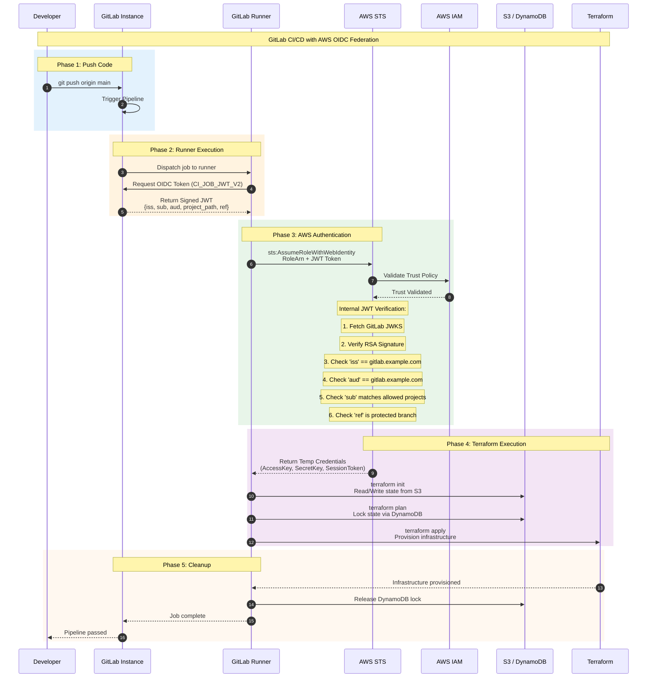

I'll explain the complete GitLab ↔ AWS OIDC federation setup for Terraform-based infrastructure provisioning via GitLab CI/CD. This follows the same OIDC principles we discussed earlier, but adapted for GitLab's specific implementation.

---

## Architecture Overview

```mermaid
graph TB
    subgraph "GitLab Instance (Self-Hosted)"
        GL[GitLab Server<br/>gitlab.example.com]
        RUNNER[GitLab Runner<br/>Docker/K8s/Shell]
        CI[.gitlab-ci.yml<br/>Terraform Pipeline]
    end
    
    subgraph "AWS Cloud"
        OIDP[AWS IAM OIDC Provider<br/>Trusts GitLab]
        ROLE[IAM Role<br/>Terraform Execution Role]
        S3[S3 Backend<br/>State Storage]
        DDB[DynamoDB<br/>State Lock]
        TF[Terraform<br/>Infrastructure]
    end
    
    GL -->|1. Pipeline Trigger| RUNNER
    RUNNER -->|2. Request OIDC Token| GL
    GL -->|3. Signed JWT<br/>{iss, sub, aud, ref, project}| RUNNER
    RUNNER -->|4. sts:AssumeRoleWithWebIdentity<br/>+ JWT| OIDP
    OIDP -->|5. Verify JWT<br/>Validate Trust Policy| OIDP
    OIDP -->|6. Temp AWS Credentials| RUNNER
    RUNNER -->|7. terraform init / plan / apply| S3
    RUNNER -->|7. terraform init / plan / apply| DDB
    RUNNER -->|7. terraform init / plan / apply| TF
    
    style GL fill:#e3f2fd
    style OIDP fill:#fff3e0
    style ROLE fill:#e8f5e9
```

---

## Key Difference: GitLab vs GitHub OIDC

| Aspect | GitHub | GitLab |
|--------|--------|--------|
| **Issuer URL** | `https://token.actions.githubusercontent.com` | `https://gitlab.example.com` (self-hosted) or `https://gitlab.com` |
| **JWT Audience (`aud`)** | `sts.amazonaws.com` | Configurable (e.g., `https://gitlab.example.com`) |
| **Subject (`sub`) Claim** | `repo:org/repo:ref:refs/heads/main` | `project_path:mygroup/myproject:ref_type:branch:ref:main` |
| **Token Request** | `ACTIONS_ID_TOKEN_REQUEST_URL` | `CI_JOB_JWT` or `CI_JOB_JWT_V2` (GitLab 15.9+) |
| **ID Token Variable** | `ACTIONS_ID_TOKEN_REQUEST_TOKEN` | Built into `CI_JOB_JWT_V2` |

---

## Step 1: GitLab Instance Configuration

### 1.1 Enable OIDC Token Generation (GitLab Admin)

On your **self-hosted GitLab instance**, OIDC tokens for CI/CD are available by default in modern versions (15.9+). Verify/enforce:

```bash
# gitlab.rb configuration (if needed)
# Typically no changes needed for self-hosted — OIDC tokens are built-in
# The token is automatically available as CI_JOB_JWT_V2
```

### 1.2 GitLab Runner Configuration

Your runner needs to be able to access the GitLab instance to get the OIDC token. No special OIDC config on the runner itself — the token is injected by GitLab into the job environment.

```toml
# /etc/gitlab-runner/config.toml (example for Docker executor)
[[runners]]
  url = "https://gitlab.example.com/"
  token = "YOUR_RUNNER_TOKEN"
  executor = "docker"
  [runners.docker]
    image = "hashicorp/terraform:1.9"
    privileged = false
    volumes = ["/cache"]
```

### 1.3 Repository-Level: `.gitlab-ci.yml`

This is where the magic happens. You request the OIDC token and exchange it for AWS credentials.

```yaml
# .gitlab-ci.yml
variables:
  AWS_REGION: "us-east-1"
  TF_ROOT: "${CI_PROJECT_DIR}/terraform"
  TF_ADDRESS: "https://gitlab.example.com/api/v4/projects/${CI_PROJECT_ID}/terraform/state/default"
  # For S3 backend instead of GitLab-managed state:
  TF_BACKEND_S3_BUCKET: "mycompany-terraform-state"
  TF_BACKEND_DYNAMODB_TABLE: "terraform-state-lock"

# OIDC Token is automatically available as CI_JOB_JWT_V2 in GitLab 15.9+
# For older versions, use CI_JOB_JWT (v1)

stages:
  - validate
  - plan
  - apply

# =============================================================================
# TEMPLATE: AWS OIDC Authentication
# =============================================================================
.aws_oidc_auth:
  id_tokens:
    OIDC_TOKEN:
      aud: "https://gitlab.example.com"  # Must match AWS OIDC Provider audience
  before_script:
    # Install AWS CLI if not in image
    - apk add --no-cache aws-cli 2>/dev/null || apt-get update && apt-get install -y awscli 2>/dev/null || true
    
    # Exchange GitLab OIDC token for AWS temp credentials
    - >
      export AWS_ROLE_ARN="arn:aws:iam::123456789012:role/gitlab-terraform-role"
      
      AWS_CREDENTIALS=$(aws sts assume-role-with-web-identity \
        --role-arn "${AWS_ROLE_ARN}" \
        --role-session-name "gitlab-${CI_PROJECT_ID}-${CI_PIPELINE_ID}" \
        --web-identity-token "${OIDC_TOKEN}" \
        --duration-seconds 3600 \
        --region ${AWS_REGION})
      
      export AWS_ACCESS_KEY_ID=$(echo $AWS_CREDENTIALS | jq -r '.Credentials.AccessKeyId')
      export AWS_SECRET_ACCESS_KEY=$(echo $AWS_CREDENTIALS | jq -r '.Credentials.SecretAccessKey')
      export AWS_SESSION_TOKEN=$(echo $AWS_CREDENTIALS | jq -r '.Credentials.SessionToken')
      
      echo "AWS credentials obtained successfully"
      aws sts get-caller-identity

# =============================================================================
# STAGE: VALIDATE
# =============================================================================
validate:
  stage: validate
  extends: .aws_oidc_auth
  image: hashicorp/terraform:1.9
  script:
    - cd ${TF_ROOT}
    - terraform fmt -check=true
    - terraform validate
  rules:
    - if: $CI_PIPELINE_SOURCE == "merge_request_event"
    - if: $CI_COMMIT_BRANCH == "main"

# =============================================================================
# STAGE: PLAN
# =============================================================================
plan:
  stage: plan
  extends: .aws_oidc_auth
  image: hashicorp/terraform:1.9
  script:
    - cd ${TF_ROOT}
    - |
      terraform init \
        -backend-config="bucket=${TF_BACKEND_S3_BUCKET}" \
        -backend-config="key=${CI_PROJECT_PATH}/${CI_ENVIRONMENT_NAME}/terraform.tfstate" \
        -backend-config="region=${AWS_REGION}" \
        -backend-config="dynamodb_table=${TF_BACKEND_DYNAMODB_TABLE}" \
        -backend-config="encrypt=true"
    - terraform plan -out=tfplan
  artifacts:
    paths:
      - ${TF_ROOT}/tfplan
    expire_in: 1 week
  rules:
    - if: $CI_PIPELINE_SOURCE == "merge_request_event"
    - if: $CI_COMMIT_BRANCH == "main"

# =============================================================================
# STAGE: APPLY (Protected)
# =============================================================================
apply:
  stage: apply
  extends: .aws_oidc_auth
  image: hashicorp/terraform:1.9
  script:
    - cd ${TF_ROOT}
    - |
      terraform init \
        -backend-config="bucket=${TF_BACKEND_S3_BUCKET}" \
        -backend-config="key=${CI_PROJECT_PATH}/${CI_ENVIRONMENT_NAME}/terraform.tfstate" \
        -backend-config="region=${AWS_REGION}" \
        -backend-config="dynamodb_table=${TF_BACKEND_DYNAMODB_TABLE}" \
        -backend-config="encrypt=true"
    - terraform apply -auto-approve tfplan
  dependencies:
    - plan
  environment:
    name: production
  rules:
    - if: $CI_COMMIT_BRANCH == "main"
      when: manual  # Require manual approval for apply
```

---

## Step 2: AWS Side — Terraform Configuration

### 2.1 IAM OIDC Provider for GitLab

```hcl
# terraform/modules/gitlab_oidc/main.tf

# =============================================================================
# AWS IAM OIDC Provider for GitLab
# =============================================================================

variable "gitlab_url" {
  description = "URL of your self-hosted GitLab instance"
  type        = string
  default     = "https://gitlab.example.com"
}

variable "thumbprint_list" {
  description = "TLS certificate thumbprint of GitLab instance"
  type        = list(string)
  default     = []  # Will be auto-computed if empty
}

# Get the TLS certificate thumbprint from GitLab
data "tls_certificate" "gitlab" {
  url = "${var.gitlab_url}/oauth/discovery/keys"
}

locals {
  gitlab_thumbprints = length(var.thumbprint_list) > 0 ? var.thumbprint_list : [
    for cert in data.tls_certificate.gitlab.certificates : cert.sha1_fingerprint
  ]
}

resource "aws_iam_openid_connect_provider" "gitlab" {
  url = var.gitlab_url

  client_id_list = [
    var.gitlab_url,  # The 'aud' claim in GitLab's JWT
    "sts.amazonaws.com"  # Also accept AWS STS as audience
  ]

  thumbprint_list = local.gitlab_thumbprints

  tags = {
    Name        = "gitlab-oidc-provider"
    Description = "OIDC provider for GitLab CI/CD federation"
  }
}

output "oidc_provider_arn" {
  value = aws_iam_openid_connect_provider.gitlab.arn
}
```

### 2.2 IAM Role with Trust Policy for GitLab

```hcl
# terraform/modules/gitlab_oidc/iam_role.tf

# =============================================================================
# IAM Role for Terraform Execution from GitLab
# =============================================================================

variable "allowed_projects" {
  description = "List of GitLab project paths allowed to assume this role"
  type        = list(string)
  default     = ["mygroup/myproject"]
}

variable "allowed_refs" {
  description = "List of Git refs (branches/tags) allowed"
  type        = list(string)
  default     = ["refs/heads/main", "refs/heads/develop"]
}

variable "allowed_environments" {
  description = "List of GitLab environments allowed"
  type        = list(string)
  default     = ["production", "staging"]
}

# The IAM Role that GitLab CI will assume
resource "aws_iam_role" "gitlab_terraform" {
  name = "gitlab-terraform-role"
  path = "/ci-cd/"

  assume_role_policy = jsonencode({
    Version = "2012-10-17"
    Statement = [
      {
        Effect = "Allow"
        Principal = {
          Federated = aws_iam_openid_connect_provider.gitlab.arn
        }
        Action = "sts:AssumeRoleWithWebIdentity"
        Condition = {
          # Verify the JWT was issued by your GitLab instance
          StringEquals = {
            "${var.gitlab_url}:aud" = var.gitlab_url
          }
          
          # Restrict which GitLab projects can assume this role
          # The 'sub' claim format: project_path:GROUP/PROJECT:ref_type:TYPE:ref:REF
          StringLike = {
            "${var.gitlab_url}:sub" = [
              for project in var.allowed_projects : "project_path:${project}:ref_type:branch:ref:*"
            ]
          }
          
          # Optional: Restrict to specific environments
          # This requires GitLab Premium (environment-specific tokens)
          # StringEquals = {
          #   "${var.gitlab_url}:environment" = var.allowed_environments
          # }
        }
      }
    ]
  })

  tags = {
    Name        = "gitlab-terraform-role"
    Description = "Role for Terraform execution from GitLab CI/CD"
  }
}

# =============================================================================
# IAM Policy: Terraform Execution Permissions
# =============================================================================

resource "aws_iam_role_policy" "terraform_execution" {
  name = "terraform-execution-policy"
  role = aws_iam_role.gitlab_terraform.id

  policy = jsonencode({
    Version = "2012-10-17"
    Statement = [
      {
        Sid    = "TerraformStateAccess"
        Effect = "Allow"
        Action = [
          "s3:GetObject",
          "s3:PutObject",
          "s3:ListBucket"
        ]
        Resource = [
          "arn:aws:s3:::mycompany-terraform-state",
          "arn:aws:s3:::mycompany-terraform-state/*"
        ]
      },
      {
        Sid    = "TerraformStateLock"
        Effect = "Allow"
        Action = [
          "dynamodb:GetItem",
          "dynamodb:PutItem",
          "dynamodb:DeleteItem"
        ]
        Resource = "arn:aws:dynamodb:*:*:table/terraform-state-lock"
      },
      {
        Sid    = "EC2Management"
        Effect = "Allow"
        Action = [
          "ec2:*"
        ]
        Resource = "*"
        Condition = {
          StringEquals = {
            "aws:RequestedRegion" = ["us-east-1"]
          }
        }
      },
      {
        Sid    = "IAMManagement"
        Effect = "Allow"
        Action = [
          "iam:CreateRole",
          "iam:DeleteRole",
          "iam:PutRolePolicy",
          "iam:DeleteRolePolicy",
          "iam:GetRole",
          "iam:ListRoles",
          "iam:AttachRolePolicy",
          "iam:DetachRolePolicy",
          "iam:PassRole"
        ]
        Resource = "*"
      },
      # Add more permissions as needed for your infrastructure
      {
        Sid    = "ReadOnlyForPlanning"
        Effect = "Allow"
        Action = [
          "sts:GetCallerIdentity"
        ]
        Resource = "*"
      }
    ]
  })
}

output "role_arn" {
  value = aws_iam_role.gitlab_terraform.arn
}
```

### 2.3 S3 Backend + DynamoDB Lock Table

```hcl
# terraform/backend/main.tf

# =============================================================================
# Terraform State Backend Infrastructure
# =============================================================================

resource "aws_s3_bucket" "terraform_state" {
  bucket = "mycompany-terraform-state"
  
  lifecycle {
    prevent_destroy = true
  }

  tags = {
    Name = "terraform-state"
  }
}

resource "aws_s3_bucket_versioning" "terraform_state" {
  bucket = aws_s3_bucket.terraform_state.id
  versioning_configuration {
    status = "Enabled"
  }
}

resource "aws_s3_bucket_server_side_encryption_configuration" "terraform_state" {
  bucket = aws_s3_bucket.terraform_state.id
  rule {
    apply_server_side_encryption_by_default {
      sse_algorithm = "aws:kms"
    }
  }
}

resource "aws_s3_bucket_public_access_block" "terraform_state" {
  bucket = aws_s3_bucket.terraform_state.id
  block_public_acls       = true
  block_public_policy     = true
  ignore_public_acls      = true
  restrict_public_buckets = true
}

resource "aws_dynamodb_table" "terraform_lock" {
  name         = "terraform-state-lock"
  billing_mode = "PAY_PER_REQUEST"
  hash_key     = "LockID"

  attribute {
    name = "LockID"
    type = "S"
  }

  tags = {
    Name = "terraform-state-lock"
  }
}
```

---

## Step 3: Complete Trust Policy Deep Dive

### Understanding GitLab's JWT Claims

When GitLab issues an OIDC token (`CI_JOB_JWT_V2`), the payload looks like:

```json
{
  "iss": "https://gitlab.example.com",
  "sub": "project_path:mygroup/myproject:ref_type:branch:ref:main",
  "aud": "https://gitlab.example.com",
  "exp": 1721500000,
  "iat": 1721499400,
  "namespace_id": "123",
  "namespace_path": "mygroup",
  "project_id": "456",
  "project_path": "mygroup/myproject",
  "user_id": "789",
  "user_login": "developer",
  "user_email": "dev@example.com",
  "pipeline_id": "1000",
  "job_id": "2000",
  "ref": "main",
  "ref_type": "branch",
  "ref_protected": "true"
}
```

### AWS Trust Policy Conditions Explained

```hcl
Condition = {
  # 1. AUDIENCE CHECK: Verify token was issued for this GitLab instance
  StringEquals = {
    "https://gitlab.example.com:aud" = "https://gitlab.example.com"
  }
  
  # 2. PROJECT RESTRICTION: Only specific repos can assume this role
  StringLike = {
    "https://gitlab.example.com:sub" = [
      "project_path:mygroup/infrastructure:ref_type:branch:ref:*",
      "project_path:mygroup/another-project:ref_type:branch:ref:main"
    ]
  }
  
  # 3. (Optional) BRANCH RESTRICTION: Only protected branches
  StringEquals = {
    "https://gitlab.example.com:ref_protected" = "true"
  }
  
  # 4. (Optional) ENVIRONMENT RESTRICTION: GitLab Premium feature
  StringEquals = {
    "https://gitlab.example.com:environment" = "production"
  }
}
```

---

## Step 4: The Complete Flow (Sequence Diagram)



---

## Step 5: Security Hardening Checklist

| Layer | Configuration | Why It Matters |
|-------|--------------|--------------|
| **GitLab** | Enable `ref_protected` check in trust policy | Prevents feature branches from deploying to prod |
| **GitLab** | Use `environment` claim (Premium) | Restricts production access to specific GitLab environments |
| **GitLab** | Set `id_tokens` `aud` explicitly | Prevents token reuse across different OIDC providers |
| **AWS** | Short session duration (1 hour max) | Limits blast radius of compromised credentials |
| **AWS** | Least-privilege IAM policy | Terraform role only gets permissions it needs |
| **AWS** | S3 bucket encryption + versioning | Protects state files from tampering |
| **AWS** | DynamoDB state locking | Prevents concurrent terraform runs |
| **Pipeline** | `when: manual` for apply stage | Requires human approval for infrastructure changes |
| **Pipeline** | Separate plan/apply stages | Review plan before applying |

---

## Quick Reference: Files Summary

| File | Location | Purpose |
|------|----------|---------|
| `.gitlab-ci.yml` | GitLab repo root | Pipeline definition, OIDC token request, AWS auth |
| `terraform/modules/gitlab_oidc/` | Infrastructure repo | AWS OIDC Provider + IAM Role (Terraform) |
| `terraform/backend/` | Infrastructure repo | S3 bucket + DynamoDB table for state |
| `terraform/main.tf` | Infrastructure repo | Your actual infrastructure code |

---

## Troubleshooting Common Issues

| Problem | Cause | Solution |
|---------|-------|----------|
| `InvalidIdentityToken` | Thumbprint mismatch | Update `thumbprint_list` with current GitLab cert |
| `AccessDenied` on AssumeRole | Trust policy `sub` mismatch | Verify `project_path` exactly matches GitLab |
| `AccessDenied` on S3 | IAM policy missing permissions | Add `s3:*` for state bucket to role policy |
| Token not available | GitLab version < 15.9 | Upgrade GitLab or use `CI_JOB_JWT` (v1) |
| `aud` claim mismatch | `id_tokens.aud` ≠ AWS trust policy | Ensure both use same URL (with/without `https://`) |

---

## Bottom Line

The GitLab ↔ AWS OIDC setup mirrors GitHub's pattern but with three key differences:
1. **Issuer is your GitLab URL** (not `token.actions.githubusercontent.com`)
2. **`aud` claim is configurable** in `.gitlab-ci.yml` `id_tokens` block
3. **`sub` claim uses `project_path:` prefix** instead of `repo:`

The AWS side (OIDC Provider, IAM Role, Trust Policy with conditions) works identically — JWT signature verification via JWKS, claims validation, and temporary credential issuance.
