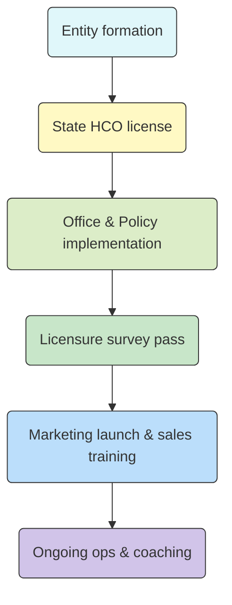

---

## 1  |  Business-Formation Package

| Item                                                 | What 21st Century does                                                                 | What you still do                                |
| ---------------------------------------------------- | -------------------------------------------------------------------------------------- | ------------------------------------------------ |
| **Articles of Incorporation / Organization**         | Drafts and files with the Virginia State Corporation Commission (SCC).                 | Pick a business name, pay SCC filing fee.        |
| **By-laws / Operating Agreement**                    | Provides a lawyer-vetted template customized with your officers or members.            | Sign and store in corporate records book.        |
| **IRS Form SS-4 & EIN**                              | Prepares and e-files the application; you receive EIN same day.                        | Use EIN for bank account, payroll, taxes.        |
| **I\&A (Identity & Access) Management registration** | Creates your CMS I\&A and PECOS accounts so you can later enroll in Medicare/Medicaid. | Safeguard login and MFA devices.                 |
| **National Provider Identifier (NPI)**               | Completes the NPPES application and links it to your new LLC / Corp.                   | Update taxonomy codes if you add services later. |

*Value:* eliminates early legal/IRS mis-steps and gives you the identifiers every payer will ask for.  ([21st Century Healthcare Consultants][1])

---

## 2  |  Virginia HCO Licensing Workflow

| Milestone                                    | Consultant deliverable                                                                                                                         | Your role                                                                |
| -------------------------------------------- | ---------------------------------------------------------------------------------------------------------------------------------------------- | ------------------------------------------------------------------------ |
| **State application preparation**            | Builds the full binder: organizational chart, job descriptions, sample in-service log, training plan, Letter of Intent, governing-body roster. | Supply résumés, choose job titles, sign forms, pay \$500 VDH fee.        |
| **Application omissions**                    | Drafts responses/corrections if the VDH analyst flags missing items.                                                                           | Provide clarifications or extra documents promptly.                      |
| **Office set-up review**                     | Virtual walk-through of their checklist (signage, postings, locked file storage, emergency plan, basic supplies).                              | Lease office, buy furniture/equipment, hang posters.                     |
| **Policy review & client-admission dry-run** | Two-way screen-share session to show where each required policy lives and how to complete the admission packet.                                | Attend the session; practice completing a mock admission.                |
| **Licensure survey prep**                    | Up to 4 hrs of RN/administrator coaching before the on-site inspection; focuses on Virginia-specific survey hot spots.                         | Ensure two employee files per discipline are complete; rehearse answers. |

*Value:* 21st Century assembles a license-ready submission and coaches you so the VDH surveyor finds your files, policies, and office in perfect order.  ([A2Zinc][2])

---

## 3  |  Marketing & Brand Launch

| Deliverable                            | Scope notes                                                                                                                                                                                          |
| -------------------------------------- | ---------------------------------------------------------------------------------------------------------------------------------------------------------------------------------------------------- |
| **Website + 1-yr domain & hosting**    | Uses a standard template you populate via an intake form (text & images can be swapped; custom layout/coding is extra). Domain is registered in their bundle so wait before purchasing one yourself. |
| **Business cards & brochures**         | Visually aligned with the website; editable design files are handed off after proof approval.                                                                                                        |
| **Marketeer & Sales Coaching Program** | Library of referral-source scripts, flyer templates, and live coaching calls.                                                                                                                        |
| **Digital Marketing Coaching**         | Tutorials for Google Business Profile, SEO basics, paid social ads, reputation-management playbook.                                                                                                  |
| **BONUS – “HomeCareSales Fast-Track”** | Self-paced video course + proven “high-performance sales” scripts to kick-start lead generation.                                                                                                     |

*Why it matters:* home-care margins depend on caregiver utilisation. A sales toolkit on day 1 shortens the time between licensure and positive cashflow.

---

## 4  |  Training & Ongoing Education

| Program                          | What you get                                                                                                                                                |
| -------------------------------- | ----------------------------------------------------------------------------------------------------------------------------------------------------------- |
| **Home-Care Boot Camp**          | Three-day in-person workshop (you can send two people, three times over the first year). Covers operations, compliance, marketing, scheduling, QA, and EVV. |
| **Home-Care University**         | On-demand video portal; good for annual in-service hours and new-hire orientation.                                                                          |
| **Business-Management Coaching** | Templates for budgets, pro-formas, KPI dashboards, succession planning; monthly strategy calls.                                                             |

These satisfy the Virginia requirement for a *structured* ongoing education program and help you hit DMAS’s 12-hour annual in-service for attendants.

---

## 5  |  Clinical / Compliance Document Bundle

*Hundreds of ready-to-use forms and manuals including:*

* Policy-change log, HIPAA privacy notices, Emergency Preparedness Plan (EPP).
* Staff competency check-offs, background-check & TB forms.
* Client admission packet (consents, advance directives, service agreement, rights booklet).
* QAPI forms, incident logs, SDS sheets, binder set-up instructions.

**Polsinelli-branded bonuses**

* **HR Starter Kit** – compliant employment application, handbook inserts, wage-and-hour guides.
* **State-specific Home-Care Policies & Procedures Manual** – lawyer-vetted and cross-referenced to Virginia’s 12VAC 5-381 citations.

Polsinelli is a national healthcare law firm; these extras reduce legal review time and show surveyors your materials tie directly to state code.  ([Cal AHS Home][3])

---

## 6  |  How the Pieces Fit Together

*21st Century walks you through each block; your pace depends on how quickly you supply documents, finish hiring, and schedule survey dates.*

---

### Quick Reality-Check Before You Sign

1. **Clarify scope creep** – ask for a written schedule of *what is billable* if revisions exceed the included hours (e.g., extra website customisation, additional survey coaching).
2. **Timeline guarantees** – get target durations in writing (entity formation ≈ 1 wk, license packet ≈ 4-6 wks once you deliver résumés, survey pass rate, etc.).
3. **Post-launch support window** – confirm how long you retain access to consultants after opening (many items are “lifetime,” others renew annually).
4. **Local market due-diligence** – the package is national; wage surveys, competitor pricing, and caregiver supply analysis in *Virginia* are still on you.

---

**Bottom line:** the list you received is essentially a “turn-key non-medical home-care agency” kit—combining legal formation, Virginia licensure prep, clinical/HR documents, and go-to-market coaching. 21st Century supplies the templates, filings, and expert hand-holding; you supply the leadership, capital, and day-to-day execution.

[1]: https://homehealthcareconsultants.com/?utm_source=chatgpt.com "Start a Home Care Business Today | 21st Health Care Consultants"
[2]: https://s23.a2zinc.net/clients/NAHC/NAHCEXPO24/Public/eBooth.aspx?BoothID=107450&FromPage=Exhibitors.aspx&IndexInList=0&ListByBooth=true&ParentBoothID=&utm_source=chatgpt.com "21st Century Health Care Consultants - 2024 Home Care ..."
[3]: https://www.cahsah.org/member-directory/twenty-first-century-health-care-consultants-inc?utm_source=chatgpt.com "Twenty First Century Health Care Consultants, Inc."
