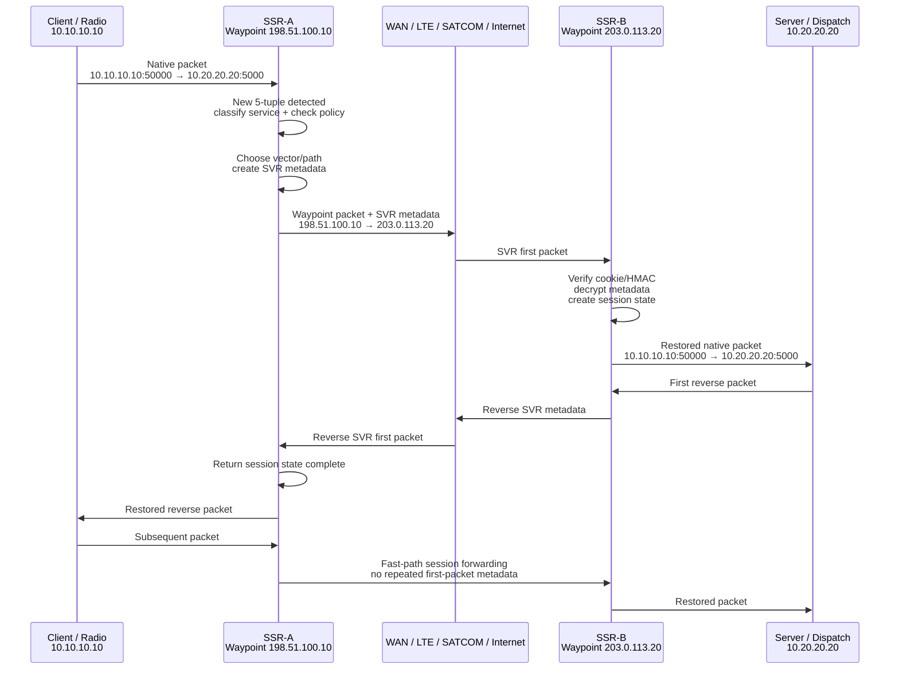

## Example topology

```text
Radio / Client A:     10.10.10.10
Dispatch / Server B:  10.20.20.20

SSR-A LAN side:       10.10.10.1
SSR-A WAN waypoint:   198.51.100.10

SSR-B WAN waypoint:   203.0.113.20
SSR-B LAN side:       10.20.20.1
```

Application traffic:

```text
10.10.10.10:50000  →  10.20.20.20:5000 UDP
```

Maybe this is Radio-over-IP, RTP, serial-over-IP, or some custom UDP protocol that does **not** support TLS.

---

# 1. Normal packet reaches SSR-A

The client/radio sends a normal packet:

```text
Original packet from device:

Src IP:     10.10.10.10
Src Port:   50000
Dst IP:     10.20.20.20
Dst Port:   5000
Protocol:   UDP
Payload:    Radio / app data
```

SSR-A receives it and checks the **5-tuple**:

```text
Source IP
Source port
Destination IP
Destination port
Protocol
```

If this 5-tuple is not already in the flow/session table, SSR treats it as the **first packet of a new session**. The SVR draft describes this exact order: detect a new flow, parse headers, route, check whether the next hop is an SVR peer, and then insert SVR metadata into the first packet. ([IETF Datatracker][1])

---

# 2. SSR-A classifies the session

SSR-A asks:

```text
What service is this?
Who/what is the source?
Is this traffic allowed?
Which destination service is being requested?
Which path should it use?
Should it be encrypted?
What class of service should it get?
```

For example:

```text
Service:        Radio-over-IP
Tenant:         Mission-A
Policy:         Allow Radio Site A to Dispatch Site B
QoS:            Real-time / low latency
Encryption:     Required because app is not TLS
Path:           Use LTE primary, SATCOM backup
```

This is where SVR differs from normal IP routing. A normal router mostly says:

```text
Destination 10.20.20.20? Send to next hop.
```

SSR says:

```text
This is a specific session for a specific service.
Apply policy and choose the best vector/path for that session.
```

Juniper describes SVR as using metadata in the first packet to signal original IPs, user, class of service, and policy/control information. ([Juniper Networks][2])

---

# 3. SSR-A rewrites the outer packet to waypoint addresses

Instead of building an IPsec/GRE/VXLAN tunnel, SSR uses **waypoint addresses**.

Juniper describes waypoints as IP addresses assigned to SSR interfaces. SVR creates engineered paths between those waypoint addresses and uses a NAT-like technique to create distinct tuples between SSR peers. ([128 Technology Docs][3])

So SSR-A changes the packet that crosses the WAN.

Before SSR-A:

```text
Src IP:     10.10.10.10
Dst IP:     10.20.20.20
```

Across the WAN between SSRs:

```text
Src IP:     198.51.100.10      ← SSR-A waypoint
Dst IP:     203.0.113.20       ← SSR-B waypoint
```

The original source/destination are not lost. They are placed into SVR metadata.

Conceptually:

```text
WAN packet:

Outer IP:
  Src IP:     SSR-A waypoint 198.51.100.10
  Dst IP:     SSR-B waypoint 203.0.113.20

SVR metadata:
  Original Src IP:     10.10.10.10
  Original Src Port:   50000
  Original Dst IP:     10.20.20.20
  Original Dst Port:   5000
  Tenant/service/policy/QoS/security/session information

Payload:
  Original application data, encrypted if policy requires
```

Juniper’s white paper says the ingress router translates the source and destination IP address to waypoint IPs, adds metadata to the first packet, and forwards it to the waypoint address of the next SSR. ([Juniper Networks][2])

---

# 4. SSR metadata is added to the first packet

SVR metadata is not added to every packet like a classic tunnel header. It is primarily added to the **first packet** of the session.

Juniper’s SSR metadata documentation says SSR performs flow classification, route selection, and load balancing on the first packet of a new five-tuple, then inserts metadata as TLVs into the packet payload before sending it to another SSR. ([128 Technology Docs][4])

A simplified first packet looks like this:

```text
IP Header:
  Src = SSR-A waypoint
  Dst = SSR-B waypoint

UDP/TCP Header:
  Waypoint ports / transport info

SVR Metadata:
  Cookie
  Session UUID
  Tenant
  Service name
  Original 5-tuple
  Security policy
  QoS / SLA info
  Keying material if payload encryption is used
  Signature / HMAC

Application Payload:
  App data, optionally encrypted
```

Important detail: the SVR draft says metadata is inserted **directly after the Layer 4 header** and must appear in the first packet of a new TCP or UDP bidirectional flow. ([IETF Datatracker][1])

---

# 5. Metadata is signed and may be encrypted

The metadata exchange is security-sensitive because it carries the original IPs, policy, and session information.

Juniper says the metadata exchange is **digitally signed** to prevent tampering and can be optionally encrypted. ([Juniper Networks][2])

The newer SVR draft describes HMAC options and metadata encryption options, including AES-128/AES-256 for metadata encryption, and says per-session payload encryption policies are negotiated in first-packet SVR metadata. ([IETF Datatracker][1])

So SSR-B can verify:

```text
Did this really come from an authorized SSR peer?
Was the metadata modified?
Is this a valid session?
Is this source allowed to reach this service?
Which original packet should be restored?
```

The draft also says the SVR cookie is checked first and HMAC is checked next; if either fails, the packet is dropped. ([IETF Datatracker][1])

---

# 6. SSR-B receives the first packet

SSR-B sees a packet arriving at its waypoint address:

```text
Src IP:   198.51.100.10
Dst IP:   203.0.113.20
```

SSR-B recognizes:

```text
This is from a known SVR peer.
This first packet contains SVR metadata.
```

Then SSR-B:

```text
1. Checks the SVR cookie.
2. Verifies HMAC/signature.
3. Decrypts metadata if encrypted.
4. Reads the original source/destination.
5. Checks policy.
6. Creates session state.
7. Restores the packet to its original form.
8. Forwards it to the real destination.
```

After restoration, the packet leaving SSR-B toward the dispatch/server side looks like this again:

```text
Restored packet:

Src IP:     10.10.10.10
Src Port:   50000
Dst IP:     10.20.20.20
Dst Port:   5000
Protocol:   UDP
Payload:    Original app data, decrypted if SSR payload encryption was used
```

Juniper’s white paper describes this as the final SSR authenticating/authorizing the first packet, restoring the original packet contents, and forwarding it to the destination. ([Juniper Networks][2])

---

# 7. Reverse packet establishes return path

Now the server/dispatch responds:

```text
10.20.20.20:5000  →  10.10.10.10:50000 UDP
```

The first reverse packet reaches SSR-B.

SSR-B adds **reverse SVR metadata**. This tells SSR-A:

```text
I received the forward metadata.
The reverse direction is valid.
Use this return path.
Here are any return-path metrics or policy updates.
```

Juniper states reverse metadata is included in the first packet on the return path for the same session, and the metadata is only included in the initial packets between the SVR routers. ([Juniper Networks][2])

The SVR draft also says reverse metadata signals the sender to stop inserting metadata and completes the metadata handshake. ([IETF Datatracker][1])

---

# 8. Subsequent packets use fast path

After both directions have exchanged metadata, SSR-A and SSR-B have session state.

Now normal packets do **not** need full first-packet processing.

For later packets:

```text
Client packet → SSR-A
SSR-A matches existing session
SSR-A applies existing rewrite/encryption/path state
WAN packet goes to SSR-B waypoint
SSR-B matches existing session
SSR-B restores/forwards packet
```

The SVR draft says after the first forward packet is processed, both directions of forwarding state and required translations are installed; subsequent packets are matched on 5-tuple and forwarded without further routing-table consultation, called the “fast path.” ([IETF Datatracker][1])

So the ongoing flow looks like this:

```text
Packet 1:
  Metadata added
  Policy selected
  Path/vector chosen
  Session state built

Packet 2, 3, 4, 5:
  Match session table
  Forward using existing state
  No repeated tunnel header overhead
```

That is the “tunnel-free” claim.

---

# 9. Why this helps with non-TLS traffic

Your Radio-over-IP example may send plain UDP/RTP/control traffic:

```text
Radio A → UDP/RTP/control → Dispatch
```

The radio itself does not need TLS.

Instead:

```text
Radio A → clear/native packet → SSR-A
SSR-A → encrypted SVR transport → SSR-B
SSR-B → clear/native packet → Dispatch
```

So the encryption and policy enforcement are handled by SSR routers, not by the radio/application.

Juniper also says SSR supports adaptive encryption: it can detect traffic already encrypted by TLS/HTTPS or IPsec and avoid re-encrypting it, reducing double-encryption overhead. ([Juniper Networks][2])

---

# 10. Packet transformation summary

## First forward packet

```text
Step 1 — Original packet on local LAN

10.10.10.10:50000  →  10.20.20.20:5000
Payload: app data
```

```text
Step 2 — SSR-A sends across WAN using SVR

198.51.100.10:wayport  →  203.0.113.20:wayport
SVR Metadata:
  original src/dst
  service
  tenant
  policy
  QoS
  security parameters
Payload:
  encrypted app data if policy requires
```

```text
Step 3 — SSR-B restores and forwards

10.10.10.10:50000  →  10.20.20.20:5000
Payload: original app data
```

## First reverse packet

```text
Step 4 — Server replies

10.20.20.20:5000  →  10.10.10.10:50000
```

```text
Step 5 — SSR-B sends reverse metadata

203.0.113.20:wayport  →  198.51.100.10:wayport
Reverse SVR Metadata:
  reverse state
  metrics
  path confirmation
  service-class updates if needed
```

```text
Step 6 — SSR-A restores and forwards

10.20.20.20:5000  →  10.10.10.10:50000
```

---

# 11. Simple Mermaid flow



---

# 12. Key difference from IPsec tunnel

With IPsec, conceptually every packet gets wrapped:

```text
Original IP packet
  inside
IPsec ESP outer packet
```

With SVR, the first packet carries metadata to establish the session state. After that, packets are forwarded using the SSR session table and waypoint rewrite state rather than carrying a traditional tunnel overlay header on every packet. Juniper describes the remaining packets as following the same path without tunnel overhead. ([Juniper Networks][2])

## Practical mental model

```text
IPsec:
  Build tunnel first.
  Send many packets inside the tunnel.

SVR:
  First packet establishes authorized session vector.
  Remaining packets follow that session vector.
```

## Bottom line

At packet level, SVR does this:

```text
1. First packet arrives at SSR.
2. SSR detects new session by 5-tuple.
3. SSR classifies service and checks policy.
4. SSR chooses path/vector using waypoints.
5. SSR rewrites packet source/destination to SSR waypoint addresses.
6. SSR inserts signed/encrypted metadata into the first packet.
7. Remote SSR verifies metadata.
8. Remote SSR restores original source/destination and forwards.
9. First reverse packet carries reverse metadata.
10. Both sides now have session state.
11. Later packets use fast-path forwarding without traditional tunnel overhead.
```

That is why SSR can secure **non-native TLS traffic** without forcing the application itself to speak TLS.

[1]: https://datatracker.ietf.org/doc/draft-menon-svr/ "
            
    
        draft-menon-svr-08 - Hewlett Packard Enterprise's Secure Vector Routing (SVR)
    

        "
[2]: https://www.juniper.net/content/dam/www/assets/white-papers/us/en/routers/session-smart-routing-how-it-works.pdf "Session Smart Routing—How It Works | White Paper"
[3]: https://docs.128technology.com/docs/concepts_waypoint_ports/ "Waypoints and Waypoint Ports | SSN Docs"
[4]: https://docs.128technology.com/docs/concepts_metadata/ "SSR Metadata | SSN Docs"
