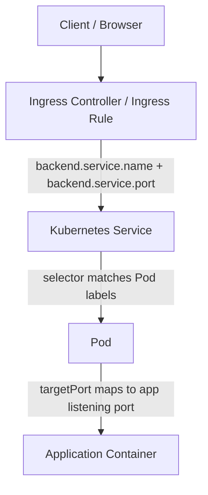
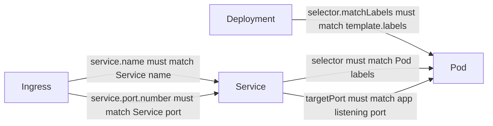
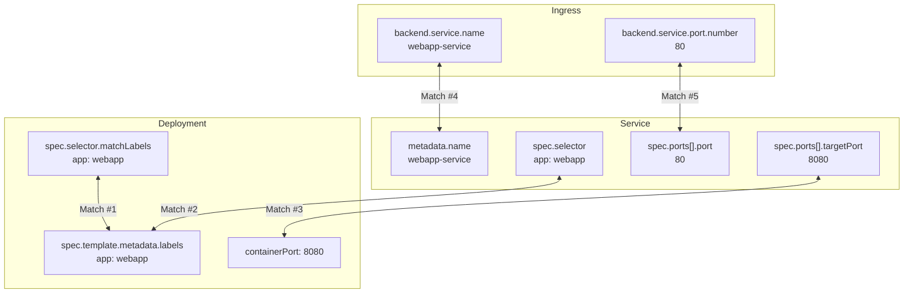

# Kubernetes — What Must Match Where

> A practical troubleshooting guide for how **Deployment**, **Pod**, **Service**, **Ingress**, and **Istio** objects connect to each other through labels, names, and ports.

---

## Executive Summary

Kubernetes does **not** connect objects because they appear in the same YAML file, are deployed together, or have similar names.

Kubernetes connects objects through:

| Connection Type | Used By | Example |
|---|---|---|
| **Labels / selectors** | Deployment ↔ Pod, Service ↔ Pod, Gateway ↔ Ingress Gateway Pod | `app: webapp` |
| **Object names** | Ingress ↔ Service, VirtualService ↔ Gateway, VirtualService ↔ Service | `webapp-service` |
| **Ports** | Ingress ↔ Service, Service ↔ Pod/application | `port: 80`, `targetPort: 8080` |

The most important mental model:

```text
Deployment creates Pods.
Service does not connect to the Deployment.
Service finds Pods by matching labels.
Ingress or Istio routes to the Service by name and port.
```

---

## The Myth This Guide Corrects

A common misunderstanding is:

```text
Deployment → Service → Pod
```

That is **not** how Kubernetes works.

The correct relationship is:

```text
Deployment ──creates/labeled template──▶ Pod ◀──label selector── Service
```

The **Deployment** creates Pods and stamps labels onto them.

The **Service** independently searches for Pods with matching labels.

The Service does **not** know or care which Deployment created the Pods.

This is why a Service can exist, Pods can be running, and the application can still fail if the Service selector does not match the Pod labels.

---

## End-to-End Request Flow

### Plain Kubernetes Ingress Flow



### Kubernetes Object Relationship



---

# The Five Core Matches

## Match #1 — Deployment `selector.matchLabels` ↔ Pod Template `metadata.labels`

This match happens **inside the Deployment**.

The Deployment selector tells Kubernetes which Pods belong to this Deployment. The Pod template labels define what labels are placed on every Pod the Deployment creates.

If these do not match, Kubernetes usually rejects the Deployment at apply time.

### Correct Example

```yaml
apiVersion: apps/v1
kind: Deployment
metadata:
  name: webapp
spec:
  replicas: 2

  # Match #1, side A:
  # The Deployment says, "I own Pods with this label."
  selector:
    matchLabels:
      app: webapp

  template:
    metadata:
      # Match #1, side B:
      # The Pods created by this Deployment receive this label.
      labels:
        app: webapp

    spec:
      containers:
      - name: webapp
        image: nginx:latest
        ports:
        - containerPort: 80
```

### Key Point

```text
Deployment selector.matchLabels must match Pod template.metadata.labels.
```

### Failure Behavior

This is usually a **loud failure**.

You may see an error during:

```bash
kubectl apply -f deployment.yaml
```

Kubernetes protects you from creating a Deployment whose selector does not match the Pod template labels.

---

## Match #2 — Service `spec.selector` ↔ Pod `metadata.labels`

This is the most important traffic match.

The Service finds Pods by matching its selector against Pod labels.

The Service does **not** connect to the Deployment.

### Correct Example

```yaml
apiVersion: apps/v1
kind: Deployment
metadata:
  name: webapp
spec:
  selector:
    matchLabels:
      app: webapp

  template:
    metadata:
      labels:
        app: webapp
    spec:
      containers:
      - name: webapp
        image: nginx:latest
        ports:
        - containerPort: 80
```

```yaml
apiVersion: v1
kind: Service
metadata:
  name: webapp-service
spec:
  type: ClusterIP

  # Match #2:
  # This must match the Pod labels.
  selector:
    app: webapp

  ports:
  - port: 80
    targetPort: 80
```

### Key Point

```text
Service selector must match Pod labels.
```

### Failure Behavior

This is a **silent failure**.

The Service exists.  
The Pods are running.  
The Deployment looks healthy.  
But the Service has no endpoints.

### Verify

```bash
kubectl describe service webapp-service | grep -i endpoints
```

Good output:

```text
Endpoints: 10.244.1.5:80,10.244.2.7:80
```

Broken output:

```text
Endpoints: <none>
```

### Troubleshooting Commands

```bash
kubectl get pods --show-labels
kubectl get svc webapp-service -o yaml
kubectl get endpoints webapp-service
kubectl get endpointslice -l kubernetes.io/service-name=webapp-service
```

---

## Match #3 — Service `targetPort` ↔ Application Listening Port

The Service has two important port fields:

```yaml
ports:
- port: 80
  targetPort: 8080
```

They do different jobs.

| Field | Meaning |
|---|---|
| `port` | The port exposed by the Service |
| `targetPort` | The port on the Pod/application where traffic is forwarded |

### Correct Example

In this example, clients talk to the Service on port `80`, but the application inside the container listens on port `8080`.

```yaml
apiVersion: apps/v1
kind: Deployment
metadata:
  name: webapp
spec:
  template:
    metadata:
      labels:
        app: webapp
    spec:
      containers:
      - name: webapp
        image: my-webapp:latest
        ports:
        - containerPort: 8080
```

```yaml
apiVersion: v1
kind: Service
metadata:
  name: webapp-service
spec:
  selector:
    app: webapp
  ports:
  - port: 80
    targetPort: 8080
```

### Key Point

```text
Service targetPort must match the port the application actually listens on.
```

`containerPort` is mostly documentation for Kubernetes, but it should reflect the application listening port so humans and tools understand the intent.

### Failure Behavior

The Service may have valid endpoints, but traffic fails because Kubernetes forwards to a port where nothing is listening.

Typical symptoms:

```text
Connection refused
upstream connect error
503 from proxy/ingress
curl: (7) Failed to connect
```

### Verify

Check what port the app is listening on:

```bash
kubectl exec -it <pod-name> -- ss -lntp
```

Check the Service target port:

```bash
kubectl get svc webapp-service -o yaml
```

---

## Match #4 — Ingress `backend.service.name` ↔ Service `metadata.name`

Ingress sends traffic to a Service by name.

The name in the Ingress must match the Service `metadata.name`.

### Correct Example

```yaml
apiVersion: v1
kind: Service
metadata:
  name: webapp-service
spec:
  selector:
    app: webapp
  ports:
  - port: 80
    targetPort: 8080
```

```yaml
apiVersion: networking.k8s.io/v1
kind: Ingress
metadata:
  name: webapp-ingress
spec:
  rules:
  - host: webapp.example.com
    http:
      paths:
      - path: /
        pathType: Prefix
        backend:
          service:
            name: webapp-service
            port:
              number: 80
```

### Key Point

```text
Ingress backend.service.name must match Service metadata.name.
```

### Failure Behavior

The Ingress controller cannot find the Service or cannot resolve a backend.

Possible symptoms:

```text
404
503
backend not found
endpoints not found
```

### Verify

```bash
kubectl describe ingress webapp-ingress
kubectl get svc webapp-service
```

---

## Match #5 — Ingress `backend.service.port.number` ↔ Service `spec.ports[].port`

This is a common source of confusion.

Ingress talks to the **Service port**, not the Service `targetPort`.

### Correct Example

```yaml
apiVersion: v1
kind: Service
metadata:
  name: webapp-service
spec:
  selector:
    app: webapp
  ports:
  - port: 80          # Ingress uses this
    targetPort: 8080  # Service forwards to this inside the Pod
```

```yaml
apiVersion: networking.k8s.io/v1
kind: Ingress
metadata:
  name: webapp-ingress
spec:
  rules:
  - host: webapp.example.com
    http:
      paths:
      - path: /
        pathType: Prefix
        backend:
          service:
            name: webapp-service
            port:
              number: 80
```

### Key Point

```text
Ingress backend.service.port.number must match Service port, not targetPort.
```

### Common Mistake

This is wrong:

```yaml
# Service
ports:
- port: 80
  targetPort: 8080
```

```yaml
# Ingress
backend:
  service:
    name: webapp-service
    port:
      number: 8080   # Wrong. This should be 80.
```

Ingress must use:

```yaml
number: 80
```

The Service then performs the translation:

```text
Service port 80 → Pod targetPort 8080
```

---

# All Five Matches Together



---

# Troubleshooting Table

| Match | What Must Match | Symptom If Broken | Diagnostic Command | Fix |
|---|---|---|---|---|
| #1 | Deployment `selector.matchLabels` ↔ Pod template `labels` | `kubectl apply` fails | `kubectl apply -f deployment.yaml` | Make selector and template labels identical |
| #2 | Service `selector` ↔ Pod labels | Service has no endpoints; traffic silently fails | `kubectl describe svc <svc> \| grep Endpoints` | Make Service selector match Pod labels |
| #3 | Service `targetPort` ↔ app listening port | Endpoints exist but connection refused | `kubectl exec <pod> -- ss -lntp` | Set `targetPort` to actual app port |
| #4 | Ingress `backend.service.name` ↔ Service name | Ingress backend not found; 404/503 | `kubectl describe ingress <ingress>` | Fix Service name in Ingress |
| #5 | Ingress `backend.service.port.number` ↔ Service `port` | Ingress 404/503 while Service may work directly | Compare `kubectl get ingress -o yaml` and `kubectl get svc -o yaml` | Use Service `port`, not `targetPort` |

---

# Bottom-Up Debugging Order

When traffic does not reach the application, debug from the bottom up.

## Step 1 — Is the Pod Running and Ready?

```bash
kubectl get pods -o wide
kubectl describe pod <pod-name>
```

Look for:

```text
STATUS: Running
READY: 1/1 or 2/2
```

If Istio sidecar is injected, you may see:

```text
READY: 2/2
```

That usually means:

```text
app container + istio-proxy sidecar
```

---

## Step 2 — Does the Service Have Endpoints?

```bash
kubectl get svc
kubectl describe svc <service-name>
kubectl get endpoints <service-name>
```

If endpoints are empty, focus on Match #2:

```text
Service selector ↔ Pod labels
```

---

## Step 3 — Does the Service Forward to the Correct Port?

```bash
kubectl get svc <service-name> -o yaml
kubectl exec -it <pod-name> -- ss -lntp
```

Check Match #3:

```text
Service targetPort ↔ application listening port
```

---

## Step 4 — Does Ingress Point to the Correct Service Name and Port?

```bash
kubectl describe ingress <ingress-name>
kubectl get ingress <ingress-name> -o yaml
kubectl get svc <service-name> -o yaml
```

Check:

```text
Ingress service.name ↔ Service metadata.name
Ingress service.port.number ↔ Service spec.ports[].port
```

---

# Istio Addendum

If you use Istio, the same principle applies:

```text
Everything connects by labels, names, hosts, and ports.
Nothing connects by file order or visual position.
```

## Istio Request Flow

```mermaid
flowchart TD
    Client[Client]
    NLB[AWS NLB / External Load Balancer]
    IGW[Istio Ingress Gateway Service]
    Envoy[Istio Ingress Gateway Pod / Envoy]
    Gateway[Istio Gateway]
    VirtualService[Istio VirtualService]
    K8SService[Kubernetes Service]
    AppPod[Application Pod]
    AppContainer[Application Container]

    Client --> NLB
    NLB --> IGW
    IGW --> Envoy
    Gateway -->|selector matches ingress gateway labels| Envoy
    VirtualService -->|gateways[] references Gateway name| Gateway
    VirtualService -->|route.destination.host references Service| K8SService
    K8SService -->|selector matches Pod labels| AppPod
    AppPod --> AppContainer
```

## Istio Match #6 — VirtualService `gateways[]` ↔ Gateway `metadata.name`

```yaml
apiVersion: networking.istio.io/v1beta1
kind: Gateway
metadata:
  name: webapp-gateway
spec:
  selector:
    istio: ingressgateway
  servers:
  - port:
      number: 443
      name: https
      protocol: HTTPS
    hosts:
    - webapp.example.com
```

```yaml
apiVersion: networking.istio.io/v1beta1
kind: VirtualService
metadata:
  name: webapp-vs
spec:
  hosts:
  - webapp.example.com
  gateways:
  - webapp-gateway
  http:
  - route:
    - destination:
        host: webapp-service
        port:
          number: 80
```

Key point:

```text
VirtualService gateways[] must reference the Gateway name.
```

---

## Istio Match #7 — Gateway `selector` ↔ Istio Ingress Gateway Pod Labels

The Gateway does not directly create the ingress gateway Pod.

The Gateway selects an existing Istio ingress gateway workload by label.

```yaml
apiVersion: networking.istio.io/v1beta1
kind: Gateway
metadata:
  name: webapp-gateway
spec:
  selector:
    istio: ingressgateway
```

That selector must match labels on the Istio ingress gateway Pod:

```bash
kubectl get pods -n istio-system --show-labels
```

Example label:

```text
istio=ingressgateway
```

Key point:

```text
Gateway selector must match the labels on the Istio ingress gateway Pod.
```

---

## Istio Match #8 — VirtualService Destination Host ↔ Kubernetes Service Name

In Istio, this destination usually points to the Kubernetes Service:

```yaml
route:
- destination:
    host: webapp-service
    port:
      number: 80
```

This must resolve to a Service.

For same namespace:

```yaml
host: webapp-service
```

For cross-namespace:

```yaml
host: webapp-service.my-namespace.svc.cluster.local
```

Key point:

```text
VirtualService destination.host usually points to the Kubernetes Service name or FQDN.
```

---

# Practical Mental Model

## Without Istio

```text
Client
  ↓
Ingress Controller
  ↓  Match #4 + #5
Ingress rule → Service name + Service port
  ↓  Match #2
Service selector → Pod labels
  ↓  Match #3
Service targetPort → Application listening port
```

## With Istio

```text
Client
  ↓
AWS NLB / LoadBalancer Service
  ↓
Istio Ingress Gateway Pod
  ↓  Gateway selector matches ingress gateway labels
Istio Gateway
  ↓  VirtualService gateways[] references Gateway name
VirtualService
  ↓  destination.host references Kubernetes Service
Kubernetes Service
  ↓  Service selector matches Pod labels
Application Pod
  ↓
Application Container listening on targetPort
```

---

# Fast Checklist for New Engineers

Use this checklist when reverse-engineering a live Kubernetes deployment.

## 1. Find the Pod Labels

```bash
kubectl get pods -n <namespace> --show-labels
```

Look for labels such as:

```text
app=webapp
app.kubernetes.io/name=webapp
```

---

## 2. Check the Service Selector

```bash
kubectl get svc -n <namespace> <service-name> -o yaml
```

Look for:

```yaml
spec:
  selector:
    app: webapp
```

Confirm it matches the Pod labels.

---

## 3. Check Service Endpoints

```bash
kubectl get endpoints -n <namespace> <service-name>
```

or:

```bash
kubectl get endpointslice -n <namespace> \
  -l kubernetes.io/service-name=<service-name>
```

If there are no endpoints, the Service is not selecting any Pods.

---

## 4. Check Service Port Mapping

```bash
kubectl get svc -n <namespace> <service-name> -o yaml
```

Look for:

```yaml
ports:
- port: 80
  targetPort: 8080
```

Then check the application listening port:

```bash
kubectl exec -n <namespace> -it <pod-name> -- ss -lntp
```

---

## 5. Check Ingress or Istio Route

For Kubernetes Ingress:

```bash
kubectl get ingress -n <namespace> -o yaml
kubectl describe ingress -n <namespace> <ingress-name>
```

For Istio:

```bash
kubectl get gateway,virtualservice -n <namespace>
kubectl describe gateway -n <namespace> <gateway-name>
kubectl describe virtualservice -n <namespace> <virtualservice-name>
```

---

# Common Confusions

## Confusion 1 — “The Service points to the Deployment”

Incorrect.

The Service points to Pods by label.

```text
Service selector → Pod labels
```

Not:

```text
Service → Deployment
```

---

## Confusion 2 — “Ingress should use targetPort”

Incorrect.

Ingress uses the Service `port`.

The Service then forwards to `targetPort`.

```text
Ingress → Service port → Service targetPort → Pod app port
```

---

## Confusion 3 — “containerPort makes the app listen on that port”

Incorrect.

The application itself must listen on the port.

`containerPort` documents or exposes intent in the Pod spec, but it does not force the application process to bind to that port.

Example:

```yaml
ports:
- containerPort: 8080
```

This does not magically make NGINX listen on `8080`. The NGINX config still controls the actual listening port.

---

## Confusion 4 — “Istio Gateway is the same as the ingress gateway Pod”

Not exactly.

| Object | Meaning |
|---|---|
| Istio ingress gateway Pod | The actual Envoy proxy workload |
| Istio ingress gateway Service | Kubernetes Service exposing the Envoy Pods |
| Istio Gateway | Istio config that tells Envoy which ports/hosts/TLS settings to accept |
| VirtualService | Istio config that tells Envoy where to route matching traffic |

---

# One-Page Summary

```text
Deployment:
  - Creates Pods.
  - selector.matchLabels must match template.metadata.labels.

Pod:
  - Runs the app container.
  - Has labels used by the Service selector.
  - App must actually listen on the expected port.

Service:
  - Does not know about the Deployment.
  - Finds Pods by selector.
  - Exposes a stable Service IP and port.
  - Forwards traffic to Pod targetPort.

Ingress:
  - Routes external HTTP/HTTPS traffic.
  - References Service by name.
  - References Service port, not targetPort.

Istio:
  - Gateway selects ingress gateway Envoy pods by label.
  - VirtualService references Gateway by name.
  - VirtualService routes to Kubernetes Service by host/name and port.
```

---

# Best Debugging Command Set

```bash
# Pods and labels
kubectl get pods -n <namespace> -o wide --show-labels

# Deployment selectors and Pod template labels
kubectl get deploy -n <namespace> <deployment-name> -o yaml

# Service selector, port, and targetPort
kubectl get svc -n <namespace> <service-name> -o yaml

# Service endpoint population
kubectl get endpoints -n <namespace> <service-name>
kubectl get endpointslice -n <namespace> \
  -l kubernetes.io/service-name=<service-name>

# App listening port
kubectl exec -n <namespace> -it <pod-name> -- ss -lntp

# Ingress routing
kubectl get ingress -n <namespace> -o yaml
kubectl describe ingress -n <namespace> <ingress-name>

# Istio routing
kubectl get gateway,virtualservice -n <namespace>
kubectl get pods -n istio-system --show-labels
kubectl describe gateway -n <namespace> <gateway-name>
kubectl describe virtualservice -n <namespace> <virtualservice-name>
```

---

# Final Rule

When Kubernetes traffic fails, do not start with the load balancer.

Start with the smallest dependency and move upward:

```text
Pod Ready?
  ↓
App listening on the expected port?
  ↓
Service selector matches Pod labels?
  ↓
Service has endpoints?
  ↓
Service targetPort matches app port?
  ↓
Ingress points to correct Service name and Service port?
  ↓
Istio Gateway / VirtualService references are correct?
  ↓
External load balancer path?
```

Most Kubernetes routing problems are not load balancer problems.

They are usually one of these:

```text
Wrong label
Wrong selector
Wrong Service name
Wrong Service port
Wrong targetPort
Wrong Istio Gateway or VirtualService reference
```
