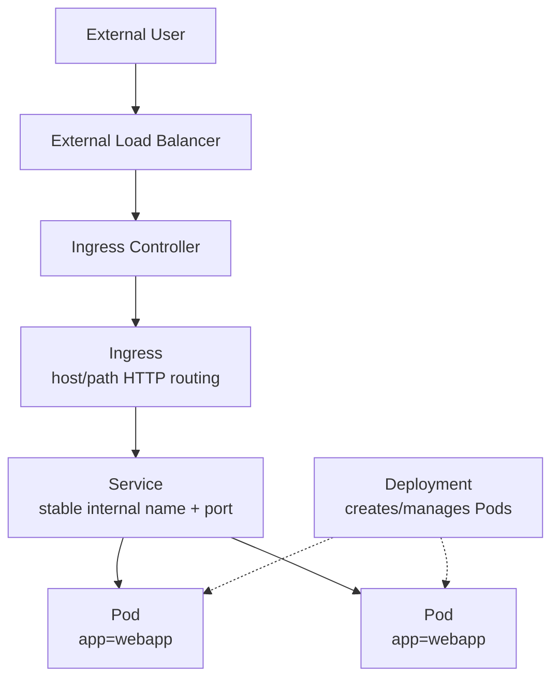
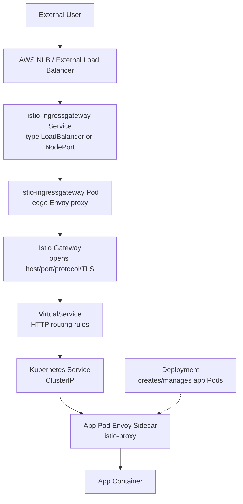
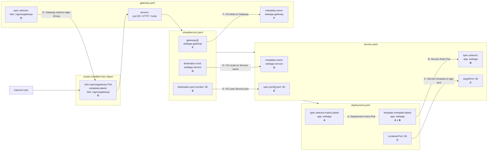

# Kubernetes + Istio Traffic Flow — Simple Mental Model with YAML Cross-References

## 0. The Mental Model First

Before looking at YAML, remember who does what.

| Object | Plain-English Job | What It Does **Not** Do |
|---|---|---|
| **Deployment** | Creates and manages Pods | Does **not** route traffic |
| **Pod** | Runs your application container | Does **not** provide stable routing by itself |
| **Service** | Provides stable internal access to Pods using labels | Does **not** create external HTTP/HTTPS routing rules |
| **Ingress** | Handles external HTTP/HTTPS routing in plain Kubernetes | Does **not** directly select Pods |
| **Istio Gateway** | Istio external listener: host, port, protocol, TLS | Does **not** route directly to Pods |
| **Istio VirtualService** | Istio HTTP routing rules | Does **not** create Pods |
| **Envoy Sidecar** | Proxy inside the app Pod | Does **not** replace the app container |

The short version:

```text
Deployment creates Pods.
Service finds Pods.
Ingress handles external HTTP/HTTPS routing in plain Kubernetes.
Istio usually replaces Ingress with Gateway + VirtualService.
```

---

# 1. Plain Kubernetes Flow

```text
User
  -> Ingress
  -> Service
  -> Pod
  -> App
```

In plain Kubernetes:

```text
Ingress = external HTTP/HTTPS routing
Service = internal Pod selection/routing
Deployment = creates/manages Pods
Pod = runs the application
```

## Plain Kubernetes Diagram



---

# 2. Plain Kubernetes YAML Cross-References

## `deployment.yaml`

```yaml
apiVersion: apps/v1
kind: Deployment
metadata:
  name: webapp-deployment
spec:
  replicas: 2

  selector:
    matchLabels:
      app: webapp
      # K8S-MATCH-A:
      # Must match template.metadata.labels.app below.
      # Deployment uses this to know which Pods it owns.

  template:
    metadata:
      labels:
        app: webapp
        # K8S-MATCH-A:
        # Must match Deployment selector above.
        #
        # K8S-MATCH-B:
        # Must match Service spec.selector.app in service.yaml.

    spec:
      containers:
      - name: webapp-container
        image: nginx:latest
        ports:
        - containerPort: 80
          # K8S-MATCH-C:
          # This is the app listening port inside the Pod.
          # Service targetPort in service.yaml should point here.
```

## `service.yaml`

```yaml
apiVersion: v1
kind: Service
metadata:
  name: webapp-service
  # K8S-MATCH-D:
  # Must match Ingress backend.service.name in ingress.yaml.

spec:
  type: ClusterIP
  # ClusterIP = internal-only Service.
  # Ingress talks to this Service inside the cluster.

  selector:
    app: webapp
    # K8S-MATCH-B:
    # Must match Pod label from deployment.yaml:
    # template.metadata.labels.app: webapp

  ports:
  - port: 80
    # K8S-MATCH-E:
    # Must match Ingress backend.service.port.number in ingress.yaml.
    # This is the Service port.
    # Ingress uses Service port, NOT targetPort.

    targetPort: 80
    # K8S-MATCH-C:
    # Must point to the app listening port inside the Pod:
    # deployment.yaml containerPort: 80
```

## `ingress.yaml`

```yaml
apiVersion: networking.k8s.io/v1
kind: Ingress
metadata:
  name: webapp-ingress
spec:
  ingressClassName: nginx
  # This tells Kubernetes which Ingress Controller should process this Ingress.

  rules:
  - host: webapp.example.com
    http:
      paths:
      - path: /
        pathType: Prefix
        backend:
          service:
            name: webapp-service
            # K8S-MATCH-D:
            # Must match service.yaml metadata.name: webapp-service

            port:
              number: 80
              # K8S-MATCH-E:
              # Must match service.yaml spec.ports[].port: 80
              # Important: this is Service port, not targetPort.
```

## Plain Kubernetes Match Table

| Match | Must Match | Why |
|---|---|---|
| A | Deployment `selector.matchLabels` = Pod template `labels` | Deployment owns the Pods |
| B | Service `selector` = Pod `labels` | Service finds Pods |
| C | Service `targetPort` = app `containerPort` / listening port | Service forwards to the correct app port |
| D | Ingress `backend.service.name` = Service `metadata.name` | Ingress finds the Service |
| E | Ingress `backend.service.port.number` = Service `spec.ports[].port` | Ingress uses the Service port, not targetPort |

---

# 3. Istio with Kubernetes Flow

```text
User
  -> Istio Gateway
  -> VirtualService
  -> Service
  -> Pod Sidecar
  -> App
```

With Istio, Kubernetes `Ingress` is usually replaced by:

```text
Istio Gateway + Istio VirtualService
```

But these still remain:

```text
Deployment still creates Pods.
Service still selects Pods.
Pod still runs the app.
```

## Istio Diagram — End-to-End Flow



Read it like this:

```text
External load balancer gets traffic into the cluster.
The istio-ingressgateway Envoy receives the traffic.
Gateway says which host/port/protocol is allowed.
VirtualService says where to route the request.
VirtualService usually routes to a Kubernetes Service.
Service selects the right app Pods using labels.
Traffic enters the app Pod through the Envoy sidecar, then reaches the app container.
```

---

# 4. All 7 Istio Matches on One Page

This is the diagram you wanted added. It shows every major YAML object plus the cluster-installed `istio-ingressgateway` Pod. Trace each match letter across files.



## What the 7 Istio matches mean

| Match | Must Match | Why It Matters |
|---|---|---|
| **A** | Deployment `selector.matchLabels` = Pod template `labels` | Deployment knows which Pods it owns |
| **B** | Service `selector` = Pod `labels` | Service finds the app Pods |
| **C** | Service `targetPort` = app `containerPort` / listening port | Service forwards to the right app port |
| **D** | VirtualService `destination.host` = Service `metadata.name` | Istio routes to the Kubernetes Service |
| **E** | VirtualService `destination.port.number` = Service `spec.ports[].port` | Istio uses the Service port, not targetPort |
| **F** | VirtualService `gateways[]` = Gateway `metadata.name` | VirtualService attaches to the correct Gateway |
| **G** | Gateway `selector` = labels on `istio-ingressgateway` Pod | Gateway config applies to the correct edge Envoy |

---

# 5. Istio YAML Cross-References

## `deployment.yaml`

```yaml
apiVersion: apps/v1
kind: Deployment
metadata:
  name: webapp-deployment
spec:
  replicas: 2

  selector:
    matchLabels:
      app: webapp
      # ISTIO-MATCH-A:
      # Must match template.metadata.labels.app below.
      # Deployment uses this to know which Pods it owns.

  template:
    metadata:
      labels:
        app: webapp
        # ISTIO-MATCH-A:
        # Must match Deployment selector above.
        #
        # ISTIO-MATCH-B:
        # Must match Service spec.selector.app in service.yaml.

      annotations:
        sidecar.istio.io/inject: "true"
        # Optional if namespace has automatic injection enabled.
        # Final Pod will usually have two containers:
        # 1. webapp-container
        # 2. istio-proxy sidecar

    spec:
      containers:
      - name: webapp-container
        image: nginx:latest
        ports:
        - containerPort: 80
          # ISTIO-MATCH-C:
          # App listens here.
          # Service targetPort should point here.
```

## `service.yaml`

```yaml
apiVersion: v1
kind: Service
metadata:
  name: webapp-service
  # ISTIO-MATCH-D:
  # Must match VirtualService destination.host in virtualservice.yaml.

spec:
  type: ClusterIP
  # Internal-only Service.
  # VirtualService routes to this Service.

  selector:
    app: webapp
    # ISTIO-MATCH-B:
    # Must match Pod label from deployment.yaml:
    # template.metadata.labels.app: webapp

  ports:
  - name: http
    # Istio works best when ports are named by protocol: http, http2, grpc, tcp, etc.

    port: 80
    # ISTIO-MATCH-E:
    # Must match VirtualService destination.port.number.
    # This is the Service port.

    targetPort: 80
    # ISTIO-MATCH-C:
    # Must point to app container listening port:
    # deployment.yaml containerPort: 80
```

## `gateway.yaml`

```yaml
apiVersion: networking.istio.io/v1beta1
kind: Gateway
metadata:
  name: webapp-gateway
  # ISTIO-MATCH-F:
  # Must match VirtualService spec.gateways[] in virtualservice.yaml.

spec:
  selector:
    istio: ingressgateway
    # ISTIO-MATCH-G:
    # Must match labels on the cluster-installed istio-ingressgateway Pod.
    # Example check:
    # kubectl get pod -n istio-system -l istio=ingressgateway --show-labels
    #
    # This means:
    # Apply this Gateway listener config to the edge Envoy Pod.

  servers:
  - port:
      number: 80
      name: http
      protocol: HTTP
    hosts:
    - webapp.example.com
    # This host should match VirtualService spec.hosts[].
```

## `virtualservice.yaml`

```yaml
apiVersion: networking.istio.io/v1beta1
kind: VirtualService
metadata:
  name: webapp-vs
spec:
  hosts:
  - webapp.example.com
  # Should match gateway.yaml servers.hosts.

  gateways:
  - webapp-gateway
  # ISTIO-MATCH-F:
  # Must match gateway.yaml metadata.name: webapp-gateway

  http:
  - match:
    - uri:
        prefix: /

    route:
    - destination:
        host: webapp-service
        # ISTIO-MATCH-D:
        # Must match service.yaml metadata.name: webapp-service
        # VirtualService routes to a Kubernetes Service.

        port:
          number: 80
          # ISTIO-MATCH-E:
          # Must match service.yaml spec.ports[].port: 80
          # Important: this is Service port, not targetPort.
```

## Cluster-installed Istio ingress gateway Pod

You usually do **not** create this Pod in your app YAML. It is installed by Istio using `istioctl`, Helm, or the Istio operator.

```bash
kubectl get pod -n istio-system -l istio=ingressgateway --show-labels
```

Expected concept:

```text
istio-ingressgateway-xxxxx   labels include: istio=ingressgateway
```

This label must match the `Gateway` selector:

```yaml
spec:
  selector:
    istio: ingressgateway
```

---

# 6. The Istio Chain — Read Top to Bottom

```text
Internet
  │
  ▼
AWS NLB / External Load Balancer
  │
  ▼
istio-ingressgateway Service
  │
  ▼
istio-ingressgateway Pod, edge Envoy
  │
  │  G: Gateway selector matches this Envoy Pod label
  ▼
Gateway config opens port 80 / host webapp.example.com
  │
  │  F: VirtualService attaches to this Gateway by name
  ▼
VirtualService L7 routing rules
  │
  │  D: destination.host matches Service name
  │  E: destination.port.number matches Service port
  ▼
Service, ClusterIP
  │
  │  B: Service selector matches Pod label
  │  C: Service targetPort points to app listening port
  ▼
App Pod with Envoy sidecar
  │
  ▼
App Container

Separately:
Deployment --A--> creates App Pods with labels used by the Service.
```

---

# 7. What Breaks When a Match Is Wrong

| Match | If Broken, Symptom Is... | Diagnostic Command | Good Output | Fix |
|---|---|---|---|---|
| **A** | `kubectl apply` returns an error | `kubectl apply -f deployment.yaml` | No error | Make Deployment selector identical to Pod template labels |
| **B** | Everything looks healthy, but requests time out or fail | `kubectl describe svc webapp-service` | `Endpoints: 10.x.x.x:80` | Make Service selector match Pod labels |
| **C** | Endpoints exist, but upstream connection fails | `kubectl exec <pod> -- netstat -ltn` | App listens on targetPort | Set Service `targetPort` to the real app port |
| **D** | Istio/Envoy cannot find backend Service; possible 503 | `istioctl proxy-config cluster <ingress-pod> -n istio-system` | Cluster exists for Service | Fix `destination.host` to match Service name/FQDN |
| **E** | Envoy routes to wrong Service port; possible 503 UH | `kubectl get svc webapp-service -o yaml` | VS port equals Service `port` | Use Service `port`, not `targetPort` |
| **F** | Route never applies; edge may return 404 | `istioctl proxy-config route <ingress-pod> -n istio-system` | Route appears for host | Match `VirtualService gateways[]` to Gateway name |
| **G** | Gateway config not applied to edge Envoy; port/host not active | `kubectl get pods -n istio-system --show-labels \\| grep ingressgateway` | Pod labels include selector | Make Gateway selector match actual ingressgateway Pod labels |

---

# 8. Troubleshooting Order

Use this order when traffic is broken.

## Step 1 — Are Pods running?

```bash
kubectl get pods -n <namespace>
```

Expected:

```text
READY 1/1 without Istio
READY 2/2 with Istio sidecar
STATUS Running
```

## Step 2 — Does the Service have endpoints?

```bash
kubectl describe svc <service-name> -n <namespace>
```

Good:

```text
Endpoints: 10.244.1.5:80, 10.244.2.7:80
```

Bad:

```text
Endpoints: <none>
```

If endpoints are `<none>`, Match **B** is broken.

## Step 3 — Is the app listening on the Service targetPort?

```bash
kubectl exec -it <pod-name> -n <namespace> -- netstat -ltn
```

Confirm the app listens on the same port as Service `targetPort`.

## Step 4 — With Istio, confirm Gateway and VirtualService wiring

```bash
kubectl get gateway,virtualservice -n <namespace>
kubectl describe gateway webapp-gateway -n <namespace>
kubectl describe virtualservice webapp-vs -n <namespace>
```

Check:

```text
VirtualService gateways[] = Gateway metadata.name
VirtualService destination.host = Service metadata.name
VirtualService destination.port.number = Service port
```

## Step 5 — Check what Envoy actually loaded

```bash
istioctl proxy-config listener <ingress-pod> -n istio-system
istioctl proxy-config route <ingress-pod> -n istio-system
istioctl proxy-config cluster <ingress-pod> -n istio-system
istioctl proxy-config endpoint <ingress-pod> -n istio-system
```

Most useful shortcut:

```bash
istioctl analyze -n <namespace>
```

This can catch missing Gateway references, bad destination hosts, and other common Istio wiring problems before you chase packet-level issues.

---

# 9. Final Memory Trick

## Plain Kubernetes

```text
Ingress routes to Service.
Service finds Pods.
Deployment creates Pods.
```

## Istio

```text
Gateway listens.
VirtualService routes to Service.
Service finds Pods.
Deployment creates Pods.
Sidecar controls traffic inside the Pod.
```

## The most important sentence

```text
With Istio, Kubernetes Ingress is usually replaced by Gateway + VirtualService, but Kubernetes Service and Deployment still remain critical.
```
