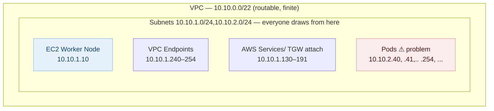
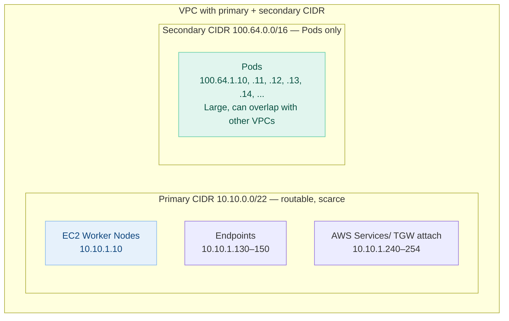
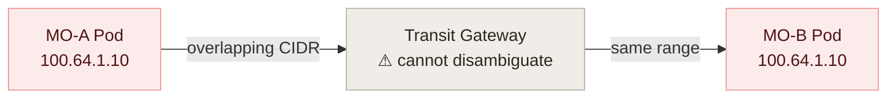
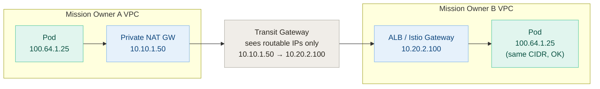
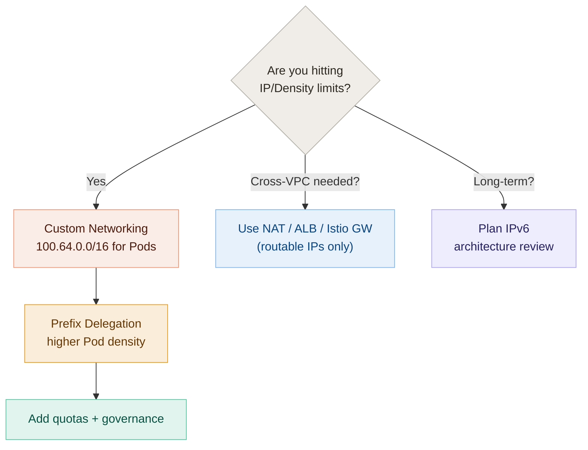

---

#  Guide to Avoiding IPv4 Exhaustion and Maximizing Pod Density on AWS EKS

**Audience:** Mission Owners running EKS on AWS, with or without Istio.

---

## TL;DR & Executive Summary

| Concern / Feature | Primary Problem Solved | Key Change / Impact |
| --- | --- | --- |
| **What causes EKS IP exhaustion?** | VPC CIDR Depletion | The AWS VPC CNI assigns each Pod a real VPC IP from your routable CIDR. |
| **What limits Pod density?** | EC2 ENI/IP Caps | Nodes hit secondary IP/ENI limits, blocking scheduling even if CPU/RAM is available. |
| **Custom Networking** | VPC IP Exhaustion | Pods move to a secondary `100.64.0.0/10` CIDR range. |
| **Prefix Delegation** | Pod Density Limits | Assigns a `/28` prefix (16 IPs) per ENI slot instead of single secondary IPs. |
| **Combined Pattern** | Scale & Density | Pods use a secondary CIDR with high density. |
| **Does Istio make it worse?** | None | No. The sidecar shares the Pod IP — no extra IP is consumed. |
| **Cross-VPC traffic?** | Overlapping Pod CIDRs | Never route overlapping Pod CIDRs directly. Use NAT, ALB/NLB, or an Istio Gateway. |
| **Long-term direction?** | Protocol-Level Scarcity | IPv6. Strategic, but needs full architecture review. |

---

## 1. The Core Challenges

### 1.1 VPC Address Scarcity

By default, every Pod consumes a VPC IP from the **same routable subnet** as your nodes, load balancers, NAT gateways, and VPC endpoints. Multiplying hundreds of Pods per cluster across many Mission Owners means even a large block like `10.0.0.0/8` runs thin.

**The Math That Hurts:** 100 Pods × 20 nodes ≈ 2,000 routable IPs gone — Following is just Hypothetical Example.



### 1.2 EC2 Instance ENI and IP Limits

Every EKS Pod requires a VPC IP. However, EC2 instances have hard limits on the number of Network Interfaces (ENIs) and IP addresses they can support. Once these slots are full, the node cannot schedule more Pods, even if CPU and memory are still available. IP address allocation is a core dimension of the maximum pods allowed per instance type.


---

## 2. The Recommended Pattern

Move Pod IPs out of your routable VPC space into the shared address block `100.64.0.0/10` (RFC 6598, "Carrier-Grade NAT space"). Nodes and infrastructure keep their routable `10.x.x.x` addresses, while Pods get throwaway space that does not need to be unique across the organization.



### Boosting Density via Prefix Delegation

* **Custom Networking** solves VPC IP exhaustion by moving Pod IPs to a secondary VPC CIDR (e.g., `100.64.x.x`). It is ideal for preserving primary IP space for infrastructure and using non-routable ranges for Pods.
* **Prefix Delegation** solves Pod density limitations by assigning a `/28` prefix (16 IPs) to each ENI slot instead of a single secondary IP. This significantly increases Pods per node and improves container startup speeds by pre-allocating addresses.
* **Combined Solution** resolves both scale and density by ensuring Pods use a secondary CIDR with high density per node.

---

## 3. Cross-VPC Communication Caveat

The `100.64.x.x` space is reusable **only** if it stays local inside the VPC. If Mission Owner A and Mission Owner B both use `100.64.1.0/24` for Pods and you try to route directly across a Transit Gateway (TGW), the TGW cannot distinguish them. Direct Pod-to-Pod communication will fail.

### ✗ Broken Topology (Direct Routing Overlaps)

TGW route tables match on destination CIDR. With identical Pod CIDRs on both sides, there is no way to express where to send the traffic.



### ✓ Functional Topology (Edge Translation)

Cross-VPC traffic must leave through a unique, routable address: a Private NAT Gateway, ALB/NLB, or an Istio Gateway. The receiving side takes traffic from a routable IP and routes it locally to its own Pod.



**Rule of Thumb:** If a packet leaves the VPC boundary, both its source and destination must reside in routable space.

---

## 4. Address-Space Design Framework

| Layer | CIDR | Must be unique org-wide? | Sized for |
| --- | --- | --- | --- |
| **Infrastructure** (Nodes, ALB/NLB, NAT GW, VPC endpoints, TGW) | `10.x.x.x` (routable) | **Yes** | Infrastructure only — small allocation. |
| **Compute / Pods** (AWS VPC CNI Custom Network) | `100.64.0.0/16` (RFC 6598 (100.64.0.0/10)) | **No** (can overlap across isolated VPCs) | The bulk of your addresses. |
| **Future State** | IPv6 dual-stack | **Yes** (globally unique) | Removes IPv4 scarcity entirely. |

### Single-Tenant Allocation Example

```
MO-A-Dev:  routable 10.10.0.0/20   Pods 100.64.0.0/16
MO-A-Test:  routable 10.20.0.0/20   Pods 100.64.0.0/16
MO-A-Prod:  routable 10.30.0.0/20   Pods 100.64.0.0/16

```

This layout is safe **as long as** overlapping Pod ranges are never advertised across the Transit Gateway.

---

## 5. High-Level Implementation Path

*Note: Detailed YAML manifests and verification commands can be found in `eks-ip-exhaustion-implementation.md`. For official implementation guidelines, refer to the [AWS VPC CNI Best Practices Guide](https://docs.aws.amazon.com/eks/latest/best-practices/vpc-cni.html) and [EKS Custom Networking Documentation](https://docs.aws.amazon.com/eks/latest/best-practices/custom-networking.html).*

```mermaid
flowchart LR
    S1["1. Add secondary<br/>VPC CIDR"] --> S2["2. Create Pod<br/>subnets per AZ"]
    S2 --> S3["3. Enable<br/>Custom Networking"]
    S3 --> S4["4. Create<br/>ENIConfig per AZ"]
    S4 --> S5["5. Enable<br/>Prefix Delegation"]
    S5 --> S6["6. Replace<br/>nodes"]
    S6 --> S7["7. ✓ Verify"]

    classDef vpc fill:#e6f1fb,stroke:#85b7eb,color:#0c447c
    classDef cni fill:#faece7,stroke:#f0997b,color:#4a1b0c
    classDef density fill:#faeeda,stroke:#ef9f27,color:#633806
    classDef nodes fill:#eeedfe,stroke:#afa9ec,color:#26215c
    classDef done fill:#e1f5ee,stroke:#5dcaa5,color:#085041
    class S1,S2 vpc
    class S3,S4 cni
    class S5 density
    class S6 nodes
    class S7 done

```



1. **Add a secondary CIDR** (`100.64.0.0/16`) to your VPC.
2. **Create one Pod subnet per Availability Zone (AZ)** from that secondary CIDR block.
3. **Enable Custom Networking** on the `aws-node` DaemonSet.
4. **Create one ENIConfig per AZ** mapping the AZ label to its corresponding Pod subnet (utilizing automated configuration with Availability Zone labels).
5. **Enable Prefix Delegation** to transition from individual secondary IPs to `/28` prefix blocks for higher node density.
6. **Replace existing nodes** via rolling updates so new worker nodes pick up the updated configurations (existing Pods will not migrate automatically).
7. **Verify configuration** to confirm Pod IPs land in `100.64.x.x` while worker node IPs stay in the `10.x.x.x` space.

---

## 6. Strategic Long-Term Outlook: IPv6

IPv6 addresses IP scarcity at the protocol layer and represents the ideal long-term architecture. However, it is **not** an immediate drop-in fix. Before moving to dual-stack or IPv6-first EKS clusters, verify:

* VPC, TGW, and route table designs.
* AWS Network Firewall alongside ingress/egress validation systems.
* Istio and Envoy proxy configuration for native IPv6 processing.
* Application codebases for hardcoded IPv4 assumptions (e.g., `127.0.0.1`, `0.0.0.0`).
* DNS strategy, including AAAA record mapping and dual-stack resolvers.
* Enterprise security tooling, logging pipelines, SIEM parsers, and external allowlists.
* On-premises architecture and specialized connectivity (such as federal or DoD networks).

**Strategic Guidance:** Map your milestone paths toward IPv6, but resolve pressing production blockages today using **Custom Networking + Prefix Delegation**.

---

## 7. Operational Decision Matrix


