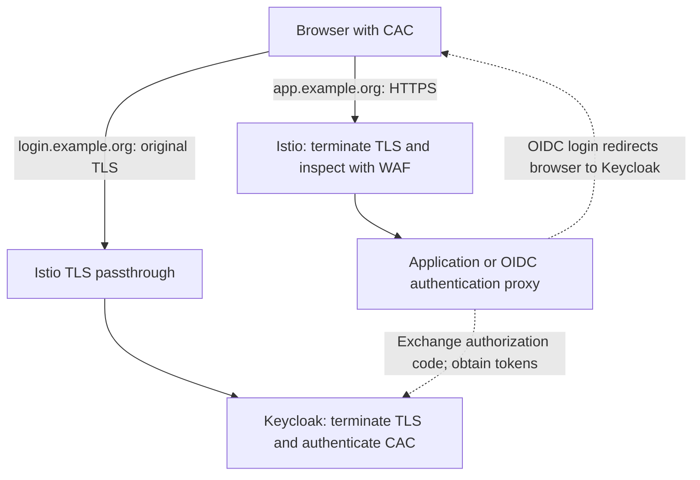

**Yes—Kubernetes can use open-source WAFs, but Kubernetes, Istio, and Keycloak do not automatically provide WAF protection.** The key design question is **where the browser’s CAC-authenticated TLS connection terminates**, because that determines where HTTP inspection is possible.

| Component       | Security responsibility                                                                              |
| --------------- | ---------------------------------------------------------------------------------------------------- |
| **WAF**         | Inspects HTTP requests for attacks such as SQL injection, cross-site scripting, and malicious paths. |
| **Istio/Envoy** | Handles gateway routing, TLS/mTLS, and configured authentication and authorization policies.         |
| **Keycloak**    | Authenticates users using CAC/X.509 and supplies application identity through OIDC or SAML.          |
| **Application** | Enforces business permissions, such as which records a user can access.                              |

A valid CAC authenticates a user; that user’s requests still need web security inspection.

**Open-source WAF choices**

| Option                                       | How it fits Kubernetes and Istio                                                                                                         |
| -------------------------------------------- | ---------------------------------------------------------------------------------------------------------------------------------------- |
| **OWASP Coraza + OWASP Core Rule Set (CRS)** | Can run as an Envoy WebAssembly filter through an Istio plugin. This is the first option I would evaluate for an existing Istio gateway. |
| **OWASP ModSecurity + CRS**                  | Can run in a dedicated Apache/NGINX reverse-proxy deployment in front of services. Requires the appropriate connector and configuration. |

Coraza explicitly supports Istio integration. Both solutions require rule tuning and ongoing maintenance; installing the engine alone does not establish effective protection. [Coraza integration](https://github.com/corazawaf/coraza-proxy-wasm), [ModSecurity](https://owasp.org/projects/modsecurity), [OWASP CRS](https://coreruleset.org/).

**“CAC needs to pass through” can mean two different things**

| Requirement                                                                             | TLS arrangement                                                                                                         | Can the Istio gateway WAF inspect HTTP? |
| --------------------------------------------------------------------------------------- | ----------------------------------------------------------------------------------------------------------------------- | --------------------------------------- |
| Keycloak must receive the browser’s **original client-certificate TLS handshake**       | Istio uses TLS `PASSTHROUGH`; Keycloak terminates TLS.                                                                  | **No**, for that connection.            |
| Keycloak may consume a certificate authenticated and forwarded by a **trusted gateway** | Istio terminates client mTLS, inspects HTTP, then forwards certificate information over a protected backend connection. | **Yes.**                                |

Istio documents passthrough as forwarding the encrypted connection without terminating it. Keycloak supports both approaches and recommends passthrough for direct X.509 authentication because it avoids certificate-header impersonation risks. [Istio passthrough](https://istio.io/latest/docs/tasks/traffic-management/ingress/ingress-sni-passthrough/), [Keycloak proxy guidance](https://www.keycloak.org/server/reverseproxy).

**Option 1: CAC terminates directly at Keycloak; application traffic receives WAF inspection**

Use separate hostnames, for example `login.example.org` and `app.example.org`:

The application or authentication proxy redirects the browser to Keycloak. After CAC authentication, the application establishes an authenticated session using OIDC; SAML is another integration option. **Keycloak does not proxy every application request.** Its X.509 authentication flow must be configured to validate the certificate and map it to the correct user. [Keycloak authentication documentation](https://www.keycloak.org/docs/latest/server_admin/index.html#_x509).

The limitation is explicit: **the passthrough login connection has no HTTP WAF inspection at Istio.** Application traffic on the other hostname can still receive full WAF inspection.

**Option 2: CAC terminates at Istio; WAF protects both login and application traffic**

The sequence is:

1. **Istio requests and validates the CAC client certificate** during client mTLS.
2. **Coraza inspects the decrypted HTTP request** inside Envoy.
3. For Keycloak requests, Envoy forwards the authenticated client certificate in a controlled header over a protected backend connection.
4. **Keycloak performs X.509 user authentication**, then issues the OIDC/SAML identity result.
5. Application requests receive WAF inspection and separate authorization checks.

Istio supports mutual TLS at its ingress gateway. Current Keycloak documentation lists an Envoy certificate-lookup provider for `X-Forwarded-Client-Cert`; verify support in your deployed version. [Istio mutual TLS](https://istio.io/latest/docs/tasks/traffic-management/ingress/secure-ingress/), [Keycloak certificate forwarding](https://www.keycloak.org/server/reverseproxy#_enabling_client_certificate_lookup).

For this design, configure these controls deliberately:

* Strip or overwrite client-supplied certificate headers and populate them from the authenticated TLS connection.
* Restrict Keycloak access to trusted proxy paths.
* Configure certificate trust, validity, and revocation checking.
* Preserve the original CAC identity correctly through any additional mesh proxies.

**Backend mesh mTLS identifies the gateway/workload; it does not automatically carry the user’s CAC identity.** Certificate forwarding is a separate trust mechanism. [Envoy certificate-header handling](https://www.envoyproxy.io/docs/envoy/latest/configuration/http/http_conn_man/headers#x-forwarded-client-cert).

For protected APIs, also combine Istio `RequestAuthentication` with `AuthorizationPolicy`: validating a supplied JWT alone does **not** reject requests with no JWT. Browser login redirects require an application OIDC integration or authentication proxy. [Istio authentication behavior](https://istio.io/latest/docs/reference/config/security/request_authentication/).

**For your design:** if original CAC TLS must reach Keycloak, use Option 1 and explicitly account for the login endpoint’s inspection gap. If both login and application HTTP traffic must receive gateway WAF inspection, evaluate Option 2 with trusted certificate forwarding.
