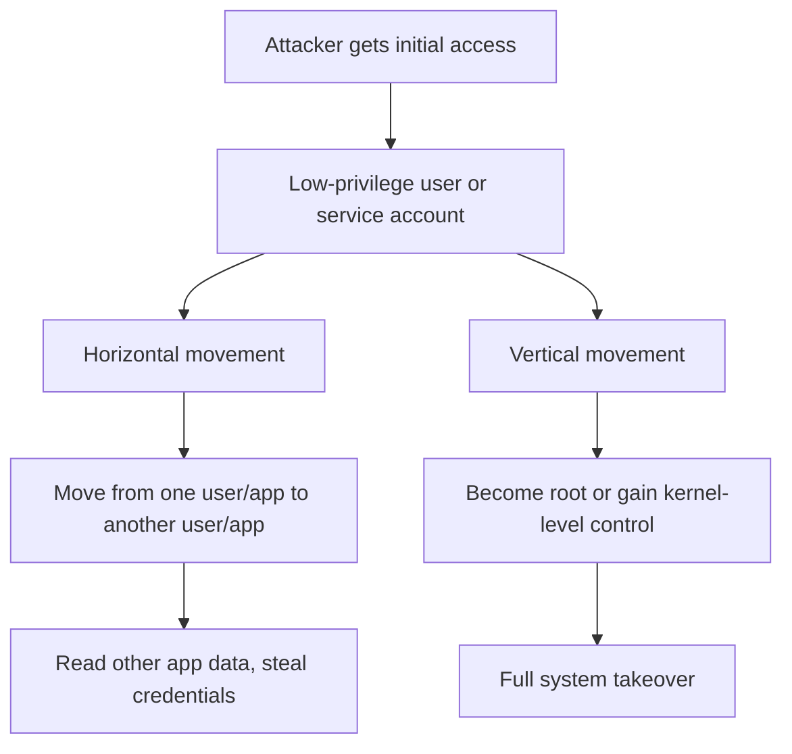
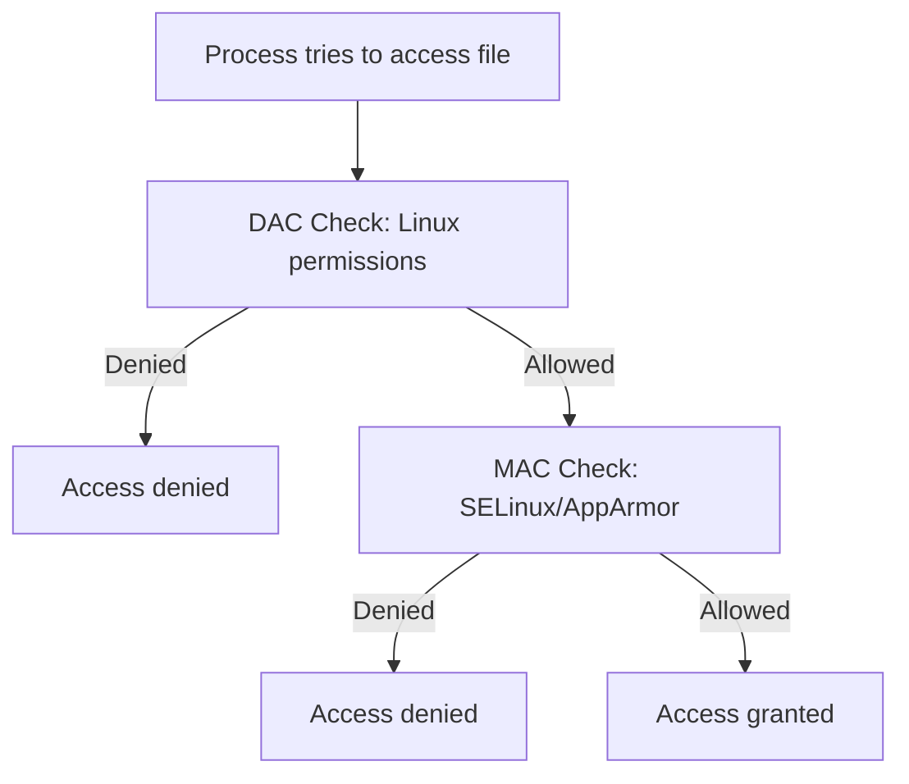
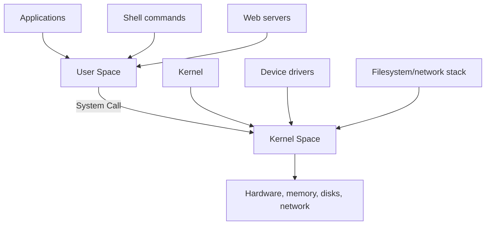
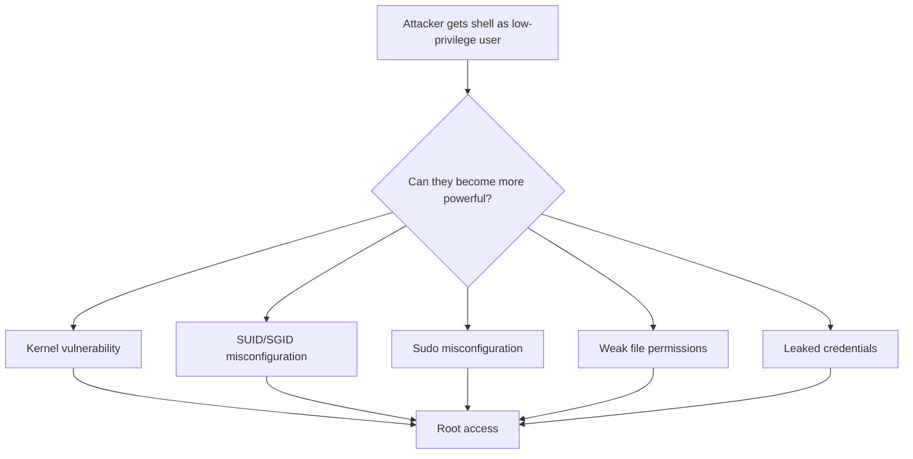
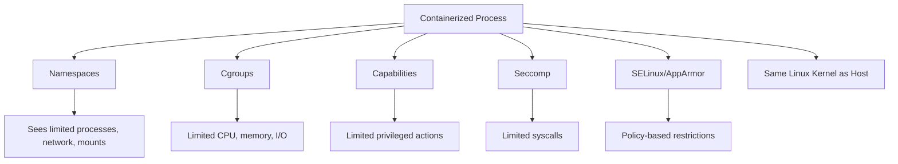
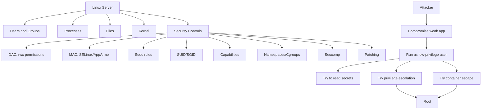

## Linux Security Explained for a Junior Linux Admin

The easiest way to understand Linux security is this:

> **Linux is trying to keep every user, process, file, and service inside its proper boundary.**
> Attackers try to cross those boundaries.

There are two main directions attackers try to move:



Example:

| Starting Point                         | Attacker Goal                              |
| -------------------------------------- | ------------------------------------------ |
| Apache service account like `www-data` | Read app files, database secrets, SSH keys |
| Normal Linux user                      | Become `root`                              |
| Container user                         | Break out to the host                      |
| Web app process                        | Abuse kernel or misconfiguration           |

---

# 1. Linux Security Starts with Users, Processes, and Files

A junior admin should first understand these basics:

| Concept              | Simple Meaning                                                          |
| -------------------- | ----------------------------------------------------------------------- |
| **User**             | Identity that owns files or runs commands                               |
| **Group**            | Collection of users used for shared access                              |
| **Process**          | A running program                                                       |
| **File permissions** | Who can read, write, or execute a file                                  |
| **Root**             | Superuser with broad administrative power                               |
| **Kernel**           | Core of the OS; controls memory, hardware, processes, files, networking |

In Linux, a process does not just “run.” It runs **as a user**.

Example:

```bash
ps -ef | grep httpd
```

You may see Apache running as:

```text
apache   1234  ...
```

That means the Apache process has the permissions of the `apache` user, unless something else like SELinux restricts it further.

---

# 2. DAC: Normal Linux File Permissions

**DAC** means **Discretionary Access Control**.

This is the normal Linux permission model:

```bash
ls -l /var/www/html/index.html
```

Example output:

```text
-rw-r--r-- 1 root root 1200 Jun 12 index.html
```

Breakdown:

```text
-rw-r--r--
 │ │  │
 │ │  └── others can read
 │ └───── group can read
 └─────── owner can read/write
```

The three permission groups are:

| Permission Area | Meaning                    |
| --------------- | -------------------------- |
| Owner           | User who owns the file     |
| Group           | Group assigned to the file |
| Others          | Everyone else              |

The permission letters mean:

| Letter | Meaning |
| ------ | ------- |
| `r`    | Read    |
| `w`    | Write   |
| `x`    | Execute |

## DAC Weakness

The file owner controls access.

So if an attacker compromises `user_a`, the attacker gets whatever `user_a` can access.

Example:

```text
Attacker compromises app running as user_a
        ↓
Attacker can read files user_a can read
        ↓
Attacker may modify files user_a can write
```

That is why DAC alone is not enough for high-security systems.

---

# 3. MAC: SELinux and AppArmor

**MAC** means **Mandatory Access Control**.

This is stricter than normal file permissions.

With MAC, the system policy controls what a process can do.

Even if Linux file permissions say “allowed,” SELinux or AppArmor can still say “denied.”



## Simple Example

Apache is compromised.

Without MAC:

```text
Apache process may read files allowed by Linux permissions.
```

With SELinux/AppArmor:

```text
Apache process can only access what the security policy allows.
```

So even if the attacker controls Apache, the attacker may still be trapped inside a small allowed area.

---

## SELinux Simple Explanation

SELinux labels everything.

A process has a label.
A file has a label.
SELinux policy decides whether that process label can access that file label.

Example:

```bash
ls -Z /var/www/html
```

You may see something like:

```text
system_u:object_r:httpd_sys_content_t:s0 index.html
```

Example process label:

```bash
ps -eZ | grep httpd
```

You may see:

```text
system_u:system_r:httpd_t:s0
```

The important part is the **type**:

| Object         | SELinux Type          |
| -------------- | --------------------- |
| Apache process | `httpd_t`             |
| Web content    | `httpd_sys_content_t` |

SELinux policy may say:

```text
httpd_t can read httpd_sys_content_t
```

But it may deny:

```text
httpd_t reading /etc/shadow
```

Even if the process somehow has Linux-level permission, SELinux can still block it.

That is why SELinux is often called a **second security wall**.

---

## AppArmor Simple Explanation

AppArmor is usually easier to understand.

It limits a program by path.

Example idea:

```text
Apache may read:
/var/www/**

Apache may not read:
/home/**
/etc/shadow
/root/**
```

SELinux is label/type-based.
AppArmor is path/profile-based.

| Feature            | SELinux                           | AppArmor |
| ------------------ | --------------------------------- | -------- |
| Model              | Label/type based                  |          |
| Common in          | RHEL, CentOS, Fedora              |          |
| Easier to read     | Usually AppArmor                  |          |
| More granular      | Usually SELinux                   |          |
| Example rule style | Process type can access file type |          |
| AppArmor style     | Program can access these paths    |          |

---

# 4. User Space vs Kernel Space

A junior admin can think of Linux as two worlds:



## User Space

This is where normal programs run:

```text
bash
python
apache
nginx
ssh
mysql
```

These programs cannot directly control hardware or raw memory.

## Kernel Space

This is the trusted core of the OS.

The kernel controls:

```text
CPU scheduling
memory
disk access
networking
filesystems
processes
security checks
```

If an attacker compromises a normal user-space program, the damage may be limited.

If an attacker compromises the kernel, the system is usually fully compromised.

---

## What Is a System Call?

A **system call**, or syscall, is how a program asks the kernel to do something.

Example:

```text
Application: "Please open this file."
Kernel: "Let me check permissions first."
```

Common syscall examples:

| Syscall     | Meaning                   |
| ----------- | ------------------------- |
| `open()`    | Open a file               |
| `read()`    | Read data                 |
| `write()`   | Write data                |
| `execve()`  | Start a program           |
| `connect()` | Open a network connection |
| `mount()`   | Mount filesystem          |
| `setuid()`  | Change user ID            |

Important security point:

> A bug in a normal application may compromise that application.
> A bug in the kernel may compromise the whole machine.

---

# 5. Memory Corruption Explained Simply

Memory corruption usually affects software written in languages like C or C++.

These languages are powerful but dangerous because they allow direct memory handling.

## Simple Mental Model

Imagine a form has space for 10 characters:

```text
Name: [__________]
```

But the program forgets to check length, and the attacker sends 200 characters.

The extra data spills into memory areas it should not touch.

That is a **buffer overflow**.

---

## Stack-Based Buffer Overflow

The stack is temporary memory used when functions run.

A simplified stack looks like this:

```text
+----------------------+
| Local variables      |
+----------------------+
| Saved frame pointer  |
+----------------------+
| Return address       |
+----------------------+
```

The **return address** tells the program where to go after a function finishes.

If an attacker overwrites the return address, they may redirect the program.

```text
Normal:
Function finishes → returns to expected place

Overflow:
Function finishes → jumps to attacker-controlled location
```

That is why memory bugs can become serious security bugs.

---

# 6. Memory Protection Controls

Modern Linux has several protections to make exploitation harder.

## NX / DEP

**NX** means **No Execute**.

It marks memory areas like the stack as non-executable.

Simple explanation:

```text
Attacker puts code on stack
        ↓
CPU refuses to run it
        ↓
Program crashes instead of executing attacker code
```

## ASLR

**ASLR** means **Address Space Layout Randomization**.

It randomizes memory locations each time a program runs.

Simple explanation:

```text
Without ASLR:
Library always loads at the same address.

With ASLR:
Library address changes every run.
```

This makes it harder for attackers to know where useful code exists in memory.

Check ASLR:

```bash
cat /proc/sys/kernel/randomize_va_space
```

Common values:

| Value | Meaning               |
| ----- | --------------------- |
| `0`   | Disabled              |
| `1`   | Partial randomization |
| `2`   | Full randomization    |

Usually you want:

```text
2
```

## Stack Canaries

A stack canary is like a tripwire.

It is placed before sensitive control data.

```text
Buffer
Canary
Return address
```

Before the function returns, the program checks the canary.

If the canary changed, the program assumes memory corruption happened and terminates.

Simple explanation:

```text
Overflow damages canary
        ↓
Program detects tampering
        ↓
Program stops before attacker controls execution
```

## ROP

**ROP** means **Return-Oriented Programming**.

This is an advanced bypass technique.

Simple explanation:

```text
NX blocks attacker from running new code.
So attacker tries to reuse existing code already loaded in memory.
```

For a junior admin, the key point is not how to perform ROP.

The key point is:

> Memory protections reduce risk, but patching vulnerable software is still required.

---

# 7. Privilege Escalation

Initial access is often not enough for an attacker.

They may start as:

```text
apache
nginx
www-data
nobody
appuser
```

But they want:

```text
root
```

That process is called **privilege escalation**.



---

# 8. Kernel Exploits

A kernel exploit abuses a flaw in the Linux kernel.

The kernel is powerful, so kernel bugs are dangerous.

Example: **Dirty COW**, CVE-2016-5195.

Simple explanation:

```text
A kernel race condition allowed users to modify memory they should not modify.
That could be abused to gain higher privileges.
```

For admins, the lesson is:

> Kernel patching matters.
> A fully hardened app does not save you if the kernel is vulnerable.

Practical checks:

```bash
uname -a
```

```bash
cat /etc/os-release
```

On RHEL-like systems:

```bash
dnf updateinfo list security
```

On Debian/Ubuntu:

```bash
apt list --upgradable
```

---

# 9. SUID and SGID

SUID is one of the most important Linux privilege concepts.

## What Is SUID?

Normally, when you run a command, it runs as **you**.

But if a binary has the SUID bit set, it runs as the **file owner**.

If the owner is root, the program runs with root privileges.

Example:

```bash
ls -l /usr/bin/passwd
```

You may see:

```text
-rwsr-xr-x 1 root root /usr/bin/passwd
```

Notice the `s`:

```text
-rws
```

That means SUID is set.

## Why Does `passwd` Need SUID?

A normal user must be able to change their password.

Password hashes are stored in protected files like:

```text
/etc/shadow
```

Normal users cannot write to `/etc/shadow`.

So `/usr/bin/passwd` runs with special privileges to update only the password safely.

That is a legitimate use of SUID.

---

## SUID Risk

If a dangerous binary has SUID root, an attacker may abuse it.

Examples of risky SUID situations:

```text
Text editors with SUID
Shells with SUID
Scripting tools with SUID
Custom admin scripts with SUID
Old legacy binaries with SUID
```

Admin check:

```bash
find / -perm -4000 -type f -xdev -ls 2>/dev/null
```

You should compare the output against a known-good baseline.

Important:

> Not every SUID file is bad.
> But every SUID file should be intentional and justified.

---

# 10. Sudo Misconfiguration

Sudo allows a user to run commands as another user, often root.

Check what a user can run:

```bash
sudo -l
```

Dangerous example:

```text
user ALL=(ALL) NOPASSWD: ALL
```

That means:

```text
This user can run anything as root without a password.
```

That is convenient but high risk.

Safer model:

```text
Allow only specific commands needed for the job.
```

Example idea:

```text
User can restart nginx
User cannot edit /etc/shadow
User cannot run arbitrary shell
```

---

# 11. Linux Capabilities

Linux capabilities split root privileges into smaller pieces.

Instead of giving a process full root, you can give one specific privilege.

Example capabilities:

| Capability             | Meaning                        |
| ---------------------- | ------------------------------ |
| `CAP_NET_BIND_SERVICE` | Bind to ports below 1024       |
| `CAP_NET_ADMIN`        | Change network settings        |
| `CAP_SYS_ADMIN`        | Very powerful; often dangerous |
| `CAP_DAC_OVERRIDE`     | Bypass file permissions        |

Check file capabilities:

```bash
getcap -r / 2>/dev/null
```

Important:

> Capabilities are useful, but some are almost as dangerous as root.

Be especially careful with:

```text
CAP_SYS_ADMIN
CAP_DAC_OVERRIDE
CAP_SETUID
CAP_SETGID
CAP_NET_ADMIN
```

---

# 12. Containers: Not Full Virtual Machines

Docker and Kubernetes containers are not full VMs.

They use Linux kernel features to isolate processes.

Main features:

| Feature          | Simple Meaning                         |
| ---------------- | -------------------------------------- |
| Namespaces       | Control what a process can see         |
| Cgroups          | Control what a process can use         |
| Capabilities     | Control what special privileges it has |
| Seccomp          | Control which syscalls it can make     |
| SELinux/AppArmor | Add extra policy enforcement           |



The important point:

> Containers share the host kernel.
> If the kernel is compromised, container isolation can fail.

---

# 13. Namespaces: What a Container Can See

Namespaces make a process think it has its own world.

| Namespace | What It Isolates             |
| --------- | ---------------------------- |
| PID       | Process list                 |
| Network   | Interfaces, routing, ports   |
| Mount     | Filesystem view              |
| UTS       | Hostname                     |
| IPC       | Shared memory/message queues |
| User      | User IDs                     |
| Cgroup    | Cgroup visibility            |

Example:

Inside a container, a process may think it is PID 1:

```bash
ps -ef
```

But on the host, that same process has a different real PID.

Simple explanation:

```text
Container view: "I am the main process."
Host view: "You are just one process among many."
```

---

# 14. Cgroups: What a Container Can Use

Cgroups limit resources.

They answer questions like:

```text
How much CPU can this container use?
How much memory can it use?
How much disk I/O can it use?
```

Without cgroups, one bad process could consume all resources and impact the whole server.

Example:

```text
Container memory limit: 512 MB
Process tries to use 2 GB
Kernel stops or kills the process
```

---

# 15. Container Escapes

A container escape means an attacker breaks out of the container and gains access to the host.

Common causes:

| Cause                           | Why It Is Dangerous                  |
| ------------------------------- | ------------------------------------ |
| Running container as privileged | Gives too much host power            |
| Mounting Docker socket          | Lets container control Docker daemon |
| Mounting host `/` filesystem    | Gives access to host files           |
| Dangerous Linux capabilities    | Allows privileged host actions       |
| Weak kernel                     | Kernel bug may break isolation       |
| No SELinux/AppArmor/seccomp     | Fewer containment layers             |

## Docker Socket Risk

The Docker socket is usually:

```text
/var/run/docker.sock
```

If mounted inside a container, the container may control the host Docker daemon.

That is very dangerous.

Simple explanation:

```text
Docker socket = remote control for Docker on the host
```

If a compromised container gets access to that socket, the attacker may create new containers with powerful host access.

Defensive check:

```bash
docker inspect <container_name> | grep docker.sock
```

Or:

```bash
find / -name docker.sock 2>/dev/null
```

---

# 16. How These Concepts Fit Together

Here is the big picture:



---

# 17. Practical Admin Checklist

For a junior Linux admin, these checks are more useful than memorizing exploit names.

## Check Current User Context

```bash
whoami
id
groups
```

If SELinux is enabled:

```bash
id -Z
```

---

## Check File Permissions

```bash
ls -l /path/to/file
namei -l /path/to/file
getfacl /path/to/file
```

`namei -l` is very useful because it checks permissions across every directory in the path.

---

## Check Sudo Permissions

```bash
sudo -l
```

Look for risky entries like:

```text
NOPASSWD: ALL
ALL=(ALL) ALL
```

---

## Check SUID Files

```bash
find / -perm -4000 -type f -xdev -ls 2>/dev/null
```

Review anything unusual.

---

## Check SGID Files

```bash
find / -perm -2000 -type f -xdev -ls 2>/dev/null
```

---

## Check Linux Capabilities

```bash
getcap -r / 2>/dev/null
```

Be cautious with powerful capabilities like:

```text
cap_sys_admin
cap_dac_override
cap_setuid
cap_net_admin
```

---

## Check SELinux

```bash
getenforce
sestatus
```

Check labels:

```bash
ls -Z /path/to/file
ps -eZ | grep <process>
```

Check recent SELinux denials:

```bash
ausearch -m AVC -ts recent
```

---

## Check AppArmor

On Ubuntu/Debian systems:

```bash
aa-status
```

---

## Check Listening Services

```bash
ss -tulpn
```

This shows what services are listening on the network.

---

## Check Failed Services

```bash
systemctl --failed
```

---

## Check World-Writable Directories

```bash
find / -xdev -type d -perm -0002 -ls 2>/dev/null
```

World-writable directories are not always bad, but they must be controlled carefully.

---

# 18. What Junior Admins Should Remember

The most important lessons are:

1. **A process runs as a user.**
   If Apache runs as `apache`, an attacker who compromises Apache usually starts with `apache` permissions.

2. **DAC is normal Linux permission.**
   `rwx`, users, groups, ownership.

3. **MAC is the extra cage.**
   SELinux/AppArmor can deny access even when normal permissions allow it.

4. **Root is powerful, but not always unlimited when MAC is enforced.**

5. **Kernel bugs are extremely serious.**
   Kernel compromise often means full system compromise.

6. **SUID and sudo are common privilege escalation paths.**
   Keep them minimal and intentional.

7. **Containers are isolated processes, not full VMs.**
   They share the host kernel.

8. **Docker socket inside a container is very dangerous.**

9. **Security is layered.**
   File permissions, SELinux/AppArmor, patching, sudo control, capabilities, container hardening, and logging all work together.

---

# 19. Simple Final Mental Model

Think of a Linux server like a secure building:

| Linux Concept    | Building Analogy                    |
| ---------------- | ----------------------------------- |
| User account     | Employee badge                      |
| File permissions | Door locks                          |
| Groups           | Department access                   |
| Root             | Master key holder                   |
| SELinux/AppArmor | Security guard enforcing policy     |
| Kernel           | Building control room               |
| Syscalls         | Requests to the control room        |
| SUID             | Temporary special key               |
| Sudo             | Approved admin override             |
| Container        | Room with limited visibility        |
| Cgroups          | Limits on electricity/water use     |
| Namespace        | Fake room map                       |
| Container escape | Breaking out into the main building |

The admin’s job is to make sure every user, process, and service has only the access it truly needs — and no easy path to become more powerful.
