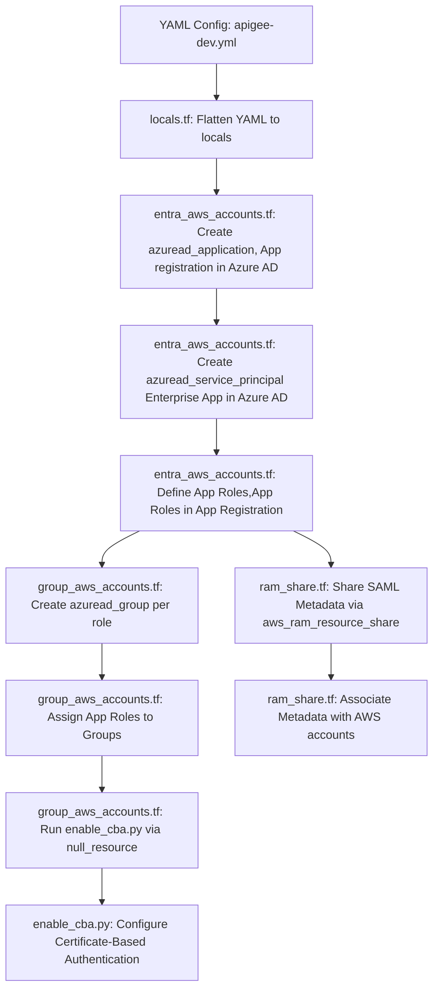

# Terraform Documentation: Entra-AWS Integration

## Overview
This document talks about  Microsoft Entra ID setup for enabling SAML federation with New AWS Accounts.

- AWS Accounts (via Enterprise Apps and App Roles)

It uses YAML inputs to drive role/group creation and integrates Certificate-Based Authentication (CBA) via Microsoft Graph.

---

##  Order of Operations

| Step | Description | Resource(s) | File |
|------|-------------|-------------|------|
| 1 | Parse YAML input | `locals` | `locals.tf` |
| 2 | Create App Registration | `azuread_application`<br> *Defines identity and permission model for an app* | `entra_aws_accounts.tf` |
| 3 | Create Enterprise App (SP) | `azuread_service_principal`<br> *Acts as the runtime identity of the application in the tenant* | `entra_aws_accounts.tf` |
| 4 | Define App Roles | Part of `azuread_application`<br> *Custom roles that can be assigned to users/groups for access control* | `entra_aws_accounts.tf` |
| 5 | Create Groups per Role | `azuread_group` | `group_aws_accounts.tf` |
| 6 | Assign Groups to Roles | `azuread_app_role_assignment` | `group_aws_accounts.tf` |
| 7 | Enable CBA | `null_resource` → `enable_cba.py` | `group_aws_accounts.tf` |
| 8 | Share SAML metadata with AWS accounts | `aws_ram_resource_share`, `aws_ram_principal_association` | `ram_share.tf` |

---

##  Testing `locals.tf` Flattening

You can validate the output of `locals` logic (especially for YAML flattening) in two easy ways:

##  Key Resources by File

### `locals.tf`
- Parses YAML files (`apigee-dev.yml`) into reusable local variables.
- Flattens role mappings for looping.

### `entra_aws_accounts.tf`
- **`azuread_application`** – defines the logical app, its manifest, and app roles.
- **`azuread_service_principal`** – represents the app's identity inside your tenant.
- **App role definitions** – permissions that groups/users can be assigned to.

### `group_aws_accounts.tf`
- **`azuread_group`** – creates Azure AD groups named after roles.
- **`azuread_app_role_assignment`** – assigns each group to an app role.
- **`null_resource` + `local-exec`** – triggers CBA script after group creation.

### `ram_share.tf`
- **`aws_ram_resource_share`** – shares the SAML metadata document.
- **`aws_ram_principal_association`** – associates the metadata with other AWS accounts.

---

##  Certificate-Based Authentication

Python script: `enable_cba.py`

- Targets **US Government** Graph API (`https://graph.microsoft.us`)
- Modifies the `X509Certificate` method configuration
- Adds new groups to the `include_targets` list
- Sets up multiple certificate bindings

---

##  Manual Steps

1. **Manually generate SAML signing certificate** in Entra portal (API not supported).
2. **SharePoint Admins** must map Azure groups to on-prem permissions.
3. **Child AWS accounts** accept RAM share and set up SSO trust.

---

##  Known Limitations

- Dynamic group membership not currently supported.
- Terraform cannot detect or re-run failed `local-exec` automatically.
- USGov Graph API lacks support for token signing cert automation.

---

##  Mermaid Diagram


---

##  ASCII Diagram

```
+---------------------------+
| YAML Config               |
| (apigee-dev.yml)          |
+------------+--------------+
             |
             v
+------------+--------------+
| locals.tf: Flatten YAML   |
+------------+--------------+
             |
             v
+---------------------------+
| entra_aws_accounts.tf     |
| - azuread_application     |
| - azuread_service_principal |
| - App Role Definitions    |
+------------+--------------+
             |
             v
+---------------------------+
| group_aws_accounts.tf     |
| - azuread_group (per role)|
| - azuread_app_role_assignment |
+------------+--------------+
             |
             v
+---------------------------+
| group_aws_accounts.tf     |
| - null_resource           |
| - local-exec → enable_cba.py |
+------------+--------------+
             |
             v
+---------------------------+
| enable_cba.py             |
| - Set up Certificate-Based|
|   Authentication (Graph)  |
+------------+--------------+

          (in parallel)
             |
             +------------------------------+
             v                              v
+---------------------------+   +---------------------------+
| ram_share.tf              |   | ram_share.tf              |
| - aws_ram_resource_share  |   | - aws_ram_principal_assoc |
+---------------------------+   +---------------------------+
```

