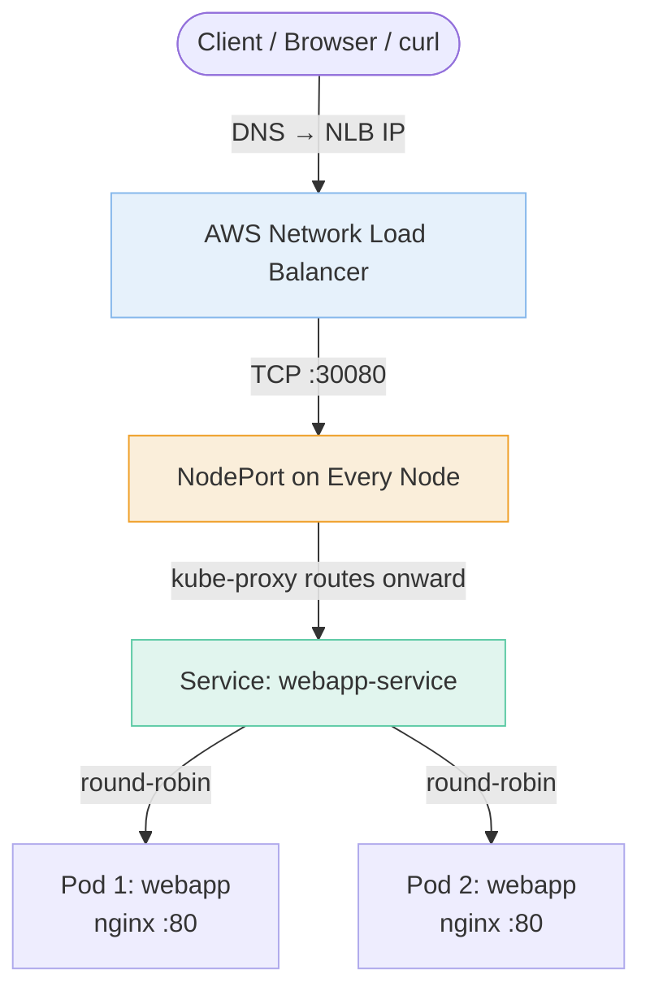
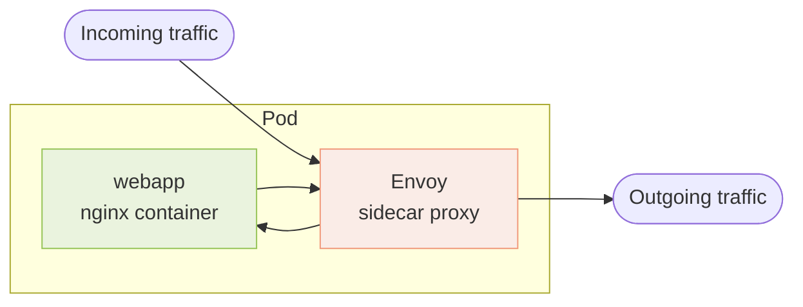
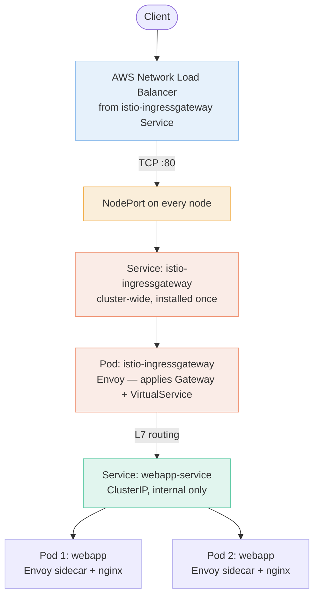
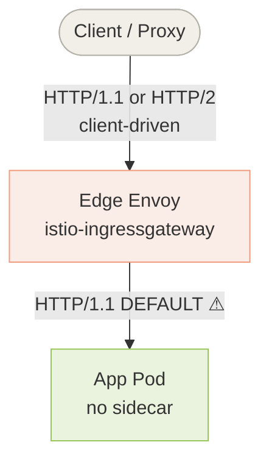
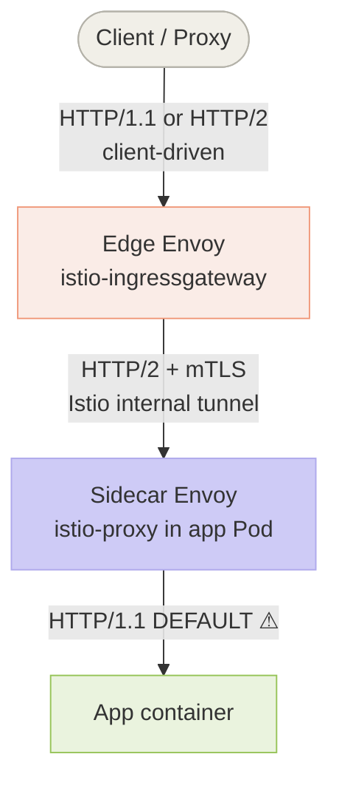
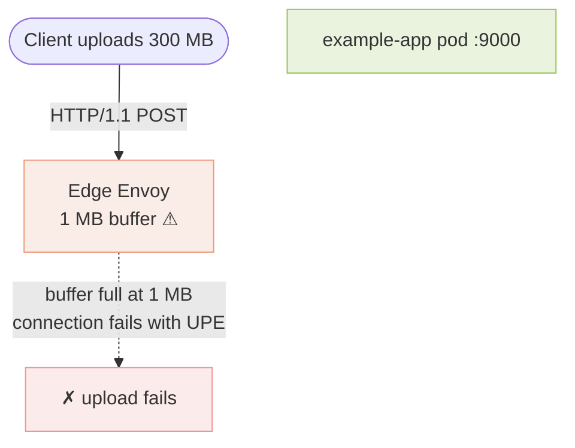
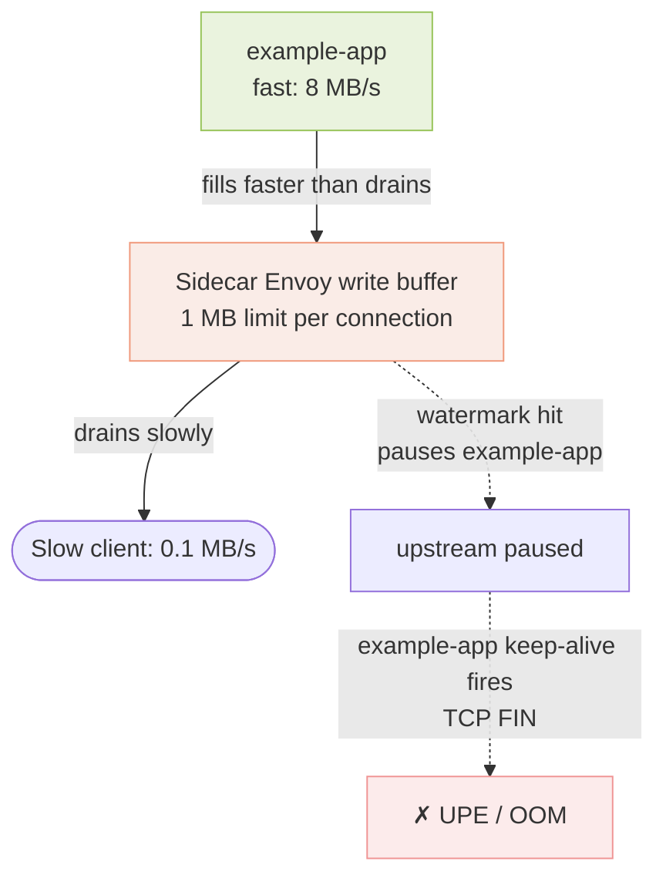

# Kubernetes & Istio Networking Guide
## A Beginner's Path from Plain Kubernetes to Service Mesh Traffic Management

> **Audience:** Engineers new to Kubernetes and Istio who want to understand how traffic flows, how to control it, and how to troubleshoot it — with real YAML examples throughout.

---

## Table of Contents

- [Part 1 — Kubernetes Foundations](#part-1--kubernetes-foundations)
- [Part 2 — Introducing Istio](#part-2--introducing-istio)
- [Part 3 — Istio Traffic Management Building Blocks](#part-3--istio-traffic-management-building-blocks)
- [Part 4 — Resilience Features](#part-4--resilience-features)
- [Part 5 — Protocol Behavior at Each Hop](#part-5--protocol-behavior-at-each-hop)
- [Part 6 — Real-World Troubleshooting](#part-6--real-world-troubleshooting)
- [Part 7 — Quick Reference](#part-7--quick-reference)

---

# Part 1 — Kubernetes Foundations

## 1.1 What is Kubernetes?

Think of Kubernetes (K8s) as an **operating system for your servers**. Instead of manually deciding which machine runs what, you describe the *desired state* and Kubernetes figures out how to achieve it.

| Object | Real-world analogy | Technical role |
|---|---|---|
| **Pod** | An individual worker | Smallest unit; runs one or more containers |
| **Deployment** | The manager | Keeps N copies of a Pod alive, handles rolling updates |
| **Service** | The office phone number | Stable internal IP that routes to shifting Pods |
| **Node** | The physical office | A VM or bare-metal server that runs Pods |

The key insight: **Pods are ephemeral — they come and go.** Services give you a stable address so clients don't have to track which Pod is alive right now.

---

## 1.2 Plain Kubernetes: Deploying a Web App

We're going to deploy a simple app called `webapp` and follow it through the entire guide. In plain Kubernetes you need exactly **two files**.

### deployment.yaml

```yaml
# deployment.yaml — tells K8s: "run 2 copies of webapp"
apiVersion: apps/v1
kind: Deployment
metadata:
  name: webapp
spec:
  replicas: 2              # run 2 Pods
  selector:
    matchLabels:
      app: webapp          # ← selector finds Pods with this label
  template:
    metadata:
      labels:
        app: webapp        # ← Pods get this label (must match above)
    spec:
      containers:
      - name: webapp
        image: nginx:latest
        ports:
        - containerPort: 80
```

**Key points:**

- `replicas: 2` — K8s always keeps 2 Pods running. If one crashes, it starts a replacement automatically.
- `app: webapp` — this label is the *wiring*. The Deployment uses it to own its Pods, and the Service uses it to find them. A mismatch means no traffic is delivered.
- `containerPort: 80` — purely informational (it documents what port the app listens on). It does **not** open any external access on its own.

### service.yaml (without Istio)

```yaml
# service.yaml — creates an AWS NLB and routes to our Pods
apiVersion: v1
kind: Service
metadata:
  name: webapp-service
spec:
  type: LoadBalancer       # tells AWS/EKS: "provision an NLB for me"
  selector:
    app: webapp            # ← finds Pods with this label
  ports:
  - port: 80               # external port (what clients connect to)
    targetPort: 80         # port on the Pod container
    nodePort: 30080        # port opened on every Node (auto-assigned if omitted)
```

**Key points:**

- `type: LoadBalancer` — on AWS/EKS this triggers the cloud controller to automatically provision a Network Load Balancer (NLB).
- `selector: app: webapp` — K8s watches all Pods with this label and builds an endpoint list. If no Pods match, traffic is dropped silently with no error.
- `nodePort: 30080` — the hidden middle layer. The NLB sends traffic to `NodeIP:30080` on any node, then `kube-proxy` routes it to the right Pod. Range must be 30000–32767.

---

## 1.3 Traffic Flow — Plain Kubernetes



> **Key insight:** The NodePort layer is invisible in your config (K8s manages it), but it's physically real. The NLB never talks directly to a Pod — it always hits a Node first, then `kube-proxy` routes to the right Pod via the Service's selector.

---

## 1.4 Service Types

| Type | Visibility | When to use |
|---|---|---|
| **ClusterIP** | Internal only | Databases, internal APIs, anything that should never be public |
| **NodePort** | Node IP + fixed port (30000–32767) | Dev/testing, or when you manage your own load balancer externally |
| **LoadBalancer** | Cloud NLB with public IP | Production services reachable from the internet |

> **LoadBalancer ⊃ NodePort ⊃ ClusterIP** — each type builds on the previous one. A `LoadBalancer` Service is secretly also a `NodePort` Service, which is secretly also a `ClusterIP` Service.

---

# Part 2 — Introducing Istio

## 2.1 Why Istio?

Plain Kubernetes is "dumb" at Layer 7 (the application layer). It can move bytes to the right Pod, but it doesn't understand HTTP paths, headers, or versions. Specifically, plain K8s can't:

- Route based on URL path (`/api/v1` vs `/api/v2`)
- Do percentage-based traffic splits (90% to v1, 10% to canary v2)
- Encrypt traffic automatically between internal services
- Retry failed requests, enforce timeouts, or trip circuit breakers
- Give you metrics, tracing, and a service map out of the box

Istio is a **service mesh** that adds all of this without requiring changes to your application code.

---

## 2.2 The Sidecar Model

Istio works by injecting a proxy called **Envoy** as a second container in every Pod — a "sidecar" that intercepts all traffic going in and out of the application container.



The app still thinks it's talking directly to the network. Istio configuration controls what the sidecar does — routing, encryption, retries, metrics — all transparently.

---

## 2.3 The Four-File Pattern

With Istio you need **four files** instead of two.

| File | Change from plain K8s |
|---|---|
| `deployment.yaml` | **Unchanged.** Istio auto-injects the Envoy sidecar. |
| `service.yaml` | Now `type: ClusterIP` — internal only. Istio handles external entry. |
| `gateway.yaml` | **New.** Tells Istio's edge proxy which ports/hostnames to accept. |
| `virtualservice.yaml` | **New.** L7 routing rules — host/path → service. |

There is also a **cluster-wide** `istio-ingressgateway` Service (type: LoadBalancer) installed once when you install Istio. You do not create this per app — it's shared across every app that uses Istio.

### service.yaml (with Istio)

```yaml
# service.yaml — now internal-only
apiVersion: v1
kind: Service
metadata:
  name: webapp-service
spec:
  type: ClusterIP          # ← changed from LoadBalancer
  selector:
    app: webapp
  ports:
  - port: 80
    targetPort: 80
    name: http             # ← port name matters to Istio (see Part 5)
```

### gateway.yaml

```yaml
# gateway.yaml — opens port 80 on the Istio edge proxy
apiVersion: networking.istio.io/v1alpha3
kind: Gateway
metadata:
  name: webapp-gateway
spec:
  selector:
    istio: ingressgateway  # targets the shared Istio edge proxy pod
  servers:
  - port:
      number: 80
      name: http
      protocol: HTTP
    hosts:
    - "*"                  # accept any hostname (use "myapp.com" in production)
```

### virtualservice.yaml

```yaml
# virtualservice.yaml — routing rules: host/* → webapp-service
apiVersion: networking.istio.io/v1alpha3
kind: VirtualService
metadata:
  name: webapp-vs
spec:
  hosts:
  - "*"
  gateways:
  - webapp-gateway         # references the Gateway above by name
  http:
  - route:
    - destination:
        host: webapp-service  # the K8s Service name
        port:
          number: 80
```

---

## 2.4 Traffic Flow — With Istio



The NLB and NodePort layers are the same as plain K8s. The difference is what happens next — traffic hits the Istio ingress gateway Pod, which reads your `Gateway` and `VirtualService` configs and does L7 routing before sending traffic on to your app's Service.

---

## 2.5 The Selector Chain — How Everything Is Wired

Nothing in Kubernetes is hardwired by position. Everything is connected by **matching labels and names**.

```mermaid
graph TD
    VS[VirtualService<br/>webapp-vs]
    GW[Gateway<br/>webapp-gateway]
    IGP[Ingress Gateway Pod<br/>label: istio=ingressgateway]
    SVC[Service<br/>webapp-service<br/>selector: app=webapp]
    P1[Pod 1<br/>label: app=webapp]
    P2[Pod 2<br/>label: app=webapp]

    VS -->|gateways: [webapp-gateway]<br/>references by name| GW
    GW -->|selector: istio=ingressgateway<br/>matches label| IGP
    VS -.->|destination.host: webapp-service<br/>routes to by name| SVC
    SVC -->|selector matches label| P1
    SVC -->|selector matches label| P2

    style VS fill:#e6f1fb,stroke:#85b7eb
    style GW fill:#e1f5ee,stroke:#5dcaa5
    style IGP fill:#faece7,stroke:#f0997b
    style SVC fill:#faeeda,stroke:#ef9f27
    style P1 fill:#eeedfe,stroke:#afa9ec
    style P2 fill:#eeedfe,stroke:#afa9ec
```

> **⚠ The #1 cause of "service unavailable" errors:**
> If `selector: app=webapp` in your Service doesn't exactly match `labels: app=webapp` on your Pods, the Service has **zero endpoints** and traffic silently drops — no error, no warning. A typo like `app: web-app` vs `app: webapp` will cost you hours.

---

# Part 3 — Istio Traffic Management Building Blocks

Istio's traffic management gives you five main resources. You've seen Gateway and VirtualService already. Now we go deeper into all five.

## 3.1 VirtualService — Routing Rules

A `VirtualService` describes **how to route** requests. It consists of a list of rules evaluated **top to bottom**; the first match wins.

### Why VirtualServices matter

Without a VirtualService, Envoy just load-balances across all Pods behind a Service. With one, you can:

- Route based on headers, URI paths, methods, query params
- Split traffic by weight (canary / A/B testing)
- Rewrite URLs, add/remove headers
- Set per-route timeouts and retry policies

### Example: routing by header

This VirtualService sends requests from user `jason` to subset `v2`; everyone else goes to `v3`.

```yaml
apiVersion: networking.istio.io/v1
kind: VirtualService
metadata:
  name: webapp-vs
spec:
  hosts:
  - webapp                 # the destination hostname
  http:
  - match:
    - headers:
        end-user:
          exact: jason
    route:
    - destination:
        host: webapp
        subset: v2         # defined in a DestinationRule (Section 3.2)
  - route:
    - destination:
        host: webapp
        subset: v3         # default — no match block means "match everything"
```

**Rule precedence:** rules are evaluated in order. Always end with a "catch-all" default rule (no `match` block) so that traffic never falls off the end of your list.

### Example: routing by URI path

This turns two separate services into what looks like one app from the outside.

```yaml
apiVersion: networking.istio.io/v1
kind: VirtualService
metadata:
  name: webapp-vs
spec:
  hosts:
  - webapp.example.com
  http:
  - match:
    - uri:
        prefix: /api/v1
    route:
    - destination:
        host: webapp-v1
  - match:
    - uri:
        prefix: /api/v2
    route:
    - destination:
        host: webapp-v2
```

### Example: weighted traffic split (canary)

```yaml
apiVersion: networking.istio.io/v1
kind: VirtualService
metadata:
  name: webapp-vs
spec:
  hosts:
  - webapp
  http:
  - route:
    - destination:
        host: webapp
        subset: v1
      weight: 75           # 75% to v1
    - destination:
        host: webapp
        subset: v2
      weight: 25           # 25% to v2 (canary)
```

You can gradually shift the weights — 90/10 → 75/25 → 50/50 → 0/100 — to roll out a new version safely.

### Match options

You can match on `exact`, `prefix`, or `regex` for most string fields. Multiple conditions inside a single `match` block are **AND**ed. Multiple `match` blocks on a single rule are **OR**ed.

---

## 3.2 DestinationRule — What Happens Once Traffic Arrives

If VirtualService is "where to send traffic," DestinationRule is "what to do once it gets there." DestinationRules are **applied after** VirtualService routing — they operate on the real destination.

### Three main jobs

1. **Define subsets** — named groups of Pods (usually by version label) that VirtualServices can target.
2. **Set load-balancing policy** — round-robin, random, consistent hash, etc.
3. **Configure connection-pool settings** — max connections, idle timeouts, HTTP/2 upgrade, circuit breakers.

### Example: subsets + load balancing

```yaml
apiVersion: networking.istio.io/v1
kind: DestinationRule
metadata:
  name: webapp-dr
spec:
  host: webapp
  trafficPolicy:
    loadBalancer:
      simple: RANDOM       # default for all subsets
  subsets:
  - name: v1
    labels:
      version: v1          # matches Pods with label version=v1
  - name: v2
    labels:
      version: v2
    trafficPolicy:
      loadBalancer:
        simple: ROUND_ROBIN  # override for this subset only
  - name: v3
    labels:
      version: v3
```

Subsets are how you group Pods. They're just labels — your Pods need the `version: v1` label for the `v1` subset to find them. The VirtualService references subsets by name.

### Load-balancing options

| Policy | Behavior |
|---|---|
| `LEAST_REQUEST` (default) | Picks the host with the fewest active requests (from a random sample of 2) |
| `RANDOM` | Random Pod every time |
| `ROUND_ROBIN` | Each Pod in sequence |
| `PASSTHROUGH` | Let the client's original destination IP pass through (rare) |
| Consistent hash (by header/cookie) | Sticky sessions — same user keeps hitting the same Pod |

### Example: connection-pool settings (used heavily in Part 6)

```yaml
apiVersion: networking.istio.io/v1
kind: DestinationRule
metadata:
  name: webapp-dr
spec:
  host: webapp
  trafficPolicy:
    connectionPool:
      tcp:
        maxConnections: 100
      http:
        http1MaxPendingRequests: 1000
        h2UpgradePolicy: UPGRADE   # force HTTP/2 to this service
        idleTimeout: 90s
```

---

## 3.3 Gateway — The Edge Door

A `Gateway` configures the **edge proxy** (usually `istio-ingressgateway`) — which ports and hostnames to accept. It's L4-L6 only (ports, TLS), and you pair it with a VirtualService for L7 routing.

### Example: HTTPS ingress

```yaml
apiVersion: networking.istio.io/v1
kind: Gateway
metadata:
  name: webapp-gateway
spec:
  selector:
    istio: ingressgateway  # label of the ingress gateway Pod
  servers:
  - port:
      number: 443
      name: https
      protocol: HTTPS
    hosts:
    - webapp.example.com
    tls:
      mode: SIMPLE
      credentialName: webapp-tls-cert  # K8s secret holding the cert
```

This opens port 443 with TLS, but doesn't specify routing. Binding a VirtualService to it is what makes traffic actually reach your app.

**Gateway vs VirtualService in one line:**
- **Gateway** — *opens the door* (which ports/hosts are accepted)
- **VirtualService** — *directs the visitor* (where to send them once inside)

### Egress gateways

You can also use gateways for *outgoing* traffic — a dedicated exit node for traffic leaving the mesh. This is useful for auditing, security, and enforcing which services may call external APIs.

---

## 3.4 ServiceEntry — Bringing External Services Into the Mesh

By default, Istio only knows about services inside your cluster. A `ServiceEntry` adds an external service (an API on the internet, a legacy VM, a managed database) to Istio's internal service registry — so you can apply VirtualServices, DestinationRules, timeouts, and retries to external traffic too.

### Example: adding an external API

```yaml
apiVersion: networking.istio.io/v1
kind: ServiceEntry
metadata:
  name: external-api
spec:
  hosts:
  - api.example.com
  ports:
  - number: 443
    name: https
    protocol: HTTPS
  location: MESH_EXTERNAL
  resolution: DNS
```

Once added, you can apply a DestinationRule to control the connection pool or timeout:

```yaml
apiVersion: networking.istio.io/v1
kind: DestinationRule
metadata:
  name: external-api-dr
spec:
  host: api.example.com
  trafficPolicy:
    connectionPool:
      tcp:
        connectTimeout: 1s
```

> You don't strictly need a ServiceEntry for every external service — Istio passes unknown-destination traffic through by default. But without one, you lose all Istio features for that traffic.

---

## 3.5 Sidecar — Scoping Proxy Reach

By default, every Envoy sidecar is configured to reach every service in the mesh. In a large cluster with thousands of services, this blows up the config size and memory usage of every sidecar.

A `Sidecar` resource lets you limit which services a sidecar needs to know about.

### Example: scope to namespace

```yaml
apiVersion: networking.istio.io/v1
kind: Sidecar
metadata:
  name: default
  namespace: webapp-ns
spec:
  egress:
  - hosts:
    - "./*"                # services in the current namespace
    - "istio-system/*"     # the Istio control plane (required)
```

This tells every Envoy in `webapp-ns` that it only needs config for services in its own namespace plus the Istio control plane — cutting memory use dramatically in large meshes.

---

# Part 4 — Resilience Features

Istio provides opt-in fault-tolerance features. They're all **configured in YAML** and transparent to your application code.

## 4.1 Timeouts

The default HTTP timeout in Istio is **disabled** (unlimited). For most services you want a sensible limit so that slow backends don't pile up.

```yaml
apiVersion: networking.istio.io/v1
kind: VirtualService
metadata:
  name: webapp-vs
spec:
  hosts:
  - webapp
  http:
  - route:
    - destination:
        host: webapp
        subset: v1
    timeout: 10s           # max 10s for the complete response
```

> **Watch out for double timeouts.** If your application code also sets a timeout (say 2s) on calls to `webapp`, the application timeout fires first and your Istio timeout never gets a chance. Pick one layer to own the timeout.

---

## 4.2 Retries

Istio retries failed HTTP calls automatically. Default is **2 attempts**. The interval between retries (25ms+) is jittered automatically to avoid thundering-herd problems.

```yaml
apiVersion: networking.istio.io/v1
kind: VirtualService
metadata:
  name: webapp-vs
spec:
  hosts:
  - webapp
  http:
  - route:
    - destination:
        host: webapp
        subset: v1
    retries:
      attempts: 3          # 3 retries after initial failure
      perTryTimeout: 2s    # each attempt gets 2 seconds
```

Retries help with transient errors (a Pod restarting, a brief network hiccup). They can hurt if the failure is non-transient — you're just piling more load onto a failing service.

---

## 4.3 Circuit Breakers

Circuit breakers stop sending traffic to a host that's already struggling — fail fast instead of making the problem worse. Configure them in a **DestinationRule**.

```yaml
apiVersion: networking.istio.io/v1
kind: DestinationRule
metadata:
  name: webapp-dr
spec:
  host: webapp
  subsets:
  - name: v1
    labels:
      version: v1
    trafficPolicy:
      connectionPool:
        tcp:
          maxConnections: 100       # hard cap on TCP connections
        http:
          http1MaxPendingRequests: 10  # queue depth limit
          maxRequestsPerConnection: 100
      outlierDetection:
        consecutive5xxErrors: 5     # after 5 5xx errors in a row...
        interval: 30s
        baseEjectionTime: 30s       # ...eject the Pod for 30s
```

This configuration ejects an individual Pod from the load-balancing pool if it returns five 5xx errors in a row — for 30 seconds, no traffic goes to it, giving it a chance to recover.

---

## 4.4 Fault Injection

Before you trust your resilience config, you have to test it. Istio lets you inject faults at the application layer — delays and aborts — without any test-harness code in your services.

### Example: delay 0.1% of requests by 5 seconds

```yaml
apiVersion: networking.istio.io/v1
kind: VirtualService
metadata:
  name: webapp-vs
spec:
  hosts:
  - webapp
  http:
  - fault:
      delay:
        percentage:
          value: 0.1       # 0.1% of requests
        fixedDelay: 5s
    route:
    - destination:
        host: webapp
        subset: v1
```

### Example: abort 10% of requests with HTTP 503

```yaml
spec:
  hosts:
  - webapp
  http:
  - fault:
      abort:
        percentage:
          value: 10
        httpStatus: 503
    route:
    - destination:
        host: webapp
        subset: v1
```

> **Gotcha:** Fault injection **cannot** be combined with retries or timeouts on the same VirtualService rule. Test faults in a dedicated rule.

---

# Part 5 — Protocol Behavior at Each Hop

Now we transition from "what Istio can do" into "what actually happens on the wire." The troubleshooting in Part 6 builds on this.

## 5.1 HTTP Versions — Client to App

Different hops speak different HTTP versions by default. The NLB layer (TCP passthrough) is HTTP-agnostic — we only care about the HTTP-aware hops.

### Path A — App outside the mesh (no sidecar)



### Path B — App inside the mesh (sidecar injected)



### Protocol defaults at each hop

| Hop | Default | Why |
|---|---|---|
| Client → Edge Envoy | HTTP/1.1 or /2 | Client decides; NLB passes through unchanged |
| Edge Envoy → App (no sidecar) | **HTTP/1.1 ⚠** | Envoy default. Port named `http` = HTTP/1.1 |
| Edge Envoy → Sidecar | HTTP/2 + mTLS | Istio always uses HTTP/2 for proxy-to-proxy tunnels |
| Sidecar → App container | **HTTP/1.1 ⚠** | Sidecar delivers plain HTTP to the app by default |

The critical default is **HTTP/1.1 on the last leg** (Envoy → app). This is what causes the problems in Part 6.

---

## 5.2 Why HTTP/1.1 Causes Problems with Large Transfers

On HTTP/1.1, Envoy buffers the full request or response body before forwarding it. The default per-connection buffer limit is **1 MB**. For small API calls this is invisible. For large file uploads or downloads it's a disaster:

- **Large uploads** → Envoy tries to buffer the whole body, hits the 1 MB limit, connection fails with `upstream protocol error (UPE)`.
- **Large downloads** → Envoy buffers from a fast upstream into memory while a slow client drains it slowly, triggering watermark backpressure (see Part 6.3).

HTTP/2 fixes this because it uses **streaming frames** with per-stream flow control — no full-body buffering required.

---

## 5.3 Forcing HTTP/2 with a DestinationRule

Two ways to upgrade a hop to HTTP/2:

**Option 1 — name the port `http2` on the Service**

```yaml
apiVersion: v1
kind: Service
metadata:
  name: webapp-service
spec:
  ports:
  - port: 80
    targetPort: 80
    name: http2            # ← Istio treats this as HTTP/2
```

**Option 2 — explicit DestinationRule (preferred, more visible)**

```yaml
apiVersion: networking.istio.io/v1
kind: DestinationRule
metadata:
  name: webapp-h2
spec:
  host: webapp-service.webapp-ns.svc.cluster.local
  trafficPolicy:
    connectionPool:
      http:
        h2UpgradePolicy: UPGRADE   # force HTTP/2 — streaming, no body buffering
```

### Verification

```bash
istioctl proxy-config cluster <YOUR_POD> -n <NAMESPACE> \
  --fqdn webapp-service.<NAMESPACE>.svc.cluster.local -o json \
  | jq '.[].typedExtensionProtocolOptions'
# Should show: http2_protocol_options
```

---

# Part 6 — Real-World Troubleshooting

For this part we switch our example from `webapp` (nginx, small HTTP responses) to **`example-app`** — an S3-compatible object store used for large file upload and download. Small-file problems don't exercise the buffer and timeout limits; large-file problems do.

## 6.1 Large Upload Failures

### Symptom

Uploads of 300 MB to example-app fail consistently with upstream protocol errors.

### Cause

On HTTP/1.1, Envoy tries to buffer the full request body before forwarding. When the body exceeds the per-connection buffer limit (1 MB default), Envoy fails the upstream connection with `UPE (upstream protocol error)`.



### Detection

```bash
# 1. Check the port name on example-app's Service (http = HTTP/1.1, http2 = HTTP/2)
kubectl get svc example-app -n <NAMESPACE> -o jsonpath='{.spec.ports[*].name}'

# 2. Inspect Envoy cluster config for example-app
istioctl proxy-config cluster <YOUR_POD> -n <NAMESPACE> \
  --fqdn example-app.<NAMESPACE>.svc.cluster.local -o json \
  | jq '.[].typedExtensionProtocolOptions // "HTTP/1.1 (default)"'

# 3. Live HTTP/1 vs HTTP/2 counters
kubectl port-forward <INGRESSGATEWAY_POD> -n istio-system 15000:15000
curl -s localhost:15000/stats | grep -E "upstream_cx_http1|upstream_cx_http2"
```

### Fix

Apply the HTTP/2 DestinationRule from Part 5.3:

```yaml
apiVersion: networking.istio.io/v1
kind: DestinationRule
metadata:
  name: example-app-h2
  namespace: <NAMESPACE>
spec:
  host: example-app.<NAMESPACE>.svc.cluster.local
  trafficPolicy:
    connectionPool:
      http:
        h2UpgradePolicy: UPGRADE
```

HTTP/2 streams frames as they arrive — no full-body buffering — so uploads of any size succeed.

---

## 6.2 Intermittent Download Failures

### Symptom

Downloads of large files from example-app fail intermittently. Some succeed, some fail mid-stream with truncated files or connection resets.

Unlike upload failures (which are consistent once above the buffer limit), download failures are **timing-dependent**. The file starts downloading fine, then something closes the connection before it's done.

### The five most likely causes

| # | Cause | Mechanism | Response flag |
|---|---|---|---|
| 1 | `stream_idle_timeout` fires | Default 5 min — slow download or paused flow kills the stream | `SI` |
| 2 | Route timeout (15s default) | Istio's default route timeout kicks in mid-download | `UT` |
| 3 | Stale HTTP/1.1 connection reuse | Envoy picks a pooled connection that example-app already closed | `UC` |
| 4 | Write-buffer backpressure | Fast example-app fills buffer faster than slow client drains it | `DT` |
| 5 | `HPE_INVALID_EOF_STATE` race | example-app sends FIN exactly when Envoy reads last chunk (HTTP/1.1) | `UF` + `HPE_INVALID_EOF` in logs |

### Response flag reference

Every Envoy access log line includes a **response flag** after the status code — it's the fastest way to pin the cause.

```
[2024-01-01T12:00:00.000Z] "GET /example-app/file.zip HTTP/1.1" 503 UC ...
                                                               ^^
                                                               response flag
```

| Flag | Meaning | Likely cause |
|---|---|---|
| `SI` | Stream idle timeout | #1 — slow download exceeded 5 min |
| `UT` | Upstream request timeout | #2 — 15s route timeout fired |
| `UC` | Upstream connection terminated | #3 — stale connection reuse |
| `UF` | Upstream connection failure | #3 or #5 — connection reset or EOF race |
| `DT` | Downstream connection terminated | #4 — slow client disconnected |

### Diagnostic commands

```bash
# Look at the response flag in ingressgateway logs for failing requests
kubectl logs -l app=istio-ingressgateway -n istio-system --tail=200 | grep -v " 200 "

# Check the current route timeout on the example-app path
# "0s" = unlimited, "15s" with no explicit config = Istio default firing
istioctl proxy-config routes <INGRESSGATEWAY_POD> -n istio-system -o json \
  | jq '.[] .virtualHosts[].routes[] \
  | select(.match.prefix=="/") \
  | {timeout:.route.timeout, idleTimeout:.route.idleTimeout}'

# Check stream_idle_timeout (default 300s = 5 min)
kubectl port-forward <INGRESSGATEWAY_POD> -n istio-system 15000:15000
curl -s localhost:15000/config_dump \
  | jq '.. | .stream_idle_timeout? // empty'

# Check for stale-connection events (rising count = cause #3)
curl -s localhost:15000/stats \
  | grep -E "upstream_cx_destroy_remote_with_active_rq|upstream_rq_retry|upstream_cx_http1_total"

# Enable debug logging temporarily to capture reset reasons
istioctl proxy-config log <INGRESSGATEWAY_POD> -n istio-system --level http:debug,connection:debug
kubectl logs <INGRESSGATEWAY_POD> -n istio-system -f | grep -E "example-app|reset|timeout|EOF"
# Reset when done
istioctl proxy-config log <INGRESSGATEWAY_POD> -n istio-system --level default
```

### Fixes by cause

**Fix #1 + #2 — VirtualService with disabled route timeout**

```yaml
apiVersion: networking.istio.io/v1
kind: VirtualService
metadata:
  name: example-app-vs
  namespace: <NAMESPACE>
spec:
  hosts:
  - example-app-service
  http:
  - timeout: 0s            # 0s = disable route timeout for large downloads
    route:
    - destination:
        host: example-app-service
        port:
          number: 9000
```

**Fix #1 — extend `stream_idle_timeout` at the ingress gateway**

```yaml
apiVersion: networking.istio.io/v1
kind: EnvoyFilter
metadata:
  name: example-app-stream-idle-timeout
  namespace: istio-system
spec:
  workloadSelector:
    labels:
      app: istio-ingressgateway
  configPatches:
  - applyTo: NETWORK_FILTER
    match:
      listener:
        filterChain:
          filter:
            name: envoy.filters.network.http_connection_manager
    patch:
      operation: MERGE
      value:
        typed_config:
          "@type": type.googleapis.com/envoy.extensions.filters.network.http_connection_manager.v3.HttpConnectionManager
          stream_idle_timeout: 3600s   # 1 hour — tune to largest expected download
```

**Fix #3, #4, #5 — DestinationRule with HTTP/2 + tight idle timeout**

```yaml
apiVersion: networking.istio.io/v1
kind: DestinationRule
metadata:
  name: example-app-connpool
  namespace: <NAMESPACE>
spec:
  host: example-app.<NAMESPACE>.svc.cluster.local
  trafficPolicy:
    connectionPool:
      http:
        idleTimeout: 90s          # MUST be less than example-app's server keep-alive
        h2UpgradePolicy: UPGRADE  # HTTP/2 also eliminates causes 3 and 5
```

> **Why HTTP/2 fixes so many download failures at once:** HTTP/2 uses multiplexed streams with explicit `END_STREAM` frames. No connection-close race (kills cause #5). No keep-alive stale-connection issue (kills cause #3). Per-stream flow control instead of per-connection TCP backpressure (kills cause #4). The single highest-leverage fix for intermittent download failures on example-app.

### Which fix addresses which cause

| Cause | Fix | Object |
|---|---|---|
| 1 — `stream_idle_timeout` | `stream_idle_timeout: 3600s` | EnvoyFilter |
| 2 — Route timeout 15s default | `timeout: 0s` | VirtualService |
| 3 — Stale HTTP/1.1 connection | `idleTimeout: 90s` + HTTP/2 | DestinationRule |
| 4 — Slow-client backpressure | HTTP/2 | DestinationRule |
| 5 — `HPE_INVALID_EOF` race | HTTP/2 | DestinationRule |

---

## 6.3 Sidecar Resource Pressure

### Symptom

Downloads fail intermittently with no obvious Envoy log entry. Client sees "Unexpected Response" or "Download Incomplete."

### The mechanism

example-app sends data at 8 MB/s into the sidecar's write buffer. A slow client drains it at 0.1 MB/s. The buffer fills at a net 7.9 MB/s. Envoy's default `per_connection_buffer_limit_bytes` is **1 MB** — once that fills, Envoy triggers `Disabling upstream stream due to downstream stream watermark` and pauses example-app.

Under many concurrent slow downloads, each one holds up to 1 MB of buffered data. At Istio's default 128 MiB memory request, ten concurrent slow downloads put the sidecar under real memory pressure. If it hits the memory limit and gets **OOMKilled**, the kernel resets all connections instantly — producing exactly the "download incomplete" errors with no warning in Envoy logs, because the process simply died.



### Istio sidecar default resources (mesh defaults)

| Resource | Default request | Default limit | Risk |
|---|---|---|---|
| Memory | 128 Mi | 1024 Mi | Real pressure with many slow clients |
| CPU | 100 m | 2000 m | CPU throttle slows buffer draining, worsens backpressure |
| `per_connection_buffer_limit_bytes` | 1 MB (Envoy default) | — | Triggers watermark at 1 MB backlog per connection |

### Diagnostic commands

```bash
# 1. Check sidecar resource config
kubectl get pod -l app=example-app -n <NAMESPACE> -o json \
  | jq '.items[].spec.containers[] | {name:.name, resources:.resources}'

# 2. Check pod annotations that override mesh defaults
kubectl get pod -l app=example-app -n <NAMESPACE> \
  -o jsonpath='{range .items[*]}{.metadata.name}{"\n"}{.metadata.annotations}{"\n\n"}{end}'

# 3. Live resource usage
kubectl top pod -l app=example-app -n <NAMESPACE> --containers

# 4. Recent OOMKill events (!!)
kubectl get pod -l app=example-app -n <NAMESPACE> -o json \
  | jq '.items[].status.containerStatuses[] | {name:.name, restartCount:.restartCount, lastState:.lastState}'
# Look for: "reason": "OOMKilled" on istio-proxy

# 5. Envoy's own memory + watermark stats
kubectl exec -it <example-app_POD> -n <NAMESPACE> -c istio-proxy \
  -- curl -s localhost:15000/stats \
  | grep -E "server.memory|buffer|watermark"
# Key: downstream_flow_control_paused_reading_total rising = buffer pressure is active

# 6. Current per-connection buffer limit
kubectl exec -it <example-app_POD> -n <NAMESPACE> -c istio-proxy \
  -- curl -s localhost:15000/config_dump \
  | jq '.. | .per_connection_buffer_limit_bytes? // empty' | sort -u
# Default 1048576 (1 MB)
```

### Two fixes — band-aid vs root cause

**Band-aid: increase sidecar resources** (buys time, doesn't fix the underlying problem)

```yaml
spec:
  template:
    metadata:
      annotations:
        sidecar.istio.io/proxyCPU: "500m"
        sidecar.istio.io/proxyCPULimit: "2000m"
        sidecar.istio.io/proxyMemory: "512Mi"
        sidecar.istio.io/proxyMemoryLimit: "2048Mi"
```

**Root fix: HTTP/2** (eliminates the buffer accumulation entirely)

```yaml
apiVersion: networking.istio.io/v1
kind: DestinationRule
metadata:
  name: example-app-h2
  namespace: <NAMESPACE>
spec:
  host: example-app.<NAMESPACE>.svc.cluster.local
  trafficPolicy:
    connectionPool:
      http:
        h2UpgradePolicy: UPGRADE
        idleTimeout: 90s
```

HTTP/2 uses per-stream flow control negotiated between Envoy and example-app at the protocol level. Envoy never has to hold a growing write buffer — it tells example-app to slow down directly. The write buffer stays near zero regardless of client speed.

### Verify the fix

```bash
# Confirm HTTP/2 is now in use
istioctl proxy-config cluster <example-app_POD> -n <NAMESPACE> \
  --fqdn example-app.<NAMESPACE>.svc.cluster.local -o json \
  | jq '.[].typedExtensionProtocolOptions'

# Confirm watermark events stop occurring
kubectl exec -it <example-app_POD> -n <NAMESPACE> -c istio-proxy \
  -- curl -s localhost:15000/stats \
  | grep downstream_flow_control_paused_reading_total
# Counter should stop rising
```

### Priority order for example-app-style large-file services

1. **Check for OOMKill first** — if present, it's already causing failures
2. **Apply `h2UpgradePolicy: UPGRADE`** — root fix, eliminates buffer pressure
3. **Set `timeout: 0s` in VirtualService** — removes 15s route timeout
4. **Extend `stream_idle_timeout`** if downloads exceed 5 minutes
5. **Add resource annotations** only if concurrent slow downloads are expected

---

# Part 7 — Quick Reference

## 7.1 Plain Kubernetes vs Istio Side-by-Side

| | Without Istio | With Istio |
|---|---|---|
| **Files needed** | `deployment.yaml`, `service.yaml` (LoadBalancer) | `deployment.yaml`, `service.yaml` (ClusterIP), `gateway.yaml`, `virtualservice.yaml` |
| **External entry** | Your app's Service (LoadBalancer) | `istio-ingressgateway` (cluster-wide, shared) |
| **Routing control** | L4 only (IP + port) | L7 (host, path, headers, weights) |
| **Traffic visibility** | None built-in | Metrics, tracing, mTLS between Pods |
| **App Service type** | LoadBalancer | ClusterIP |
| **NLB count** | One per app Service | One shared for whole cluster |
| **Proxy in Pod** | None | Envoy sidecar (auto-injected) |

## 7.2 Memory Anchors

**Without Istio:**
```
NLB → NodePort → Service → Pod
```
Two files. Your Service *is* the load balancer.

**With Istio:**
```
NLB → NodePort → Envoy (ingress) → VirtualService rules → Service → Pod (Envoy sidecar)
```
Four files. Istio owns the entry point; your Service becomes internal-only.

## 7.3 The Selector Rule (never forget)

> If `selector: app=webapp` in your Service doesn't exactly match `labels: app=webapp` on your Pods, the Service has zero endpoints and traffic silently drops — no error, no warning.

## 7.4 Gateway vs VirtualService

- **Gateway** = *opens the door* (which ports/hosts to accept)
- **VirtualService** = *directs the visitor* (where to send them once inside)

## 7.5 Traffic Management Resource Cheat Sheet

| Resource | Purpose |
|---|---|
| `VirtualService` | How to route — rules, matches, weights, retries, timeouts, fault injection |
| `DestinationRule` | What happens once traffic arrives — subsets, load balancing, connection pool, circuit breakers, HTTP/2 upgrade |
| `Gateway` | Edge L4-L6 config — which ports/hosts/TLS to accept |
| `ServiceEntry` | Add external services to Istio's registry |
| `Sidecar` | Limit which services a sidecar needs to know about (performance at scale) |
| `EnvoyFilter` | Low-level Envoy config overrides (last resort) |

## 7.6 Minimum Recommended Config for Large-File Services

For any service handling large uploads/downloads (example-app, S3 gateway, file upload API):

```yaml
---
# 1. VirtualService — disable route timeout
apiVersion: networking.istio.io/v1
kind: VirtualService
metadata:
  name: example-app-vs
  namespace: <NAMESPACE>
spec:
  hosts:
  - example-app-service
  http:
  - timeout: 0s
    route:
    - destination:
        host: example-app-service
        port:
          number: 9000
---
# 2. DestinationRule — HTTP/2 + tight idle timeout
apiVersion: networking.istio.io/v1
kind: DestinationRule
metadata:
  name: example-app-connpool
  namespace: <NAMESPACE>
spec:
  host: example-app.<NAMESPACE>.svc.cluster.local
  trafficPolicy:
    connectionPool:
      http:
        h2UpgradePolicy: UPGRADE
        idleTimeout: 90s
---
# 3. EnvoyFilter — extend stream idle timeout (only if downloads > 5 min)
apiVersion: networking.istio.io/v1
kind: EnvoyFilter
metadata:
  name: example-app-stream-idle-timeout
  namespace: istio-system
spec:
  workloadSelector:
    labels:
      app: istio-ingressgateway
  configPatches:
  - applyTo: NETWORK_FILTER
    match:
      listener:
        filterChain:
          filter:
            name: envoy.filters.network.http_connection_manager
    patch:
      operation: MERGE
      value:
        typed_config:
          "@type": type.googleapis.com/envoy.extensions.filters.network.http_connection_manager.v3.HttpConnectionManager
          stream_idle_timeout: 3600s
```

## 7.7 Common Failure Modes

| Symptom | Likely cause | First check |
|---|---|---|
| Service has no endpoints | Label/selector mismatch | `kubectl get endpoints <service>` |
| 503 immediately on all requests | No matching Pods or wrong port | `kubectl describe svc <service>` |
| Large upload fails with UPE | HTTP/1.1 + 1 MB buffer limit | Service port name — is it `http` or `http2`? |
| Download truncated intermittently | stream idle timeout / route timeout / stale connection | Response flag in ingress logs (`SI`, `UT`, `UC`) |
| Download fails with no Envoy log | Sidecar OOMKilled | `kubectl get pod … -o json` → `lastState.terminated.reason` |
| Gateway defined but 404 on all requests | No VirtualService bound to it | `kubectl get virtualservice` |
| Canary getting 0% traffic | Subset label doesn't match Pod labels | Pod labels vs DestinationRule subset labels |

---

*End of guide.*
