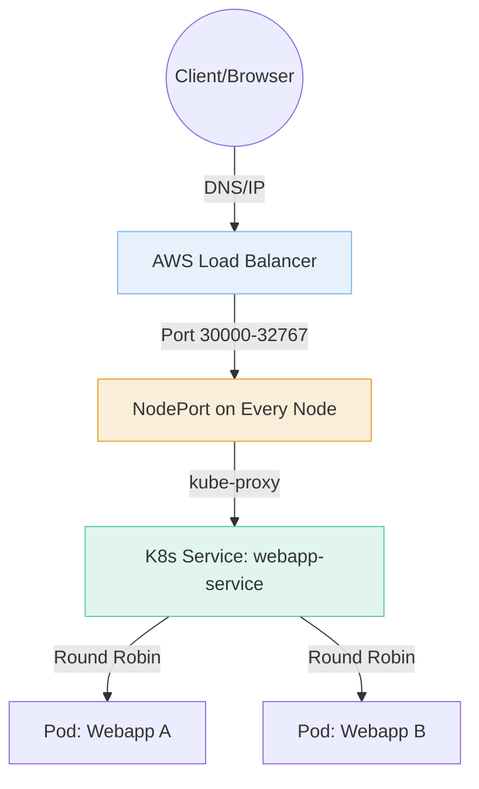
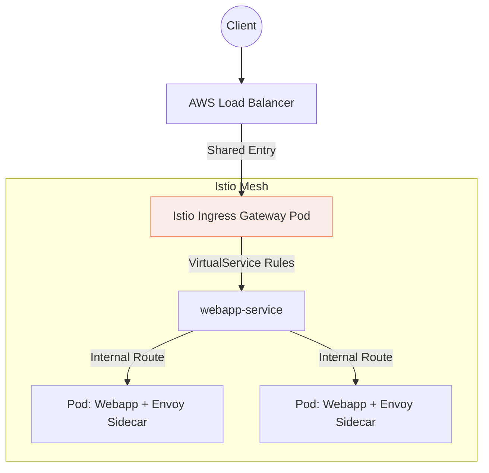
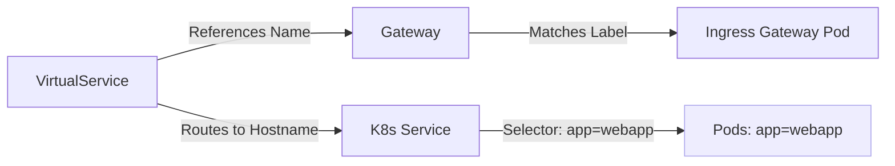

# Kubernetes Networking Guide: From Plain K8s to Istio
## A Beginner’s Path to Traffic Management

---

## What is Kubernetes? The Mental Model

Think of Kubernetes (K8s) as an **operating system for your data center**. You don't manage servers; you manage "desired states."

| Object | Real-world Analogy | Technical Role |
| :--- | :--- | :--- |
| **Pod** | An individual worker | The smallest unit; runs your container. |
| **Deployment** | The manager | Ensures the right number of workers are healthy. |
| **Service** | The office phone number | A stable internal IP that routes to shifting Pods. |
| **Node** | The physical office | A VM or bare-metal server where Pods live. |

---

## Part 1: Standard Kubernetes (No Istio)

In basic K8s, you expose an app by creating a **Service** of `type: LoadBalancer`. This tells your cloud provider (like AWS) to spin up a physical Load Balancer.

### 1. The Configuration

**deployment.yaml**
```yaml
apiVersion: apps/v1
kind: Deployment
metadata:
  name: webapp
spec:
  replicas: 2              # Maintain 2 copies of the app
  selector:
    matchLabels:
      app: webapp          # Finds Pods with this label
  template:
    metadata:
      labels:
        app: webapp        # Injects this label into Pods
    spec:
      containers:
      - name: webapp
        image: nginx:latest
        ports:
        - containerPort: 80
```

**service.yaml**
```yaml
apiVersion: v1
kind: Service
metadata:
  name: webapp-service
spec:
  type: LoadBalancer       # Provisions an external AWS NLB/ELB
  selector:
    app: webapp            # Connects the LB to the Pods
  ports:
  - port: 80               # External port
    targetPort: 80         # Internal Pod port
```

### 2. Standard Traffic Flow
The traffic hops from the internet through a physical balancer, into a specific high-range port on the server (**NodePort**), and finally to your app.



---

## Part 2: Adding Istio (The Service Mesh)

**Why Istio?** Standard K8s is "dumb" at Layer 7. It doesn't understand URLs like `/api/v1` vs `/api/v2`, it can't do easy A/B testing, and it doesn't encrypt traffic between internal apps.

Istio injects a **Sidecar Proxy (Envoy)** into every Pod. Now, your app doesn't talk to the network; it talks to its proxy, which handles the heavy lifting.

### 1. The Files Change
Instead of 2 files, you now use **4 files**. Note that your Service changes to `type: ClusterIP` because it no longer needs to be public—Istio handles the "doorway."

| Resource | Role in Istio |
| :--- | :--- |
| **Deployment** | **Same**, but Istio adds a "Sidecar" container automatically. |
| **Service** | **Internal Only.** Becomes `type: ClusterIP`. |
| **Gateway** | **The Door.** Defines which ports/hosts can enter the cluster. |
| **VirtualService** | **The GPS.** Defines the rules (e.g., "If path is /v2, go to Service B"). |

### 2. The Istio Configs

**gateway.yaml**
```yaml
apiVersion: networking.istio.io/v1alpha3
kind: Gateway
metadata:
  name: webapp-gateway
spec:
  selector:
    istio: ingressgateway # Uses the shared cluster-wide Load Balancer
  servers:
  - port:
      number: 80
      name: http
      protocol: HTTP
    hosts:
    - "*"
```

**virtualservice.yaml**
```yaml
apiVersion: networking.istio.io/v1alpha3
kind: VirtualService
metadata:
  name: webapp-vs
spec:
  hosts:
  - "*"
  gateways:
  - webapp-gateway
  http:
  - route:
    - destination:
        host: webapp-service # Points to the standard K8s Service
        port:
          number: 80
```

### 3. Istio Traffic Flow
Notice how the "Ingress Gateway" is now a central brain that makes routing decisions before hitting your app.



---

## Part 3: The Selector Chain (How things connect)

Kubernetes uses **Labels**, not IPs, to connect resources. If one character is wrong, traffic drops.



> **Warning:** If your Service selector is `app: web-app` but your Pod label is `app: webapp`, the Service will show **zero endpoints**. This is the #1 cause of "Service Unavailable" errors.

---

## Summary Comparison

| Feature | Without Istio | With Istio |
| :--- | :--- | :--- |
| **Config Load** | Low (2 files) | Moderate (4 files) |
| **Traffic Rules** | Basic Round Robin | Advanced (Path-based, Header-based) |
| **Security** | Manual TLS | Automatic mTLS between services |
| **Visibility** | Simple logs | Full metrics, traces, and service maps |
| **Cost** | 1 Cloud LB per Service | 1 Shared Cloud LB for the whole Mesh |

**Memory Anchor:**
* **Standard K8s** is like a house with a front door for every room.
* **Istio** is like a hotel with one lobby (Gateway) and a concierge (VirtualService) who tells you which room to go to.


