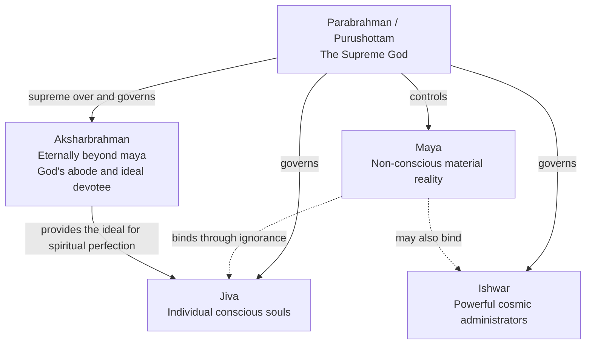
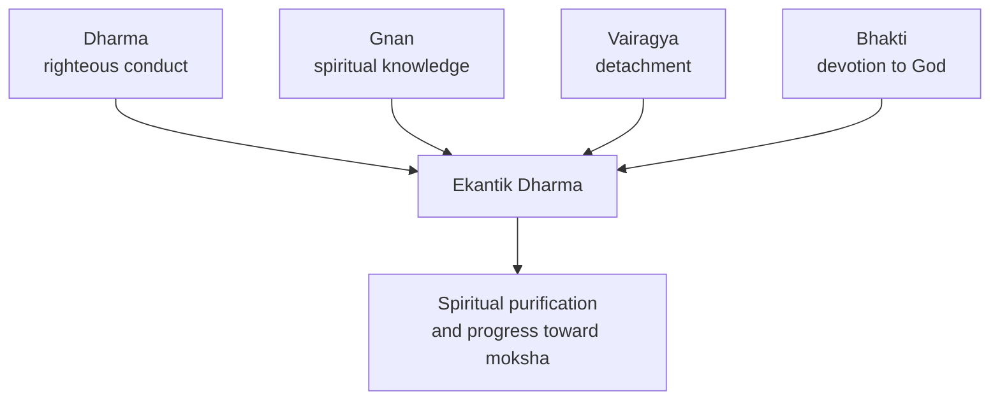
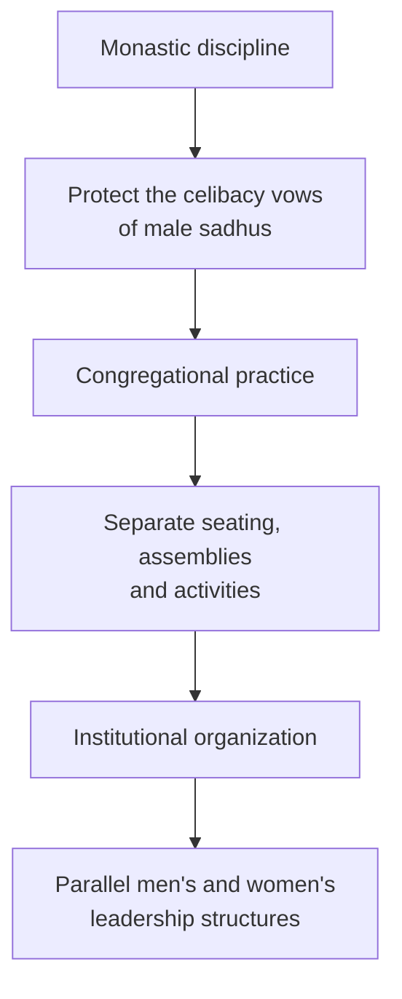
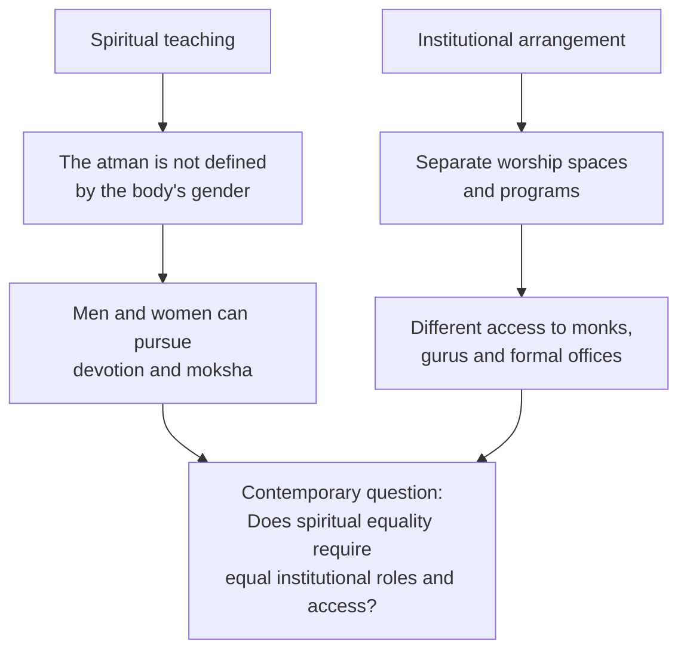

# Swaminarayan Philosophy and Gender Separation

## Theology, Practice, Historical Context, and Contemporary Interpretation

## Introduction

The **Swaminarayan Sampraday** is a Hindu bhakti tradition founded by **Bhagwan Swaminarayan**, also known as Sahajanand Swami, in early nineteenth-century Gujarat. The tradition combines devotion to a personal Supreme God with moral discipline, renunciation, community service, temple worship, and a distinctive understanding of the relationship between the soul, the material world, Brahman, and God.

A necessary distinction should be made at the outset:

> **The Swaminarayan Sampraday is an umbrella tradition containing several institutional lineages and denominations. BAPS is one influential branch within that broader tradition.**

The original Ahmedabad and Vadtal dioceses, BAPS, and other Swaminarayan organizations share many foundational scriptures and practices but may differ regarding religious authority, succession, the earthly manifestation of Aksharbrahman, and certain institutional customs. The interpretation presented below follows the **Akshar–Purushottam theology emphasized by BAPS** wherever that distinction matters.

---

# Part I — Theological Foundations

## 1. Akshar–Purushottam Darshan

Swaminarayan philosophy is sometimes described in BAPS literature as **Navya-Vishishtadvaita**, or “Neo-Qualified Non-Dualism.” Contemporary BAPS theological writing more commonly refers to it as:

* **Akshar–Purushottam Darshan**, or
* **Aksharabrahma–Parabrahma Darshan**

The philosophy is related to the qualified non-dualism of Ramanujacharya, but it gives particular emphasis to the eternal distinction between **Aksharbrahman** and **Parabrahman**.

Its ontology describes **five realities that are eternal and mutually distinct**:

1. Jiva
2. Ishwar
3. Maya
4. Aksharbrahman
5. Parabrahman

> **Important:** The arrows indicate dependence and spiritual hierarchy—not creation in time. All five realities are understood as beginningless and eternal.

---

## 2. The Five Eternal Realities

### 2.1 Jiva — the individual soul

A **jiva** is the eternal, conscious self within a living being. Jivas are:

* Infinite in number
* Distinct from one another
* Different from the physical body and mind
* Capable of knowledge and spiritual realization
* Bound by karma, attachment, desire, and ignorance

A central spiritual problem is that the jiva identifies itself with its temporary body rather than recognizing itself as the eternal atman.

The jiva does not become God. Even in liberation, it retains its individual existence.

### 2.2 Ishwar — cosmic governing beings

**Ishwars** are conscious beings more powerful and spiritually capable than ordinary jivas. They perform cosmic functions connected with the creation, administration, preservation, and dissolution of universes.

However, an ishwar is not the Supreme God. Ishwars remain dependent upon Parabrahman and, unless liberated, may also remain subject to maya.

### 2.3 Maya — material reality and ignorance

**Maya** is non-conscious material reality. It is associated with the three gunas:

* **Sattva** — clarity, harmony, and purity
* **Rajas** — activity, ambition, and passion
* **Tamas** — inertia, darkness, and ignorance

Maya is not merely an illusion in the sense of being completely unreal. It is an eternal reality that forms the basis of the material cosmos.

Spiritually, maya causes bondage by producing ego, attachment, desire, and identification with the body.

### 2.4 Aksharbrahman — beyond maya but subordinate to God

**Aksharbrahman**, also called Brahman or Akshar, is eternally beyond maya and second only to Parabrahman.

In the BAPS interpretation, Aksharbrahman is understood through several interconnected manifestations:

1. **Akshardham** — the divine abode of Parabrahman
2. **The ideal devotee** — eternally serving Parabrahman
3. **The all-pervading spiritual foundation** that supports the cosmos
4. **The manifest Aksharbrahman Guru**, who guides seekers toward God

The fourth expression—the identification of Aksharbrahman with a continuing lineage of manifest gurus—is especially important in BAPS theology. Other Swaminarayan branches do not necessarily interpret Aksharbrahman or religious succession in precisely the same way.

### 2.5 Parabrahman — Purushottam, the Supreme God

**Parabrahman**, also called Purushottam, is the highest reality.

Parabrahman is understood as:

* Supreme over all other realities
* Independent and all-powerful
* The controller and inner governor of all beings
* Eternally possessing a divine form
* The giver of liberation
* The ultimate object of worship

Swaminarayan devotees worship Bhagwan Swaminarayan as the manifestation of this Supreme Parabrahman.

---

## 3. The Subtle Difference Between Akshar and Purushottam

The distinction between Aksharbrahman and Parabrahman is one of the most important—and easily misunderstood—features of BAPS theology.

| Aksharbrahman                            | Parabrahman                                  |
| ---------------------------------------- | -------------------------------------------- |
| Eternally beyond maya                    | Eternally beyond and supreme over everything |
| God’s abode and ideal devotee            | The Supreme God                              |
| The highest model for the liberated soul | The ultimate object of worship               |
| Helps the seeker become brahmarup        | Grants liberation                            |
| Serves God eternally                     | Receives the devotee’s eternal service       |

Therefore:

> The seeker strives to **become like Akshar in spiritual purity**, but worships **Purushottam as the Supreme God**.

Becoming **brahmarup** does not mean becoming Aksharbrahman in every ontological sense, and it does not mean becoming Parabrahman. It means attaining freedom from maya and developing qualities suitable for perfect devotion to God.

---

## 4. Liberation — Moksha

Moksha in Swaminarayan theology is not the disappearance of the soul into an impersonal absolute.

The liberated soul:

* Becomes free from maya and the cycle of rebirth
* Becomes brahmarup, or spiritually similar to Akshar
* Reaches Akshardham
* Experiences the direct presence and bliss of Parabrahman
* Eternally worships and serves God
* Retains its individual identity

The relationship between the liberated soul and God is described as **Swami–sevak bhava**:

* **Swami** — master, referring ultimately to God
* **Sevak** — servant or devotee

The soul experiences complete nearness to God without becoming identical to God.

---

## 5. Ekantik Dharma — the Integrated Spiritual Path

The practical path toward liberation is called **Ekantik Dharma**. It combines four mutually supporting disciplines rather than treating spirituality as devotion alone.

### Dharma

Dharma means righteous conduct, moral duty, and obedience to spiritual disciplines.

Traditional Swaminarayan ethical practices include:

* Nonviolence
* Vegetarianism
* Truthfulness
* Fidelity and sexual discipline
* Abstinence from alcohol and intoxicants
* Avoidance of theft and gambling
* Honest work and personal responsibility

The precise rules vary depending on whether a person is a householder or a renunciant.

### Gnan

**Gnan** is spiritual knowledge, especially the understanding that:

* The self is the atman, not the physical body
* Maya is the cause of attachment and ignorance
* Aksharbrahman is distinct from Parabrahman
* Parabrahman is the Supreme God

Gnan is not merely intellectual study. It must transform how a devotee understands the self and lives daily life.

### Vairagya

**Vairagya** means detachment from temporary pleasures, possessions, status, and ego.

It does not necessarily require householders to abandon their families or occupations. Rather, worldly responsibilities are performed without treating temporary objects as the ultimate source of happiness.

### Bhakti

**Bhakti** is loving devotion to God through:

* Prayer
* Murti puja
* Remembrance
* Scriptural listening
* Kirtan
* Seva
* Temple participation
* Obedience to spiritual guidance

Bhakti is central, but it is considered complete when accompanied by dharma, gnan, and vairagya.

---

# Part II — Gender Separation

## 6. Scope and Terminology

Gender separation is visible in many Swaminarayan institutions, particularly in BAPS temples and assemblies. Depending on the location and event, it may include:

* Separate seating during worship
* Separate weekly assemblies
* Separate youth and educational programs
* Separate volunteer structures
* Restrictions on direct interaction between women and male renunciants

However, practices can differ between branches, countries, temples, and types of events. It is therefore more accurate to discuss **specific Swaminarayan institutions** rather than assuming that every branch follows an identical system.

---

## 7. Monastic Celibacy — Nishkam Dharma

The most direct religious explanation for separation is the monastic vow of **nishkam dharma**, interpreted for Swaminarayan sadhus as an especially rigorous form of lifelong celibacy.

The vow seeks to restrain not only sexual conduct but also the mental, verbal, visual, and social conditions believed to stimulate attachment or desire. Traditional rules therefore restrict physical contact and certain forms of direct association between male sadhus and women.

Institutional separation makes the vow practical by creating predictable boundaries around worship, counseling, travel, residence, and community events.

A subtle distinction is necessary:

> **Nishkam is a moral principle for all followers, but the strict eightfold form of celibacy applies particularly to renunciants.**

Householders are expected to practice fidelity and sexual restraint, but they do not follow every rule imposed on celibate sadhus.

---

## 8. Separation Operates at More Than One Level

Gender separation is sometimes explained solely as a rule protecting monks. In practice, however, it operates at three connected levels:

This distinction matters because a rule originating in monastic discipline can eventually shape the organization of the entire religious community.

---

## 9. Historical and Social Context

Swaminarayan institutions explain the separation partly through the social conditions of early nineteenth-century Gujarat, where women faced practices such as:

* Female infanticide
* Sati
* Limited educational opportunities
* Forced or child marriage
* Economic dependence
* Vulnerability within certain religious and social environments

Swaminarayan is remembered within the tradition for condemning female infanticide and sati, encouraging women’s religious education, and creating separate settings in which women could participate in devotional life.

These reforms were significant in their historical setting, although they should not automatically be equated with modern ideas of complete social or institutional equality.

It is more historically careful to say:

> Gender separation was presented as a system of moral discipline and protection within its original context; whether the same structure functions as protection, limitation, or both in modern settings remains a matter of interpretation.

---

## 10. Women’s Religious Organization and Leadership

Separate religious spaces can provide women with considerable responsibility. In BAPS, the Women’s Wing organizes:

* Assemblies
* Conferences
* Educational programs
* Cultural events
* Community-service projects
* Youth development
* Volunteer activities

Many such programs are designed, administered, and presented by women.

However, two different structures should not be conflated.

### BAPS Women’s Wing

This consists primarily of female devotees and volunteers managing parallel religious, educational, cultural, and humanitarian activities.

### Samkhya-yogini tradition

In the original diocesan traditions, **Samkhya-yoginis** are female renunciants who observe an ascetic way of life. The wives of the acharyas, commonly called **Gadiwalashris**, hold particular responsibilities toward female devotees, including forms of guidance and initiation.

The Samkhya-yogini order and the BAPS Women’s Wing are therefore related to the broader history of women’s religious participation but are **not the same institution**.

---

# Part III — The Central Modern Debate

## 11. Spiritual Equality Versus Institutional Equality

The most important subtlety is the difference between the following claims:

### Spiritual equality

Swaminarayan teaching maintains that the true self is the atman rather than the gendered body. Men and women are therefore capable of:

* Devotion
* Moral discipline
* Spiritual knowledge
* Freedom from maya
* Moksha

### Institutional differentiation

At the same time, men and women may:

* Worship in separate spaces
* Participate in different organizational structures
* Have different access to male sadhus and the guru
* Hold different formal religious roles
* Exercise authority through parallel rather than identical offices

These two positions are not logically identical.

A tradition can therefore affirm the equal spiritual worth of men and women while maintaining differentiated institutional roles. Supporters and critics disagree over whether that distinction is coherent, beneficial, or just.

---

## 12. Supportive Interpretation

Supporters commonly argue that separation:

* Protects the integrity of monastic vows
* Reduces social and sexual distraction
* Encourages concentration during worship
* Creates independent spaces for women
* Allows women to develop leadership without being overshadowed by men
* Should not be interpreted as teaching that women are spiritually inferior

Some female devotees describe these parallel spaces as meaningful sources of fellowship, responsibility, identity, and religious agency. Research on BAPS women has similarly observed that separate roles do not automatically eliminate women’s ability to exercise influence and negotiate forms of authority.

---

## 13. Critical Interpretation

Critics respond that separate participation is not necessarily equal participation.

They point to questions such as:

* Why are the principal sadhus and highest guru offices male?
* Do women have equal access to religious specialists and decision-makers?
* Are women’s organizations ultimately accountable to male leadership?
* Does separation limit women’s visibility in central rituals?
* Are traditional rules based on assumptions that women are sources of temptation?
* Should practices formed in nineteenth-century Gujarat remain unchanged in modern societies?

Scholarly research has noted both women’s strong participation and the unequal access women may have to male religious specialists. Consequently, the system cannot be described accurately as either complete empowerment or complete exclusion.

---

## 14. A Balanced Understanding

The practice can be evaluated through several different lenses:

| Lens               | Likely interpretation                                                            |
| ------------------ | -------------------------------------------------------------------------------- |
| Monastic           | A practical protection for celibacy                                              |
| Devotional         | A boundary that encourages focus                                                 |
| Historical         | A system associated with protection and reform                                   |
| Community          | A basis for parallel women-led programs                                          |
| Institutional      | A differentiation of roles and authority                                         |
| Egalitarian        | A possible limitation on equal access                                            |
| Devotee experience | May be empowering, restrictive, or both                                          |
| Academic analysis  | Must examine actual authority, access, and lived experience—not separation alone |

The most balanced conclusion is:

> Gender separation in the Swaminarayan tradition cannot be understood only as discrimination, but neither should the existence of women-led programs be treated as proof of complete institutional equality.

It is a religious system shaped by ascetic discipline, historical social reform, theological assumptions about the body and soul, and a parallel organizational model. Its meaning depends partly on whether the observer emphasizes spiritual worth, personal experience, access to authority, monastic discipline, or modern standards of equality.

---

# Conclusion

Swaminarayan philosophy teaches a structured relationship between five eternal realities: jiva, ishwar, maya, Aksharbrahman, and Parabrahman. Its spiritual goal is not absorption into God but liberation from maya, becoming brahmarup, and eternally serving Parabrahman while retaining one’s individual identity.

Its practice of gender separation arises primarily from strict monastic celibacy and was reinforced by the historical organization of male and female religious life into parallel spheres.

The central contemporary tension is therefore not simply:

> “Are men and women spiritually equal?”

The tradition generally answers that question affirmatively at the level of the atman and eligibility for moksha.

The more difficult question is:

> “Does equal spiritual capacity require identical access, leadership roles, religious authority, and institutional participation?”

Supporters and critics answer that second question differently. Recognizing the difference between **spiritual equality**, **separate participation**, and **institutional equality** produces a more accurate and respectful understanding of the tradition.

