Yes. A good practical case is a **RHEL/EC2 client downloading a large update over HTTPS through a firewall/VPN middlebox**. The TCP connection succeeds, small metadata requests work, but large RPM/package downloads are slow or fail.

Assume this topology:

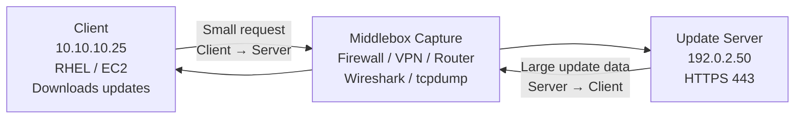

The first thing to remember is that although we call it a **client download**, the heavy data direction is:

```text
Client → Server     Small
SYN
TLS handshake
HTTP GET
ACKs

Server → Client     LARGE
RPM / Docker layer / update payload
```

So packet loss affecting a download will usually be easiest to see in the:

> **Server → Client direction.**

---

# Practical Example

Let's use these values:

```text
Client IP:       10.10.10.25
Server IP:       192.0.2.50
Server Port:     443

Client MSS:      1360
Server MSS:      1460
```

The middlebox capture filter could start with:

```text
ip.addr == 10.10.10.25 && ip.addr == 192.0.2.50 && tcp.port == 443
```

Then isolate a single connection:

```text
tcp.stream eq 15
```

---

# 1. What a Healthy Download Looks Like

First the three-way handshake:

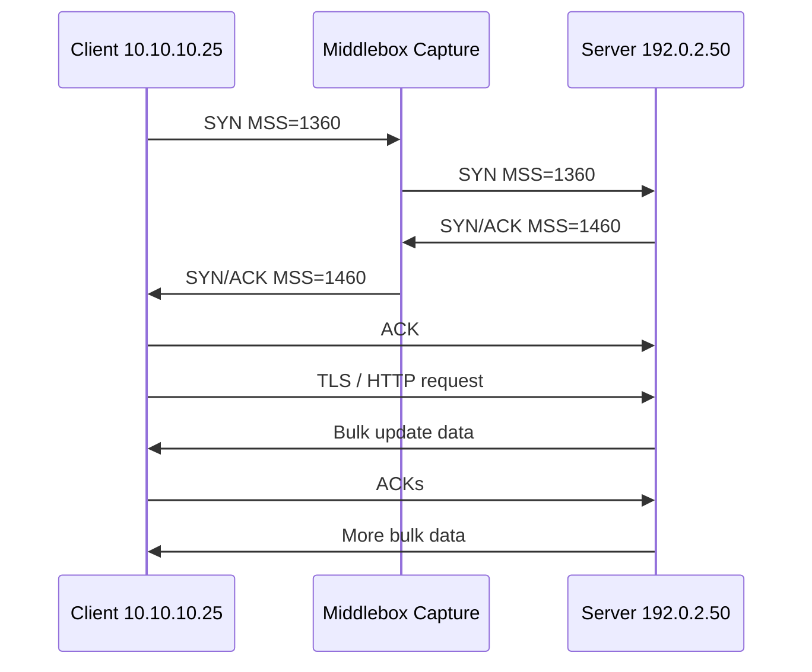

Because the client advertised:

```text
MSS = 1360
```

the server's outbound data will generally be limited accordingly.

Assuming 12 bytes of TCP timestamp options, you may see something around:

```text
tcp.len = 1348
```

for full-size packets.

A healthy capture might conceptually look like this:

```text
Time      Source          Destination     Info
--------------------------------------------------------------
0.000     10.10.10.25     192.0.2.50      SYN MSS=1360
0.020     192.0.2.50      10.10.10.25     SYN,ACK MSS=1460
0.021     10.10.10.25     192.0.2.50      ACK

0.100     10.10.10.25     192.0.2.50      TLS Application Data
0.120     192.0.2.50      10.10.10.25     TCP Len=1348 Seq=1
0.120     192.0.2.50      10.10.10.25     TCP Len=1348 Seq=1349
0.121     192.0.2.50      10.10.10.25     TCP Len=1348 Seq=2697
0.121     192.0.2.50      10.10.10.25     TCP Len=1348 Seq=4045

0.140     10.10.10.25     192.0.2.50      ACK=5393

0.141     192.0.2.50      10.10.10.25     TCP Len=1348 Seq=5393
0.141     192.0.2.50      10.10.10.25     TCP Len=1348 Seq=6741
...
```

Graphically:

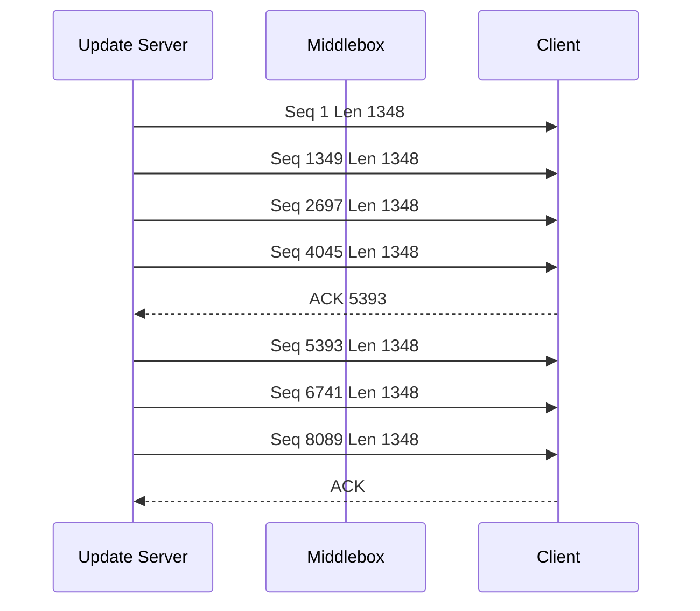

You should see a relatively continuous stream of data.

---

# 2. Now Introduce Packet Loss

Suppose this server packet is lost:

```text
Seq = 4045
Len = 1348
```

but subsequent packets arrive.

On the wire:

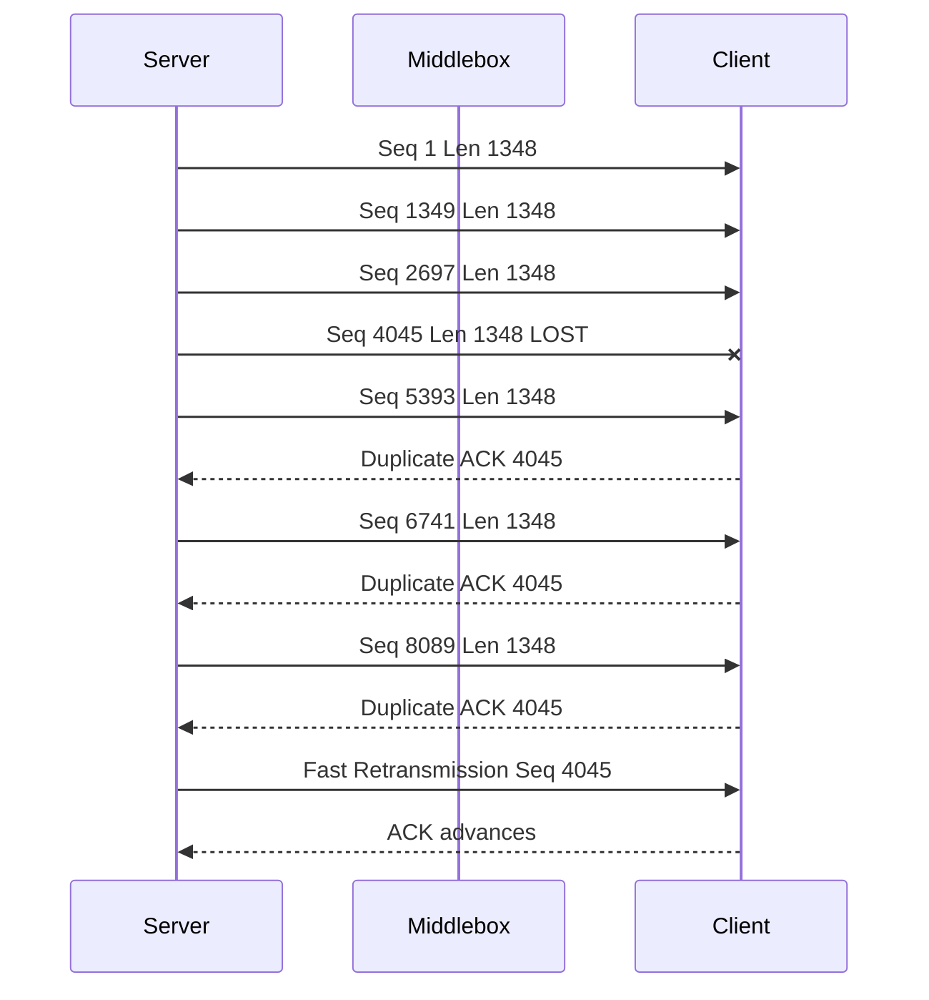

Why does the client keep saying:

```text
ACK = 4045
```

?

Because TCP ACK means:

> **"The next byte I need is byte 4045."**

The client may already have later bytes buffered, but byte 4045 is missing.

---

# What Wireshark Will Show

You might see:

```text
192.0.2.50  → 10.10.10.25
Seq=2697 Len=1348

192.0.2.50  → 10.10.10.25
Seq=5393 Len=1348
[Previous segment not captured]

10.10.10.25 → 192.0.2.50
[TCP Dup ACK]
Ack=4045

192.0.2.50 → 10.10.10.25
Seq=6741 Len=1348

10.10.10.25 → 192.0.2.50
[TCP Dup ACK]
Ack=4045

192.0.2.50 → 10.10.10.25
Seq=8089 Len=1348

10.10.10.25 → 192.0.2.50
[TCP Dup ACK]
Ack=4045

192.0.2.50 → 10.10.10.25
[TCP Fast Retransmission]
Seq=4045 Len=1348
```

This is the classic packet-loss pattern:

```text
DATA
DATA
DATA
MISSING
DATA
DATA
DATA

       ↓

Duplicate ACK
Duplicate ACK
Duplicate ACK

       ↓

Fast Retransmission
```

Useful filters:

```text
tcp.analysis.duplicate_ack
```

```text
tcp.analysis.fast_retransmission
```

```text
tcp.analysis.retransmission
```

or all of them:

```text
tcp.analysis.flags
```

---

# 3. Why Packet Loss Makes the Download Slow

One isolated loss usually does not destroy performance.

Repeated loss does.

Imagine:

```text
Server sends quickly
      ↓
Packet lost
      ↓
Dup ACKs
      ↓
Retransmission
      ↓
TCP interprets loss as congestion
      ↓
Congestion window decreases
      ↓
Sender slows down
      ↓
Window grows again
      ↓
Another loss
      ↓
Window collapses again
```

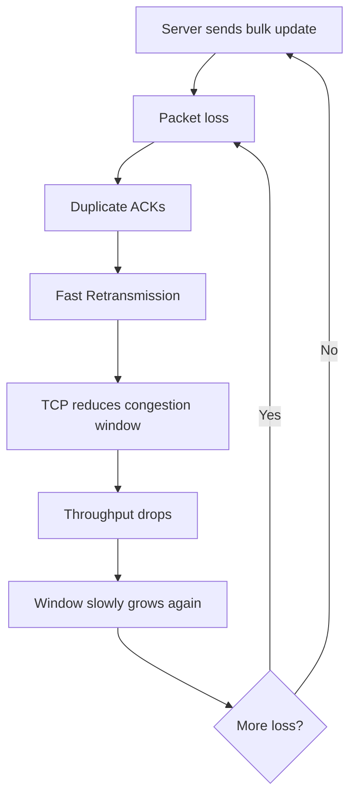

This is how you get the complaint:

> "The server is reachable and yum works, but downloading a 500-MB RPM takes forever."

---

# 4. What Severe Packet Loss Looks Like

A bad connection may show repeating groups like:

```text
DATA DATA DATA
DupACK DupACK DupACK
Fast Retransmission

DATA DATA
Retransmission

DATA
DupACK DupACK DupACK
Fast Retransmission

DATA
Retransmission
Retransmission
```

Filter:

```text
tcp.analysis.retransmission ||
tcp.analysis.fast_retransmission ||
tcp.analysis.duplicate_ack
```

If Wireshark becomes covered in these events during the large transfer, loss is highly suspicious.

---

# 5. Timeout Loss Looks Different

Sometimes enough packets are missing that the sender cannot perform fast retransmit.

Then it waits for its retransmission timer.

You might see:

```text
12.000 Server → Client  TCP Len=1348 Seq=50000

                 nothing...

13.100 Server → Client  [TCP Retransmission]
                        Seq=50000 Len=1348
```

That gap is important.

Fast retransmission might happen quickly:

```text
10–100 ms
```

depending on RTT and ACK behavior.

RTO-based retransmission creates a much more obvious pause:

```text
DATA
DATA
DATA

        ........ noticeable silence ........

RETRANSMISSION
```

Repeated RTOs absolutely crush throughput.

---

# 6. Another Very Common Failure: PMTU Black Hole

This one looks especially familiar with:

* VPNs
* IPsec
* GRE
* overlays
* TGW paths
* firewalls blocking ICMP
* Internet paths

Suppose server sends:

```text
1500-byte IP packet
```

but somewhere after your middlebox the real path MTU is:

```text
1400
```

and DF is set.

The downstream router must tell the sender:

```text
Fragmentation Needed
MTU = 1400
```

Healthy PMTUD:

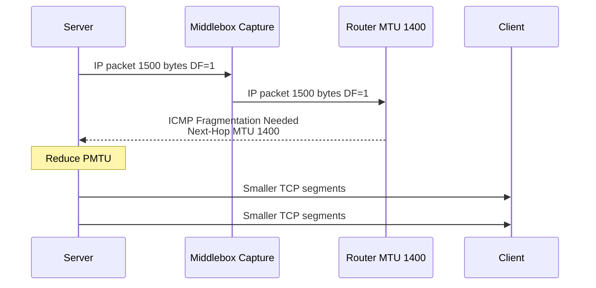

In Wireshark:

```text
icmp.type == 3 && icmp.code == 4
```

You might see:

```text
Router → Server
ICMP Destination Unreachable
Fragmentation needed
MTU = 1400
```

Then shortly afterward:

```text
Server → Client
smaller TCP packets
```

That is **working PMTUD**.

---

# 7. PMTUD Black Hole

Now imagine that the ICMP message is blocked.

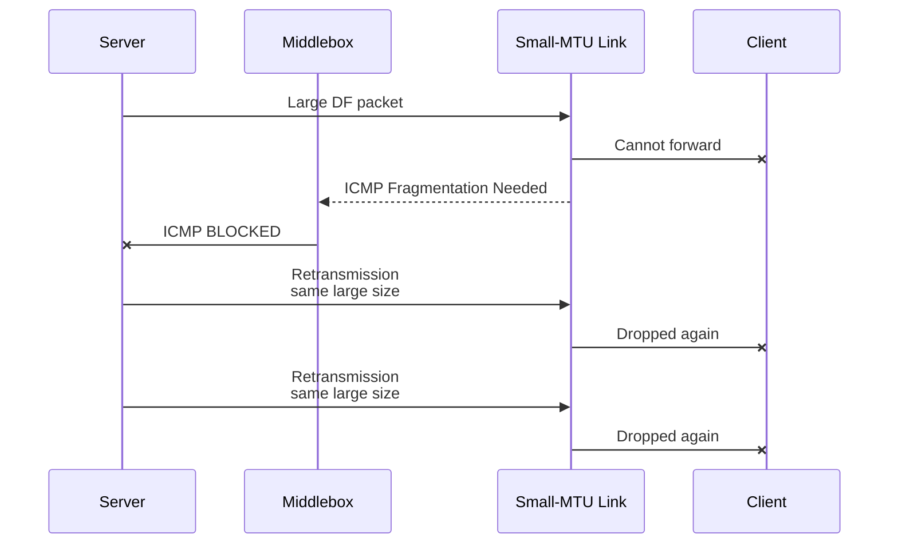

This has a very distinctive user symptom:

```text
DNS               works
TCP handshake      works
TLS handshake      often works
Small HTTP request works
Small response     works

Large download     stalls/fails
```

This is exactly the sort of case where someone says:

> "curl connects immediately but hangs during the download."

---

# What the Middlebox Capture Might Show

Suppose your middlebox is **before the smaller-MTU section**.

You might repeatedly see:

```text
Server → Client
IP length = 1500
DF = 1
Seq=100000 Len=1448

1 second later:

Server → Client
[TCP Retransmission]
IP length = 1500
DF = 1
Seq=100000 Len=1448

2 seconds later:

Server → Client
[TCP Retransmission]
IP length = 1500
DF = 1
Seq=100000 Len=1448
```

But no ACK advancement from the client.

That is extremely suspicious.

Look at:

```text
ip.flags.df == 1
```

together with:

```text
tcp.analysis.retransmission
```

and:

```text
icmp.type == 3 && icmp.code == 4
```

---

# 8. MSS Clamping Problem

Now consider a VPN path.

Client:

```text
MTU 1500
MSS 1460
```

but the VPN needs packets small enough for encapsulation.

A firewall correctly clamps the SYN to:

```text
MSS 1360
```

Your middlebox capture might show:

```text
Client → Middlebox:

SYN
MSS = 1460
```

and on the egress side:

```text
Middlebox → Server:

SYN
MSS = 1360
```

Then server bulk packets come back approximately:

```text
tcp.len ≈ 1348
```

if TCP timestamps are being used.

This is usually healthy behavior:

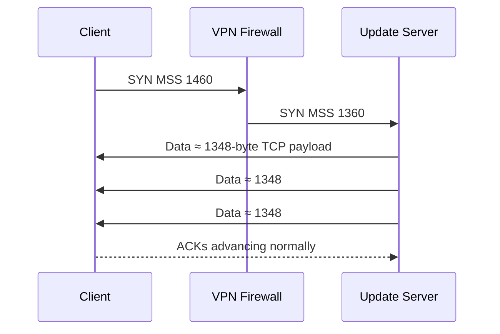

---

# Bad MSS Situation

Suppose the firewall **fails to clamp**.

Client advertises:

```text
1460
```

Server therefore sends large packets.

But the VPN can safely carry only:

```text
1360-ish TCP MSS
```

Now your capture before VPN encapsulation may show:

```text
Server → Client
tcp.len = 1448
IP Len = 1500
DF
```

repeatedly retransmitted.

That gives you the classic:

```text
Handshake works
Small traffic works
Large download fails
```

pattern.

---

# 9. The Most Useful Middlebox Method: Compare Ingress vs Egress

If the middlebox lets you capture both sides, this is extremely powerful.

Suppose:

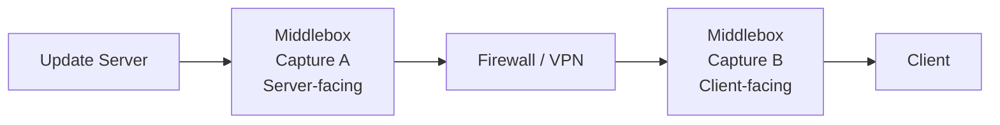

You find:

### Capture A

```text
Server → Firewall
Seq=100000 Len=1348
```

### Capture B

Nothing.

That means the packet entered the middlebox but did not leave.

Very strong evidence:

> **The middlebox dropped it.**

---

# Alternatively

Capture A:

```text
Seq=100000 Len=1348
```

Capture B:

```text
Seq=100000 Len=1348
```

The packet crossed the middlebox successfully.

But later Capture A shows:

```text
Server retransmits Seq=100000
```

while Capture B also shows the original leaving.

Then your loss is probably **after the middlebox**:

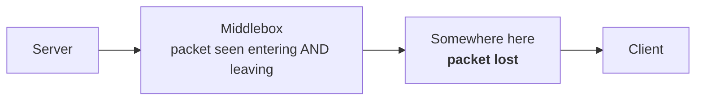

This is one of the strongest uses of dual-sided packet captures.

---

# 10. How I Would Troubleshoot Your Update Download

Assume the complaint is:

> RHEL server can connect to RHUI, but large updates download at 200 KB/s instead of 50 MB/s.

Start with:

```text
ip.addr == CLIENT && ip.addr == SERVER && tcp.port == 443
```

Then:

### Step 1 — Check handshake

```text
tcp.flags.syn == 1
```

Record:

```text
Client SYN MSS       =
Server SYN/ACK MSS   =
```

Example:

```text
Client → Server MSS 1360
Server → Client MSS 1460
```

Therefore server bulk download traffic should respect the client's 1360 advertisement.

---

### Step 2 — Follow the connection

Right-click packet:

```text
Follow
→ TCP Stream
```

or use:

```text
tcp.stream eq 15
```

---

### Step 3 — Determine heavy-data direction

You should quickly see:

```text
Client → Server
few bytes

Server → Client
millions of bytes
```

Therefore focus analysis on:

```text
192.0.2.50 → 10.10.10.25
```

---

### Step 4 — Look for TCP analysis warnings

```text
tcp.analysis.flags
```

Then specifically:

```text
tcp.analysis.retransmission
```

```text
tcp.analysis.fast_retransmission
```

```text
tcp.analysis.duplicate_ack
```

---

### Step 5 — Look at ACK behavior

Healthy:

```text
Server Seq 10000
Server Seq 11348
Server Seq 12696
Server Seq 14044

Client ACK 15392
```

Bad:

```text
Server Seq 10000
Server Seq 11348

MISSING Seq 12696

Server Seq 14044

Client ACK 12696
Client ACK 12696
Client ACK 12696

Fast Retransmission Seq 12696
```

That is real TCP loss behavior.

---

# 11. Very Useful Wireshark Graph

For this problem, open:

**Statistics → TCP Stream Graphs → Time Sequence (Stevens)**

A healthy bulk transfer tends to climb relatively smoothly:

```text
Sequence
Number
  ^
  |                         /
  |                      /
  |                   /
  |                /
  |             /
  |          /
  |_______/________________________> Time
```

A loss-heavy connection often looks more stair-stepped with retransmissions:

```text
Sequence
Number
  ^
  |                     ___/
  |                 ___/
  |             ___/
  |         ___/
  |     ___/
  |____/____________________________> Time
        ↑      ↑
       stalls / retransmissions
```

Also look at:

**Statistics → TCP Stream Graphs → Throughput**

You may see:

```text
50 Mbps
   |
   |     /\       /\           /\
   |    /  \     /  \         /  \
   |___/    \___/    \_______/    \__
          loss       loss
```

rather than steady throughput.

---

# 12. How to Tell Packet Loss from Receiver Slowness

This distinction is important.

If you see:

```text
TCP ZeroWindow
```

or:

```text
TCP Window Full
```

the problem may not be packet loss.

Filter:

```text
tcp.analysis.zero_window
```

A zero-window pattern means:

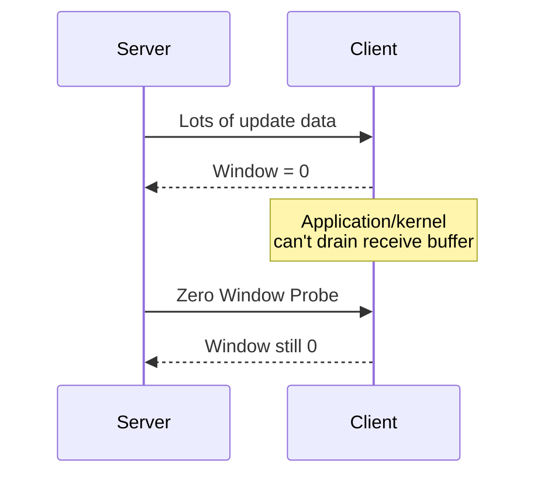

That points much more toward:

* overloaded receiver
* slow application
* receive-buffer pressure

rather than network loss.

---

# Your Middlebox Cheat Sheet

For a slow large download, this is what I would look for:

| Wireshark observation                              | Likely meaning                               |
| -------------------------------------------------- | -------------------------------------------- |
| Continuous data + advancing ACKs                   | Healthy TCP                                  |
| Dup ACK → Dup ACK → Fast Retransmission            | Packet loss                                  |
| Repeated retransmissions after long gaps           | Severe loss / RTO                            |
| Same Seq repeatedly retransmitted                  | Packet not reaching/being ACKed              |
| ICMP Type 3 Code 4                                 | PMTUD working                                |
| Large DF packet repeatedly retransmitted + no ICMP | Possible PMTU black hole                     |
| SYN MSS changes across firewall                    | MSS clamping                                 |
| Packet enters firewall but doesn't leave           | Firewall/middlebox loss                      |
| Packet enters and leaves firewall                  | Look farther downstream                      |
| Zero Window                                        | Receiver/application bottleneck              |
| Huge `tcp.len` only on host capture                | Check TSO/GRO/offload before blaming network |

The most valuable pattern to learn is this:

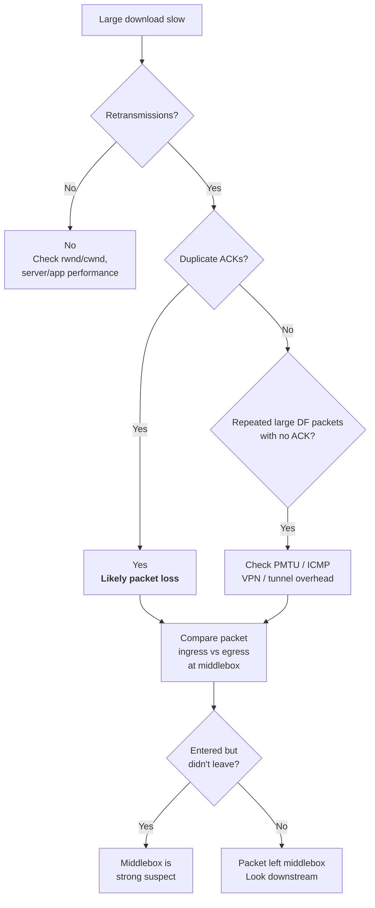

For your RHUI/Docker-download type cases, I would primarily train engineers to recognize **four signatures**: **DupACK + Fast Retransmit = loss**, **repeated RTO retransmission = severe loss**, **large DF packets + missing ICMP = PMTU black hole**, and **Zero Window = endpoint/receiver problem rather than network packet loss**.
