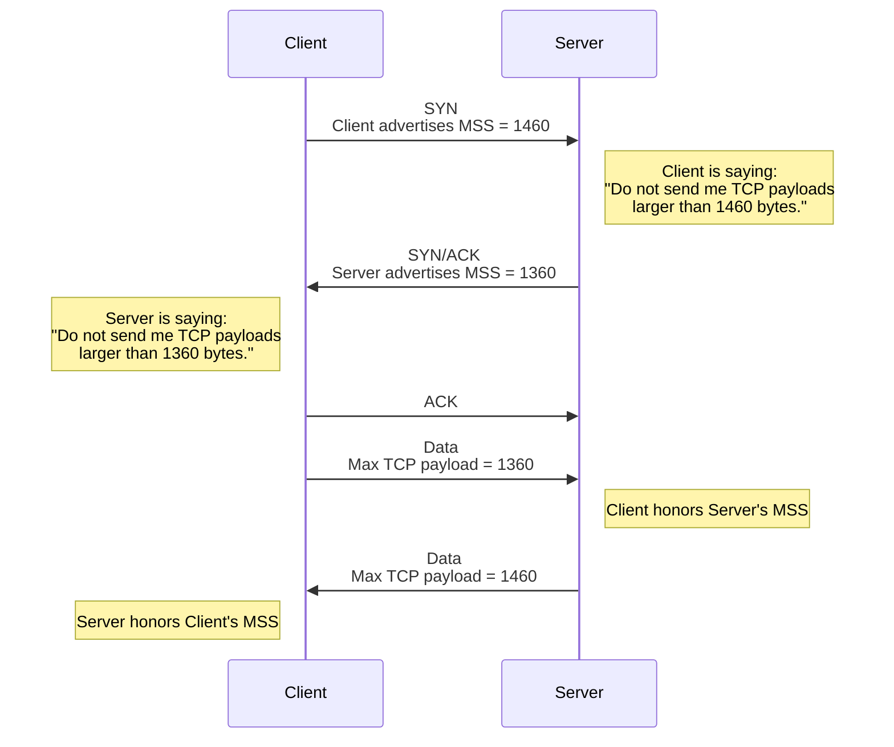
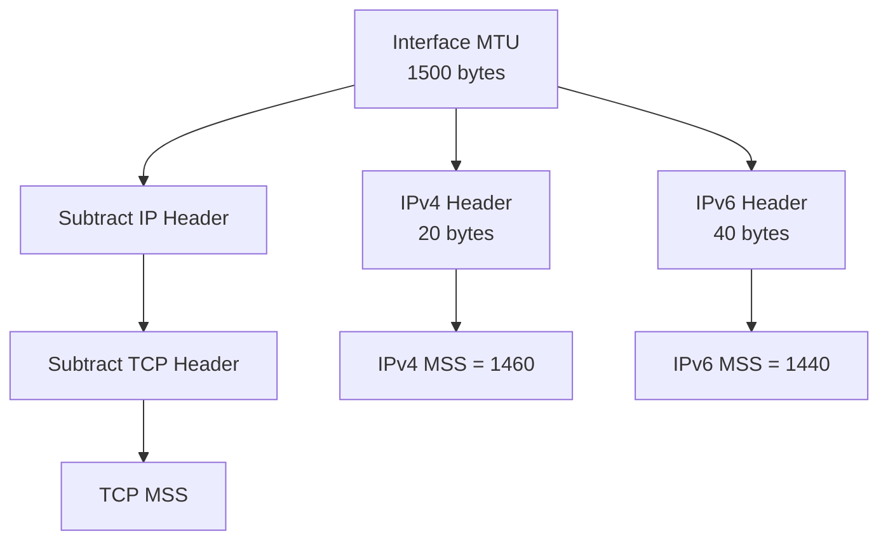
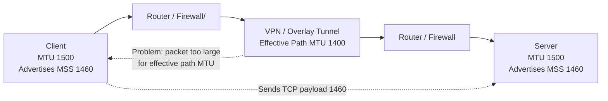
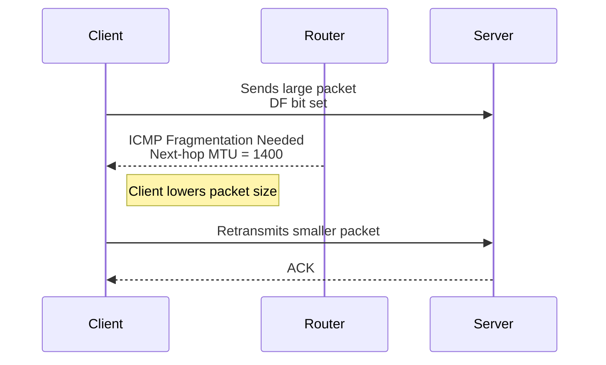
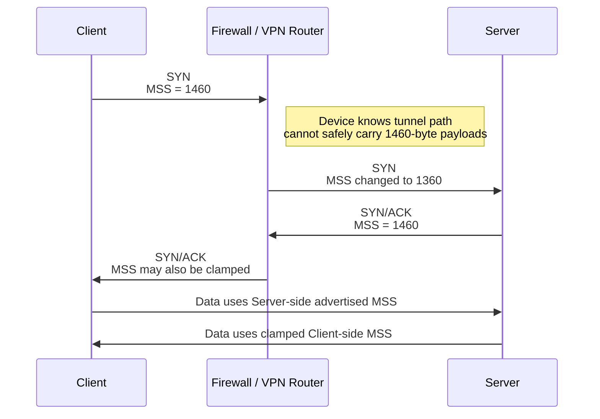

# TCP MSS, MTU, and the 3-Way Handshake

During the TCP 3-way handshake, both the client and server advertise an **MSS**, or **Maximum Segment Size**.

MSS is often misunderstood as a two-way negotiated value. It is not exactly that.

A better way to think about MSS is:

> **Each side tells the other side: “Do not send me TCP payloads larger than this size.”**

So MSS is directional.

---

## 1. What happens during the TCP 3-way handshake?

```text
Client                                      Server
  |                                           |
  | -------- SYN, MSS=1460 ------------------>|
  |                                           |
  | <------ SYN/ACK, MSS=1360 --------------- |
  |                                           |
  | -------- ACK ---------------------------->|
  |                                           |
```

Meaning:

| Traffic Direction | MSS Used By Sender | Why                                            |
| ----------------- | -----------------: | ---------------------------------------------- |
| Client → Server   |               1360 | Client honors the MSS advertised by the server |
| Server → Client   |               1460 | Server honors the MSS advertised by the client |

So the rule is:

> **The sender uses the MSS advertised by the receiver.**

---

## 2. Mermaid diagram: MSS is directional



---

## 3. Does TCP use the lowest MSS?

Not exactly.

TCP does **not** always pick one lowest MSS value for both directions.

Instead:

```text
Client → Server traffic uses the server's advertised MSS.
Server → Client traffic uses the client's advertised MSS.
```

So in this example:

```text
Client MSS advertisement = 1460
Server MSS advertisement = 1360
```

The result is:

```text
Client sends to server using MSS <= 1360
Server sends to client using MSS <= 1460
```

Only the direction toward the lower-MSS side is reduced.

---

## 4. How MSS relates to MTU

MTU is the maximum size of the full Layer 3 packet on an interface or path.

MSS is the TCP payload size inside that packet.

For standard Ethernet with IPv4:

```text
Ethernet MTU = 1500 bytes

IPv4 header = 20 bytes
TCP header  = 20 bytes

MSS = 1500 - 20 - 20
MSS = 1460 bytes
```

For IPv6:

```text
Ethernet MTU = 1500 bytes

IPv6 header = 40 bytes
TCP header  = 20 bytes

MSS = 1500 - 40 - 20
MSS = 1440 bytes
```

---

## 5. Mermaid diagram: MTU to MSS calculation



---

## 6. How MTU is honored in both directions

Each side advertises an MSS based on what it can receive.

```text
Client advertises MSS = 1460
Server advertises MSS = 1360
```

That means:

```text
Server must not send TCP payloads larger than 1460 toward the client.
Client must not send TCP payloads larger than 1360 toward the server.
```

So MTU is honored by having each sender respect the receiver’s advertised MSS.

---

## 7. Important caveat: MSS does not always know the full path MTU

The MSS value in the TCP handshake is usually based on the endpoint’s local interface MTU.

But the full path may have a smaller MTU because of tunnels or encapsulation.

Examples:

```text
IPsec VPN
GRE
VXLAN
NAT-T
AWS Transit Gateway
Direct Connect
Cloud WAN
Firewall inspection path
Overlay networking
```

Example:

```text
Client interface MTU = 1500
Server interface MTU = 1500

Both advertise MSS = 1460

But the real path MTU through a tunnel is only 1400
```

In this case, TCP may send packets that are too large for the path.

---

## 8. Mermaid diagram: endpoint MSS vs real path MTU



---

## 9. What happens if packets are too large?

If the packet is too large and the **DF bit**, or **Don’t Fragment bit**, is set, an intermediate router should send back an ICMP message:

```text
ICMP Fragmentation Needed
```

That allows the sender to lower its packet size.

This process is called:

```text
Path MTU Discovery
```

But if ICMP is blocked, the sender may never learn that the path MTU is smaller.

This creates a **PMTU black hole**.

Common symptoms:

```text
Small pings work
Small HTTP requests work
TLS handshake may fail
Large downloads stall
Large uploads fail
Some applications hang randomly
```

---

## 10. Mermaid diagram: Path MTU Discovery



---

## 11. What is MSS clamping?

MSS clamping is when a router, firewall, VPN device, or cloud gateway modifies the MSS value in the TCP SYN packet.

Instead of allowing this:

```text
Client SYN MSS = 1460
```

The middle device changes it to this:

```text
Client SYN MSS = 1360
```

Now the remote side knows:

```text
Do not send TCP payloads larger than 1360 bytes toward this client.
```

This prevents packets from exceeding the real path MTU.

---

## 12. Mermaid diagram: MSS clamping



---

## 13. Practical example

Assume a VPN tunnel reduces the usable MTU.

```text
Physical interface MTU = 1500
Tunnel overhead        = 100 bytes

Effective path MTU     = 1400
```

For IPv4 TCP:

```text
Effective MTU = 1400
IPv4 header   = 20
TCP header    = 20

Safe MSS = 1400 - 20 - 20
Safe MSS = 1360
```

So the firewall or VPN router may clamp MSS to 1360.

```text
Original MSS = 1460
Clamped MSS  = 1360
```

---

## 14. Simple mental model

```text
MTU = maximum full IP packet size

MSS = maximum TCP payload size

MSS in SYN = "maximum TCP payload you may send to me"

Each direction uses the receiver's advertised MSS

Path MTU may be smaller than endpoint MTU

PMTUD uses ICMP to discover smaller path MTU

MSS clamping prevents oversized TCP packets before the problem happens
```

---

## 15. Final answer to your key question

> Do client and server both look at their MSS and use the lowest MSS?

More accurate answer:

> **No, not as one global value. Each side uses the MSS advertised by the other side for the direction it is sending.**

Example:

```text
Client advertises MSS 1460
Server advertises MSS 1360
```

Then:

```text
Client → Server uses MSS 1360
Server → Client uses MSS 1460
```

But in many real-world environments, firewalls, VPNs, or routers clamp MSS in both directions, so it can appear as if both sides simply use the lowest MSS.

### Important caveat

Even though the TCP SYN packet may include extra TCP options, the MSS value represents the maximum TCP data payload, not the total TCP segment including TCP options.
```text
So the advertised MSS of 1460 means:

Maximum TCP payload/data = 1460 bytes

not:

TCP header + TCP payload = 1460 bytes
Simple packet view
IPv4 packet inside 1500-byte MTU:

+------------------+------------------+----------------------+
| IPv4 Header      | TCP Header       | TCP Payload          |
| 20 bytes         | 20 bytes         | 1460 bytes           |
+------------------+------------------+----------------------+

Total = 1500 bytes

```

MSS is 1460 because the default IPv4 header is 20 bytes and the default TCP header is 20 bytes.
