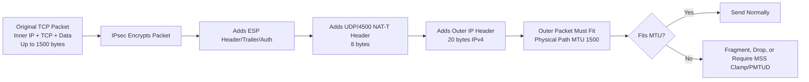
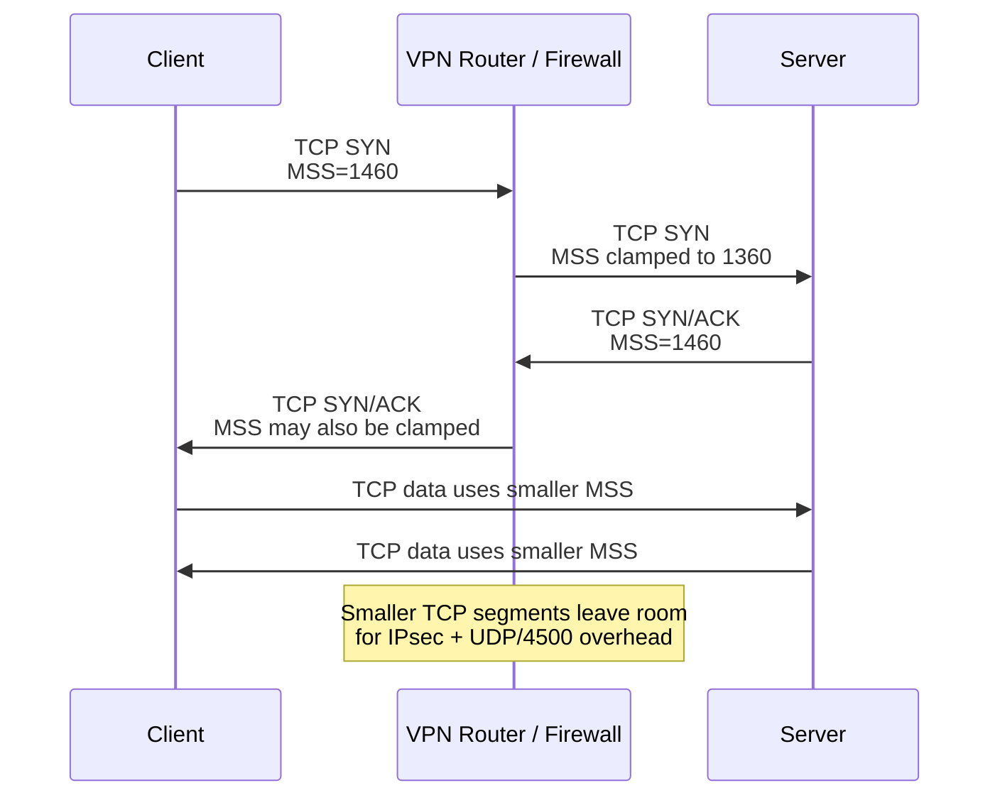

Yes — in an IPsec VPN tunnel, **MTU becomes very important because IPsec adds extra headers around the original packet**. Even though IKE control plane uses **UDP/500** and NAT-T data plane often uses **UDP/4500**, the MTU impact is mostly about the **encapsulated data traffic**, not the small control-plane packets.

---

# 1. Separate the two planes first

```text
IPsec VPN has two major traffic types:

1. Control plane
   IKE / IKEv2 negotiation
   Usually UDP/500

2. Data plane
   Encrypted user traffic inside ESP
   ESP directly as IP protocol 50, or
   ESP encapsulated in UDP/4500 when NAT-T is used
```

So:

```text
UDP/500  = tunnel negotiation/control
UDP/4500 = encrypted tunnel data when NAT-T is used
```

---

# 2. UDP/500 control plane and MTU

UDP/500 is used for IKE negotiation.

Example:

```text
Spoke VPN Router  <---- UDP/500 IKE ---->  Hub VPN Router
```

This traffic includes things like:

```text
IKE_SA_INIT
IKE_AUTH
Security Association negotiation
Encryption/authentication algorithms
Key exchange
Peer identity
Certificate/authentication payloads
```

Usually, these packets are not huge. But they **can become large** if certificates or many proposals are included.

If the IKE packet becomes too large, it can be fragmented at IP layer or use IKE fragmentation if supported.

But generally:

> **UDP/500 is not where most MTU pain happens.**

The bigger MTU problem is with the encrypted data going through the tunnel.

---

# 3. UDP/4500 NAT-T data plane and MTU

When NAT is detected between IPsec peers, IPsec usually switches to NAT Traversal.

Instead of sending raw ESP like this:

```text
Outer IP Header + ESP + Encrypted Payload
```

It sends:

```text
Outer IP Header + UDP/4500 + ESP + Encrypted Payload
```

That extra UDP header adds overhead.

So NAT-T reduces the effective payload size.

---

# 4. Simple IPsec NAT-T packet view

Original packet before tunnel:

```text
Original Inner Packet:

+----------------------+----------------------+----------------------+
| Inner IP Header      | TCP Header           | TCP Payload          |
| 20 bytes             | 20 bytes             | up to 1460 bytes     |
+----------------------+----------------------+----------------------+

Total inner packet = up to 1500 bytes
```

After IPsec NAT-T encapsulation:

```text
Outer tunneled packet:

+----------------------+----------------------+----------------------+
| Outer IP Header      | UDP/4500 Header      | ESP + Encrypted Data |
| 20 bytes             | 8 bytes              | variable overhead    |
+----------------------+----------------------+----------------------+
```

But the physical path may still only allow:

```text
Outer path MTU = 1500 bytes
```

So the tunnel must fit everything inside 1500 bytes:

```text
Outer IP header
+ UDP/4500 header
+ ESP header/trailer/authentication
+ encrypted original packet
<= 1500 bytes
```

That means the original inner packet can no longer safely be 1500 bytes.

---

# 5. Why a normal 1500-byte packet becomes too large

Without VPN:

```text
Client sends packet:

Inner IP + TCP + Payload = 1500 bytes
```

With IPsec NAT-T, the VPN device wraps that 1500-byte packet with more headers:

```text
Outer IP header     = 20 bytes
UDP header          = 8 bytes
ESP overhead        = roughly 30 to 60+ bytes depending on encryption/auth
Original packet     = 1500 bytes
--------------------------------
Total outer packet  = around 1558+ bytes
```

That exceeds a normal 1500-byte MTU.

So the VPN device must either:

```text
Fragment it
Drop it and rely on PMTUD
Clamp MSS lower
Use a smaller tunnel/interface MTU
```

---

# 6. Practical safe MSS example

Assume:

```text
Physical path MTU = 1500
IPsec NAT-T overhead = about 60 bytes
```

Then effective inner MTU is roughly:

```text
1500 - 60 = 1440
```

For IPv4 TCP inside the tunnel:

```text
Inner MTU = 1440
Inner IPv4 header = 20
Inner TCP header  = 20

Safe TCP MSS = 1440 - 20 - 20
Safe TCP MSS = 1400
```

So even though normal Ethernet MSS is 1460, across IPsec NAT-T you may need something like:

```text
MSS 1360 to 1400
```

The exact value depends on IPsec mode, NAT-T, encryption algorithm, integrity/authentication overhead, and any extra tunnel headers.

---

# 7. Mermaid: IPsec NAT-T overhead



---

# 8. How TCP MSS clamping helps IPsec VPN

For TCP traffic, the VPN router/firewall can modify MSS during the TCP handshake.

Original client SYN:

```text
Client SYN MSS=1460
```

VPN device changes it:

```text
Client SYN MSS=1360 or 1400
```

Now the remote side sends smaller TCP segments.

That prevents the original inner packet from becoming too large after IPsec encapsulation.



---

# 9. What happens for non-TCP traffic?

MSS only helps TCP.

For UDP, ICMP, GRE, or other protocols inside the tunnel, there is no TCP MSS to clamp.

Examples:

```text
DNS over UDP
VoIP/RTP
NTP
Custom UDP applications
ICMP
GRE inside IPsec
```

For these, MTU must be handled by:

```text
Path MTU Discovery
Application packet sizing
Tunnel interface MTU
Fragmentation
```

That is why IPsec MTU issues can still happen even after TCP MSS clamping if the application uses large UDP packets.

---

# 10. Control plane vs data plane summary

| Plane                    | Port / Protocol      | Purpose                            | MTU Concern                                    |
| ------------------------ | -------------------- | ---------------------------------- | ---------------------------------------------- |
| Control plane            | UDP/500              | IKE negotiation                    | Usually minor, unless large certs/proposals    |
| Data plane without NAT-T | ESP / IP protocol 50 | Encrypted user traffic             | MTU reduced by ESP overhead                    |
| Data plane with NAT-T    | UDP/4500             | ESP inside UDP so NAT can track it | MTU reduced even more due to UDP/4500 overhead |
| NAT-T keepalive          | UDP/4500             | Keeps NAT mapping alive            | Very small packets, low MTU concern            |

---

# 11. Important correction

Even though NAT-T uses UDP/4500, it does **not** mean the user data is just normal UDP application traffic.

It is more like this:

```text
Outer transport:
UDP/4500

Inside that:
ESP-encrypted IP packet

Inside ESP:
Original user packet, such as TCP, UDP, or ICMP
```

So the outer packet may be UDP/4500, but the inner traffic could be:

```text
TCP/443
TCP/22
UDP/53
ICMP
Application traffic
```

---

# 12. Simple mental model

```text
UDP/500 = build the tunnel

UDP/4500 = carry encrypted data through NAT

MTU problem = original packet + IPsec overhead may exceed physical path MTU

MSS clamping = reduce TCP payload before encryption so final encrypted packet fits

PMTUD = sender learns smaller path MTU using ICMP

Blocked ICMP = possible VPN black-hole symptoms
```

---

# 13. Practical rule of thumb

For IPsec NAT-T over a 1500-byte internet path:

```text
Normal MSS without VPN: 1460
Common safe MSS with IPsec NAT-T: 1360 to 1400
```

A conservative starting point is often:

```text
TCP MSS clamp = 1360
```

Then tune upward if testing confirms the path supports it.

Common symptoms of getting this wrong:

```text
VPN tunnel comes up
Ping works with small packet
SSH connects
Small web pages load
Large downloads hang
TLS sessions randomly fail
File transfers stall
Some apps work, others fail
```

The tunnel control plane can look healthy while the data plane has an MTU problem.
