# TCP MSS, MSS Clamping, and Segmentation

This document explains three things that are often confused:

1. **What MSS actually means**
2. **How MSS clamping changes only one direction unless both SYNs are modified**
3. **How application data eventually becomes TCP segments on the wire**

---

# Part 1 — MSS Simplified

## The one rule

**MSS is not negotiated into one connection-wide value.**

When a host advertises an MSS, it is telling the peer:

> **"When you send TCP data to me, do not exceed this receive limit."**

Therefore, always **cross the MSS value over to the opposite data direction**.

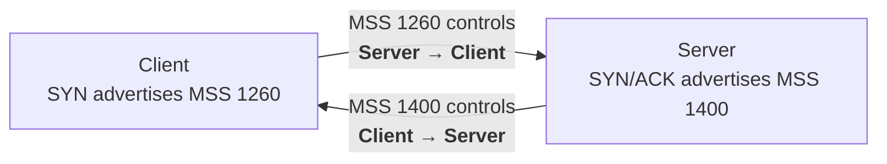

Think of it this way:

```text
Client advertises 1260
        │
        └────────────── controls Server → Client


Server advertises 1400
        │
        └────────────── controls Client → Server
```

Then evaluate **each direction separately**:

```text
Effective send size =
    minimum of:

    1. What the OTHER endpoint allows me to send
    2. What MY OWN IP layer / path can transmit
```

For troubleshooting, never start by finding:

```text
min(Client MSS, Server MSS)
```

There is no single connection-wide MSS.

There are **two directional send limits**.

---

# Scenario A — No Middlebox

Assume IPv4 with no IP options.

The basic MSS advertised by a host is commonly:

```text
MSS = MTU - 20-byte IPv4 header - 20-byte fixed TCP header
```

For this example:

| Host   |  MTU | Advertised MSS |
| ------ | ---: | -------------: |
| Client | 1300 |       **1260** |
| Server | 1440 |       **1400** |

> For simplicity, these examples assume the advertised MSS is derived from the relevant MTU. Real TCP implementations can also be influenced by route/path information and other stack behavior.

---

## Step 1 — TCP handshake

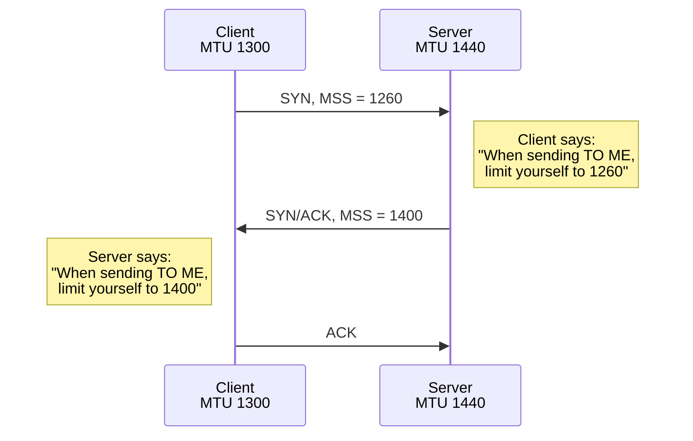

The handshake establishes two independent facts:

```text
Client MSS 1260  → affects Server → Client

Server MSS 1400  → affects Client → Server
```

---

# Step 2 — Server → Client

The server asks:

```text
What does the client allow me to send?    1260
What can my own IP layer support?         1400
                                         ----
Effective basic send limit               1260
```

Therefore:

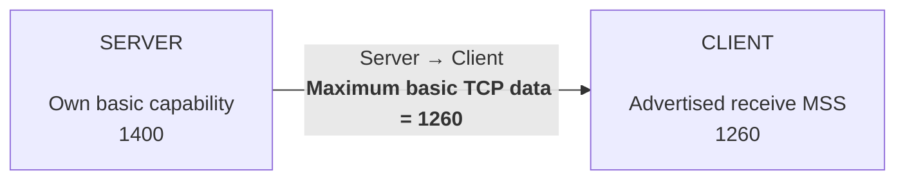

The limiting factor is:

> **The peer — the client.**

---

# Step 3 — Client → Server

Now reverse the direction.

The server advertised:

```text
MSS = 1400
```

So the server is telling the client:

> "You may send me up to 1400."

But the client's own interface MTU is only:

```text
1300
```

Its basic local capability is therefore:

```text
1300 MTU
 -20 IPv4 header
 -20 TCP fixed header
-------------------
1260
```

So:

```text
Peer permits       = 1400
My capability      = 1260

Effective limit    = 1260
```

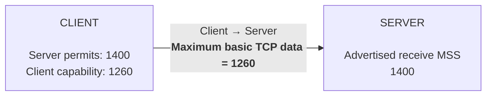

The limiting factor this time is:

> **The sender itself — the client.**

---

# Scenario A Result

| Direction       | Peer permits | Sender capability | Effective basic limit | Limited by |
| --------------- | -----------: | ----------------: | --------------------: | ---------- |
| Server → Client |         1260 |              1400 |              **1260** | Peer       |
| Client → Server |         1400 |              1260 |              **1260** | Sender     |

Both directions happen to become **1260**.

But they arrived there for completely different reasons.

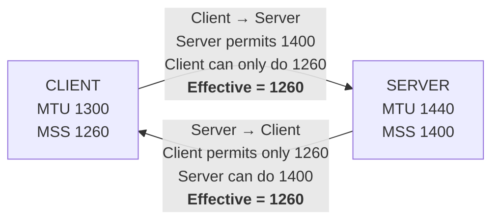

This is exactly why this shortcut is dangerous:

> **"TCP just picks the smaller MSS."**

It happens to give the correct number here:

```text
1260
```

but for the wrong reason.

The mistake becomes obvious as soon as a middlebox modifies one MSS advertisement.

---

# Scenario B — Middlebox MSS Clamping

Now change the environment.

Assume:

| Host   |  MTU | Basic MSS capability |
| ------ | ---: | -------------------: |
| Client | 1500 |             **1460** |
| Server | 1440 |             **1400** |

The client really sends:

```text
SYN
MSS = 1460
```

But a VPN/firewall rewrites that MSS before forwarding the SYN to the server.

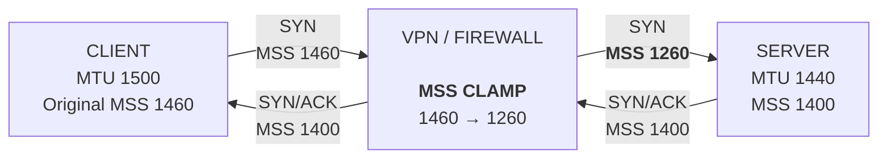

The important point:

> In this example, the firewall changes the **MSS option in the SYN**. It does not need to resize every subsequent TCP data packet.

The changed SYN causes the **server's TCP stack** to voluntarily use smaller segments.

---

# What Each Endpoint Actually Learns

The client sees:

```text
Server SYN/ACK
MSS = 1400
```

Therefore:

```text
Client believes:

Server can receive 1400
```

The server sees:

```text
Client SYN
MSS = 1260
```

Therefore:

```text
Server believes:

Client can receive only 1260
```

The server has no knowledge that the original client SYN contained:

```text
MSS = 1460
```

---

# Server → Client After Clamping

The server now calculates:

```text
Peer advertised        = 1260
Server capability      = 1400

Effective basic limit  = 1260
```

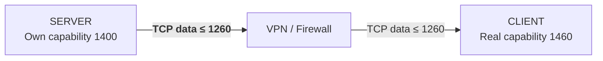

Notice that the client could really handle 1460.

But the server does not know that.

It was told:

```text
1260
```

and obeys it.

---

# Client → Server After Clamping

The client received the server's real advertisement:

```text
MSS = 1400
```

The client's own basic capability is:

```text
1460
```

Therefore:

```text
Server permits         = 1400
Client capability      = 1460

Effective basic limit  = 1400
```

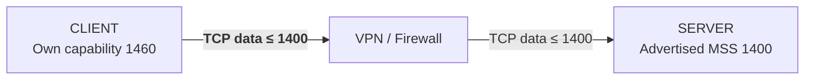

---

# Scenario B Result

| Direction       | Peer value visible to sender | Sender capability | Effective basic limit |
| --------------- | ---------------------------: | ----------------: | --------------------: |
| Server → Client |           **1260 — clamped** |              1400 |              **1260** |
| Client → Server |                         1400 |              1460 |              **1400** |

Now the two directions are different:

```text
Client → Server = 1400

Server → Client = 1260
```

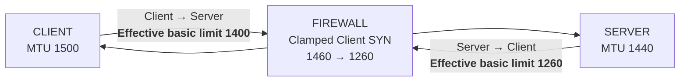

This is where the shortcut:

```text
"Use the lowest MSS on the connection"
```

completely fails.

It would predict:

```text
Client → Server = 1260
Server → Client = 1260
```

But the actual directional limits are:

```text
Client → Server = 1400
Server → Client = 1260
```

---

# Very Important — MSS and TCP Options

MSS represents TCP data relative to the **fixed** IP and TCP headers.

When calculating the MSS value placed in the SYN, a host normally does **not** subtract space for optional TCP/IP headers.

But when sending an actual packet containing TCP/IP options, the sender must account for those option bytes so that the final packet remains within the permitted size. RFC 6691 specifically clarifies this behavior.

For example, TCP timestamps commonly consume:

```text
Timestamp option = 10 bytes
Padding          =  2 bytes
-------------------------
Total            = 12 bytes
```

Therefore, **if timestamps are present on the data segment** and there are no other relevant options:

```text
Basic limit 1260
- TCP options 12
----------------
TCP data 1248
```

So Wireshark may show:

```text
tcp.len = 1248
```

rather than:

```text
tcp.len = 1260
```

---

# Actual Packet Example

For the 1300-byte client-MTU example:

```text
IPv4 fixed header       20
TCP fixed header        20
TCP timestamp/options   12
TCP data              1248
                       ----
IP total              1300
```

Exactly fits the 1300-byte MTU.

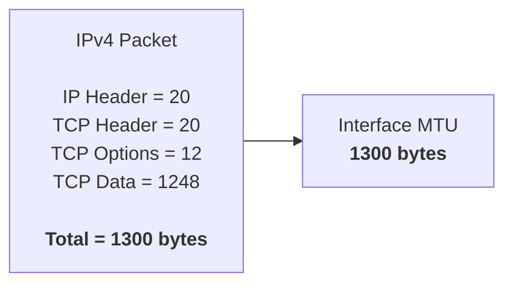

---

# What Wireshark Might Show

Assuming timestamps are present on these data packets:

| Scenario          | Direction       | Basic effective limit | Options | Possible full `tcp.len` |
| ----------------- | --------------- | --------------------: | ------: | ----------------------: |
| No middlebox      | Server → Client |                  1260 |      12 |                **1248** |
| No middlebox      | Client → Server |                  1260 |      12 |                **1248** |
| MSS clamp example | Server → Client |                  1260 |      12 |                **1248** |
| MSS clamp example | Client → Server |                  1400 |      12 |                **1388** |

So the clamped connection may look like:

```text
CLIENT                                      SERVER

         Client → Server
          tcp.len 1388
    ----------------------------->


         Server → Client
          tcp.len 1248
    <-----------------------------
```

That asymmetry is **consistent with directional MSS/PMTU constraints** and can be an excellent clue.

But:

> **1248 vs 1388 alone does not prove that a middlebox clamped MSS.**

Other path-MTU or sender behavior can also cause directional packet-size differences.

To **prove MSS clamping**, compare the same SYN at two capture points.

---

# Proving MSS Clamping with Two Captures

Capture the client's SYN:

1. **Before the firewall**
2. **After the firewall**


The evidence becomes:

| Capture                 | Client SYN MSS |
| ----------------------- | -------------: |
| **A — before firewall** |       **1460** |
| **B — after firewall**  |       **1260** |

Now you have proven:

```text
Client generated MSS 1460

             ↓

      Firewall changed it

             ↓

Server received MSS 1260
```

Seeing only:

```text
MSS = 1260
```

at the server does **not** prove clamping.

The client's real configuration could genuinely have produced MSS 1260.

---

# Wireshark Filters

## Find MSS Advertisements

```text
tcp.flags.syn == 1 && tcp.options.mss_val
```

Inspect both:

```text
Client SYN
    MSS = ?

Server SYN/ACK
    MSS = ?
```

---

## Look for Particular TCP Payload Sizes

```text
tcp.len == 1248
```

or:

```text
tcp.len == 1388
```

Remember:

```text
tcp.len
```

is TCP **payload/data length**.

It does not include the TCP header.

---

## Find Retransmissions

```text
tcp.analysis.retransmission
```

Also useful:

```text
tcp.analysis.fast_retransmission
```

and:

```text
tcp.analysis.duplicate_ack
```

---

# PMTUD Can Change the Effective Sending Size Later

MSS is exchanged during connection setup.

It is **not renegotiated every time the network changes**.

The actual usable path MTU can subsequently become smaller.

Conceptually:

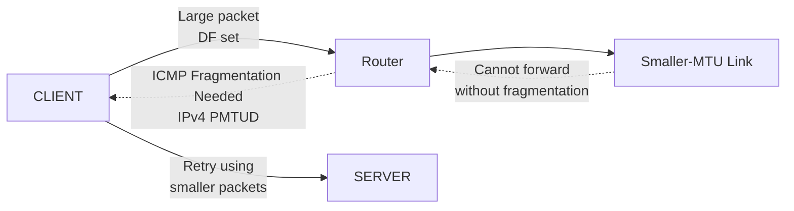

For classic IPv4 PMTUD, look for:

```text
icmp.type == 3 && icmp.code == 4
```

A common failure pattern is:

```text
TCP handshake              Works
Small request              Works
Small response             Works
Large transfer             Stalls
Retransmissions            Increase
```

If the required ICMP messages are blocked, you can get a **PMTUD black hole**.

---

# Part 2 — How Application Data Becomes TCP Segments

## The High-Level Answer

Normally:

> **The operating system's TCP stack turns the application's byte stream into TCP segments.**

With segmentation offload enabled, some of the final segmentation work may be deferred further down the networking stack or to the NIC.

---

# Application → Wire

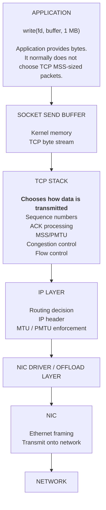

The important concept:

```text
APPLICATION

      "Here are bytes."
             │
             ▼
        TCP byte stream
             │
             ▼
       TCP/IP processing
             │
             ▼
         Segments
             │
             ▼
           Wire
```

---

# TCP Is a Byte Stream

Consider:

```text
Application:

write(socket, 1 MB)
```

The application does **not** mean:

```text
Create one 1-MB TCP packet.
```

Instead:

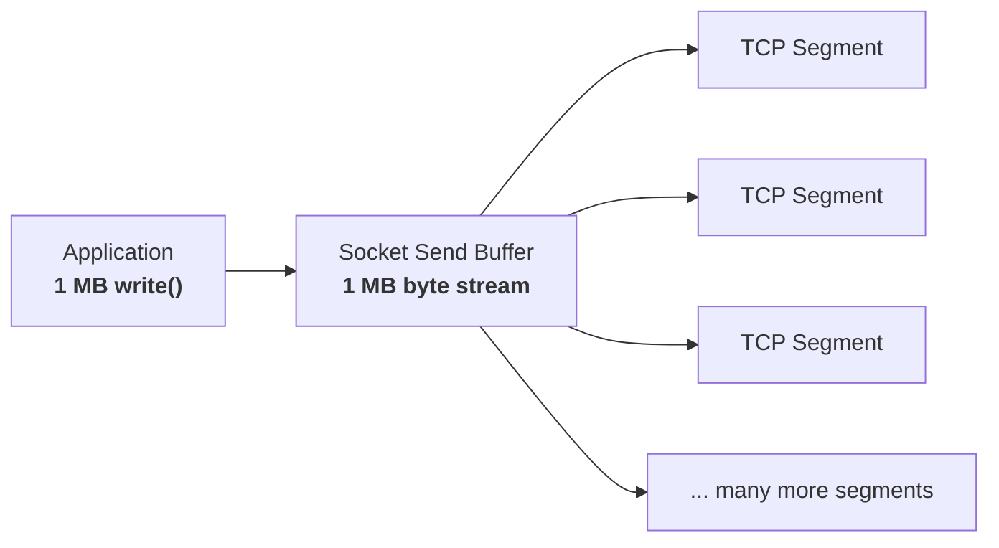

Likewise, several small application writes can potentially be combined into fewer TCP transmissions depending on buffering and TCP behavior.

Therefore:

> **Application write boundaries do not define TCP segment boundaries.**

---

# Examples

| Application behavior      | Possible network behavior                      |
| ------------------------- | ---------------------------------------------- |
| One `write()` of 1 MB     | Hundreds of TCP segments                       |
| Many tiny `write()` calls | May be combined/coalesced before transmission  |
| One 500-byte `write()`    | Could appear as one ~500-byte TCP data segment |
| Large HTTP response       | Spread across many TCP segments                |

TCP provides an ordered **byte stream**, not application-message boundaries.

That means:

```text
HTTP message boundary
        ≠
TCP segment boundary
```

---

# Important Correction — What Determines Segment Size vs How Much Can Be In Flight

It is useful to separate two different questions.

## Question 1 — How large can one TCP data segment be?

The main upper-bound considerations include:

```text
Effective MSS / PMTU
```

plus:

```text
How much application data is currently queued
```

and header/options overhead.

Conceptually:

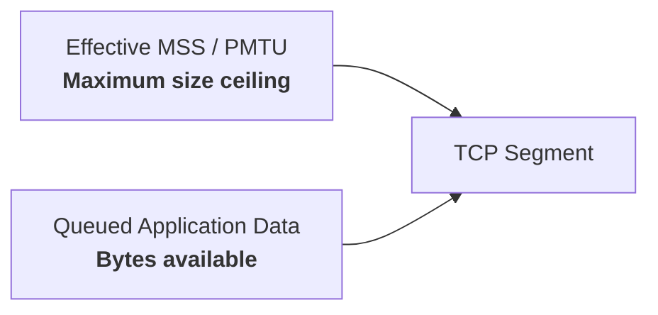

A sender does not need to fill every segment to MSS.

Therefore:

> **A sub-MSS TCP segment is completely normal.**

---

# Question 2 — How much data is TCP allowed to have outstanding?

Two major controls are:

### Receiver Window — `rwnd`

The peer says:

> "This is how much receive-buffer space I currently have available."

### Congestion Window — `cwnd`

The sender estimates:

> "This is how much unacknowledged data I believe the network can safely handle."

A simplified model is:

```text
Maximum outstanding data
≈
min(cwnd, rwnd)
```

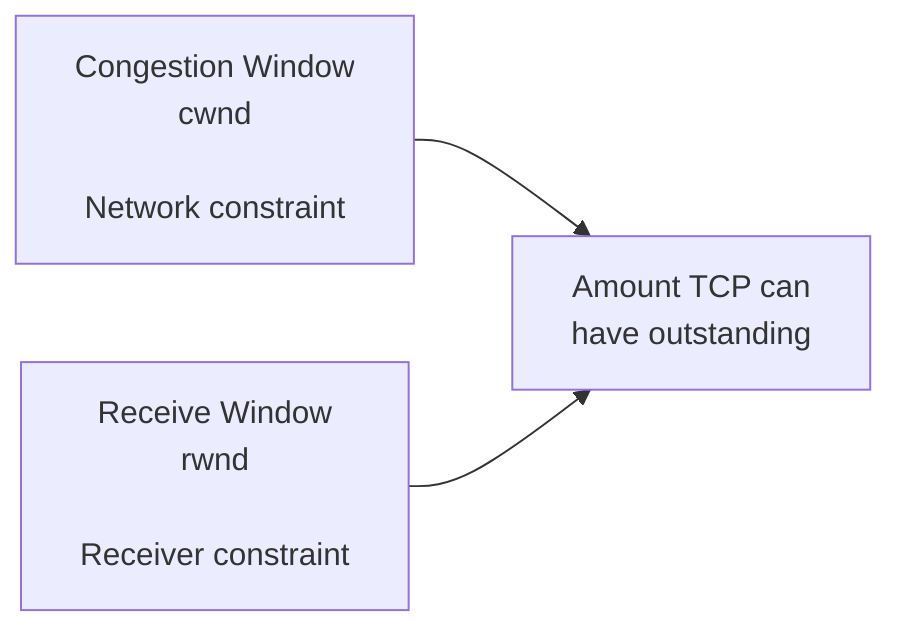

These primarily control **how much data may be in flight**.

They should not be thought of as alternative MSS values.

---

# MSS vs Window — Do Not Mix Them Up

```text
MSS
│
└── How large can an individual TCP data segment be?


cwnd / rwnd
│
└── How much data can be outstanding/in flight?
```

Example:

```text
MSS  = 1400 bytes
cwnd = 14,000 bytes
rwnd = 64,000 bytes
```

TCP might roughly be allowed to have:

```text
min(14,000, 64,000)
=
14,000 bytes outstanding
```

which could represent approximately:

```text
10 × 1400-byte TCP data segments
```

The exact behavior is more sophisticated, but this separation is the important troubleshooting concept.

---

# What About Nagle?

The Nagle algorithm is not another MSS calculation.

It is a mechanism intended to reduce excessive tiny TCP transmissions.

Conceptually:

```text
Application sends tiny writes
          │
          ▼
Is previous small data still unacknowledged?
          │
          ├── Yes → TCP may wait/coalesce
          │
          └── No  → TCP may transmit
```

Applications using:

```text
TCP_NODELAY
```

can disable Nagle behavior.

So Nagle primarily affects:

> **When small data gets transmitted**

rather than changing the connection's MSS.

---

# Part 3 — TCP Offloading and Why Host Captures Can Mislead You

This becomes extremely important when using Wireshark on Linux servers.

Consider the transmit path:

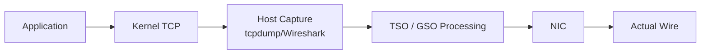

Depending on where capture occurs relative to offload processing, Wireshark may see a very large logical packet even though the actual wire contains several normal-sized packets.

---

# Transmit Offload

## TSO — TCP Segmentation Offload

The operating system/NIC path can hand a large TCP buffer to hardware, and the NIC performs the final segmentation.

Conceptually:

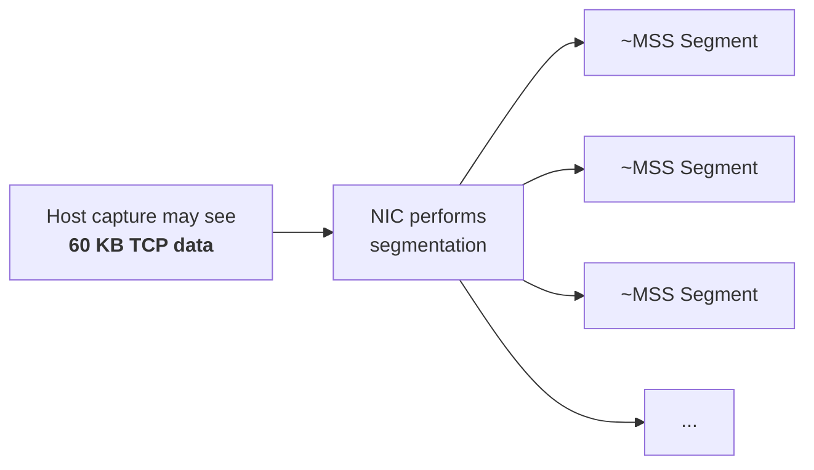

So a host capture might show:

```text
tcp.len = 64000
```

even though no 64-KB TCP packet ever appeared on the physical network.

---

# GSO — Generic Segmentation Offload

GSO performs a similar optimization in the host networking stack, with segmentation deferred until later in packet processing.

The exact implementation differs from TSO, but from a packet-analysis perspective the important lesson is:

> A local capture can occur **before final segmentation**.

---

# Receive Offload

The reverse can happen on receive.

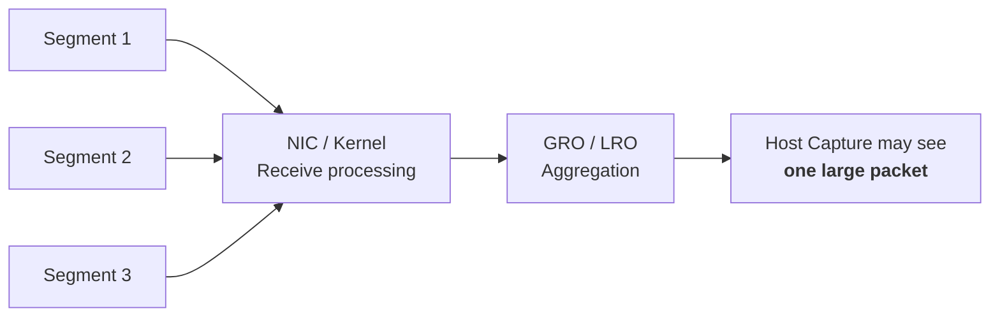

### GRO

**Generic Receive Offload**

Typically software/kernel aggregation.

### LRO

**Large Receive Offload**

A related receive-side aggregation technique, often associated with NIC/hardware implementations.

From the Wireshark analyst's perspective:

```text
Several packets existed on the network
              │
              ▼
        GRO/LRO combines them
              │
              ▼
Host capture may show one large packet
```

---

# Why This Matters for Wireshark

Suppose:

```text
MSS = 1400
```

but your EC2/Linux capture shows:

```text
tcp.len = 28,000
```

Do not immediately conclude:

```text
"The sender violated MSS."
```

First consider:

```text
TSO
GSO
GRO
LRO
```

---

# Better Capture Locations

For true wire behavior, generally prefer:

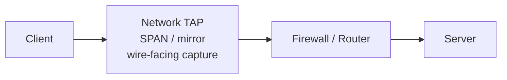

A capture point that sees traffic **after transmit segmentation and before receive aggregation** provides a more faithful view of actual network packets.

---

# Linux — Temporarily Disable Offloads for Troubleshooting

Check current settings:

```bash
ethtool -k eth0
```

For controlled troubleshooting, you may temporarily disable relevant offloads:

```bash
sudo ethtool -K eth0 tso off gso off gro off lro off
```

Then capture again.

> Do this cautiously on production systems because disabling offloads can increase CPU utilization and reduce throughput.

---

# Other Host-Capture Artifacts

Offloading can also cause misleading observations such as:

```text
Apparently oversized tcp.len
Checksum marked "incorrect"
Unexpected packet grouping
Timing that differs from true wire transmission timing
```

For example, checksum offload can cause Wireshark to see a packet **before the NIC has calculated the final checksum**.

Therefore:

> **A strange host capture is evidence to investigate — not automatically evidence of a network fault.**

---

# Final Mental Model

When troubleshooting MSS, draw the connection like this:

```mermaid
flowchart LR
    C["CLIENT<br/><br/>Advertised MSS = C<br/>Own send capability = C2"]

    S["SERVER<br/><br/>Advertised MSS = S<br/>Own send capability = S2"]

    C -- "Client → Server<br/><b>min(Server advertised MSS, Client capability)</b>" --> S

    S -- "Server → Client<br/><b>min(Client advertised MSS, Server capability)</b>" --> C
```

Never calculate:

```text
min(Client MSS, Server MSS)
```

and declare that the connection MSS.

Instead calculate:

```text
CLIENT → SERVER

min(
    Server's advertised receive MSS,
    Client's local/path capability
)
```

and independently:

```text
SERVER → CLIENT

min(
    Client's advertised receive MSS,
    Server's local/path capability
)
```

---

# The Four Questions to Ask in Wireshark

For every TCP performance problem, ask:

### 1. What did the client advertise?

```text
Client SYN
MSS = ?
```

### 2. What did the server advertise?

```text
Server SYN/ACK
MSS = ?
```

### 3. Did either MSS value change across the network?

Compare:

```text
Client-side capture
        vs
Server-side capture
```

### 4. What segment sizes actually appear on the wire?

Then determine whether the difference comes from:

```text
MSS
PMTU
TCP/IP options
Application behavior
cwnd
rwnd
TCP offloading
Retransmissions / loss
```

---

# One-Page Troubleshooting Summary

```mermaid
flowchart TD
    START["Large-transfer problem"]

    SYN["Check SYN + SYN/ACK<br/>MSS advertisements"]

    TWO["Compare captures<br/>before and after middleboxes"]

    CHANGE{"Did MSS change?"}

    CLAMP["MSS clamping proven<br/>Identify firewall/VPN/router"]

    SIZE["Check actual packet sizes<br/>in each direction"]

    OFFLOAD{"Host capture shows<br/>oversized tcp.len?"}

    DISABLE["Check TSO/GSO/GRO/LRO<br/>or use wire-facing capture"]

    LOSS["Check retransmissions,<br/>Dup ACKs and PMTUD"]

    START --> SYN
    SYN --> TWO
    TWO --> CHANGE

    CHANGE -- Yes --> CLAMP
    CHANGE -- No --> SIZE

    SIZE --> OFFLOAD
    OFFLOAD -- Yes --> DISABLE
    OFFLOAD -- No --> LOSS

    DISABLE --> LOSS
```

The central concept is:

> **MSS is directional.**

And the troubleshooting rule is:

> **Follow the MSS across the SYN, then follow the data in the opposite direction.**
