# TLS and HTTPS: From Browser URL to Wireshark Packets

**A layered reference for network and security engineers.**

---

## How to read this document

The TLS material is deliberately taught **three times, at increasing depth**. Stop wherever you have what you need.

| If you want… | Read |
| --- | --- |
| The 60-second mental model | Part 0 |
| Why packet counts never match message counts | §3 — *TCP as a byte stream* |
| TLS conceptually, no packet detail | §7 — *TLS in one page* |
| The classic handshake, message by message | §8 — *TLS 1.2* |
| What changed in 1.3 and why | §9, §10 |
| The meaning of every field you see in a ClientHello | §11 — **field reference** |
| Where load balancers make routing decisions | §17 |
| ECH and what it breaks operationally | §19, §20 |
| Filters, decryption, troubleshooting | §21–§24 |

**Notation:** `Client = 10.10.1.25:53000`, `Server = 203.0.113.20:443`, hostname `app.example.com` throughout.

**Table of contents**

- **Part 0 — The big picture**
  - [1. One request, five layers](#1-one-request-five-layers)
  - [2. The protocol stack](#2-the-protocol-stack)
  - [3. "TCP treats TLS as a stream of bytes" — what that actually means](#3-tcp-treats-tls-as-a-stream-of-bytes--what-that-actually-means)
- **Part I — TCP**
  - [4. The three-way handshake](#4-the-three-way-handshake)
  - [5. Sequence numbers count bytes, not packets](#5-sequence-numbers-count-bytes-not-packets)
  - [6. TCP in Wireshark](#6-tcp-in-wireshark)
- **Part II — TLS, three passes**
  - [7. Pass 1 — TLS in one page](#7-pass-1--tls-in-one-page)
  - [8. Pass 2 — TLS 1.2, message by message](#8-pass-2--tls-12-message-by-message)
  - [9. Pass 3 — TLS 1.3 and why each change was made](#9-pass-3--tls-13-and-why-each-change-was-made)
  - [10. TLS 1.2 vs TLS 1.3 side by side](#10-tls-12-vs-tls-13-side-by-side)
  - [11. ClientHello: every field explained](#11-clienthello-every-field-explained)
  - [12. The rest of the TLS 1.3 handshake](#12-the-rest-of-the-tls-13-handshake)
  - [13. mTLS](#13-mtls-client-certificate-authentication)
  - [14. What TLS looks like in Wireshark](#14-what-tls-looks-like-in-wireshark)
- **Part III — HTTP inside TLS**
  - [15. HTTPS](#15-https-http-inside-tls)
  - [16. SNI vs Host vs path](#16-sni-vs-host-vs-path)
  - [17. Where routing decisions happen](#17-where-routing-decisions-happen)
  - [18. Can SNI and Host differ?](#18-can-sni-and-host-differ)
- **Part IV — ECH**
  - [19. Encrypted SNI vs Encrypted ClientHello](#19-encrypted-sni-vs-encrypted-clienthello)
  - [20. ECH: operational and security implications](#20-ech-operational-and-security-implications)
- **Part V — Practice**
  - [21. Wireshark filter cookbook](#21-wireshark-filter-cookbook)
  - [22. Decrypting your own traffic](#22-decrypting-your-own-traffic)
  - [23. Troubleshooting in layer order](#23-troubleshooting-in-layer-order)
  - [24. One complete example](#24-one-complete-example)
  - [25. Quick reference card](#25-quick-reference-card)

---

# Part 0 — The big picture

## 1. One request, five layers

Consider this URL:

```text
https://app.example.com:443/orders/123?format=json#details
```

The browser does **not** immediately send an HTTP request. Five things happen first:

| # | Step | Protocol | Round trips |
| --- | --- | --- | --- |
| 1 | Resolve `app.example.com` to an IP | DNS | 0–1 |
| 2 | Open a connection to that IP on port 443 | TCP | 1 |
| 3 | Negotiate keys and verify server identity | TLS | 1 (TLS 1.3) or 2 (TLS 1.2) |
| 4 | Send the request inside the encrypted session | HTTP | — |
| 5 | Receive the encrypted response | HTTP | 1 |

Two details that trip people up immediately:

- **`#details` is never transmitted.** The fragment is processed locally by the browser. It appears in no packet, ever.
- **The hostname is sent twice, at two different layers.** Once in the clear as TLS **SNI**, once encrypted as the HTTP **Host** / `:authority`. §16 explains why both exist.

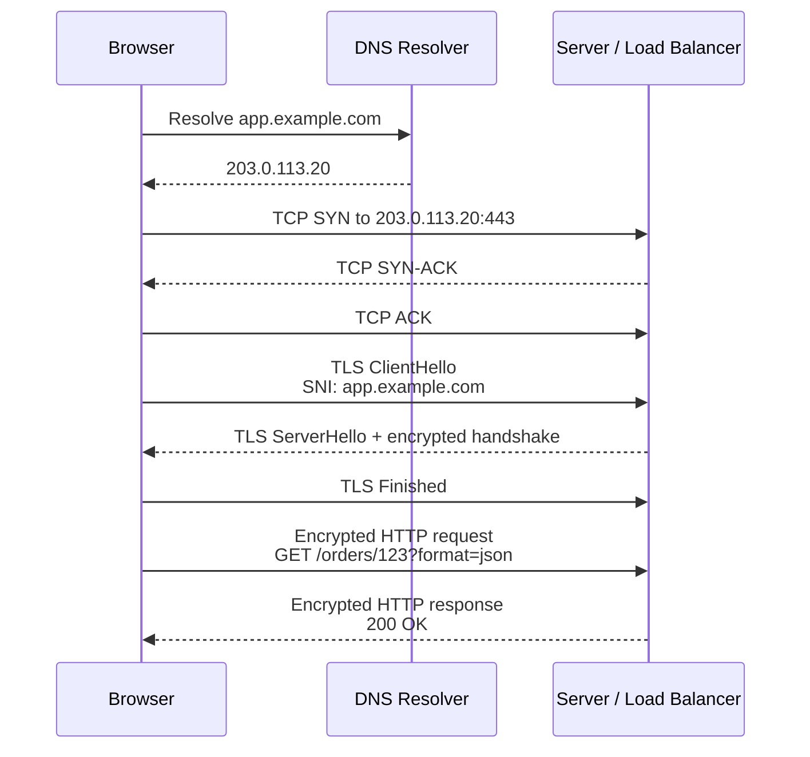

---

## 2. The protocol stack

A single captured frame contains nested headers, each layer treating the layer above as opaque payload:

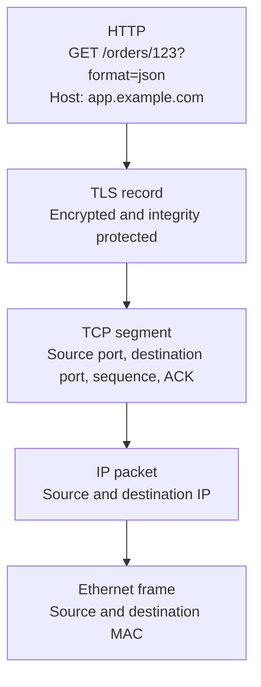

```text
Ethernet carries IP
    IP carries TCP
        TCP carries TLS
            TLS carries HTTP
```

Each layer knows only its own job:

| Layer | Sees | Does not see |
| --- | --- | --- |
| Ethernet | MAC addresses | Anything above |
| IP | Source/destination IP | Ports, payload meaning |
| TCP | Ports, sequence, flags | That the payload is TLS at all |
| TLS | Records and handshake messages | That the payload is HTTP |
| HTTP | Method, host, path, headers, body | Anything below |

That last column is the important one. **TCP has no idea it is carrying TLS.** Which brings us to the question in the original document that deserved a full section of its own.

---

## 3. "TCP treats TLS as a stream of bytes" — what that actually means

### 3.1 TCP's contract

TCP promises exactly this to whatever sits above it:

> *Every byte you hand me will arrive at the other end, in the same order, exactly once — eventually.*

TCP does **not** promise:

- That the bytes from one `write()` arrive in one `read()`
- That message boundaries are preserved in any way
- Any interpretation whatsoever of what the bytes mean

**Analogy.** TCP is a **conveyor belt of individual letters**, not a mail system of sealed envelopes. If you place `HELLO` and then `WORLD` on the belt, the receiver may pick up `HELLOWOR`, then `LD`. Nothing was lost or reordered — TCP kept its promise. But the grouping you intended is gone. TCP never knew about it.

Contrast this with UDP, which is message-oriented: one `sendto()` becomes exactly one datagram, and one `recvfrom()` returns exactly that datagram or nothing.

### 3.2 Therefore TLS must bring its own envelopes

Because TCP destroys message boundaries, **TLS re-creates them itself**. Every TLS message is wrapped in a **TLS record** with a 5-byte header:

```text
+---------+-------------------+-------------------+
| type    | legacy_version    | length            |
| 1 byte  | 2 bytes           | 2 bytes           |
+---------+-------------------+-------------------+
|            payload (length bytes)               |
+-------------------------------------------------+
```

| Field | Size | Meaning |
| --- | --- | --- |
| `type` | 1 byte | `20` change_cipher_spec, `21` alert, `22` handshake, `23` application_data |
| `legacy_version` | 2 bytes | Frozen at `0x0303` for middlebox compatibility; carries no real meaning in TLS 1.3 |
| `length` | 2 bytes | Payload length, max `2^14` = 16 384 bytes of plaintext |

The receiver's loop is simply:

```text
1. Read 5 bytes from the TCP stream  -> header
2. Read `length` more bytes          -> one complete record
3. Decrypt and process
4. Repeat
```

If fewer than `length` bytes have arrived yet, TLS **waits for more TCP data**. That waiting loop is the entire mechanism, and it produces four consequences you will see in every capture.

### 3.3 Consequence 1 — one TLS record can span many TCP segments

A certificate chain of 4 500 bytes on a link with MSS 1 460:

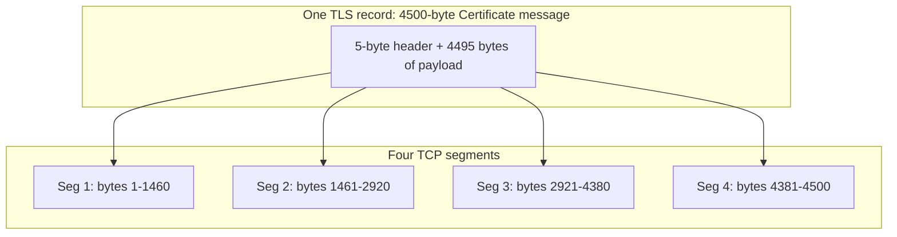

In Wireshark this appears as:

```text
No.  Protocol  Info
10   TCP       [TCP segment of a reassembled PDU]
11   TCP       [TCP segment of a reassembled PDU]
12   TCP       [TCP segment of a reassembled PDU]
13   TLSv1.3   Certificate, CertificateVerify, Finished
```

Packets 10–12 are **not** empty or broken. Wireshark simply cannot dissect the TLS message until the last byte arrives, so it attributes the whole message to the final packet. This behaviour is controlled by:

```text
Edit → Preferences → Protocols → TCP
  → "Allow subdissector to reassemble TCP streams"
```

Turn it off and TLS dissection of split messages breaks entirely — a useful diagnostic trick, and a common cause of "Wireshark isn't showing my certificate" confusion.

### 3.4 Consequence 2 — one TCP segment can carry several TLS records

The reverse happens constantly. A TLS 1.3 server typically packs four handshake messages into one segment:

```text
One TCP segment, 900 bytes of payload:
    [Record 1: EncryptedExtensions ]
    [Record 2: Certificate         ]
    [Record 3: CertificateVerify   ]
    [Record 4: Finished            ]
```

Wireshark shows this as one packet with four TLS layers in the detail pane, and an Info column reading `EncryptedExtensions, Certificate, CertificateVerify, Finished`.

### 3.5 Consequence 3 — never write logic that counts packets

> **Rule:** *n*th packet ≠ *n*th TLS message. Ever.

This has real operational consequences:

- A middlebox that inspects only the first TCP segment of a connection **will miss a ClientHello that spans two segments**. Correct implementations buffer and reassemble before parsing.
- This is not an exotic edge case any more. **Post-quantum hybrid key shares have made large ClientHellos routine.** A `X25519MLKEM768` key share is roughly 1 200 bytes on its own, pushing a normal browser ClientHello past 1 700 bytes — over a standard 1 460-byte MSS. Split ClientHellos now occur in ordinary browser traffic, not just in evasion attempts.
- If your SNI-based firewall or allowlist quietly stopped catching some domains, a two-segment ClientHello is one of the first things to test for.

### 3.6 Consequence 4 — sequence numbers count bytes

Because the unit is the byte, ACK numbers advance by payload length, not message count. See §5.

### 3.7 The flip side: TLS depends on TCP's reliability

TLS assumes a **reliable, ordered** transport, so it does no retransmission or reordering of its own. If one TCP segment carrying part of a record is lost, TLS simply stalls until TCP retransmits — **head-of-line blocking**. Everything queued behind that record waits, even if later bytes already arrived.

This is precisely why QUIC exists: it moves loss recovery and stream multiplexing below the crypto layer so that one lost packet only blocks its own stream. HTTP/3 over QUIC uses TLS 1.3's cryptographic handshake but not the TLS record layer, and not TCP at all.

```text
TLS  → needs reliable, in-order bytes → TCP
DTLS → tolerates loss and reordering  → UDP
QUIC → provides its own reliability   → UDP, TLS 1.3 handshake only
```

---

# Part I — TCP

## 4. The three-way handshake

### What TCP provides

- A connection identified by the 4-tuple: source IP, source port, destination IP, destination port
- Reliable, ordered byte delivery with retransmission
- Sequence and acknowledgment numbers
- Flow control via the receive window; congestion control
- Detection of duplicate and out-of-order data

**TCP provides no encryption and no identity verification.** An observer sees addresses, ports, flags, sizes, timing and sequence behaviour.

### The three messages

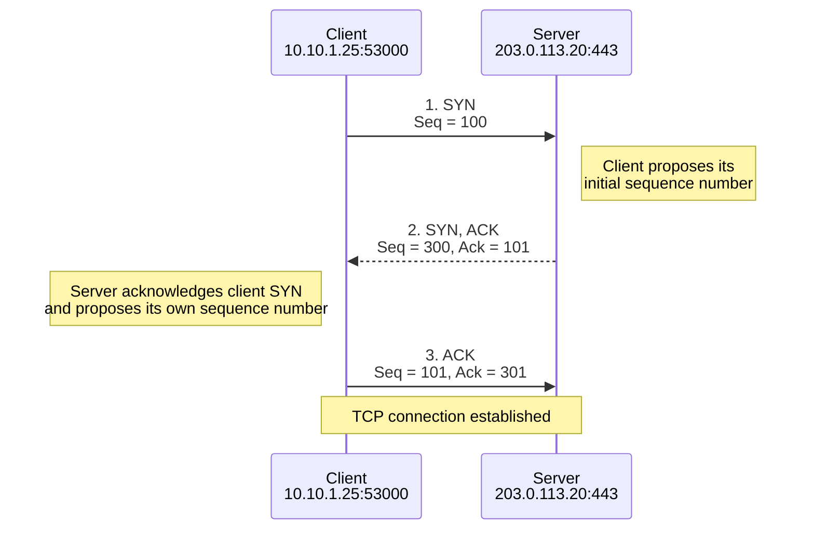

| Packet | Flags | Seq | Ack | Meaning |
| --- | --- | --- | --- | --- |
| 1 | SYN | 100 | — | "Opening a connection. My first sequence number is 100." |
| 2 | SYN, ACK | 300 | 101 | "Got it. Expecting 101 next. My sequence starts at 300." |
| 3 | ACK | 101 | 301 | "Got yours. Expecting 301 next." |

A SYN consumes one sequence number, which is why the server acknowledges `101` after client sequence `100`. A pure ACK consumes none.

The client SYN also advertises options that shape the connection but have nothing to do with TLS: MSS, window scaling, SACK permitted, timestamps.

After the handshake both sides know the peer is reachable, both directions work, each side's initial sequence number, and the agreed options. The three-way exchange also prevents delayed packets from an old connection being mistaken for a new one.

---

## 5. Sequence numbers count bytes, not packets

Suppose the client sends a 517-byte ClientHello:

```text
Client → Server
Seq = 101
TCP payload length = 517
```

Next expected byte:

```text
101 + 517 = 618
```

The server acknowledges with `Ack = 618`, meaning:

> "I have every byte through 617. Send byte 618 next."

It does **not** mean "I received packet 618." This is the same byte-stream principle from §3, viewed from the accounting side.

---

## 6. TCP in Wireshark

Wireshark displays **relative** sequence numbers by default, so the first SYN shows `Seq=0`:

```text
No.  Source          Destination     Protocol  Info
1    10.10.1.25      203.0.113.20    TCP       53000 → 443 [SYN] Seq=0
2    203.0.113.20    10.10.1.25      TCP       443 → 53000 [SYN, ACK] Seq=0 Ack=1
3    10.10.1.25      203.0.113.20    TCP       53000 → 443 [ACK] Seq=1 Ack=1
4    10.10.1.25      203.0.113.20    TLSv1.3   Client Hello
5    203.0.113.20    10.10.1.25      TCP       443 → 53000 [ACK]
6    203.0.113.20    10.10.1.25      TLSv1.3   Server Hello
```

Actual packetisation varies — see §3.

### Filters

| Filter | Matches |
| --- | --- |
| `tcp` | All TCP |
| `tcp.port == 443` | Either direction on 443 |
| `tcp.flags.syn == 1` | Any SYN, including SYN-ACK |
| `tcp.flags.syn == 1 && tcp.flags.ack == 0` | Initial client SYN only |
| `tcp.flags.syn == 1 && tcp.flags.ack == 1` | Server SYN-ACK only |
| `tcp.stream == 7` | One specific connection |
| `tcp.analysis.retransmission` | Retransmissions |
| `tcp.analysis.zero_window` | Receiver buffer exhausted |

Always compare flags against `1` or `True`. Testing merely for the field's presence also matches packets where the bit is clear.

---

# Part II — TLS, three passes

## 7. Pass 1 — TLS in one page

### The four questions TLS answers

| Question | TLS mechanism | What it defeats |
| --- | --- | --- |
| Am I talking to who I think I am? | Certificate + CertificateVerify | Impersonation |
| Can we agree a secret key in public? | Ephemeral Diffie-Hellman key agreement | Eavesdropping on key setup |
| Can we hide the content? | Symmetric AEAD encryption | Passive interception |
| Can we detect tampering? | AEAD authentication tag + Finished | Modification, downgrade |

### The two halves of TLS

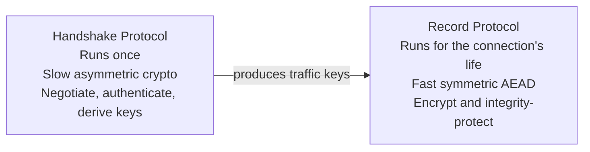

Public-key cryptography is expensive, so TLS uses it **only to bootstrap**: prove identity and agree on a shared secret. Everything after that uses fast symmetric encryption.

### Analogy

Two strangers must exchange a locked briefcase in public:

1. **Certificate** — one shows an ID card signed by a notary the other already trusts.
2. **CertificateVerify** — the ID card alone proves nothing about *who is holding it*, so they sign a fresh challenge with the private key the card names. Now you know the holder is the subject.
3. **Key agreement** — both shout numbers across the room and, using a private number each keeps, independently compute the same combination. Anyone listening heard the shouted numbers but cannot derive the combination.
4. **Finished** — each recites a summary of everything said so far. If an eavesdropper altered anything mid-conversation, the summaries won't match.
5. **Record protocol** — everything afterwards goes in the locked briefcase.

### The five goals of every TLS handshake

Regardless of version, a handshake must:

1. **Agree a protocol version**
2. **Agree on algorithms** — key exchange, signature, cipher, hash
3. **Authenticate the server** (and optionally the client)
4. **Establish shared symmetric keys**
5. **Verify the negotiation itself was not tampered with**

TLS 1.2 and TLS 1.3 both accomplish all five. They differ in **what order, how many round trips, and how much is left visible on the wire.** That comparison is the whole point of the next two sections.

### What TLS gives you when it works

- **Confidentiality** — observers cannot read HTTP headers or content
- **Integrity** — modification is detected
- **Server authentication** — client validates the certificate chain and name
- **Optional client authentication** — mTLS
- **Key agreement** — both sides derive identical keys without transmitting them
- **Forward secrecy** — with ephemeral key agreement, stealing the certificate's private key later does not decrypt previously captured sessions

That last property is why "we have the server's private key, so we can decrypt the pcap" is false for modern TLS. See §22.

---

## 8. Pass 2 — TLS 1.2, message by message

TLS 1.2 is worth learning first for two reasons: more of it is **visible in a capture**, which makes it easier to see what is happening, and you will still encounter it on appliances, embedded devices, and legacy internal services.

> **Standards note.** TLS 1.2 was specified in RFC 5246, which is now **obsoleted by RFC 9846** (the current TLS 1.3 specification, July 2026). RFC 9846 also adds new requirements for TLS 1.2 implementations and states that implementations **MUST NOT negotiate TLS 1.0 or 1.1**.

### The ECDHE handshake

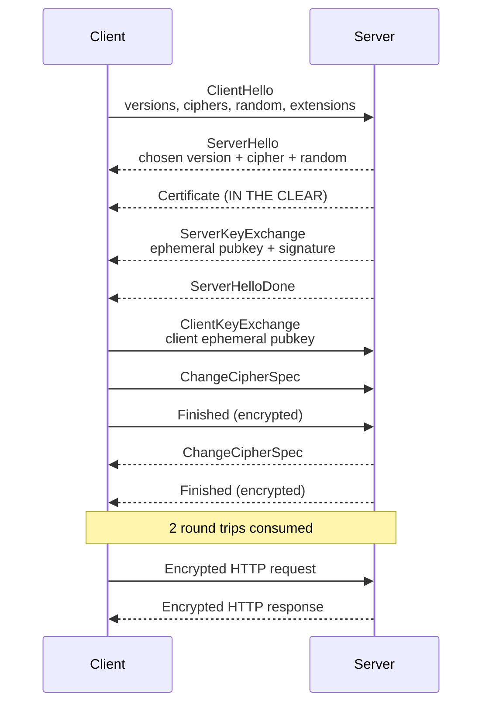

### What each message is for

| Message | Purpose | Encrypted? |
| --- | --- | --- |
| **ClientHello** | Offer versions, cipher suites, random, extensions | No |
| **ServerHello** | Pick **one** version, **one** cipher suite; send server random | No |
| **Certificate** | Present the chain proving the server's identity | **No — fully visible** |
| **ServerKeyExchange** | Send the server's *ephemeral* DH public key, **signed** with the certificate's long-term private key | No |
| **ServerHelloDone** | "I'm finished talking; your turn" | No |
| **ClientKeyExchange** | Send the client's ephemeral public key | No |
| **ChangeCipherSpec** | "Everything I send after this is encrypted" | No (it's a signal) |
| **Finished** | Hash of the entire handshake transcript, keyed with the master secret | Yes |

**Why ServerKeyExchange exists.** The certificate contains a *long-term* public key. In an ECDHE suite that key is used only for **signing**, never for key exchange — that's what gives forward secrecy. So the server must send a *separate, ephemeral* key, and must sign it (over `client_random + server_random + params`) to prove the ephemeral key came from the certificate holder and not an attacker in the middle.

### Key derivation in 1.2

```text
ECDHE(client_priv, server_pub) = pre_master_secret
master_secret = PRF(pre_master_secret, "master secret",
                    client_random + server_random)
→ split into client/server MAC keys, encryption keys, IVs
```

### Cipher suite naming in 1.2

```text
TLS_ECDHE_RSA_WITH_AES_128_GCM_SHA256
    │    │     │        │            └── PRF hash
    │    │     │        └─────────────── bulk cipher + mode
    │    │     └──────────────────────── authentication (cert key type)
    │    └────────────────────────────── key exchange
    └─────────────────────────────────── protocol
```

**Four decisions bundled into one identifier.** Remember this — it is the single biggest structural change in 1.3.

### What TLS 1.2 leaves on the table

| Weakness | Consequence |
| --- | --- |
| Certificate sent in cleartext | Passive observer learns exactly which site, even without SNI |
| Static RSA key exchange permitted | No forward secrecy; stolen key retroactively decrypts archived traffic |
| Two round trips before application data | ~100 ms extra on a 50 ms RTT path |
| CBC-and-HMAC modes, RC4, MD5/SHA-1 signatures negotiable | Large downgrade and padding-oracle attack surface |
| TLS-level compression | Compression-ratio side channel |
| Renegotiation | Complex state machine, historically abused |
| Huge negotiable option space | Every combination is a compatibility and analysis burden |

Roughly a decade of named attacks on TLS 1.2 and earlier — BEAST, CRIME, Lucky13, FREAK, Logjam, POODLE — targeted *legacy negotiable options* rather than the core design. That observation is what drove TLS 1.3.

---

## 9. Pass 3 — TLS 1.3 and why each change was made

TLS 1.3 (RFC 9846, obsoleting RFC 8446) is best understood as **a deletion project with one performance win**.

### Change 1 — one round trip instead of two

The client **guesses** which key-exchange group the server will pick and sends its ephemeral public key in the *very first message*. If the guess is right, keys can be derived immediately after ServerHello.

```text
TLS 1.2:  ClientHello → ServerHello ... → ClientKeyExchange → data   (2 RTT)
TLS 1.3:  ClientHello+key_share → ServerHello+key_share → data        (1 RTT)
```

If the guess is wrong, the server sends **HelloRetryRequest** naming an acceptable group, and the client retries — costing an extra round trip. In a capture, an HRR looks like a ServerHello with a special fixed `random` value; Wireshark labels it explicitly.

### Change 2 — everything after ServerHello is encrypted

Once both hellos are exchanged, both sides can derive **handshake traffic keys** immediately. Every subsequent handshake message is protected:

```text
Visible:    ClientHello, ServerHello
Encrypted:  EncryptedExtensions, Certificate, CertificateVerify, Finished
```

**The server certificate is no longer visible in a passive capture.** This is the single most consequential change for anyone doing network monitoring.

### Change 3 — cipher suites decoupled from key exchange and authentication

```text
TLS 1.2:  TLS_ECDHE_RSA_WITH_AES_128_GCM_SHA256   (4 decisions)
TLS 1.3:  TLS_AES_128_GCM_SHA256                  (2 decisions)
```

In TLS 1.3 a cipher suite names only **the AEAD cipher and the hash**. Key exchange moved to `supported_groups` + `key_share`; authentication moved to `signature_algorithms`. There are only five standard suites, versus dozens.

### Change 4 — forward secrecy is mandatory

Static RSA and static DH key exchange are **removed**. Every full handshake is ephemeral. Consequence: passive decryption from a stolen server private key is no longer possible — which is why enterprise TLS inspection must now be an active, terminating proxy rather than a passive tap.

### Change 5 — the deletions

Removed outright: renegotiation, TLS-level compression, static RSA/DH, custom DH groups, CBC modes, RC4, MD5/SHA-1 in signatures, DSA, session IDs and session tickets in their old form, and the ChangeCipherSpec message's real function.

### Change 6 — version negotiation moved into an extension

Middleboxes were rejecting anything whose version field wasn't `0x0303`. TLS 1.3 therefore **freezes the legacy version fields at TLS 1.2 values** and negotiates the real version in the `supported_versions` extension.

This is why Wireshark may show `Version: TLS 1.2 (0x0303)` on the record and handshake layers of a *TLS 1.3* ClientHello. **The record-layer version is meaningless. Read `supported_versions`.** This trips up almost everyone once.

The same reasoning produced "compatibility mode": a TLS 1.3 client sends a fake, non-empty `legacy_session_id` and both sides send a dummy ChangeCipherSpec record, purely so the exchange resembles a TLS 1.2 resumption to onlooking middleboxes.

### Change 7 — a real key schedule

TLS 1.3 replaces the ad-hoc 1.2 PRF with an HKDF-based schedule producing distinct secrets per stage:

```text
              PSK or 0
                │
          HKDF-Extract  →  Early Secret      → early traffic keys (0-RTT)
                │
   (EC)DHE → HKDF-Extract → Handshake Secret → handshake traffic keys
                │
          HKDF-Extract  →  Master Secret     → application traffic keys
                                             → resumption master secret
                                             → exporter secret
```

Every secret is bound to the **handshake transcript**, so any modification anywhere invalidates everything downstream.

### Change 8 — 0-RTT, with a caveat

A resuming client can send application data in its *first flight*, before the handshake completes. Latency: zero round trips.

**Early data has no replay protection.** A network attacker who captures a 0-RTT flight can resend it. Never use 0-RTT for non-idempotent operations — funds transfers, state changes, anything with a side effect. Restrict it to safe, idempotent GETs, or disable it.

### Change 9 — downgrade protection

If a TLS 1.3-capable server negotiates a lower version, it embeds a sentinel value in the last 8 bytes of `ServerHello.random`. A TLS 1.3-capable client that sees the sentinel while believing it offered 1.3 knows an attacker forced the downgrade, and aborts.

### Change 10 — RFC 9846 tightening (2026)

The current specification tightens several requirements and, notably, states that **implementations MUST NOT negotiate TLS 1.0 or TLS 1.1**. The protocol is still called TLS 1.3; RFC 9846 is backward-compatible with RFC 8446 on the wire. Practically: legacy devices that can only speak 1.0/1.1 shift from being a *confidentiality* problem to an *availability* problem as libraries adopt the new baseline.

---

## 10. TLS 1.2 vs TLS 1.3 side by side

| Item | TLS 1.2 | TLS 1.3 |
| --- | --- | --- |
| ClientHello visible | Yes | Yes, unless ECH |
| ServerHello visible | Yes | Yes |
| **Server certificate visible** | **Normally yes** | **Normally encrypted** |
| Static RSA key exchange | Historically permitted | Removed |
| Forward secrecy | Optional, suite-dependent | Always |
| Handshake round trips | ~2 | ~1 (0 with 0-RTT resumption) |
| Cipher suite encodes | KEX + auth + cipher + MAC | AEAD cipher + hash |
| Standard cipher suites | Dozens | Five |
| Version negotiated in | `ServerHello.version` | `supported_versions` extension |
| Key exchange chosen in | Cipher suite | `supported_groups` + `key_share` |
| Server auth algorithm chosen in | Cipher suite | `signature_algorithms` |
| Renegotiation | Yes | Removed |
| Compression | Yes | Removed |
| ChangeCipherSpec | Functional | Dummy, compatibility only |
| Resumption | Session IDs, session tickets | PSK |
| 0-RTT | None | Yes, with replay risk |
| Key derivation | Custom PRF | HKDF key schedule |
| Padding-oracle-prone modes | CBC available | AEAD only |

### The single most important operational difference

```text
TLS 1.2 capture, no keys:
    You can read the server certificate → you know the site,
    the issuing CA, the SANs, the validity period.

TLS 1.3 capture, no keys:
    You get IP, port, timing, sizes, and the plaintext SNI.
    Nothing else.

TLS 1.3 + ECH capture, no keys:
    You get IP, port, timing, sizes, and a public_name that
    identifies only the hosting provider.
```

Every monitoring, DLP, and allowlisting design decision follows from that ladder.

---

## 11. ClientHello: every field explained

This is the section for "I see multiple things in the ClientHello but don't know what each is for."

### 11.1 Structure at a glance

```text
TLS Record Layer
├── Content Type: Handshake (22)
├── Version: TLS 1.0/1.2 (legacy, meaningless)
└── Length

  Handshake Protocol
  ├── Handshake Type: Client Hello (1)
  ├── Length
  ├── legacy_version              ← frozen at 0x0303
  ├── random                      ← 32 bytes
  ├── legacy_session_id           ← 0 or 32 fake bytes
  ├── cipher_suites               ← list
  ├── legacy_compression_methods  ← must be [0]
  └── extensions                  ← where all the real information lives
```

**Everything interesting is in the extensions.** The fixed fields are mostly historical baggage.

### 11.2 The fixed fields

| Field | Value you'll see | What it's actually for | If wrong or missing |
| --- | --- | --- | --- |
| `legacy_version` | `0x0303` (TLS 1.2) | **Nothing, in TLS 1.3.** Frozen so middleboxes don't reject the packet. Real version is in `supported_versions`. | Servers may reject unfamiliar values |
| `random` | 32 random bytes | Freshness / anti-replay. Feeds the key schedule so identical handshakes never produce identical keys. | Reused randoms break session uniqueness |
| `legacy_session_id` | 32 random bytes in 1.3 | Pure theatre. TLS 1.3 sends a fake non-empty value so the flow resembles a 1.2 resumption. Server echoes it. In real TLS 1.2 it requests session resumption. | Empty value is legal but less middlebox-friendly |
| `cipher_suites` | 3–5 entries in 1.3 | Which **AEAD cipher + hash** the client can do. In 1.2 also encodes key exchange and auth. | No overlap → `handshake_failure` |
| `legacy_compression_methods` | `[0]` (null) | Must be null-only. TLS compression was removed after compression-ratio side channels. | Non-null → server must abort |

### 11.3 The extensions — the actual content

Extensions divide into four functional groups:

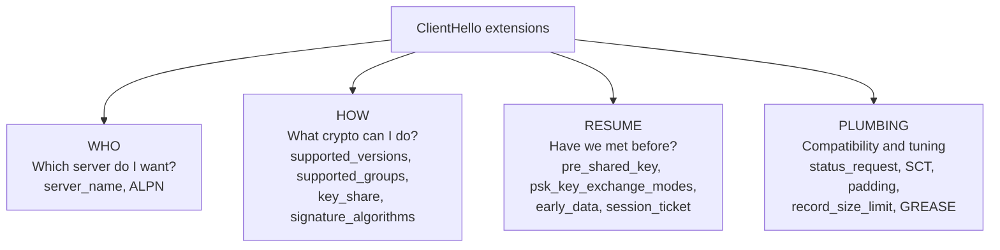

#### Group B — the crypto negotiation four

These four extensions carry what the cipher suite string used to carry in TLS 1.2. **Most TLS 1.3 handshake failures are a mismatch in one of these four.**

| Extension | ID | Example value | Purpose | Failure mode if mismatched |
| --- | --- | --- | --- | --- |
| `supported_versions` | 43 | TLS 1.3, TLS 1.2 | **The real version negotiation.** Server picks the highest it shares. | Absent → server treats client as ≤ 1.2 |
| `supported_groups` | 10 | `x25519`, `secp256r1`, `X25519MLKEM768` | Which Diffie-Hellman groups the client can compute in. Formerly "elliptic_curves". | No shared group → `handshake_failure` |
| `key_share` | 51 | x25519 public value (32 bytes) | The **actual ephemeral public key**, sent speculatively for the client's preferred group(s). This is what saves a round trip. | Server prefers a different group → **HelloRetryRequest**, +1 RTT |
| `signature_algorithms` | 13 | `ecdsa_secp256r1_sha256`, `rsa_pss_rsae_sha256` | Which signature schemes the client can **verify**. Determines which certificate the server selects (RSA vs ECDSA) and how it signs CertificateVerify. | Server has no matching cert → `handshake_failure` |

**Practical note on `signature_algorithms`:** this is the classic cause of "the browser connects fine but the Java client / IoT device / old appliance fails." The device offers a narrow signature list, and the server's ECDSA certificate isn't in it. Always check this extension before blaming the cipher suites.

`signature_algorithms_cert` (50) is a separate list covering signatures acceptable **within the certificate chain**, as distinct from the handshake signature. Rarely sent; useful when a client can verify a chain signed with an algorithm it cannot itself use for CertificateVerify.

#### Group A — routing and application selection

| Extension | ID | Value | Purpose |
| --- | --- | --- | --- |
| `server_name` (SNI) | 0 | `app.example.com` | Tells the TLS endpoint **which hostname you want**, before HTTP exists. Drives certificate selection, TLS virtual-server selection, and SNI-based routing. See §16. |
| `application_layer_protocol_negotiation` (ALPN) | 16 | `h2`, `http/1.1` | Selects the application protocol **during** the TLS handshake instead of after it. Also used by load balancers to choose a backend protocol. |

SNI carries **only a hostname**. It does not carry the scheme, path, query, headers, cookies, or body.

#### Group C — resumption and 0-RTT

| Extension | ID | Purpose |
| --- | --- | --- |
| `pre_shared_key` | 41 | Offers a PSK identity from a previous session. **Must be the last extension** — its binders are computed over all preceding bytes. |
| `psk_key_exchange_modes` | 45 | Whether resumption is PSK-only (`psk_ke`) or PSK-with-ECDHE (`psk_dhe_ke`, preserves forward secrecy). |
| `early_data` | 42 | "I am sending 0-RTT data." Presence alone signals early data follows. |
| `session_ticket` | 35 | TLS 1.2-style resumption ticket. |

#### Group D — plumbing you will see and can usually ignore

| Extension | ID | Purpose |
| --- | --- | --- |
| `status_request` | 5 | Request OCSP stapling — server includes a signed revocation response so the client needn't contact the CA |
| `signed_certificate_timestamp` | 18 | Request Certificate Transparency SCTs |
| `ec_point_formats` | 11 | Legacy; effectively always "uncompressed" |
| `extended_master_secret` | 23 | TLS 1.2 fix binding the master secret to the full handshake (triple-handshake defence). Irrelevant in 1.3 |
| `renegotiation_info` | 65281 | TLS 1.2 secure renegotiation indication. Renegotiation doesn't exist in 1.3 |
| `record_size_limit` | 28 | "Don't send me records larger than N" — constrained clients |
| `padding` | 21 | Pads the ClientHello out of size ranges known to break certain buggy middleboxes |
| `compress_certificate` | 27 | Offer to accept a compressed certificate chain (brotli/zlib/zstd) — meaningful savings on large chains |
| `post_handshake_auth` | 49 | Willing to be asked for a client certificate *after* the handshake |
| `cookie` | 44 | Echoed back on a HelloRetryRequest retry; lets a stateless server avoid keeping state |
| `encrypted_client_hello` | 0xfe0d | ECH — see §19 |

#### GREASE — the values that look like garbage

You will see entries Wireshark labels `Reserved (GREASE)` in the cipher suite list, supported groups, ALPN, and extensions:

```text
Cipher Suite: Reserved (GREASE) (0x3a3a)
Extension: Reserved (GREASE) (len=0)
Supported Group: Reserved (GREASE) (0x7a7a)
```

These are **deliberately meaningless values** (RFC 8701) that clients insert at random. Their purpose is to keep the ecosystem honest: if a middlebox or server chokes on an unknown value, it breaks *immediately and visibly* during normal browsing rather than years later when a genuinely new extension is deployed. A correct server ignores them silently.

**If your appliance rejects connections from Chrome but accepts them from `curl`, GREASE intolerance is a strong first suspect.**

### 11.4 Annotated ClientHello

```text
Handshake Protocol: Client Hello
    Version: TLS 1.2 (0x0303)          ← IGNORE, legacy
    Random: 4f2a...                    ← freshness
    Session ID Length: 32              ← fake, compat mode
    Cipher Suites (5):
        Reserved (GREASE)              ← ossification probe
        TLS_AES_128_GCM_SHA256         ← AEAD + hash only
        TLS_AES_256_GCM_SHA384
        TLS_CHACHA20_POLY1305_SHA256
        TLS_ECDHE_RSA_WITH_AES_128_GCM_SHA256   ← 1.2 fallback
    Compression Methods: null (0)      ← must be null
    Extensions:
        server_name: app.example.com   ← WHICH SERVER  (visible!)
        supported_versions: 1.3, 1.2   ← REAL version negotiation
        supported_groups: X25519MLKEM768, x25519, secp256r1
        key_share: X25519MLKEM768 (1216 bytes)   ← speculative pubkey
        signature_algorithms: ecdsa_secp256r1_sha256, rsa_pss_rsae_sha256
        alpn: h2, http/1.1             ← app protocol  (visible!)
        status_request                 ← want OCSP stapling
        psk_key_exchange_modes: psk_dhe_ke
        Reserved (GREASE)
        padding
```

Read it as four questions: **who** (`server_name`, `alpn`), **how** (the crypto four), **have we met** (PSK group), **plumbing** (everything else).

### 11.5 Why the exact field set matters: JA3 / JA4

The **combination and ordering** of ClientHello values — version, cipher list, extension list, groups, point formats — is remarkably consistent per TLS library and version, and remarkably distinct between them. Hashing that combination yields a client fingerprint: **JA3** (older) and **JA4** (current, which also incorporates ALPN, SNI presence, and sorted lists to resist trivial evasion).

Practical uses:

- Identify the *library* behind a connection even when everything else is encrypted — Chrome vs Firefox vs Go vs Python `requests` vs a known malware family
- Detect a client claiming a `User-Agent` that contradicts its TLS fingerprint
- Build allowlists of expected client stacks for a service

Caveats worth stating in any design doc that relies on it: fingerprints are **spoofable** by attackers who craft their ClientHello to imitate a browser, they **change with library versions**, and GREASE randomisation must be normalised out before hashing. Treat JA3/JA4 as a strong signal for correlation and hunting, not as an authentication mechanism.

---

## 12. The rest of the TLS 1.3 handshake

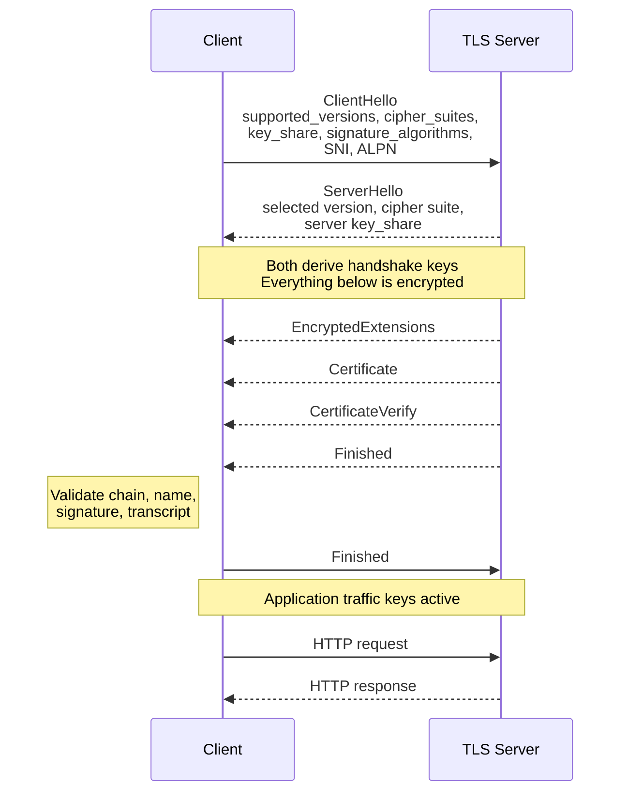

### ServerHello

The server makes four selections:

```text
Selected Version:   TLS 1.3            (via supported_versions)
Cipher Suite:       TLS_AES_128_GCM_SHA256
Key Share Group:    x25519
Server Key Share:   <ephemeral public value>
```

Then both sides hold complementary halves:

```text
Client has: client ephemeral private + server ephemeral public
Server has: server ephemeral private + client ephemeral public

DH(client_private, server_public) == DH(server_private, client_public)
                                  == shared_secret
```

The shared secret was never transmitted. It plus the transcript feed the HKDF key schedule (§9, Change 7).

### EncryptedExtensions

Negotiated extensions that don't need to be visible — most notably the **server's ALPN selection**:

```text
ALPN selected protocol: h2
```

Note the asymmetry: the client's ALPN *offers* are visible in the plaintext ClientHello, but the server's *choice* is encrypted.

### Certificate

The chain proving identity:

```text
Leaf:         SAN → DNS: app.example.com
Intermediate: Example Issuing CA
Root:         already in the client's trust store
```

The client must validate the certification path **and** verify that the requested service name matches an appropriate `subjectAltName` (`dNSName=app.example.com`). Modern service-identity rules (RFC 9525) use the SAN; the Common Name is no longer an acceptable substitute.

The certificate contains the server's **public** key. It never contains the private key.

### CertificateVerify

The server signs the handshake transcript with the private key matching its certificate.

| Message | Proves |
| --- | --- |
| Certificate | "A CA bound this public key to `app.example.com`" |
| **CertificateVerify** | **"The endpoint in *this specific handshake* holds the matching private key"** |

Without CertificateVerify, anyone could replay a copied certificate. This message is what makes the certificate mean anything.

### Finished

A MAC over the entire handshake transcript, keyed with a secret only a legitimate participant could derive. If an attacker stripped a strong cipher suite, altered an extension, or modified any handshake byte, the Finished values won't match and the connection aborts.

### Client-side validation checklist

1. Certification path builds to a trusted root
2. Requested name matches a SAN
3. Certificate is within its validity period and not revoked
4. CertificateVerify signature is valid
5. Server Finished is valid
6. Negotiated parameters are acceptable to local policy

Then the client sends its own Finished, and application data flows.

---

## 13. mTLS (client certificate authentication)

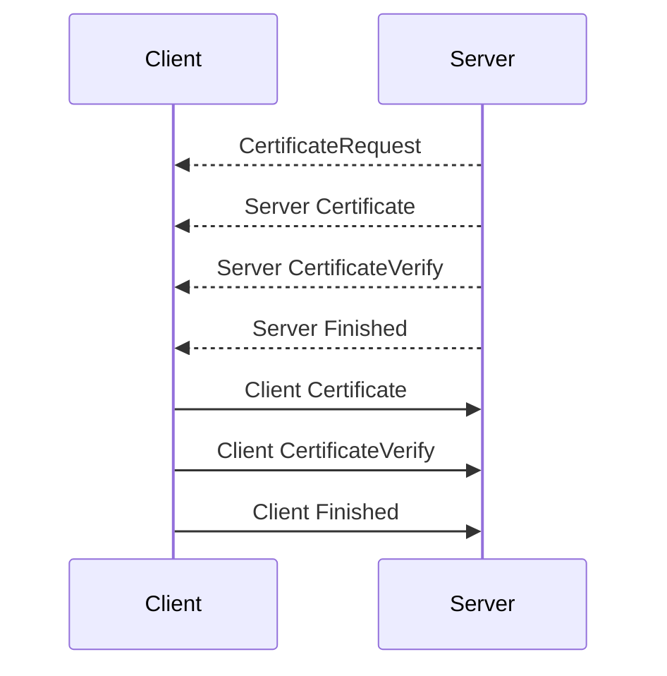

The mechanism mirrors the server side exactly: the client's CertificateVerify proves possession of the client private key over the same transcript. In TLS 1.3 all of these messages are encrypted, so **the client certificate is not visible in a passive capture either** — a meaningful change for environments that previously identified users from certificates on the wire.

`CertificateRequest` can carry `certificate_authorities`, letting the server tell the client which issuers it will accept — the mechanism behind "the browser shows me no certificate to pick" problems.

---

## 14. What TLS looks like in Wireshark

Without keys, a TLS 1.3 capture reads:

```text
Client Hello
Server Hello
Change Cipher Spec
Application Data
Application Data
Application Data
```

This is initially baffling, because some of those `Application Data` records are **encrypted handshake messages** — EncryptedExtensions, Certificate, CertificateVerify, Finished.

**Why:** TLS 1.3 encrypted records always carry an *outer* content type of `application_data` for middlebox compatibility. The real inner content type is inside the AEAD-protected payload and is revealed only on decryption. The `Change Cipher Spec` is the dummy compatibility record from §9.

### Visibility without session keys

| Information | Visible? |
| --- | --- |
| Client and server IP | Yes |
| TCP ports | Yes |
| ClientHello | Yes |
| SNI (without ECH) | Yes |
| Client cipher suites, groups, ALPN offers | Yes |
| ServerHello, selected version and suite | Yes |
| Packet sizes and timing | Yes |
| **Server certificate (TLS 1.3)** | **No** |
| **Client certificate (TLS 1.3 mTLS)** | **No** |
| Server ALPN selection | No |
| HTTP Host / `:authority` | No |
| URI path and query | No |
| HTTP method, headers, cookies, body | No |

---

# Part III — HTTP inside TLS

## 15. HTTPS: HTTP inside TLS

Once TLS finishes, HTTP flows through the encrypted session. For `https://app.example.com/orders/123?format=json`:

```http
GET /orders/123?format=json HTTP/1.1
Host: app.example.com
User-Agent: ExampleBrowser/1.0
Accept: application/json
Cookie: session=abc123
```

None of this is visible on the wire without decryption.

### HTTP/2 representation

```text
:method:    GET
:scheme:    https
:authority: app.example.com
:path:      /orders/123?format=json
```

`:authority` plays the routing role that `Host` plays in HTTP/1.1. RFC 9110 requires the target authority to be conveyed by one or the other.

---

## 16. SNI vs Host vs path

For `https://app.example.com:443/orders/123?format=json#details`:

| Value | Example | Layer | Visible without decryption? |
| --- | --- | --- | --- |
| Destination IP | `203.0.113.20` | IP | Yes |
| Destination port | `443` | TCP | Yes |
| **SNI** | `app.example.com` | **TLS ClientHello** | **Yes, unless ECH** |
| ALPN offer | `h2`, `http/1.1` | TLS ClientHello | Yes, unless ECH |
| **HTTP Host** | `app.example.com` | **HTTP/1.1** | **No** |
| `:authority` | `app.example.com` | HTTP/2, HTTP/3 | No |
| URI path | `/orders/123` | HTTP | No |
| Query | `format=json` | HTTP | No |
| Fragment | `details` | Browser only | **Never transmitted** |

### Why SNI must exist

One load balancer IP serves three sites with three different certificates:

```text
finance.example.com
hr.example.com
portal.example.com
```

**The server must send a certificate during the TLS handshake — but the Host header only arrives after TLS completes.** Chicken and egg. SNI breaks the deadlock by carrying the hostname in the very first client message.

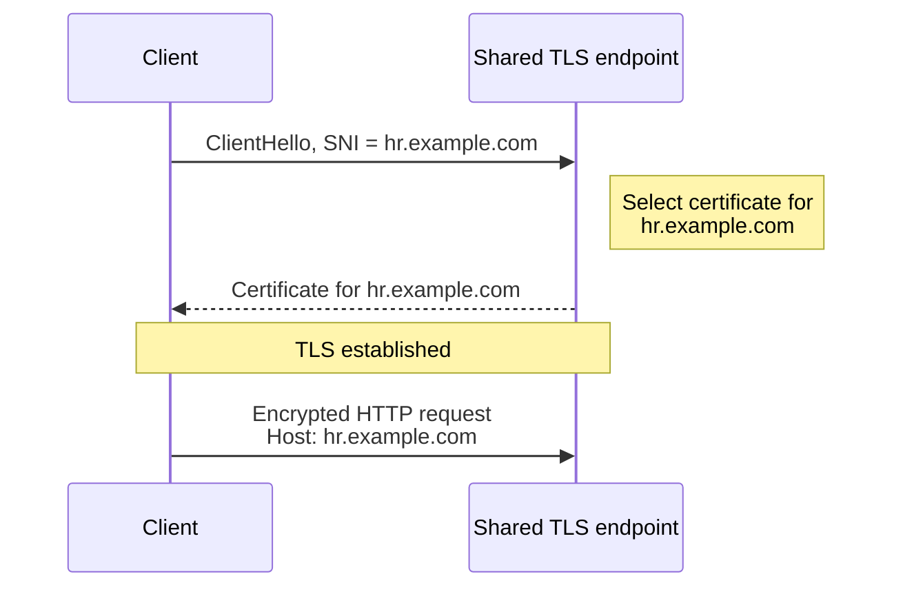

### The three-step ladder

```text
SNI            → selects the TLS context and certificate
Host/:authority → selects the HTTP virtual host
Path           → selects the resource or application route
```

---

## 17. Where routing decisions happen

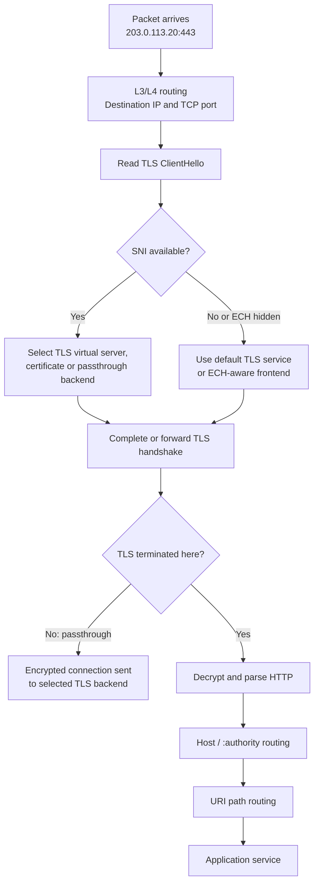

| Level | Decision key | Available when | Requires decryption? |
| --- | --- | --- | --- |
| 1 | IP + port | Immediately | No |
| 2 | SNI | On ClientHello | No (unless ECH) |
| 3 | Host / `:authority` | After TLS termination | **Yes** |
| 4 | URI path | After TLS termination | **Yes** |

### TLS passthrough — what you give up

A passthrough proxy can read plaintext SNI and forward the encrypted connection untouched. It **cannot** see Host, path, method, cookies, authorization headers, or body.

```text
TLS passthrough:
    SNI-based routing        → possible
    Host/path-based routing  → impossible
    WAF inspection           → impossible
    Header injection         → impossible
```

### TLS termination — what you gain

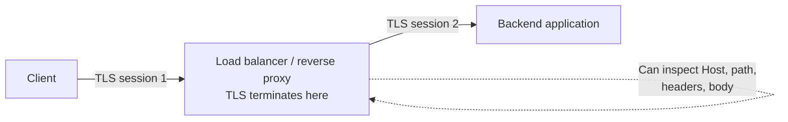

The terminating proxy holds the certificate and private key, completes the client handshake, and can then route by Host and path, apply WAF policy, inject headers, authenticate users, and open a **separate** TLS session to the backend. Those two sessions have independent certificates, handshakes, and traffic keys — a fact worth stating explicitly in any architecture document, because "is it encrypted end to end?" almost always means "what happens at the termination point?"

---

## 18. Can SNI and Host differ?

Technically yes. A client can send `SNI: front.example.com` and then, inside TLS, `Host: hidden.example.net`.

Whether it works depends on which certificate was selected, whether it covers the requested name, the proxy's configuration, whether the origin accepts the Host, and whether any policy checks the two against each other.

In ordinary browser traffic they correspond to the same origin. **Systems should not assume they always match.** This mismatch — sometimes called domain fronting — has been used both to evade SNI-based filtering and, in the other direction, to confuse reverse proxies into routing a request to an unintended backend.

**Design guidance:** if a proxy or firewall enforces policy on SNI, it should also verify that the decrypted Host is consistent with the SNI it allowed, or the SNI check provides weaker assurance than it appears to.

---

# Part IV — ECH

## 19. Encrypted SNI vs Encrypted ClientHello

First, a correction that matters:

> **TLS 1.3 by itself did not encrypt the ClientHello or its SNI.** It encrypted the handshake *after* ServerHello, including the certificate. The SNI stayed in plaintext.

An earlier proposal, **ESNI**, encrypted only the SNI field. It was abandoned: encrypting one field in isolation leaked information through the surrounding unencrypted extensions and was vulnerable to several attacks.

The standardised replacement is **ECH — Encrypted Client Hello**, RFC 9849 (March 2026), which encrypts the entire inner ClientHello, protecting SNI, ALPN, and other sensitive extensions together.

### Without ECH

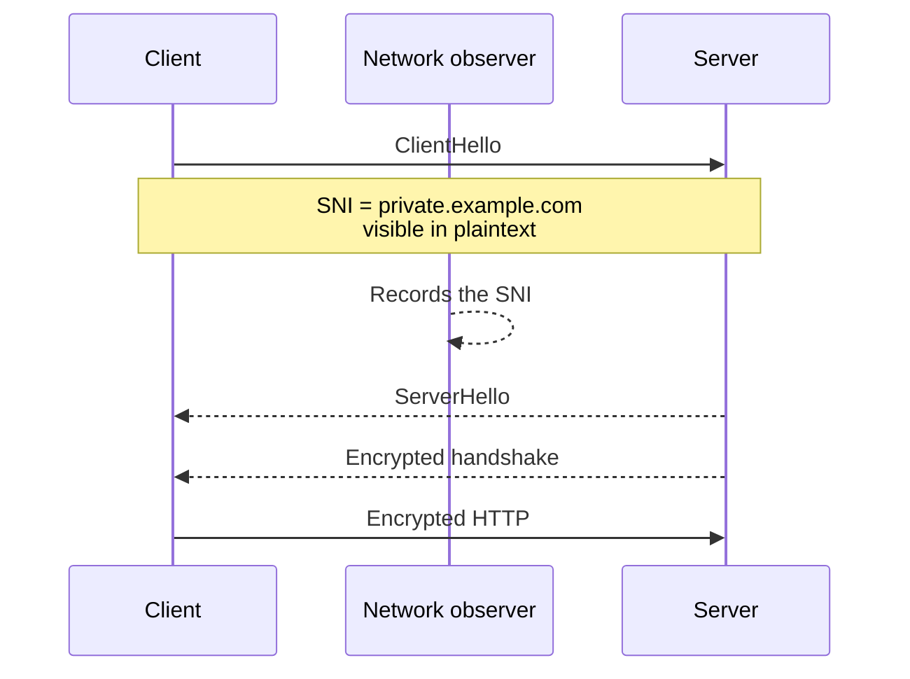

The observer can't read the Host or path, but learns the domain anyway.

### With ECH

ECH constructs **two** ClientHellos:

- **ClientHelloOuter** — publicly visible, with innocuous values and a `public_name` identifying the provider
- **ClientHelloInner** — encrypted under the provider's public key, containing the real SNI

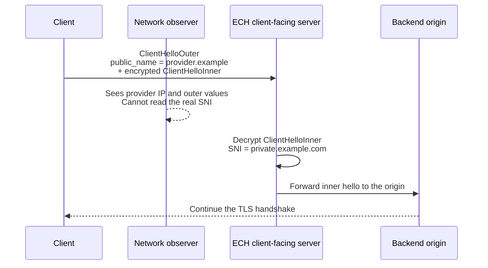

If the client-facing server cannot decrypt the extension, it **rejects ECH** and completes the handshake using the outer hello — and, if configured with ECH keys, returns up-to-date configurations so the client can retry correctly.

### Where the ECH public key comes from

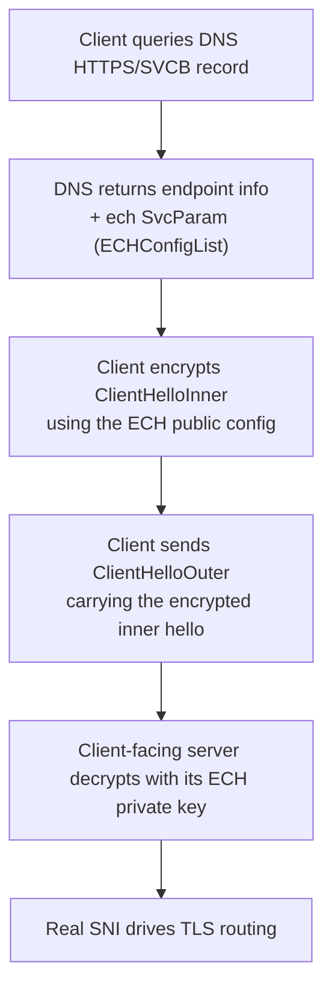

RFC 9848 defines the `ech` SvcParamKey in SVCB and HTTPS DNS records as the primary bootstrap mechanism. It also notes a downgrade concern: an attacker who blocks SVCB resolution can make the client believe ECH isn't configured, causing a cleartext ClientHello. Clients are advised to abandon the attempt when such an attack is detected.

**The dependency chain is important:** ECH's privacy benefit collapses if DNS is in the clear, because the same hostname appears in the DNS query. ECH is only meaningful when paired with encrypted DNS (DoH/DoT) and shared hosting infrastructure.

### What ECH does and does not hide

| Hides | Does not hide |
| --- | --- |
| The real SNI | Source and destination IP |
| The real ALPN offer | Destination port |
| Other inner ClientHello extensions | Packet sizes and timing |
| | The hosting provider's identity |
| | Cleartext DNS queries made separately |
| | Anything a managed endpoint or terminating proxy sees |

ECH's guarantee is best stated precisely: it reveals that a client is connecting to *a particular provider*, but not *which server in that provider's anonymity set*. The size and consistency of that anonymity set determines how much privacy you actually get — a provider hosting one domain provides none.

---

## 20. ECH: operational and security implications

### What breaks

Anything that depends on plaintext SNI:

- Domain allowlisting and blocklisting at the firewall
- SNI-based backend selection on a passthrough load balancer
- Traffic classification and QoS by domain
- Logging of visited domain names from the network
- SNI-based threat intelligence matching

```text
On-path enterprise firewall:
    No ECH private key → cannot see the real SNI

ECH client-facing server (the hosting provider):
    Holds the ECH private key → recovers the inner hello
                              → routes to the intended backend
```

The asymmetry is deliberate. ECH moves hostname visibility from *anyone on the path* to *the endpoints and the provider*.

### Where control has to move

| Was | Becomes |
| --- | --- |
| SNI inspection at the perimeter | Encrypted-DNS policy and resolver control |
| | Explicit forward proxies with authenticated users |
| | Managed browser/endpoint policy (browsers can be configured not to use ECH on managed devices) |
| | Endpoint security telemetry — the endpoint always knows the hostname |
| | Terminating TLS inspection where policy and trust configuration permit |
| | Destination IP and provider-level controls |
| | Application-layer controls at the terminating proxy |

### The honest framing for a design document

> ECH removes **passive** SNI visibility for on-path observers. It does not prevent a managed endpoint, an authorised terminating proxy, or the destination service from knowing the requested hostname.

That sentence is worth keeping verbatim in architecture discussions, because it separates the real change (passive network visibility) from the imagined one (total loss of control). It also frames the correct response: shift detection toward the endpoint and toward authorised termination points, rather than trying to defeat ECH on the wire.

---

# Part V — Practice

## 21. Wireshark filter cookbook

### Handshake messages

| Filter | Matches |
| --- | --- |
| `tls.handshake.type == 1` | ClientHello |
| `tls.handshake.type == 2` | ServerHello (and HelloRetryRequest) |
| `tls.handshake.type == 11` | Certificate |
| `tls.handshake.type == 13` | CertificateRequest (mTLS) |
| `tls.handshake.type == 15` | CertificateVerify |
| `tls.handshake.type == 20` | Finished |
| `tls.handshake.type == 4` | NewSessionTicket |

### ClientHello contents

| Filter | Matches |
| --- | --- |
| `tls.handshake.extensions_server_name` | Any packet carrying SNI |
| `tls.handshake.extensions_server_name == "app.example.com"` | One specific hostname |
| `tls.handshake.extensions_alpn_str` | ALPN values |
| `tls.handshake.extensions_supported_version` | Offered versions |
| `tls.handshake.extensions_key_share_group` | Key share groups |
| `tls.handshake.sig_hash_alg` | Signature algorithms |
| `tls.handshake.ja3` / `tls.handshake.ja4` | Client fingerprint (version-dependent) |

### Diagnostics

| Filter | Matches |
| --- | --- |
| `tls.record.content_type == 21` | TLS alerts — **start here on any failure** |
| `tls.alert_message.desc` | Specific alert reason |
| `tls.record.version` | Record-layer version (remember: legacy) |
| `tcp.stream == 7 && tls` | One connection's TLS only |

### After decryption

```text
http.host == "app.example.com"
http.request.uri.path == "/orders/123"
http.request.method == "GET"
http.request.full_uri
http2.headers.authority == "app.example.com"
http2.headers.path == "/orders/123?format=json"
http2.headers.method == "GET"
```

---

## 22. Decrypting your own traffic

**Capturing packets is not enough, and neither is the server's private key.** With ephemeral key exchange — mandatory in TLS 1.3, near-universal in 1.2 — the session keys were never transmitted and cannot be derived from the certificate's private key. That is forward secrecy working as designed.

The workable approach for **your own, authorised** sessions is a TLS key log file, in which the client application exports the per-session secrets:

1. Close the browser completely
2. Set `SSLKEYLOGFILE` to a writable path
3. Launch the browser from that environment
4. Start the Wireshark capture
5. Visit the test site
6. Configure Wireshark:

```text
Edit → Preferences → Protocols → TLS
     → (Pre)-Master-Secret log filename
```

7. Select the key log file — Wireshark now decodes the records and dissects HTTP/1.1 or HTTP/2

> **Handle the key log file as a credential.** Anyone holding both the capture and the matching secrets can decrypt those sessions. Use it only on test systems and traffic you are authorised to inspect, and delete it afterwards.

---

## 23. Troubleshooting in layer order

Work upward. Each step assumes the previous one succeeded.

### Step 1 — Did DNS resolve?

```text
dns.qry.name == "app.example.com"
```

Confirm the returned address is the one the client actually contacted.

### Step 2 — Did TCP establish?

| Symptom | Usual cause |
| --- | --- |
| Repeated SYN, no SYN-ACK | Routing, firewall, security group, no listener, or asymmetric return path |
| SYN then RST | Reachable, but nothing accepted the connection — wrong port, service down, policy reject |
| SYN-ACK then RST from client | Client-side policy or an unexpected server |

### Step 3 — Did the client send a ClientHello?

```text
tls.handshake.type == 1
```

Inspect SNI, `supported_versions`, cipher suites, `supported_groups`, `key_share`, `signature_algorithms`, ALPN — §11 explains what each one can break.

### Step 4 — Did the server answer with a ServerHello?

If instead you see an immediate alert, the cause is almost always one of:

| Alert | Likely cause |
| --- | --- |
| `protocol_version` | No shared version — check `supported_versions`, not the record version |
| `handshake_failure` | No shared cipher suite, group, or signature algorithm |
| `unrecognized_name` | SNI missing or unknown to the server |
| `insufficient_security` | Client offered only algorithms below server policy |
| `internal_error` | Server-side certificate or configuration fault |

If you see a **HelloRetryRequest**, the client's speculative `key_share` guessed the wrong group. Functionally fine; costs a round trip.

### Step 5 — Did certificate validation succeed?

Check the chain, SAN, validity dates, trust path, and CertificateVerify. Client-side alerts to expect:

| Alert | Meaning |
| --- | --- |
| `unknown_ca` | Issuer not in the client's trust store — usually a missing intermediate |
| `bad_certificate` | Malformed, or name mismatch |
| `certificate_expired` | Outside validity window — check clock skew on both ends |
| `certificate_unknown` | Generic validation failure |

In TLS 1.3 you cannot read the certificate from a passive capture, so validate from the client side with `openssl s_client -connect host:443 -servername host` or equivalent.

### Step 6 — Did HTTP begin?

After the Finished exchange, look for application data. With decryption, confirm Host/`:authority`, path, method, and response status. **This is the boundary between a TLS problem and an application-routing problem** — if the handshake completes and you get a 404 or a wrong vhost, stop looking at TLS.

---

## 24. One complete example

Request: `https://shop.example.com/cart/checkout`

```text
0. DNS
   shop.example.com → 203.0.113.20

1. TCP
   10.10.1.25:53000 → 203.0.113.20:443  SYN
   203.0.113.20:443 → 10.10.1.25:53000  SYN-ACK
   10.10.1.25:53000 → 203.0.113.20:443  ACK

2. TLS 1.3
   ClientHello  (may span two TCP segments — see §3.5)
       SNI       = shop.example.com          ← visible
       ALPN      = h2, http/1.1              ← visible
       key_share = x25519                    ← visible
   ServerHello
       TLS 1.3, TLS_AES_128_GCM_SHA256, x25519
   Encrypted:
       EncryptedExtensions  (ALPN = h2)
       Certificate                            ← NOT visible
       CertificateVerify
       Finished
   Client validates chain + SAN, sends Finished

3. HTTP/2 inside TLS
   :method    = POST
   :scheme    = https
   :authority = shop.example.com
   :path      = /cart/checkout

4. Routing decisions, in order
   203.0.113.20:443           → reach the shared load balancer
   SNI shop.example.com       → choose TLS certificate and context
   :authority shop.example.com → choose the shopping virtual host
   :path /cart/checkout       → choose the checkout service
```

---

## 25. Quick reference card

### What each identifier answers

```text
IP address         → Which machine or network endpoint?
TCP port           → Which listening service?
SNI                → Which TLS identity and certificate?
Host / :authority  → Which HTTP site?
URI path           → Which resource or application route?
```

### The security boundary

```text
Visible before decryption:
    IP, port, packet sizes, timing, TCP flags,
    ClientHello, plaintext SNI, ALPN offers

Encrypted by ordinary HTTPS:
    Server certificate (1.3), Host, path, query,
    headers, cookies, body, response

Additionally protected by ECH:
    Real SNI, real ALPN, other inner ClientHello fields
```

### Ten things to remember

1. TCP delivers **bytes**, not messages — TLS supplies its own record framing
2. One TLS record can span many segments; one segment can hold many records
3. Never write logic that counts packets to find a TLS message
4. The record-layer version field is **legacy**; read `supported_versions`
5. TLS 1.3 encrypts the certificate — passive monitoring loses it
6. TLS 1.3 cipher suites name only the AEAD cipher and hash
7. Most 1.3 handshake failures are a mismatch in one of the crypto four: versions, groups, key_share, signature_algorithms
8. GREASE values are meant to look like garbage; a server that rejects them is broken
9. Forward secrecy means the server private key will not decrypt your pcap
10. ECH removes passive SNI visibility, not endpoint or terminating-proxy visibility

---

## References

| Topic | Document |
| --- | --- |
| TLS 1.3 (current) | RFC 9846, *The Transport Layer Security (TLS) Protocol Version 1.3*, July 2026 — obsoletes RFC 8446 and RFC 5246; prohibits negotiating TLS 1.0/1.1 |
| TLS 1.3 (superseded) | RFC 8446, August 2018 |
| TLS 1.2 (obsoleted) | RFC 5246 |
| TCP | RFC 9293, *Transmission Control Protocol* |
| HTTP semantics | RFC 9110, *HTTP Semantics* |
| Service identity in TLS | RFC 9525 |
| TLS extensions, incl. SNI | RFC 6066 |
| ALPN | RFC 7301 |
| GREASE | RFC 8701 |
| Encrypted Client Hello | RFC 9849, March 2026 |
| ECH bootstrapping via DNS | RFC 9848, March 2026 |
| SVCB and HTTPS DNS records | RFC 9460 |
| Wireshark TLS display filters | wireshark.org/docs/dfref/t/tls.html |
| Wireshark HTTP display filters | wireshark.org/docs/dfref/h/http.html |
| Wireshark TLS decryption | wiki.wireshark.org/tls |

---

*One final scoping note: this document describes HTTPS over **TCP**, covering HTTP/1.1 and HTTP/2. HTTP/3 runs over QUIC on UDP — no TCP three-way handshake, no TLS record layer. QUIC embeds the TLS 1.3 cryptographic handshake into its own transport, combining connection establishment and key agreement, and moves loss recovery below the crypto layer to eliminate the head-of-line blocking described in §3.7.*
