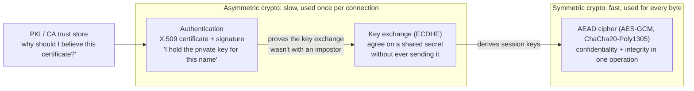
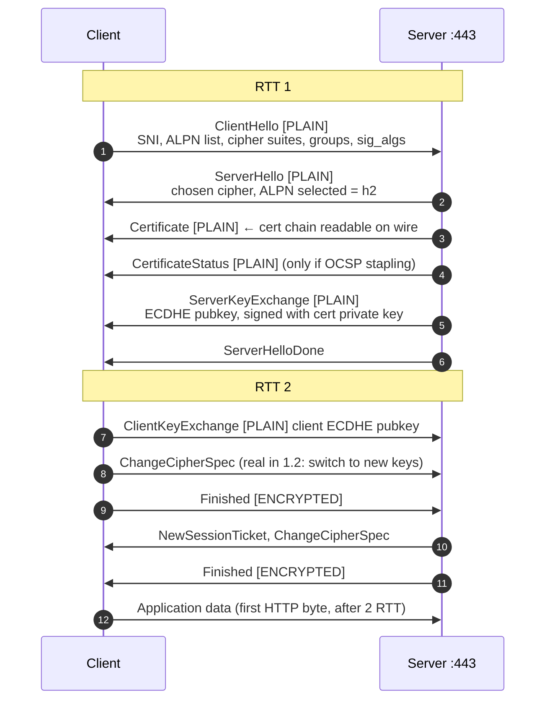
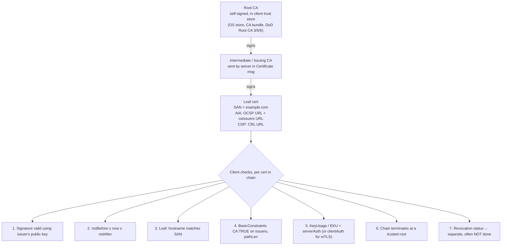
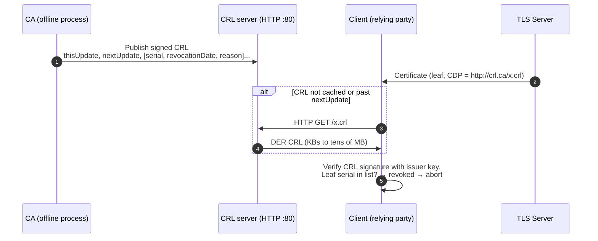
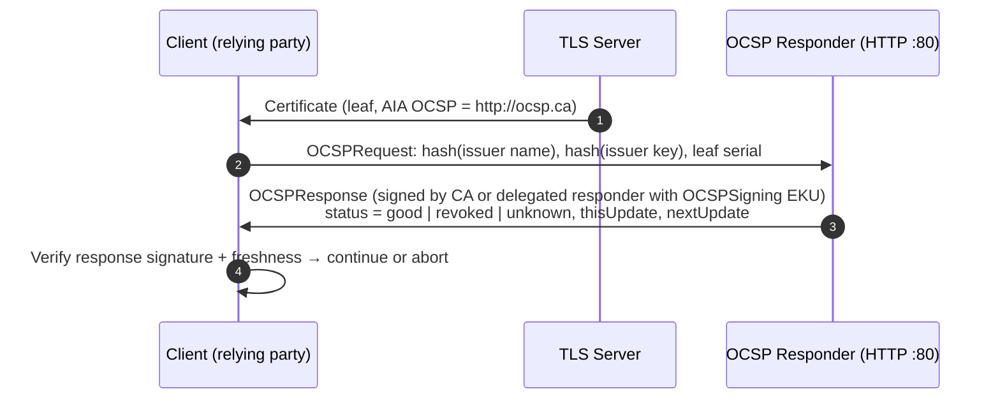
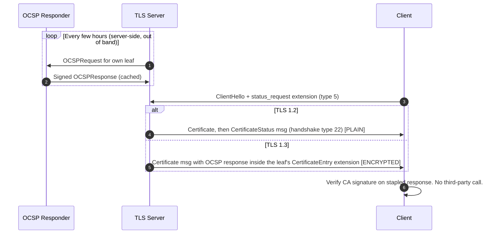
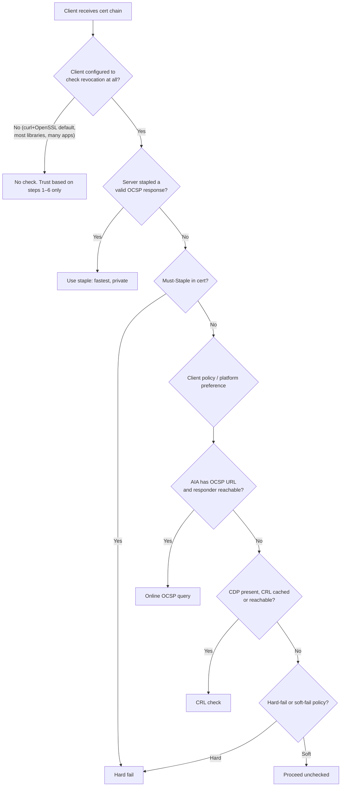

Two new sections go into the document, plus a few extra rows for the tables. §1–§4 are unchanged.

- **New §0** (goes before §1): what problem TLS solves, and how 1.2 and 1.3 each solve it.
- **New §6** (goes after §5): PKI chain validation, CRL, OCSP, stapling, and what decides which revocation method is used. The old §6 and §7 become §7 and §8.

---

## 0. What problem TLS solves

### The base problem

On their own, IP and TCP have three gaps:

| Gap | Attack it enables | Where an attacker sits |
|---|---|---|
| No confidentiality | Passive eavesdropping (read creds, cookies, data) | Any L2/L3 hop: Wi-Fi, ISP, compromised router, tap/SPAN |
| No integrity | Active tampering (inject JS, alter responses, flip bits) | Any inline hop |
| No authentication | Impersonation / MITM (you connect to the attacker thinking it's your bank) | DNS spoofing, BGP hijack, ARP poisoning, rogue proxy |

The hard part is that client and server have never met. They must agree on a secret key over a network the attacker controls, and each must prove the other end is who it claims to be. TLS solves this by combining two kinds of crypto:



| Security property | TLS mechanism |
|---|---|
| Confidentiality | Symmetric AEAD encryption with per-session keys |
| Integrity | AEAD authentication tag on every record; tampering → `bad_record_mac` alert, connection killed |
| Server authentication | Certificate chain to a trusted root, plus a signature over the handshake transcript |
| Client authentication (optional) | mTLS: client sends its own cert + CertificateVerify (CAC/PIV in DoD) |
| Forward secrecy | Ephemeral (EC)DHE keys discarded after handshake. Stealing the server's private key later cannot decrypt old captures |
| Downgrade protection | Finished messages MAC the whole handshake transcript; 1.3 adds a sentinel value in ServerHello.random |

### TLS 1.2 (RFC 5246, 2008)

What it fixed compared with SSL 3.0 / TLS 1.0 / 1.1:
- It added AEAD cipher suites (AES-GCM), removing dependence on CBC+HMAC constructions.
- Its PRF uses SHA-256, replacing the MD5/SHA-1 combination.
- The negotiable signature/hash algorithms extension allowed the move away from SHA-1.

What stayed wrong with it:
- **Two round trips** before any application data can flow.
- **Too many options.** It still allowed:
  - RSA key transport (no forward secrecy);
  - static DH;
  - CBC modes (Lucky13 padding-oracle class);
  - RC4, export ciphers (FREAK, Logjam);
  - compression (CRIME);
  - renegotiation (the 2009 renegotiation attack).

  Most real-world TLS attacks from 2011–2018 exploited legacy options that 1.2 permitted, not the core design.
- **Handshake mostly plaintext.** The certificate is visible, so a passive observer learns who you're talking to beyond SNI.

The TLS 1.2 full handshake with ECDHE, the counterpart to the 1.3 diagram in §2:



### TLS 1.3 (RFC 8446, 2018)

TLS 1.3 was a redesign that fixed 1.2 by removing things rather than adding them:

| 1.2 problem | 1.3 fix |
|---|---|
| 2-RTT handshake | 1-RTT: client guesses the key group and sends `key_share` in ClientHello |
| Resumption still costs a round trip | 0-RTT early data via PSK. Caveat: replayable, so only for idempotent requests |
| RSA key transport → no forward secrecy | Removed. Only ephemeral (EC)DHE, so forward secrecy is mandatory |
| Hundreds of cipher suites, many broken | 5 suites, all AEAD. Suite no longer encodes key exchange/auth |
| CBC, RC4, SHA-1, MD5, compression, renegotiation, custom DHE groups | All removed |
| Cert and extensions visible to passive observers | Everything after ServerHello is encrypted; only SNI remains visible (ECH closes that) |
| Downgrade attacks | ServerHello.random ends in `DOWNGRD` + 01/00 if the server negotiated below 1.3 despite supporting it. The client aborts if it sees that |
| Ad-hoc key derivation | HKDF-based key schedule with separate handshake and application traffic keys |

Federal and DoD context:
- NIST SP 800-52 Rev. 2 requires TLS 1.2 at minimum and required agencies to support TLS 1.3 by January 2024.
- Under FIPS, TLS 1.3 is fine with validated modules. ChaCha20-Poly1305 is not FIPS-approved, so FIPS policies restrict to the AES-GCM suites.
- On AWS, the ELB FIPS security policies (e.g. `ELBSecurityPolicy-TLS13-1-2-FIPS-2023-04`) apply this restriction. Confirm the exact policy names available in your GovCloud region with `aws elbv2 describe-ssl-policies`.

---

## 6. PKI, certificate validation and revocation (CRL / OCSP)

### 6.1 What "SSL certificate verify ok" actually checked

When the client receives the Certificate message, it runs X.509 path validation (RFC 5280):



Checks 1–6 are purely local math against the trust store. Check 7 is different: it needs fresh information from outside, because a cert can be perfectly valid cryptographically and still have been revoked. Common reasons are a compromised key, a mis-issued cert, or a decommissioned host.

**curl + OpenSSL does no revocation checking by default.** "SSL certificate verify ok" means checks 1–6 passed. It says nothing about revocation. curl on Windows with the Schannel backend does check revocation by default; that's why you sometimes see `CRYPT_E_NO_REVOCATION_CHECK` errors there.

### 6.2 Where a certificate says to check revocation

Two extensions in the cert tell the relying party where to look:

| Extension | OID | Contains | Used for |
|---|---|---|---|
| CRL Distribution Points (CDP) | 2.5.29.31 | `http://…/xyz.crl` (sometimes `ldap://`) | CRL download |
| Authority Information Access (AIA) | 1.3.6.1.5.5.7.1.1 | `OCSP - URI:http://ocsp…` and `CA Issuers - URI:http://…/int.crt` | OCSP query; fetching a missing intermediate |

```bash
openssl x509 -in leaf.pem -noout -ext crlDistributionPoints,authorityInfoAccess   # OpenSSL 3.x
openssl x509 -in leaf.pem -noout -ocsp_uri
```

Both URLs are almost always plain `http://`. That's deliberate: CRLs and OCSP responses are signed by the CA, so transport security adds nothing. Using HTTPS would also create a chicken-and-egg loop, since you'd have to validate a cert in order to check a cert.

### 6.3 CRL (Certificate Revocation List)

The CA periodically publishes a signed list of revoked serial numbers. The client downloads the whole list and looks for the leaf's serial.



| Pros | Cons |
|---|---|
| Cacheable until `nextUpdate`, so it works offline or in air-gapped enclaves | Size. Large CAs' CRLs (DoD PKI notably) run to many MB, which hurts first-connection latency |
| Private: the CA only learns that someone fetched the CRL, not which site you visited | Staleness. Revocation isn't visible until the next CRL is published (hours to days) |
| One download covers every cert from that issuer | Delta CRLs mitigate size but add complexity |

### 6.4 OCSP (Online Certificate Status Protocol, RFC 6960)

Instead of downloading a whole list, the client asks about one certificate at a time.



| Pros | Cons |
|---|---|
| Small request and response (~1–2 KB) | Privacy: the CA's responder sees every site each client visits, in real time |
| Fresher than CRLs (responses typically valid hours to days) | Adds an extra connection and RTT to a third party inside the TLS handshake path |
| | Availability: if the responder is down or blocked, clients must choose hard-fail (outage) or soft-fail (no protection) |

Soft-fail is effectively useless against an active attacker. An attacker who can MITM your TLS can also drop your OCSP query, and the client will then proceed.

### 6.5 OCSP stapling: fixing OCSP's problems

With stapling, the server fetches its own OCSP response periodically, caches it, and staples it into the handshake. The client never contacts the CA.



- **Why the client can trust a response that came from the server:** it's signed by the CA and time-bounded, so the server can't forge a "good" status.
- **Must-Staple:** a cert extension (TLS Feature, RFC 7633, `status_request`). It tells clients to hard-fail if no staple is presented, which closes the soft-fail hole.

### 6.6 What determines which method is used

The decision isn't made by the protocol. It's made by the relying party's validation stack, constrained by what the cert advertises and what the network allows.



Five things decide the method:

1. **What the cert contains.** If AIA has no OCSP URL, OCSP is impossible; if there's no CDP, CRL is impossible. This is changing on the public web:
   - A 2023 CA/Browser Forum ballot made OCSP optional and CRLs mandatory for publicly trusted CAs.
   - Let's Encrypt ended OCSP support, removing OCSP URLs from its certs in 2025.
   - Certs from some public CAs now have only a CDP.
2. **The relying party's software and policy.** This is the biggest factor.
   - **Chrome:** no online OCSP/CRL for normal certs. Uses Google-pushed CRLSets.
   - **Firefox:** moving from OCSP to CRLite, a compressed push of all revocations.
   - **Windows CryptoAPI/Schannel:** checks by default and prefers OCSP. After enough OCSP lookups against the same CA, it switches to downloading the CRL, a registry-tunable threshold.
   - **OpenSSL/curl, Java, Go, Python:** off unless you enable it.
   - **mTLS servers** checking CACs: whatever the server product supports.
3. **Whether the server staples.** A staple, when present and supported, beats every online method.
4. **Network reachability.** This dominates in DoD enclaves. If the client or server can't reach public OCSP responders or CRL servers, OCSP fails. Enclaves typically handle this in one of two ways:
   - local OCSP responders or repeaters, or cached CRLs mirrored internally (the usual DoD pattern for CAC validation);
   - explicit firewall/proxy allowances to the DISA OCSP/CRL endpoints.
5. **Fail mode and freshness requirements.** High-assurance contexts, such as STIG'd CAC authentication, require revocation checking with hard-fail. General web clients soft-fail.

### 6.7 Relevance to your AWS environment

- **ALB mTLS (verify mode).** Revocation is checked only against CRLs you upload to S3 and attach to the trust store. ALB does not do OCSP. For CAC-based mTLS through ALB, you own a job that keeps those CRLs current. Stale CRLs mean revoked CACs still authenticate, which is an audit finding. Confirm feature parity in GovCloud for your region.
- **Egress through Network Firewall.** Revocation traffic is plain HTTP on :80 to CA hosts, e.g. `ocsp.digicert.com` or the DoD PKI endpoints. If egress rules allow only :443, it breaks in one of two ways:
  - online OCSP/CRL checks fail silently (soft-fail);
  - or, on hard-fail clients such as Windows/Schannel apps and some Java configs, you see handshake-time stalls and timeouts that look like TLS problems.
- **Server-side stapling on ALB/NLB/CloudFront.** Stapling support varies by service, so verify it with `openssl s_client -status` rather than assuming.

### 6.8 Revocation on the wire

The client is the capture point. Direction:
- online OCSP/CRL: client → CA endpoint on :80;
- stapled response: server → client inside the TLS handshake.

| Goal | Display filter |
|---|---|
| Client asked for a staple | `tls.handshake.type == 1 && tls.handshake.extension.type == 5` |
| Stapled response (TLS 1.2, plaintext) | `tls.handshake.type == 22` |
| Online OCSP queries/responses | `ocsp` (dissected over HTTP :80) |
| CRL downloads | `http.request.uri contains ".crl"` |
| Revoked cert rejection | `tls.alert_message.desc == 44` (certificate_revoked) |

In TLS 1.3 the stapled response is inside the encrypted Certificate message. You need `SSLKEYLOGFILE` to see it, or use `openssl s_client -status`.

---

### Additional rows for §8 (curl / openssl flags)

| Purpose | Command |
|---|---|
| Require a valid stapled OCSP response (fails if none) | `curl --cert-status -v https://host` |
| Check against a local CRL | `curl --crlfile crl.pem https://host` |
| Windows/Schannel: disable or soften revocation | `curl --ssl-no-revoke` / `--ssl-revoke-best-effort` |
| Show the stapled OCSP response | `openssl s_client -connect host:443 -servername host -status </dev/null 2>/dev/null \| grep -A20 "OCSP Response"` |
| Dump the chain to files for further checks | `openssl s_client -connect host:443 -servername host -showcerts </dev/null` |
| Manual OCSP query | `openssl ocsp -issuer int.pem -cert leaf.pem -url "$(openssl x509 -in leaf.pem -noout -ocsp_uri)" -resp_text` |
| Manual CRL check | `curl -so x.crl <CDP URL>` → `openssl crl -inform DER -in x.crl -out x.pem` → `openssl verify -crl_check -CAfile chain.pem -CRLfile x.pem leaf.pem` |

Want me to assemble §0–§8 into a single consolidated doc you can keep editing and share?
