# TLS and HTTPS: from browser URL to Wireshark packets

Consider this request:

```text
https://app.example.com:443/orders/123?format=json#details
```

The browser does **not** immediately send an HTTP request. It normally performs several layers of work:

1. Resolve `app.example.com` to an IP address.
2. Establish a TCP connection to that IP on port 443.
3. Establish a TLS-secured session over TCP.
4. Send the HTTP request through the encrypted TLS session.
5. Receive the encrypted HTTP response.

The fragment `#details` is processed locally by the browser and is not sent as part of the HTTP request. HTTP routing uses the authority/Host and request target, while TLS routing can use SNI before HTTP is available. ([RFC Editor][1])

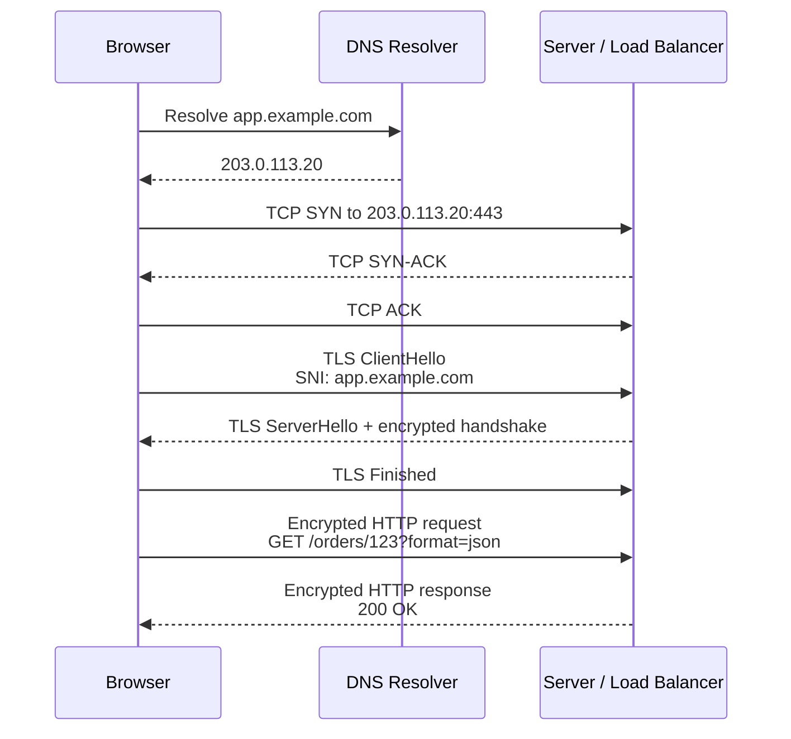

## The protocol stack

A captured packet contains multiple nested headers:

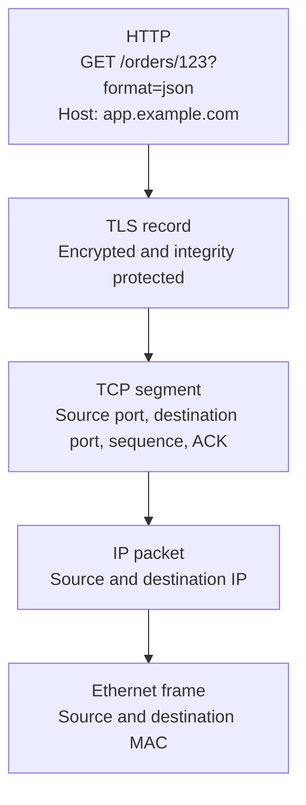

Think of it as:

```text
Ethernet carries IP
    IP carries TCP
        TCP carries TLS
            TLS carries HTTP
```

TCP treats TLS as a stream of bytes. TLS treats HTTP as application data. One TLS message does not necessarily equal one TCP packet: a TLS record can span multiple TCP segments, and one TCP segment can contain several TLS records. TLS itself fragments, protects and reassembles records over the reliable transport supplied by TCP. ([RFC Editor][1])

---

# 1. TCP three-way handshake

## What TCP provides

TCP provides:

* A logical connection identified by source IP, source port, destination IP and destination port.
* Reliable, ordered byte delivery.
* Sequence and acknowledgment numbers.
* Retransmission of lost data.
* Flow control through the receive window.
* Congestion-control behavior.
* Detection of duplicate and out-of-order data.

TCP provides **no encryption and no server identity verification**. Someone capturing the connection can see TCP addresses, ports, flags, packet sizes, timing and sequence behavior.

## The three messages

Assume:

```text
Client: 10.10.1.25:53000
Server: 203.0.113.20:443
```

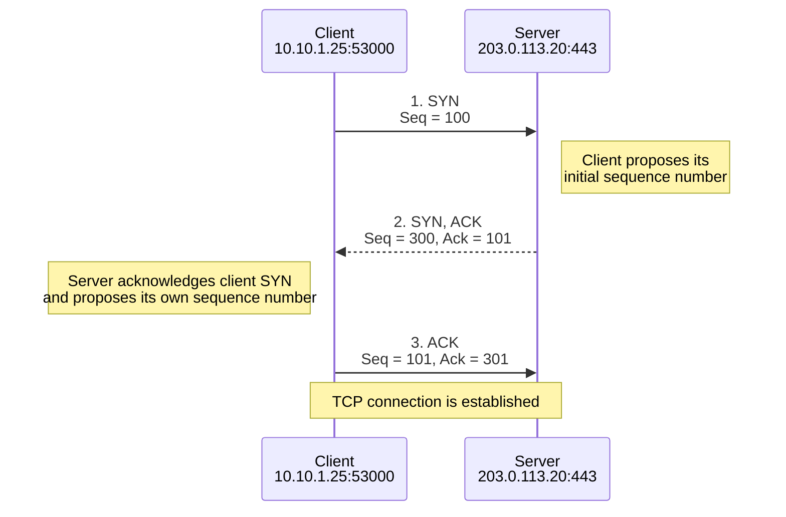

The official TCP example uses this same sequence-number pattern. A SYN occupies one sequence number, which is why the server acknowledges `101` after receiving client sequence `100`. A pure ACK does not consume sequence-number space. ([RFC Editor][2])

## Packet 1: SYN

```text
10.10.1.25:53000 → 203.0.113.20:443

Flags: SYN
Sequence number: 100
Acknowledgment number: not valid
```

The client is saying:

> I want to open a TCP connection. My first sequence number will be 100.

The SYN also commonly advertises TCP options such as:

* Maximum Segment Size, or MSS.
* Window scaling.
* Selective acknowledgment support.
* TCP timestamps.

These options influence how the connection transfers and acknowledges data, but they do not establish TLS.

## Packet 2: SYN-ACK

```text
203.0.113.20:443 → 10.10.1.25:53000

Flags: SYN, ACK
Sequence number: 300
Acknowledgment number: 101
```

The server is saying:

> I received your SYN with sequence 100. I expect your next sequence to be 101. My starting sequence number is 300.

This simultaneously acknowledges the client and opens the server-to-client direction.

## Packet 3: ACK

```text
10.10.1.25:53000 → 203.0.113.20:443

Flags: ACK
Sequence number: 101
Acknowledgment number: 301
```

The client is saying:

> I received your SYN with sequence 300. I expect your next sequence to be 301.

Both sides now know:

* The other side is reachable.
* The connection works in both directions.
* Each side’s initial sequence number.
* The TCP options that will be used.

The three-way handshake also helps prevent delayed packets from an older connection from being mistaken for a valid new connection. ([RFC Editor][2])

## Why sequence numbers count bytes, not packets

Suppose the client sends a 517-byte TLS ClientHello after the handshake:

```text
Client → Server
Seq = 101
TCP payload length = 517
```

The next expected byte is:

```text
101 + 517 = 618
```

The server can acknowledge it with:

```text
Ack = 618
```

That means:

> I have received every byte through 617. Send byte 618 next.

It does not mean “I received packet 618.”

## Illustrative Wireshark view

Wireshark normally displays relative sequence numbers, making the first SYN appear as `Seq=0`.

```text
No.  Source          Destination     Protocol  Info
1    10.10.1.25      203.0.113.20    TCP       53000 → 443 [SYN] Seq=0
2    203.0.113.20    10.10.1.25      TCP       443 → 53000 [SYN, ACK] Seq=0 Ack=1
3    10.10.1.25      203.0.113.20    TCP       53000 → 443 [ACK] Seq=1 Ack=1
4    10.10.1.25      203.0.113.20    TLSv1.3   Client Hello
5    203.0.113.20    10.10.1.25      TCP       443 → 53000 [ACK]
6    203.0.113.20    10.10.1.25      TLSv1.3   Server Hello
```

Actual packetization varies. The final TCP ACK and ClientHello might be sent separately or close together, and TLS messages may be split across packets.

## Useful TCP filters

```text
tcp
```

All TCP packets.

```text
tcp.port == 443
```

TCP traffic where either source or destination port is 443.

```text
tcp.flags.syn == 1
```

All packets with SYN set, including SYN-ACK.

```text
tcp.flags.syn == 1 && tcp.flags.ack == 0
```

Initial client SYN packets.

```text
tcp.flags.syn == 1 && tcp.flags.ack == 1
```

Server SYN-ACK packets.

```text
tcp.stream == 7
```

Only TCP stream number 7.

Wireshark requires comparison with `1` or `True` when you want the SYN bit set; simply testing for the field’s presence can also match packets where the bit is not set. ([Wireshark][3])

---

# 2. TLS: securing the TCP connection

Once TCP is established, TLS runs through that TCP byte stream.

TLS has two main jobs:

1. **Handshake protocol:** negotiate algorithms, authenticate identities and establish shared keys.
2. **Record protocol:** encrypt and integrity-protect the application data using those keys.

TLS 1.3’s current specification is RFC 9846, published in July 2026, which obsoletes the original TLS 1.3 RFC 8446. ([RFC Editor][4])

## TLS provides

TLS normally gives you:

* **Confidentiality:** observers cannot read HTTP headers or content.
* **Integrity:** modification is detected.
* **Server authentication:** the client validates the server certificate.
* **Optional client authentication:** mTLS can authenticate the client.
* **Key agreement:** both sides independently derive the same symmetric session keys.
* **Forward secrecy:** with ephemeral key agreement, later compromise of the certificate private key does not by itself decrypt previously captured sessions.

TLS primarily uses public-key cryptography to authenticate and establish secrets. It then uses faster symmetric AEAD encryption for the actual HTTP traffic.

---

# 3. TLS 1.3 full handshake

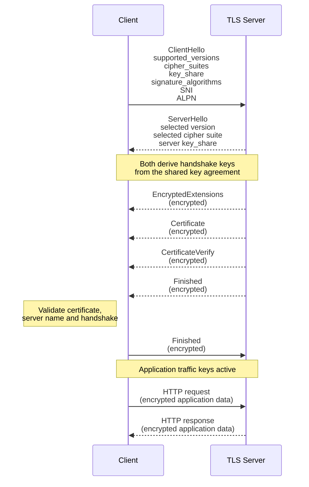

In TLS 1.3, the ClientHello and ServerHello establish the shared cryptographic context. Messages after ServerHello—including the server certificate—are normally encrypted. ([RFC Editor][1])

## Step 1: ClientHello

The client begins by advertising what it supports.

A simplified ClientHello might contain:

```text
Handshake Protocol: Client Hello
    Supported Versions:
        TLS 1.3
        TLS 1.2

    Cipher Suites:
        TLS_AES_128_GCM_SHA256
        TLS_AES_256_GCM_SHA384
        TLS_CHACHA20_POLY1305_SHA256

    Supported Groups:
        x25519
        secp256r1

    Key Share:
        x25519 public value

    Signature Algorithms:
        rsa_pss_rsae_sha256
        ecdsa_secp256r1_sha256

    Server Name:
        app.example.com

    ALPN:
        h2
        http/1.1
```

### Important ClientHello values

**Supported versions**

The real version negotiation happens through the `supported_versions` extension. Some visible legacy version fields retain older-looking values for middlebox compatibility.

**Cipher suites**

In TLS 1.3, a cipher suite primarily identifies the symmetric AEAD cipher and hash, for example:

```text
TLS_AES_128_GCM_SHA256
```

Conceptually:

```text
AES-128-GCM = encryption and integrity
SHA-256     = handshake/key-derivation hash
```

**Supported groups and key share**

The client sends an ephemeral public key, often for X25519 or an elliptic-curve group. The corresponding private value remains on the client.

**Signature algorithms**

These tell the server which signature types the client can validate for certificate authentication.

**SNI**

The client tells the TLS endpoint the desired server name:

```text
app.example.com
```

Without ECH, this is normally visible in the ClientHello.

**ALPN**

The client can offer application protocols such as:

```text
h2
http/1.1
```

This enables the endpoints to select HTTP/2 or HTTP/1.1 without another application-level negotiation.

## Step 2: ServerHello

The server selects:

* TLS 1.3.
* One offered cipher suite.
* One compatible key-exchange group.
* Its own ephemeral key share.

Example:

```text
Selected Version: TLS 1.3
Cipher Suite: TLS_AES_128_GCM_SHA256
Key Share Group: x25519
Server Key Share: <public value>
```

At this point:

```text
Client has:
    client ephemeral private key
    server ephemeral public key

Server has:
    server ephemeral private key
    client ephemeral public key
```

Both perform the key-agreement operation and derive the same shared secret without sending that secret over the network.

Conceptually:

```text
Client calculation:
DH(client_private, server_public) = shared_secret

Server calculation:
DH(server_private, client_public) = shared_secret
```

The shared secret and the transcript of ClientHello and ServerHello feed TLS’s HKDF-based key schedule, producing separate client and server handshake keys and later application traffic keys. ([RFC Editor][1])

## Step 3: EncryptedExtensions

The server sends negotiated extensions that do not need to remain visible.

A significant example is the selected ALPN protocol:

```text
ALPN selected protocol: h2
```

In TLS 1.3, the client’s offered ALPN values are normally visible in the ordinary ClientHello, but the server’s final ALPN selection is sent in encrypted handshake data.

## Step 4: Certificate

The server sends its certificate chain.

For example:

```text
Leaf certificate:
    Subject Alternative Name:
        DNS: app.example.com

Intermediate certificate:
    Example Issuing CA

Root CA:
    Already trusted by the client
```

The client needs to validate the certification path and verify that the requested service identity matches an appropriate `subjectAltName`, such as `dNSName=app.example.com`. Modern service-identity rules use the SAN rather than treating the Common Name as a substitute. ([RFC Editor][5])

The certificate contains the server’s long-term public key. It does **not** expose the server’s private key.

## Step 5: CertificateVerify

The server signs the TLS handshake transcript using the private key corresponding to its certificate.

This proves:

> The endpoint presenting this certificate actually possesses the associated private key.

The certificate alone says:

> A CA associated this public key with `app.example.com`.

CertificateVerify additionally says:

> The server handling this particular handshake controls the private key.

## Step 6: Server Finished

The server sends a cryptographic verification value calculated from:

* The negotiated handshake secrets.
* The handshake transcript.

This protects the handshake against undetected alteration.

For example, if an attacker attempted to remove stronger cipher suites or change an extension, the Finished verification would not match.

## Step 7: Client verification and Finished

The client verifies:

1. The certificate’s certification path.
2. The service name, such as `app.example.com`, against the certificate SAN.
3. The server’s CertificateVerify signature.
4. The server’s Finished value.
5. The overall negotiated TLS parameters.

The client then sends its own Finished message, proving that it derived the same handshake secrets and saw the same transcript.

After that, normal HTTP application data can flow.

## mTLS variation

If the server requires client-certificate authentication, it sends a CertificateRequest.

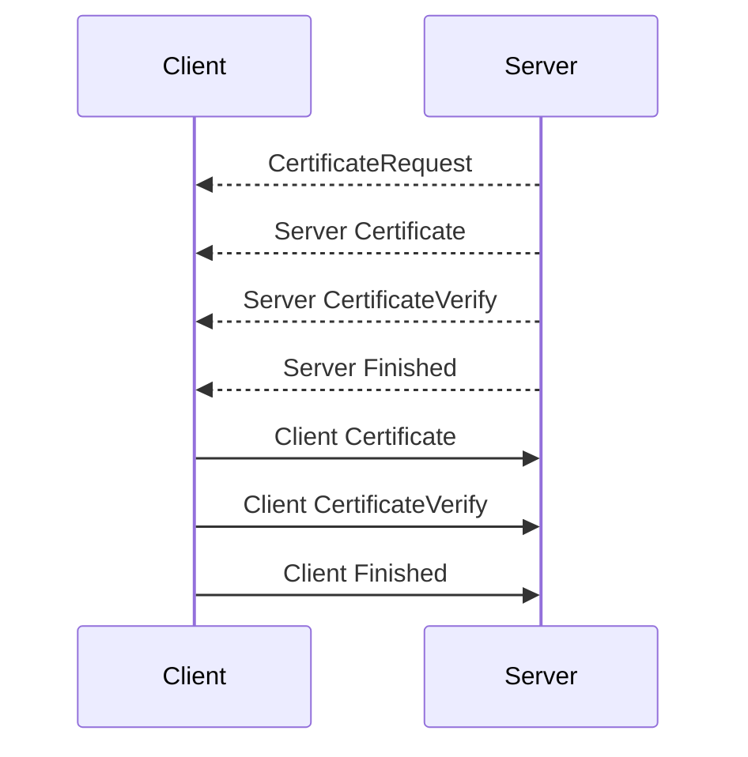

The client’s CertificateVerify proves possession of the client private key.

---

# 4. What TLS looks like in Wireshark

Without decryption secrets, a TLS 1.3 capture may look like:

```text
Client Hello
Server Hello
Change Cipher Spec
Application Data
Application Data
Application Data
```

This is initially confusing because some of the packets labeled **Application Data** are actually carrying encrypted handshake messages such as:

* EncryptedExtensions.
* Certificate.
* CertificateVerify.
* Finished.

In TLS 1.3, encrypted TLS records use an outer content type of `application_data` for compatibility. The real inner content type is revealed only after decryption. TLS 1.3 uses AEAD to perform encryption and integrity protection together. ([RFC Editor][1])

## Before versus after ServerHello

| TLS information                   | Visible without session keys? |
| --------------------------------- | ----------------------------: |
| Client and server IP addresses    |                           Yes |
| TCP source and destination ports  |                           Yes |
| ClientHello                       |                   Usually yes |
| SNI without ECH                   |                           Yes |
| Client-supported cipher suites    |                           Yes |
| Client-supported groups           |                           Yes |
| Client ALPN offers                |                           Yes |
| ServerHello                       |                           Yes |
| Selected TLS version              |                           Yes |
| Selected cipher suite             |                           Yes |
| Server certificate in TLS 1.3     |                            No |
| HTTP Host header                  |                            No |
| URI path and query                |                            No |
| HTTP body                         |                            No |
| Cookies and authorization headers |                            No |

---

# 5. TLS 1.2 compared with TLS 1.3

A common TLS 1.2 full handshake looks approximately like this:

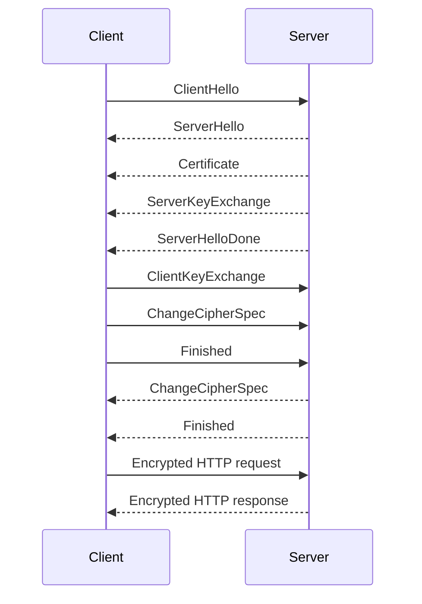

TLS 1.2 normally exposes more of the handshake, including the server certificate, before encryption begins. TLS 1.3 encrypts most handshake information after ServerHello and reduces the normal handshake latency. ([RFC Editor][6])

A simplified comparison:

| Item                         | TLS 1.2                                          | TLS 1.3                         |
| ---------------------------- | ------------------------------------------------ | ------------------------------- |
| ClientHello visible          | Yes                                              | Yes, unless protected by ECH    |
| ServerHello visible          | Yes                                              | Yes                             |
| Server certificate visible   | Normally yes                                     | Normally encrypted              |
| Static RSA key exchange      | Historically possible                            | Removed                         |
| Ephemeral key agreement      | Optional depending on suite                      | Normal design                   |
| Normal TLS handshake latency | About two TLS round trips                        | About one TLS round trip        |
| 0-RTT resumption             | No standard equivalent                           | Supported, with replay concerns |
| Cipher-suite design          | Key exchange + authentication + encryption + MAC | AEAD cipher + hash              |

TLS 1.3 0-RTT allows a resumed client to send early application data before the handshake completes, but early data has replay risks. Applications must therefore be cautious about using it for operations such as financial transactions or non-idempotent changes. ([RFC Editor][1])

---

# 6. HTTPS: HTTP inside TLS

Once TLS finishes, the browser sends HTTP through the encrypted session.

For this URL:

```text
https://app.example.com/orders/123?format=json
```

An HTTP/1.1 request might be:

```http
GET /orders/123?format=json HTTP/1.1
Host: app.example.com
User-Agent: ExampleBrowser/1.0
Accept: application/json
Cookie: session=abc123
```

On the network, none of this is visible without TLS decryption.

## HTTP/2 representation

HTTP/2 expresses the important values as pseudo-headers:

```text
:method: GET
:scheme: https
:authority: app.example.com
:path: /orders/123?format=json
```

The HTTP/2 `:authority` value serves the routing role associated with the HTTP/1.1 Host field. RFC 9110 requires the target authority to be sent through Host or the corresponding `:authority` pseudo-header. ([RFC Editor][7])

---

# 7. SNI, Host and URI path

These values are related but occur at different protocol layers and different times.

Consider:

```text
https://app.example.com:443/orders/123?format=json#details
```

| Value            | Example           | Protocol layer   | Normally visible without TLS decryption? |
| ---------------- | ----------------- | ---------------- | ---------------------------------------: |
| Destination IP   | `203.0.113.20`    | IP               |                                      Yes |
| Destination port | `443`             | TCP              |                                      Yes |
| SNI              | `app.example.com` | TLS ClientHello  |                          Yes, unless ECH |
| ALPN offer       | `h2`, `http/1.1`  | TLS ClientHello  |                          Yes, unless ECH |
| HTTP Host        | `app.example.com` | HTTP/1.1         |                                       No |
| `:authority`     | `app.example.com` | HTTP/2 or HTTP/3 |                                       No |
| URI path         | `/orders/123`     | HTTP             |                                       No |
| Query            | `format=json`     | HTTP             |                                       No |
| Fragment         | `details`         | Browser only     |                          Not transmitted |

## SNI

SNI means **Server Name Indication**.

It is a TLS extension sent in ClientHello so that a server hosting multiple names on one IP address can determine which TLS identity the client wants. ([RFC Editor][8])

Example:

```text
SNI = app.example.com
```

SNI contains a server hostname. It does not contain:

* `https://`
* `/orders/123`
* `?format=json`
* HTTP headers
* Cookies
* Request body

### Why the server needs SNI before HTTP

Suppose one load balancer IP serves:

```text
finance.example.com
hr.example.com
portal.example.com
```

Each site might have a different certificate.

The server has to send a certificate during the TLS handshake, but the HTTP Host header arrives only **after TLS is established**. Therefore the server cannot wait for the HTTP Host header to decide which certificate to send.

SNI solves that ordering problem:

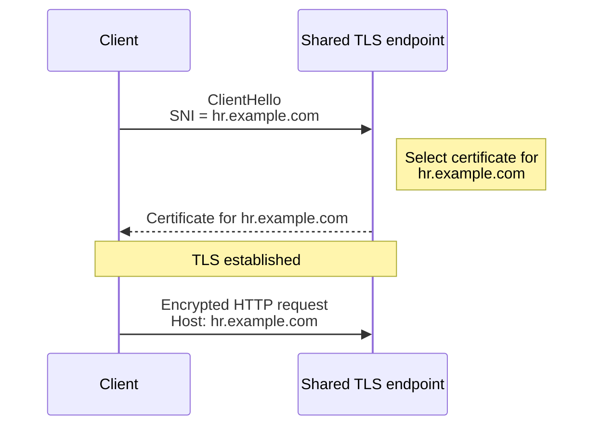

## Host header

In HTTP/1.1:

```http
Host: app.example.com
```

The Host header tells the HTTP server which logical origin or virtual host should process the request.

A single web server may have:

```text
Host: finance.example.com → Finance application
Host: hr.example.com      → HR application
Host: portal.example.com  → Portal application
```

The Host value is protected by TLS in HTTPS.

## HTTP/2 and HTTP/3 authority

HTTP/2 and HTTP/3 commonly use:

```text
:authority: app.example.com
```

instead of relying on the conventional HTTP/1.1 Host field. The semantic purpose is similar: identify the target host and optional port. ([RFC Editor][7])

## URI path

The path selects a resource or application route within that host.

```text
/orders/123
```

Examples:

```text
Host: app.example.com
Path: /orders/*       → Order service

Host: app.example.com
Path: /inventory/*    → Inventory service

Host: app.example.com
Path: /admin/*        → Administration service
```

The query string provides additional parameters:

```text
?format=json
```

RFC 9110 defines the path and optional query as identifying a target resource within the origin server’s namespace. ([RFC Editor][9])

---

# 8. Where routing decisions happen

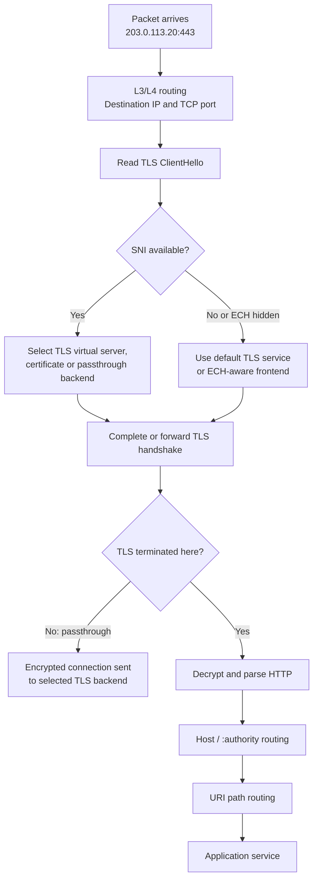

## Four routing levels

### 1. IP and port routing

Available immediately:

```text
203.0.113.20:443
```

This is traditional Layer 3/Layer 4 routing.

The device cannot distinguish two websites sharing that exact IP and port unless it examines a higher layer.

### 2. SNI routing

Available from the ordinary TLS ClientHello:

```text
app.example.com
```

A TLS-aware router can use SNI to select:

* A certificate.
* A TLS virtual server.
* A backend server.
* A security policy.

It can sometimes do this without decrypting the eventual HTTP request.

### 3. Host or `:authority` routing

Available only after TLS termination or decryption:

```text
Host: app.example.com
```

This can select an HTTP virtual host or application.

### 4. Path routing

Also requires HTTP visibility:

```text
/orders/123
```

This can select an individual microservice or target group.

## TLS passthrough limitation

A passthrough proxy can potentially inspect plaintext SNI and forward the encrypted TLS connection to a backend.

It generally cannot see:

* HTTP Host.
* URI path.
* HTTP method.
* Cookies.
* Authorization headers.
* Request body.

Therefore:

```text
TLS passthrough:
    SNI routing may be possible
    Host/path routing is not possible without decryption
```

## TLS termination

A terminating proxy owns the server certificate/private key relationship and completes the client-side TLS handshake.

It can then:

* Read the HTTP request.
* Route by Host.
* Route by path.
* Apply WAF policies.
* Add headers.
* Authenticate users.
* Start another TLS connection to the backend.

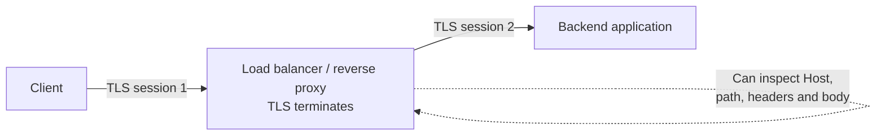

These are two independent TLS sessions with separate certificates, handshakes and traffic keys.

---

# 9. Can SNI and Host differ?

Technically, yes.

A client could send:

```text
TLS SNI: front.example.com
```

and later, inside TLS:

```http
Host: hidden.example.net
```

Whether that works depends on:

* Which certificate was selected.
* Whether the certificate covers the requested service name.
* The reverse proxy’s configuration.
* Whether the HTTP server accepts the Host.
* Security policies preventing cross-host confusion.

In normal browser traffic, the SNI and HTTP authority generally correspond to the same intended origin. Systems should not blindly assume they are always identical, especially when implementing proxies or security enforcement.

The basic order is:

```text
SNI → selects TLS context and certificate
Host/:authority → selects HTTP virtual host
Path → selects resource or application route
```

---

# 10. Encrypted SNI versus Encrypted ClientHello

There is an important terminology correction:

> TLS 1.3 by itself did not encrypt the initial ClientHello or its SNI.

TLS 1.3 encrypted most of the handshake after ServerHello, including the server certificate, but ordinary SNI remained visible in ClientHello.

An earlier proposal was commonly called **Encrypted SNI**, or ESNI. The standardized solution became **Encrypted ClientHello**, or ECH.

ECH was standardized in RFC 9849 in March 2026 as a separate TLS extension supported with TLS 1.3. It protects not just SNI, but also other sensitive ClientHello information such as ALPN. ([RFC Editor][10])

## Ordinary TLS 1.3 without ECH

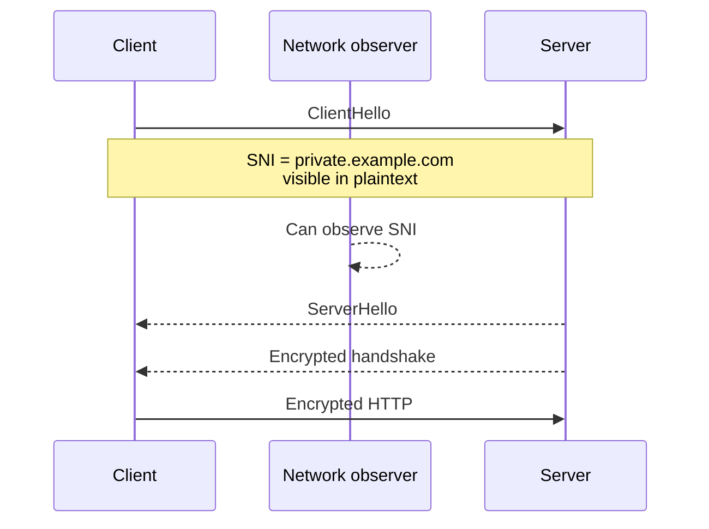

The observer cannot read the HTTP Host or path, but can see:

```text
SNI = private.example.com
```

## TLS 1.3 with ECH

ECH logically creates two ClientHello structures:

* **ClientHelloOuter:** publicly visible.
* **ClientHelloInner:** encrypted and contains the actual service SNI.

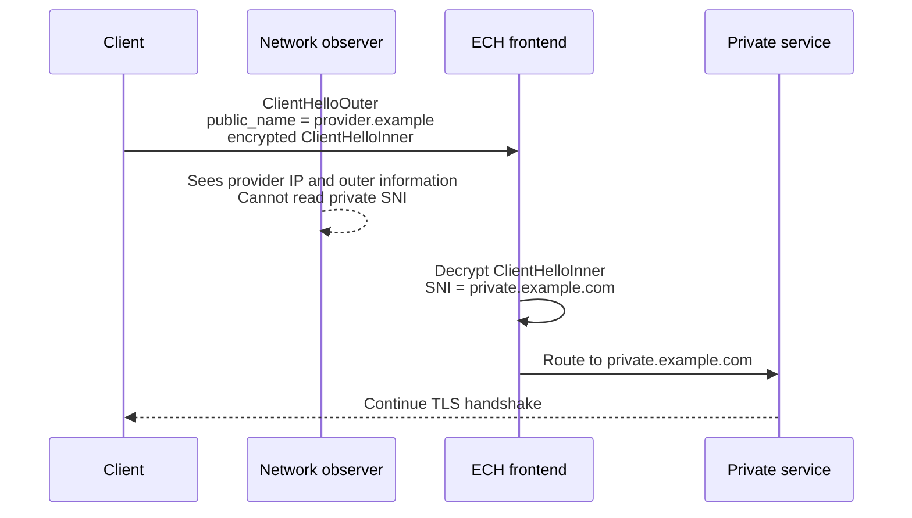

RFC 9848 describes this as an unencrypted outer ClientHello and an encrypted inner ClientHello; the inner ClientHello’s SNI identifies the desired service. ECH configuration is commonly bootstrapped through DNS HTTPS or SVCB records. ([RFC Editor][11])

## How the client obtains the ECH public key

Conceptually:

1. Client performs DNS resolution.
2. An HTTPS/SVCB DNS record supplies ECH configuration.
3. The configuration contains information needed to encrypt ClientHelloInner.
4. Client creates:

   * An outer ClientHello.
   * An encrypted inner ClientHello.
5. The ECH-capable frontend decrypts the inner hello with its ECH private key.

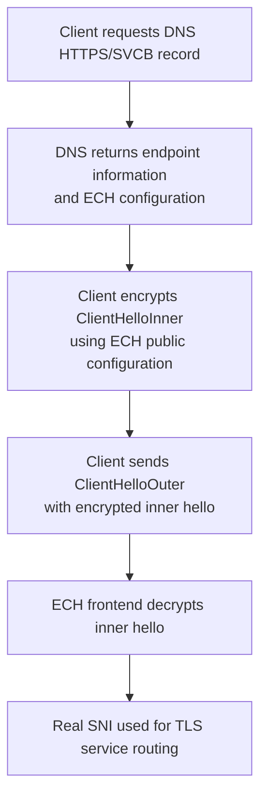

## What ECH protects

ECH can hide from a passive network observer:

* The actual SNI.
* The actual ALPN offer.
* Other sensitive ClientHello extensions placed in the inner hello.

ECH does not automatically hide:

* Source and destination IP addresses.
* Destination port.
* Packet sizes.
* Packet timing.
* The identity of a large hosting provider.
* Plaintext DNS queries made separately.
* Information leaked by endpoint or application behavior.

The ECH specification explicitly notes that DNS and visible server IP addresses can still expose destination information, which is why ECH is often paired with encrypted DNS and shared hosting infrastructure. ([RFC Editor][10])

---

# 11. ECH implications for SNI-based routing and security

## Traditional SNI passthrough

Without ECH:

```text
ClientHello SNI: payroll.example.com
```

A network load balancer, firewall or proxy can inspect the ClientHello and make a routing or policy decision without terminating TLS.

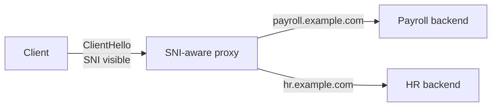

## With ECH

The real SNI is not available to an ordinary passive intermediary.

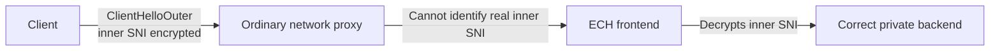

### Operational implications

A device that depends on plaintext SNI for:

* Domain allowlisting.
* Domain blocking.
* SNI-based backend selection.
* Traffic classification.
* Logging visited domain names.

may no longer see the actual origin name when ECH is successfully used.

However, an ECH-aware public frontend that holds the ECH private key can decrypt the inner ClientHello and continue routing within its service infrastructure.

This creates a distinction:

```text
On-path enterprise firewall:
    Does not possess ECH key
    Cannot see real SNI

ECH hosting frontend:
    Possesses ECH key
    Can recover inner ClientHello
    Can route to the intended service
```

Potential enterprise control points therefore shift toward combinations of:

* Encrypted-DNS policy and resolver control.
* Explicit web proxies.
* Managed endpoint/browser policy.
* Endpoint security telemetry.
* TLS inspection where organizational policy and trust configuration permit it.
* Destination IP and provider-level controls.
* Application-layer controls at the terminating proxy.

ECH primarily removes passive SNI visibility; it does not prevent a managed endpoint, an authorized terminating proxy or the destination service from knowing the requested hostname.

---

# 12. Wireshark filters for TLS, SNI and HTTP

## Find ClientHello packets

```text
tls.handshake.type == 1
```

TLS handshake type 1 is ClientHello.

## Find ServerHello packets

```text
tls.handshake.type == 2
```

## Display packets containing ordinary SNI

```text
tls.handshake.extensions_server_name
```

## Search for a specific SNI

```text
tls.handshake.extensions_server_name == "app.example.com"
```

## Inspect ALPN

```text
tls.handshake.extensions_alpn_str
```

## Filter a specific TLS connection

```text
tcp.stream == 7
```

Or combine conditions:

```text
tcp.stream == 7 && tls
```

Wireshark exposes fields for the server-name extension, ALPN, key shares, supported versions and ECH-related outer extensions. ([Wireshark][12])

## HTTP/1.1 filters after decryption

```text
http.host == "app.example.com"
```

```text
http.request.uri.path == "/orders/123"
```

```text
http.request.uri.query
```

```text
http.request.full_uri
```

```text
http.request.method == "GET"
```

Wireshark exposes Host, request URI, path, query, method and full-URI fields once it can dissect the HTTP plaintext. ([Wireshark][13])

## HTTP/2 filters after decryption

```text
http2.headers.authority == "app.example.com"
```

```text
http2.headers.path == "/orders/123?format=json"
```

```text
http2.headers.method == "GET"
```

---

# 13. Decrypting your own browser TLS traffic in Wireshark

Capturing packets alone is insufficient to decrypt modern ephemeral TLS. Possessing the server certificate or public key is also insufficient.

For an authorized test of your own browser session, a TLS key log file can provide the per-session secrets.

Typical workflow:

1. Close the browser.
2. Configure the `SSLKEYLOGFILE` environment variable to a writable file.
3. Start the browser from that environment.
4. Start Wireshark capture.
5. Open the test website.
6. In Wireshark, configure:

```text
Edit
  → Preferences
    → Protocols
      → TLS
        → (Pre)-Master-Secret log filename
```

7. Select the key log file.
8. Wireshark can then decode the encrypted TLS records and expose HTTP/1.1 or HTTP/2.

The key-log method works with modern ephemeral Diffie-Hellman TLS because the application exports the actual session secrets rather than expecting Wireshark to derive them from a server private key. ([Wireshark Wiki][14])

Treat the key log file as highly sensitive: anyone with both the capture and matching session secrets may be able to decrypt those recorded sessions.

---

# 14. How to troubleshoot a TLS connection in order

When reading a capture, move layer by layer.

## Step 1: Did DNS resolve?

Look for:

```text
dns.qry.name == "app.example.com"
```

Confirm the returned IP is the one the client contacted.

## Step 2: Did TCP establish?

Look for:

```text
SYN
SYN-ACK
ACK
```

Common failures:

```text
Repeated SYN, no SYN-ACK
```

Usually indicates routing, firewall, security-group, service-listener or return-path problems.

```text
SYN followed by RST
```

Usually means the destination was reachable, but no acceptable listener or policy accepted the connection.

## Step 3: Did the client send ClientHello?

Use:

```text
tls.handshake.type == 1
```

Inspect:

* SNI.
* Supported versions.
* Cipher suites.
* Supported groups.
* Key shares.
* ALPN.

## Step 4: Did the server respond with ServerHello?

If the server immediately sends a TLS alert, likely causes include:

* Unsupported TLS version.
* No mutually supported cipher or group.
* Invalid or missing SNI.
* Client-certificate policy.
* Protocol mismatch.

## Step 5: Did certificate validation succeed?

From a client-side application or decrypted trace, check:

* Certificate chain.
* SAN hostname.
* Validity period.
* Trusted certification path.
* CertificateVerify.
* TLS alerts such as `unknown_ca`, `bad_certificate` or `certificate_expired`.

## Step 6: Did HTTP begin?

After the TLS Finished exchange, look for application traffic.

With decryption, confirm:

```text
Host / :authority
Path / :path
Method
Response status
```

This separates TLS problems from application-routing problems.

---

# 15. One complete example

The browser requests:

```text
https://shop.example.com/cart/checkout
```

DNS returns:

```text
shop.example.com → 203.0.113.20
```

The connection proceeds:

```text
1. TCP
   10.10.1.25:53000 → 203.0.113.20:443 SYN
   203.0.113.20:443 → 10.10.1.25:53000 SYN-ACK
   10.10.1.25:53000 → 203.0.113.20:443 ACK

2. TLS
   ClientHello:
       SNI = shop.example.com
       ALPN = h2, http/1.1
       key_share = x25519

   ServerHello:
       TLS 1.3
       TLS_AES_128_GCM_SHA256
       key_share = x25519

   Encrypted:
       Certificate
       CertificateVerify
       Finished

   Client:
       Validates certificate for shop.example.com
       Sends Finished

3. HTTP/2 inside TLS
   :method    = POST
   :scheme    = https
   :authority = shop.example.com
   :path      = /cart/checkout

4. Routing
   IP:443                    → reach shared load balancer
   SNI shop.example.com      → choose TLS certificate/context
   :authority shop.example.com → choose shopping virtual host
   :path /cart/checkout      → choose checkout service
```

The simplest way to remember the whole process is:

```text
IP address answers:
    Which machine or network endpoint?

TCP port answers:
    Which listening service?

SNI answers:
    Which TLS identity?

Host or :authority answers:
    Which HTTP site?

URI path answers:
    Which resource or application route?
```

And the security boundary is:

```text
Visible before ordinary TLS decryption:
    IP, port, packet sizes, timing, TCP flags,
    ClientHello and plaintext SNI

Encrypted by ordinary HTTPS:
    Host, path, query, headers, cookies, body and response

Additionally protected by ECH:
    Actual SNI and other inner ClientHello details
```

One final distinction: this explanation describes HTTPS over **TCP**, covering HTTP/1.1 and HTTP/2. HTTP/3 runs over QUIC/UDP, so it does not use a TCP three-way handshake; QUIC combines transport security and connection establishment differently, although it still uses TLS 1.3 cryptographic handshake concepts.

[1]: https://www.rfc-editor.org/info/rfc9846/ "RFC 9846: The Transport Layer Security (TLS) Protocol Version 1.3 | RFC Editor"
[2]: https://www.rfc-editor.org/rfc/rfc9293.html "RFC 9293: Transmission Control Protocol (TCP)"
[3]: https://www.wireshark.org/docs/wsug_html/ "Wireshark User’s Guide"
[4]: https://www.rfc-editor.org/info/rfc9846/?utm_source=chatgpt.com "RFC 9846: The Transport Layer Security (TLS) Protocol Version 1.3 | RFC Editor"
[5]: https://www.rfc-editor.org/info/rfc9525/?utm_source=chatgpt.com "RFC 9525: Service Identity in TLS | RFC Editor"
[6]: https://www.rfc-editor.org/info/rfc5246?utm_source=chatgpt.com "RFC 5246: The Transport Layer Security (TLS) Protocol Version 1.2 | RFC Editor"
[7]: https://www.rfc-editor.org/rfc/rfc9110.html "RFC 9110: HTTP Semantics"
[8]: https://www.rfc-editor.org/info/rfc6066/?utm_source=chatgpt.com "RFC 6066: Transport Layer Security (TLS) Extensions"
[9]: https://www.rfc-editor.org/info/rfc9110/?utm_source=chatgpt.com "RFC 9110: HTTP Semantics | RFC ..."
[10]: https://www.rfc-editor.org/info/rfc9849/ "RFC 9849: TLS Encrypted Client Hello | RFC Editor"
[11]: https://www.rfc-editor.org/rfc/rfc9848.html "RFC 9848: Bootstrapping TLS Encrypted ClientHello with DNS Service Bindings"
[12]: https://www.wireshark.org/docs/dfref/t/tls.html "Wireshark • Go Deep | Display Filter Reference: Transport Layer Security"
[13]: https://www.wireshark.org/docs/dfref/h/http.html?utm_source=chatgpt.com "Wireshark • Go Deep | Display Filter Reference: Hypertext Transfer Protocol"
[14]: https://wiki.wireshark.org/tls?utm_source=chatgpt.com "TLS - Wireshark Wiki"
